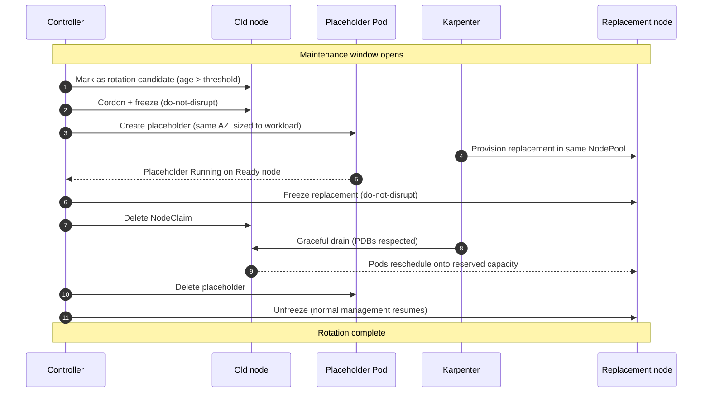

# node-rotation-controller

[](https://github.com/AkashiSN/node-rotation-controller/blob/main/LICENSE)
[-blue.svg)](/specification/06-release)

A Kubernetes controller that gracefully rotates Karpenter-managed nodes inside a maintenance window, before Karpenter's forceful `expireAfter` fires.

Designed for **EKS Auto Mode** and any Karpenter v1+ environment.

日本語版: [docs/ja/getting-started](/ja/getting-started)

---

## Quick start

### Prerequisites

- A Kubernetes cluster with **Karpenter v1+** (`karpenter.sh/v1` CRDs served)
- At least one `NodePool` with `expireAfter` set
- Helm 3.12+

### Install

```sh
helm install node-rotation-controller \
  oci://ghcr.io/akashisn/charts/node-rotation-controller \
  --namespace node-rotation-system --create-namespace \
  --set-json 'rotationPolicies=[{
    "spec": {
      "nodePoolSelector": {"matchLabels": {"workload": "api"}},
      "maintenanceWindows": [{
        "timezone": "Asia/Tokyo",
        "days": ["Wed", "Sat"],
        "start": "02:00",
        "end": "06:00"
      }]
    }
  }]'
```

This installs the controller (2 replicas with leader election), RBAC, the `RotationPolicy` CRD, and a dedicated negative-priority `PriorityClass` for the surge placeholder.

> Change `workload: api` to a label your target NodePool carries; adjust `maintenanceWindows` to your preferred schedule.

### Verify

```sh
# Check the controller is running
kubectl -n node-rotation-system get pods

# See the derived schedule for your NodePool
kubectl get rotationpolicy -o wide

# Watch rotation metrics (if Prometheus is available)
kubectl port-forward -n node-rotation-system svc/node-rotation-controller-metrics 8080:8080
curl -s localhost:8080/metrics | grep noderotation_
```

### Try the simulator

Before deploying to production, use the [policy simulator](/simulator) to visualize which day each node would rotate under your configuration.

---

## How it works



Key properties:

- **Make-before-break** — the replacement node is `Ready` before the old one is drained
- **Never bypasses Karpenter** — the controller deletes `NodeClaim` resources; Karpenter's termination controller drains nodes via the Eviction API (PDBs apply)
- **Window-bounded** — rotation starts only inside the maintenance window; an in-flight rotation runs to completion past the boundary
- **Safe fallback** — if the controller is absent, `expireAfter` still fires as usual (never worse than without the controller)

---

## Why this exists

Karpenter classifies node disruption into two categories:

| Category | Examples | Disruption Budgets | Pre-provisioned replacement |
|----------|----------|---------------------|------------------------------|
| Graceful | Drift, Consolidation | Applied | Yes (make-before-break) |
| **Forceful** | **Expiration**, Spot Interruption | **Not applied** | **No** |

Expiration is intentionally forceful — see the upstream [forceful-expiration design](https://github.com/kubernetes-sigs/karpenter/blob/main/designs/forceful-expiration.md) — so that security patches cannot be blocked by misconfigured PDBs. EKS Auto Mode enforces a **21-day hard cap** on node lifetime.

The consequence: nodes **will be force-drained** at an unpredictable time, Karpenter provisions a replacement only *after* the drain begins, and this can land in peak business hours. This controller moves that rotation earlier, into your maintenance window, with make-before-break semantics.

---

## What it is not

- **Not** a replacement for Karpenter Consolidation, Drift, or Disruption Budgets — it composes with them
- **Not** a Spot interruption handler — use [AWS Node Termination Handler](https://github.com/aws/aws-node-termination-handler)
- **Not** an OS-patch reboot tool — use [kured](https://github.com/kubereboot/kured)
- **Not** application-side warm-up — `readinessProbe` / `readinessGate` / ALB slow start handle that

---

## Configuration

The chart renders one `RotationPolicy` per entry in `rotationPolicies`. A minimal values file:

```yaml
rotationPolicies:
  - spec:
      nodePoolSelector:
        matchLabels:
          workload: api
      maintenanceWindows:
        - timezone: Asia/Tokyo
          days: [Wed, Sat]
          start: "02:00"
          end: "06:00"
      # minRotationChances: 2       # K — guaranteed windows before expiry (default 2)
      # surge:
      #   readyTimeout: 15m         # how long to wait for the replacement node
      #   cooldownAfter: 10m        # pause between successive rotations
      #   forcefulFallback:
      #     enabled: false           # opt-in: rotate surge-less if a graceful surge can't finish in time
```

- **Per-NodePool policies.** Add more entries to give each NodePool its own window or surge settings.
- **Bring your own.** Set `rotationPolicies: []` and apply your own `RotationPolicy` objects; see [`examples/`](https://github.com/AkashiSN/node-rotation-controller/blob/main/examples/) for ready-to-adapt manifests.
- **Full schema.** See the [specification §5.4](/specification/05-implementation#54-configuration-schema) and [`values.yaml`](https://github.com/AkashiSN/node-rotation-controller/blob/main/charts/node-rotation-controller/values.yaml).

---

## Compatibility

The compatibility contract is the **stable `karpenter.sh/v1` CRD surface**, not a specific Karpenter minor.

- **Runtime:** EKS Auto Mode and any Karpenter v1+ cluster
- **No cloud APIs:** the controller interacts only through Kubernetes API objects (`NodeClaim`/`NodePool`, `Node`, `Pod`)
- **Fail-fast preflight:** the controller exits immediately if `karpenter.sh/v1` is not served or not readable

See the [compatibility policy](/specification/02-scope) for the full required-field list.

---

## Project status

**Pre-1.0** — the CRD schema (`v1alpha1`) and configuration surface may change between minor releases.

The core surge path, forceful fallback, earliest-deadline ordering, and all runtime safety properties are validated end-to-end on real EKS Auto Mode clusters, including a 12-hour tight-race soak. One open item remains before v1.0: a genuine same-AZ capacity shortage (ICE) driving rollback. See the [roadmap](/specification/06-release) and [validated assumptions](/specification/07-risks#72-validated-assumptions).

---

## Project layout

```
├── docs/specification/     Design specification (English)
├── docs/ja/specification/  Japanese translation
├── docs/runbook.md         Production runbook
├── charts/                 Helm chart
├── examples/               Ready-to-adapt RotationPolicy manifests
├── cmd/                    Controller entry point
└── internal/               Reconciler, state machine, surge, window, policy, metrics
```

---

## Development

Requires [aqua](https://aquaproj.github.io) and `make`. All tooling is version-pinned in [`aqua.yaml`](https://github.com/AkashiSN/node-rotation-controller/blob/main/aqua.yaml).

| Command | Purpose |
|---------|---------|
| `make build` | Compile the manager binary |
| `make test` | Unit tests + envtest smoke test |
| `make lint` | golangci-lint |
| `make helm-lint` | Lint and render the Helm chart |
| `make docker-build` | Build the container image |

See [CONTRIBUTING.md](https://github.com/AkashiSN/node-rotation-controller/blob/main/CONTRIBUTING.md) for the development workflow.

---

## Getting involved

This project is pre-1.0 and under active development. Design feedback and implementation contributions are welcome via GitHub Issues and PRs.

See [CONTRIBUTING.md](https://github.com/AkashiSN/node-rotation-controller/blob/main/CONTRIBUTING.md) for the workflow and [CODE_OF_CONDUCT.md](https://github.com/AkashiSN/node-rotation-controller/blob/main/CODE_OF_CONDUCT.md) for community standards.

---

## License

Apache 2.0 — [LICENSE](https://github.com/AkashiSN/node-rotation-controller/blob/main/LICENSE).
