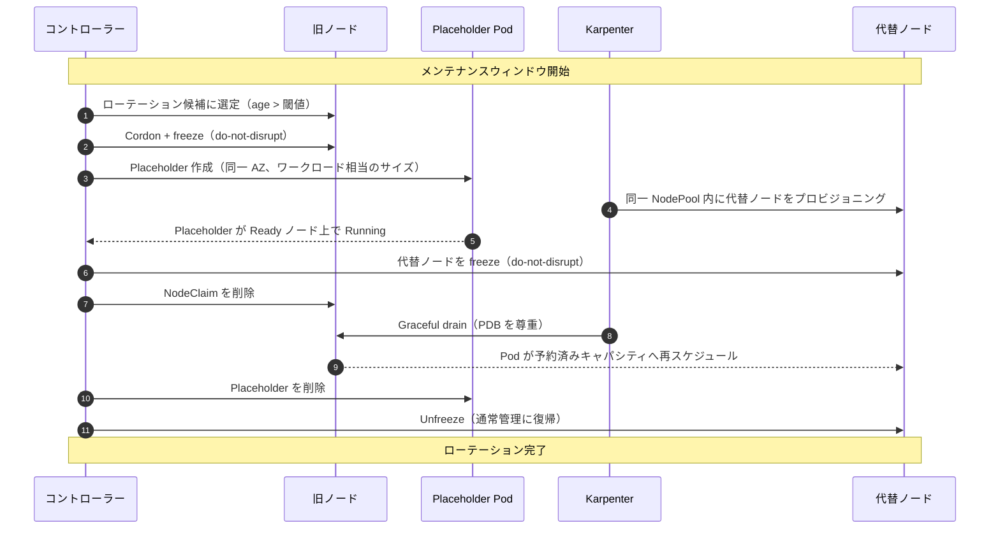

# node-rotation-controller

[](https://github.com/AkashiSN/node-rotation-controller/blob/main/LICENSE)
[-blue.svg)](/ja/specification/06-release)

Karpenter 管理ノードを、メンテナンスウィンドウ内で graceful に先回りローテーションする Kubernetes コントローラー。Karpenter の forceful な `expireAfter` が発火する前に、make-before-break で置換する。

**EKS Auto Mode** および Karpenter v1+ 環境向け。

English: [docs/getting-started](/getting-started)

---

## クイックスタート

### 前提条件

- **Karpenter v1+** がインストール済みのクラスタ（`karpenter.sh/v1` CRD が提供されている）
- `expireAfter` が設定された `NodePool` が 1 つ以上存在
- Helm 3.12+

### インストール

```sh
helm install node-rotation-controller \
  oci://ghcr.io/akashisn/charts/node-rotation-controller \
  --namespace node-rotation-system --create-namespace \
  --set-json 'rotationPolicies=[{
    "spec": {
      "nodePoolSelector": {"matchLabels": {"workload": "api"}},
      "maintenanceWindows": [{
        "timezone": "Asia/Tokyo",
        "days": ["Wed", "Sat"],
        "start": "02:00",
        "end": "06:00"
      }]
    }
  }]'
```

これにより、コントローラー（leader election 付き 2 レプリカ）、RBAC、`RotationPolicy` CRD、surge placeholder 用の負優先度 `PriorityClass` がインストールされる。

> `workload: api` は対象 NodePool が持つラベルに合わせる。`maintenanceWindows` は運用に合わせて調整する。

### 動作確認

```sh
# コントローラーが起動していることを確認
kubectl -n node-rotation-system get pods

# NodePool に対する導出スケジュールを確認
kubectl get rotationpolicy -o wide

# メトリクスの確認（Prometheus がある場合）
kubectl port-forward -n node-rotation-system svc/node-rotation-controller-metrics 8080:8080
curl -s localhost:8080/metrics | grep noderotation_
```

### シミュレーターで事前確認

本番適用の前に、[ポリシーシミュレーター](/ja/simulator)で各ノードがいつローテーションされるか可視化できる。

---

## 仕組み



主要な特性:

- **Make-before-break** — 旧ノードの drain 前に代替ノードが `Ready` になる
- **Karpenter を迂回しない** — コントローラーは `NodeClaim` を削除し、Karpenter の termination controller が Eviction API で drain する（PDB が適用される）
- **ウィンドウ有界** — ローテーション開始はウィンドウ内のみ。進行中のローテーションはウィンドウを跨いでも完遂する
- **安全なフォールバック** — コントローラーが不在でも `expireAfter` は通常通り発火する（コントローラーなしの場合より悪くならない）

---

## なぜ必要か

Karpenter はノードの disruption を 2 種類に分類している:

| 分類 | 例 | Disruption Budgets | 代替の事前起動 |
|------|-----|---------------------|----------------|
| Graceful | Drift, Consolidation | 適用される | する（make-before-break）|
| **Forceful** | **Expiration**, Spot Interruption | **適用されない** | **しない** |

Expiration が意図的に Forceful なのは、セキュリティパッチが誤設定された PDB でブロックされるのを防ぐためである（公式 [forceful-expiration design](https://github.com/kubernetes-sigs/karpenter/blob/main/designs/forceful-expiration.md)）。EKS Auto Mode はさらに **21 日のノード寿命 hard cap** を強制する。

帰結: ノードは予測不能なタイミングで **必ず Force drain される**。Karpenter は drain 開始の **後から** 代替を起動するため、ピーク営業時間帯と衝突しうる。本コントローラーはこのローテーションをメンテナンスウィンドウ内に前倒しし、make-before-break で実行する。

---

## スコープ外

- Karpenter Consolidation / Drift / Disruption Budgets の置き換え — 共存する
- Spot 中断 — [AWS Node Termination Handler](https://github.com/aws/aws-node-termination-handler) を使う
- OS パッチ起因の再起動 — [kured](https://github.com/kubereboot/kured) を使う
- アプリケーション側 warm-up — `readinessProbe` / `readinessGate` / ALB slow start の領分

---

## 設定

chart は `rotationPolicies` のエントリごとに 1 つの `RotationPolicy` をレンダリングする。最小構成:

```yaml
rotationPolicies:
  - spec:
      nodePoolSelector:
        matchLabels:
          workload: api
      maintenanceWindows:
        - timezone: Asia/Tokyo
          days: [Wed, Sat]
          start: "02:00"
          end: "06:00"
      # minRotationChances: 2       # K — 失効前に保証するウィンドウ回数（既定 2）
      # surge:
      #   readyTimeout: 15m         # 代替ノードの Ready 待ち上限
      #   cooldownAfter: 10m        # 連続ローテーション間の休止
      #   forcefulFallback:
      #     enabled: false           # opt-in: graceful surge が間に合わない場合に surge-less で回す
```

- **NodePool ごとのポリシー。** エントリを追加すれば NodePool ごとに別のウィンドウや surge 設定を与えられる。
- **自前のポリシー。** `rotationPolicies: []` にして独自の `RotationPolicy` オブジェクトを適用可能。[`examples/`](https://github.com/AkashiSN/node-rotation-controller/blob/main/examples/) にすぐ流用できるマニフェストがある。
- **完全なスキーマ。** [仕様 §5.4](/ja/specification/05-implementation#54-設定スキーマ) と [`values.yaml`](https://github.com/AkashiSN/node-rotation-controller/blob/main/charts/node-rotation-controller/values.yaml) を参照。

---

## 互換性

互換性の契約は **安定版 `karpenter.sh/v1` CRD サーフェス** であり、特定の Karpenter マイナーではない。

- **ランタイム対象:** EKS Auto Mode、および任意の Karpenter v1+ クラスタ
- **クラウド API 不使用:** Kubernetes API オブジェクト（`NodeClaim`/`NodePool`、`Node`、`Pod`）のみで動作
- **Fail-fast プリフライト:** `karpenter.sh/v1` が提供されない・読み取れない場合は即座に終了

必須フィールドの一覧は[互換性ポリシー](/ja/specification/02-scope)を参照。

---

## プロジェクト状況

**Pre-1.0** — CRD スキーマ（`v1alpha1`）と設定サーフェスは minor リリース間で変わりうる。

コアの surge パス、forceful fallback、earliest-deadline 順序付け、全ランタイム安全性は実 EKS Auto Mode クラスタで E2E 検証済み（12 時間 tight-race soak 含む）。v1.0 に向けて残る項目は、同一 AZ の実容量枯渇（ICE）によるロールバックのみ。[ロードマップ](/ja/specification/06-release)と[検証済み前提](/ja/specification/07-risks#72-検証済み前提)を参照。

---

## プロジェクト構成

```
├── docs/specification/     仕様書（英語）
├── docs/ja/specification/  日本語訳
├── docs/runbook.md         運用ランブック
├── charts/                 Helm chart
├── examples/               すぐ流用できる RotationPolicy マニフェスト
├── cmd/                    コントローラーエントリポイント
└── internal/               Reconciler、ステートマシン、surge、window、policy、metrics
```

---

## 開発

[aqua](https://aquaproj.github.io) と `make` が必要。全ツールは [`aqua.yaml`](https://github.com/AkashiSN/node-rotation-controller/blob/main/aqua.yaml) でバージョン固定。

| コマンド | 用途 |
|----------|------|
| `make build` | マネージャーバイナリをビルド |
| `make test` | ユニットテスト + envtest スモークテスト |
| `make lint` | golangci-lint |
| `make helm-lint` | Helm chart の lint とレンダリング |
| `make docker-build` | コンテナイメージのビルド |

開発ワークフローは [CONTRIBUTING.md](https://github.com/AkashiSN/node-rotation-controller/blob/main/CONTRIBUTING.md) を参照。

---

## 参加するには

本プロジェクトは pre-1.0 で活発に開発中。設計へのフィードバックも実装の貢献も、GitHub の Issue と PR で歓迎する。

開発ワークフローは [CONTRIBUTING.md](https://github.com/AkashiSN/node-rotation-controller/blob/main/CONTRIBUTING.md)、コミュニティ規範は [CODE_OF_CONDUCT.md](https://github.com/AkashiSN/node-rotation-controller/blob/main/CODE_OF_CONDUCT.md) を参照。

---

## ライセンス

Apache 2.0 — [LICENSE](https://github.com/AkashiSN/node-rotation-controller/blob/main/LICENSE)
