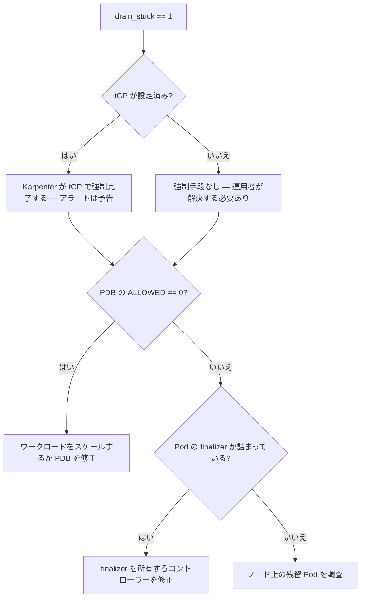

# 運用ランブック

`node-rotation-controller` の運用ガイド。各セクションは **いつ該当するか**・**何を見るか**・**何をするか** に答える。

設計の理由は[仕様書](specification/)を参照。英語原文: [docs/runbook.md](../runbook.md)。

::: tip いまインシデント対応中なら？
[§7 トラブルシューティング](#7-トラブルシューティング)へ直行 — 症状から対処へのインデックス。
:::

---

## 目次

1. [AZ ごとの surge ヘッドルーム（ゾーン PV）](#1-az-ごとの-surge-ヘッドルームゾーン-pv)
2. [スループットと tGP の調整](#2-スループットと-tgp-の調整)
3. [メトリクスリファレンス](#3-メトリクスリファレンス)
4. [freeze ワークフロー](#4-freeze-ワークフロー)
5. [drain が詰まったときの対処](#5-drain-が詰まったときの対処)
6. [アラート（PrometheusRule）](#6-アラートprometheusrule)
7. [トラブルシューティング](#7-トラブルシューティング)
8. [アップグレードとロールバック](#8-アップグレードとロールバック)
9. [大規模クラスタでのサイジング](#9-大規模クラスタでのサイジング)

---

## 1. AZ ごとの surge ヘッドルーム（ゾーン PV）

**いつ:** NodePool がゾーン制約の PersistentVolume（EBS `gp3`/`io2`、または `topology.kubernetes.io/zone` の nodeAffinity を持つ PV）に紐づくワークロードを前段に置くとき。

**制約:** surge ノードは既存ボリュームを再アタッチできるよう候補の AZ に固定される。同一 AZ の容量不足は**別ゾーンにフォールバックできない** — `readyTimeout` 後にロールバックする。

**何をするか:**

- 使用中の AZ ごとに **ノード 1 台分のヘッドルーム** を NodePool の `spec.limits` に確保する
- 各 AZ で EC2 vCPU クォータに余地があることを確認する（集計値だけでなく AZ ごとに）
- surge インスタンスシェイプに対するキャパシティ予約を検討する

**不足の検知方法:**

- `noderotation_completed_total{outcome="failure"}` の増加
- `noderotation_retry_count >= 3`（アラート: `NodeRotationRetryCountHigh`）

このアラートがゾーン PV の pool で発火したら、まず AZ ごとの容量不足を疑う。

---

## 2. スループットと tGP の調整

### スループット（ウィンドウ容量 `C`）を上げる

**いつ:** `ThroughputBelowArrival` や `ThroughputBurstShortfall` の警告が出る、またはウィンドウ内で候補がさばけない。

**スループットを決めるもの:**

```
C = ceil(D / (provisioningEstimate + drainEstimate + cooldownAfter))
```

| つまみ | 意味 | 設定方法 |
|--------|------|----------|
| `surge.provisioningEstimate` | surge ノードが Ready になるまでの期待時間 | `noderotation_duration_seconds{phase="surge_wait"}` から読む |
| `surge.drainEstimate` | 健全な drain の期待時間 | `noderotation_duration_seconds{phase="drain"}` から読む |
| `surge.cooldownAfter` | 連続ローテーション間の休止 | PDB が drain を直列化しているなら `0` でも可 |

**スループットを上げないもの:** `terminationGracePeriod`。`C` にはもう現れない。スループット警告のために下げてはいけない。

### `terminationGracePeriod` の選び方

**いつ:** Karpenter が drain 中の Pod を強制 kill するまでの猶予をどう決めるか。

**基準:** インシデントで許容できるダウンタイムから選ぶ。通常観測する drain 時間からではない（観測値にはこの設定が備える裾野が含まれていない）。

**tGP を下げる理由（いずれもスループット目的ではない）:**

- `ageThreshold` が伸びる → ノードがより遅くローテーションされ、チャーンが減る
- Auto Mode の 21 日キャップが緩む（`expireAfter + tGP ≤ 21d`）
- stuck-drain 判定が早くなる（`noderotation_drain_stuck` は `tGP + buffer` で発火）

導出の詳細は[仕様 §3.2](specification/03-design.md#32-候補選定)を参照。

---

## 3. メトリクスリファレンス

`/metrics` で公開。完全なセマンティクスは[仕様 §4.2](specification/04-operations.md#42-観測性)を参照。

NodePool 単位の系列は NodePool 削除時、または統治 `RotationPolicy` を失った時にクリアされる。

### 主要な運用メトリクス

| メトリクス | 型 | 見るべきポイント |
|-----------|------|-----------------|
| `noderotation_candidates` | Gauge | 各ウィンドウ後に 0 へ向かうべき。2 ウィンドウ跨いで > 0 → 処理が追いついていない |
| `noderotation_in_progress` | Gauge | 0 か 1（v1 は pool ごとに直列） |
| `noderotation_completed_total{outcome}` | Counter | `outcome ∈ {success, failure, expired}`。failure/expired → 調査 |
| `noderotation_forceful_fallback_total` | Counter | 増加中 → graceful surge がデッドラインに間に合っていない |
| `noderotation_duration_seconds{phase}` | Histogram | `phase ∈ {surge_wait, drain}`。見積もりの設定に使う |
| `noderotation_drain_stuck` | Gauge | `1` → 運用者の対処が必要（[§5](#5-drain-が詰まったときの対処)） |
| `noderotation_retry_count` | Gauge | `≥ 3` → systematic な失敗（preemption か AZ 不足） |
| `noderotation_short_lead_nodes` | Gauge | 自身の expiry 前に K 回の機会を得られないノード |

### スケジュールとポリシーのメトリクス

| メトリクス | 型 | 用途 |
|-----------|------|------|
| `noderotation_window_active` | Gauge | 0/1（pool ごと）— いまウィンドウが開いているか |
| `noderotation_window_period_seconds` | Gauge | 最悪ケースのウィンドウ間隔 `P`（pool ごと） |
| `noderotation_age_threshold_seconds` | Gauge | 導出された ageThreshold `A`（pool ごと） |
| `noderotation_rotation_chances` | Gauge | 保証されるローテーション回数 `G` |
| `noderotation_throughput_capacity` | Gauge | 予測 `C` — ウィンドウ機会あたりの開始可能数 |
| `noderotation_t_rot_estimate_seconds` | Gauge | `t_rot_est` — 健全なローテーションの期待時間 |
| `noderotation_t_rot_bound_seconds` | Gauge | `t_rot` — deadline 側の上限（lead time に効く） |
| `noderotation_freeze_until_timestamp` | Gauge | 有効な freeze のタイムスタンプ（0 = なし） |
| `noderotation_policy_conflict` | Gauge | `1` = ポリシー競合で pool がブロックされている |

### 生存性の判断

コントローラーの警告ログはデデュープされる — 健全なアイドルループは **0 行** しか出さない。ログが出ないことをストールと判断しないこと。以下を使う:

- `controller_runtime_reconcile_total{controller="rotation"}` — `rate()` が上昇中 = 生存
- `workqueue_depth{name="rotation"}` — 0 付近に留まるべき

---

## 4. freeze ワークフロー

**目的:** ビジネスクリティカルな期間中、特定の NodePool のローテーションを抑止する。

**設定:**

```sh
kubectl annotate nodepool <name> \
  noderotation.io/freeze='2026-12-31T23:59:59Z' --overwrite
```

**解除:**

```sh
kubectl annotate nodepool <name> noderotation.io/freeze-
```

**freeze 中の挙動:**

- 新しいローテーションは開始しない
- `pending` 中のローテーションは保留される（drain 未開始なので安全に停止可能）
- `draining` 中のローテーションは完遂する（drain の中断は安全でない）
- `expireAfter` バックストップは引き続き有効 — freeze でノード寿命は延びない

**監視:** `noderotation_freeze_until_timestamp{nodepool}`（0 = freeze なし）。

**ベストプラクティス:** freeze は ad-hoc な `kubectl` ではなく GitOps で管理する。忘れられた freeze はタイムスタンプが過ぎるまで黙って graceful ローテーションを無効にする。

---

## 5. drain が詰まったときの対処

**症状:** `noderotation_drain_stuck == 1`（アラート: `NodeRotationDrainStuck`）。

**何が起きたか:** コントローラーが旧 NodeClaim を削除し、Karpenter が voluntary 経路で drain しているが、`tGP + buffer` を超過した。

**重要:** stuck drain はその pool の全ローテーションを意図的にブロックする（`maxUnavailable = 1` を尊重するため）。他の pool は影響を受けない。

**判断フロー:**



**コマンド:**

```sh
# drain 中のノードを特定
kubectl get nodeclaim -l karpenter.sh/nodepool=<pool> -o wide | grep -i terminating

# ノード上の Pod
kubectl get pods -A --field-selector spec.nodeName=<node> -o wide

# eviction をブロックしている PDB
kubectl get pdb -A -o custom-columns=NS:.metadata.namespace,NAME:.metadata.name,ALLOWED:.status.disruptionsAllowed
```

コントローラーのアノテーションや placeholder を削除して「詰まりを解消」しようとしては**いけない** — ステートマシンは冪等であり、再アサートする。根本の PDB / finalizer を修正すること。

---

## 6. アラート（PrometheusRule）

Helm chart にオプションの `PrometheusRule` が同梱（既定で無効）。有効化:

```sh
helm upgrade --install node-rotation-controller charts/node-rotation-controller \
  --set prometheusRule.enabled=true
```

| アラート | 発火条件 | 対処 |
|---------|---------|------|
| `NodeRotationCompletedFailureOrExpired` | 直近 1h にローテーションが失敗/expired | §1（AZ 容量）と §5（stuck drain）を確認 |
| `NodeRotationCandidatesNotDraining` | 2 ウィンドウ跨いで候補がさばけない | §2（スループット）を確認 |
| `NodeRotationStalledInWindow` | ウィンドウ内で候補あり、完了ゼロ | §1 または §5 を確認 |
| `NodeRotationDrainStuck` | drain が `tGP + buffer` を超過 | §5 に従う |
| `NodeRotationShortLeadNodes` | ノードが K 回の機会を得られない | `expireAfter` を引き上げるかウィンドウ日を追加 |
| `NodeRotationRetryCountHigh` | 同じローテーションが 3 回以上失敗 | systematic な原因 — §1 を確認 |
| `NodeRotationForcefulFallback` | ローテーションが surge-less で実行された | 設計通り。増加が過剰なら §2 で対処 |

**スケジュール依存のレンジを調整:**

- `prometheusRule.candidatesNotDraining.windowRange` → `2·P`（既定 `8d`、`{Wed, Sat}` 向け）
- `prometheusRule.stalledInWindow.completionRange` → ウィンドウ長 `D`（既定 `4h`）

全チューニング項目は [`values.yaml`](https://github.com/AkashiSN/node-rotation-controller/blob/main/charts/node-rotation-controller/values.yaml) を参照。

---

## 7. トラブルシューティング

**症状**から出発し、**シグナル**で確認し、**修正先**へ飛ぶ。

| 症状 | シグナル | 修正先 |
|------|---------|--------|
| Placeholder Pod が Pending のまま、ローテーションが失敗する | `completed_total{outcome="failure"}`; `retry_count` 増加 | [§1](#1-az-ごとの-surge-ヘッドルームゾーン-pv) — 同一 AZ 容量 |
| 候補が 2 ウィンドウ跨いでもさばけない | `NodeRotationCandidatesNotDraining` アラート | [§2](#2-スループットと-tgp-の調整) — スループット不足 |
| `ThroughputBurstShortfall` 警告が毎ウィンドウ出る | NodePool 上の Warning Event | [§2](#2-スループットと-tgp-の調整) — ウィンドウがバッチに対して短い |
| drain が止まり、新しい完了が出ない | `noderotation_drain_stuck == 1` | [§5](#5-drain-が詰まったときの対処) — PDB or finalizer |
| `in_progress` が 1 で張り付き | `NodeRotationStalledInWindow` | surge 未着（→ §1）か drain 詰まり（→ §5） |
| NodePool が一切ローテーションしない、候補が溜まる | `noderotation_policy_conflict == 1` | RotationPolicy のセレクタ重複を修正 |
| NodePool がいつの間にかローテーション停止 | `freeze_until_timestamp > 0` | 忘れられた freeze — [§4](#4-freeze-ワークフロー) |
| ノードがコントローラーにもかかわらず expireAfter に到達 | `completed_total{outcome="expired"}` | lead time 不足 — ウィンドウ拡張か tGP 引き下げ |
| `short_lead_nodes > 0` | `ShortLead` Warning Event | NodePool の `expireAfter` 引き上げかウィンドウ日追加 |
| `forceful_fallback_total` が増加中 | `ForcefulFallback` Warning Event | スループットが逼迫なら §2 で対処。単発は設計通り |
| "reconcile が停止したように見える"（ログが出ない） | `controller_runtime_reconcile_total` が上昇中か確認 | 本当の問題ではない — ログは定常状態でデデュープされる |

---

## 8. アップグレードとロールバック

### イメージのアップグレード

**ローテーション中でも安全。** 全状態は Kubernetes オブジェクト上にある — ローリングアップグレードで新 Pod にリーダーシップが渡り、`active-rotation` アノテーションから再開する。外部ステートなし、メモリ内の状態喪失なし。

事前に静止させたいなら（任意）: 短い [freeze](#4-freeze-ワークフロー) を設定し `noderotation_in_progress` が 0 になるのを待つ。

### CRD スキーマ変更

Helm は CRD をアップグレードしない。フィールドが追加されたリリースへのアップグレード時は CRD を先に適用:

```sh
kubectl apply -f charts/node-rotation-controller/crds/
helm upgrade --install node-rotation-controller charts/node-rotation-controller ...
```

| リリース | スキーマ変更 | 対処 |
|---------|-------------|------|
| v0.6.1 | なし | なし |
| v0.6.0 | `surge.failurePause`, `surge.drainEstimate`, `surge.provisioningEstimate` 追加 | `crds/` を先に適用 |
| v0.5.0 | `surge.forcefulFallback` 追加 | `crds/` を先に適用 |
| v0.4.0 | なし | なし |
| v0.3.0 | `RotationPolicy` CRD 導入 | 初回インストール |

### v0.6.0 の動作変更

`cooldownAfter` は失敗後の休止を兼ねなくなった。それは `surge.failurePause`（既定 `max(10m, cooldownAfter)`）になった。`cooldownAfter` を 10m 未満に下げていた場合、アップグレードで失敗後休止が 10m に戻る。旧値を維持するには `failurePause` を明示的に設定する。

### v0.6.0 の values スキーマ変更

chart が `rotationPolicies[].spec` サブツリーを封印した — 以前は黙って捨てられたタイポがアップグレード時にハードエラーになる。**事前にドライラン:**

```sh
helm template node-rotation-controller charts/node-rotation-controller -f your-values.yaml >/dev/null
```

### ロールバック

イメージのロールバックは安全（同じオブジェクト上の状態から旧コントローラーが再開）。**CRD 変更を跨ぐ**ロールバックは、コントローラーがポリシーを不正とみなす場合がある（`noderotation_policy_conflict == 1`）。その pool のローテーションが停止するが `expireAfter` バックストップは引き続き有効。`RotationPolicy` オブジェクトも合わせて旧スキーマに戻すこと。

---

## 9. 大規模クラスタでのサイジング

**いつ:** **10k+ Pods** のクラスタ。

コントローラーはクラスタ内の全 Pod をキャッシュする（placeholder のサイジングにクロスネームスペースの可視性が必要なため）。メモリは Pod 数にスケール:

| Pod 数 | キャッシュフットプリント（下限） |
|--------|-------------------------------|
| ~1k | ~4 MB |
| ~10k | ~37 MB |
| ~50k | ~185 MB — 実運用では 500 MB〜1 GB を見込む |

CPU は問題にならない — 50k Pod のスキャンは呼び出しあたり ~105 µs。

Deployment の memory `requests`/`limits` をこれに合わせて設定する。ベンチマーク詳細は [perf note](reference/perf/pod-cache-scalability.md) を参照。
