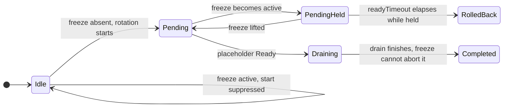
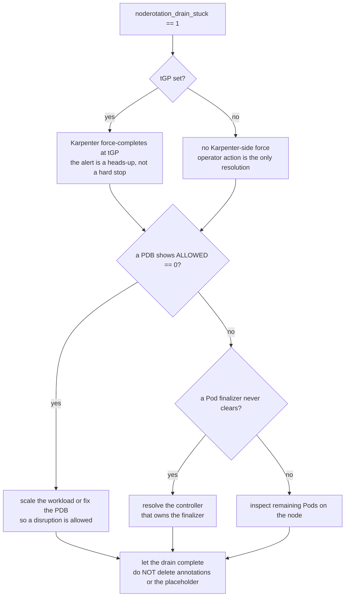

# 運用ランブック

`node-rotation-controller` を実クラスタで運用するための手引き。設計の *なぜ* は
[仕様書](specification/)が source of truth であり、本ランブックは運用者向けの
*どうやって* を扱う。各節は対応する仕様セクションへリンクしている。

英語原文: [docs/runbook.md](../runbook.md)。

> 本コントローラは pre-1.0 である。EKS Auto Mode PoC では core surge path を
> 検証済みだが、edge case と full multi-hour tight-race soak は未了である
> （[§7.2 検証済み前提](specification/07-risks.md#72-検証済み前提)を参照）。本ランブックは
> production 展開の出発点であって、保証ではない。

> **いまインシデント対応中なら？**
> [§7 トラブルシューティング: 症状別インデックス](#7-トラブルシューティング-症状別インデックス)
> から始めること — 観測できる各症状を、それを確定するメトリクス/イベントと、
> 直すべきセクションに対応づけてある。

## 目次

1. [ゾーン制約 PV ワークロード向けの AZ ごとの surge ヘッドルーム](#1-ゾーン制約-pv-ワークロード向けの-az-ごとの-surge-ヘッドルーム)
2. [Auto Mode の `terminationGracePeriod` を下げる](#2-auto-mode-の-terminationgraceperiod-を下げる)
3. [`noderotation_*` メトリクスの読み方](#3-noderotation_-メトリクスの読み方)
4. [freeze ワークフロー](#4-freeze-ワークフロー)
5. [drain が詰まったときの対処](#5-drain-が詰まったときの対処)
6. [アラート（PrometheusRule）](#6-アラートprometheusrule)
7. [トラブルシューティング: 症状別インデックス](#7-トラブルシューティング-症状別インデックス)
8. [コントローラのアップグレードとロールバック](#8-コントローラのアップグレードとロールバック)
9. [大規模クラスタでのコントローラのサイジング（Pod キャッシュ）](#9-大規模クラスタでのコントローラのサイジングpod-キャッシュ)

---

## 1. ゾーン制約 PV ワークロード向けの AZ ごとの surge ヘッドルーム

**対象:** **ゾーン制約** PersistentVolume（EBS `gp3`/`io2`、または
`nodeAffinity` に `topology.kubernetes.io/zone` 制約を持つ PV）に紐づくワークロードを
前段に置く NodePool。

**なぜ重要か。** surge は make-before-break であり、コントローラは古いノードを drain する
*前に* 置換ノードを追加する。ゾーン制約 PV ワークロードでは、既存ボリュームが再アタッチ
できるよう、置換ノードは **候補の AZ に固定される** —
`topology.kubernetes.io/zone` は `surge.matchNodeRequirements` の既定 `required`
集合に含まれる
（[§3.3 *ステートフル／ゾーン制約のワークロード*](specification/03-design.md#33-surge-シーケンスv1)）。
コントローラはゾーンストレージを AZ 間で移動できないし、するべきでもない。

その帰結は **ハードな制約** である: 同一 AZ の容量不足は **別ゾーンへフォールバック
できない**。候補の AZ に同一ゾーン置換用のスケジュール可能な容量がなければ surge は完了
できない。placeholder Pod が `Running` にならず `readyTimeout` が発火し、ローテーションは
`expireAfter` ベースラインへロールバックする
（[§3.3 *ロールバック挙動*](specification/03-design.md#33-surge-シーケンスv1)）。同一 AZ 不足が
繰り返されると `noderotation_retry_count` の増大として現れる
（リスク [R3](specification/07-risks.md#71-リスク)）。

**指針。** ゾーン制約 PV ワークロードを前段に置く各 NodePool では、**使用中の AZ ごとに
ノード 1 台分の surge ヘッドルームを確保する**:

- NodePool の `requirements` が **使用中のすべての AZ** を許可していることを確認する
  （ボリュームが複数ゾーンにまたがるなら `topology.kubernetes.io/zone` を 1 ゾーンに
  絞らない）。
- NodePool の `spec.limits` リソース予算を、*各* AZ で定常状態のフットプリント＋ノード
  1 台分の余地が残るよう設定する。コントローラはローテーション開始前に pool 全体の
  `limits` ヘッドルームを事前チェックするが（§5.2 step 3）、`limits` は **pool 全体の
  リソース予算であり AZ ごとの台数ではない** — 「`us-east-1a` に予備ノード 1 台」を表現
  できない。AZ ごとのヘッドルームは運用者の責任である。
- 使用する **各** AZ で（集計値だけでなく）基盤プロバイダに容量があり、EC2 vCPU クォータ
  にも余地があることを確認する。
- クラウドプロバイダが対応していれば、使用中の各 AZ で surge ノードのインスタンス形状に
  対するキャパシティ予約を検討する。

**不足の検知方法。** 同一 AZ 不足は `readyTimeout` 起因のロールバック
（`noderotation_completed_total` の `failure` 結果）と `noderotation_retry_count`
の増大（アラート: `NodeRotationRetryCountHigh`、[§6](#6-アラートprometheusrule)）として
現れる。このアラートがゾーン制約 PV の NodePool で発火したら、まず AZ ごとの容量不足を
疑うこと。

---

## 2. Auto Mode の `terminationGracePeriod` を下げる

**対象:** EKS Auto Mode の NodePool（既定の `terminationGracePeriod`（`tGP`）が
`24h`）。

**なぜ重要か。** コントローラのスループットモデル
（[§3.2 layer 2](specification/03-design.md#32-候補選定)）は、Karpenter が drain を束縛できる上限が
それであるため、各ローテーションについて `tGP` 全体を drain に要しうる時間として見込まねば
ならない。単一ノードのローテーション上限は `t_rot = readyTimeout + tGP + buffer` であり、
長さ `D` のウィンドウは直列で `C = floor(D / (t_rot + cooldownAfter))` 台を回せる。

既定の `tGP = 24h` では `t_rot ≈ 24.5h` となり、典型的な 4 時間ウィンドウは
`C = floor(4h / (24.5h + 10m)) = 0` を計算する — PDB を尊重する drain は通常数分で
終わるにもかかわらず、コントローラは **毎ウィンドウで警告する**（`ThroughputZero`）。
モデルは正しい: drain が速いと仮定できないだけである。

**指針。** NodePool の `spec.template.spec.terminationGracePeriod` を **現実的な
ノードあたりの drain 上限** に下げる — [§3.2](specification/03-design.md#32-候補選定) の worked
example は `1h` を用いる。`tGP = 1h` なら `t_rot ≈ 1.5h` となり、同じ 4 時間ウィンドウは
`C = floor(4h / (1.5h + 10m)) = 2` 回/occurrence を与える。

`tGP` を下げると、さらに以下の効果がある（いずれもここでは有益）:

- **Auto Mode の 21 日ハードキャップが緩む**（`E + tGP ≤ 21d`、
  [§1.1](specification/01-overview.md#11-背景)）。`tGP = 1h` は `expireAfter` を最大 ~`20d` まで
  許容し、これは疎な（例: 週次）ウィンドウで lead-time 導出を満たすのに必要なヘッドルーム
  そのものである。
- **stuck-drain 判定が厳しくなる**。`noderotation_drain_stuck` は `tGP + buffer` で
  発火するため、`tGP` が小さいほど詰まった drain を早く表面化できる
  （[§5](#5-drain-が詰まったときの対処)）。

**トレードオフ。** 本当に遅い drain は `24h` ではなく **`tGP` で強制完了される**。
`tGP` はワークロードの実際の PDB 尊重 drain 時間から選ぶこと — 健全な drain が自発的に
終わる程度には長く、スループットモデルが通る程度には短く。例の `1h` を盲目的にコピーしない
こと。

> `tGP` が未設定（self-managed Karpenter は nil を許容）の場合、drain は Karpenter に
> 束縛されない。コントローラはスループットモデルと stuck-drain アラートの両方に固定の
> フォールバック上限（例: `1h`）を代入する
> （[§3.2 layer-1 `TGPUnset` 警告](specification/03-design.md#32-候補選定)）。

---

## 3. `noderotation_*` メトリクスの読み方

`/metrics` で公開される（[§4.2](specification/04-operations.md#42-観測性)）。以下の名前とラベルは
コントローラが出力する **正確な** 文字列である。NodePool 単位の系列は **NodePool 削除時に
クリアされ** — 同様に、pool が統治 `RotationPolicy` を失った（もはやどのポリシーにもマッチしない）
ときにもクリアされる — ため、reconcile が止まった pool が最後の値を保持し続けることはない。

| メトリクス | 型 | ラベル | 読み方 |
|--------|------|--------|------------|
| `noderotation_candidates` | Gauge | `nodepool` | ローテーション待ちの適格 NodeClaim 数。各ウィンドウ内/後で **0 に向かうべき**。2 ウィンドウにわたり > 0 のままなら遅延（[R2](specification/07-risks.md#71-リスク)）。 |
| `noderotation_in_progress` | Gauge | `nodepool` | 進行中のローテーション数（v1 は直列なので 0 か 1）。 |
| `noderotation_completed_total` | Counter | `nodepool`, `outcome` | 累積完了数。`outcome ∈ {success, failure, expired}`。`expired` = 優雅なローテーション完了 **前に** 古いノードが Forceful Expiration された（lead-time レースに負けた — [§3.5](specification/03-design.md#35-バックストップ挙動)）。`success` には数えない。 |
| `noderotation_duration_seconds` | Histogram | `nodepool`, `phase` | フェーズ別レイテンシ。`phase ∈ {surge_wait, drain}`。`surge_wait` 増大 ≈ プロビジョニングが遅い/失敗、`drain` 増大 ≈ eviction が遅い。 |
| `noderotation_window_active` | Gauge | `nodepool` | `0/1`。pool の **統治ポリシー** のメンテナンスウィンドウ所属。各 pool が自身の `RotationPolicy` ウィンドウを解決するため NodePool ごと（[§5.4](specification/05-implementation.md#54-設定スキーマ)）。 |
| `noderotation_policy_conflict` | Gauge | `nodepool` | `0/1`。`1` = pool が `RotationPolicy` の競合 — 同一 specificity のセレクタ同点、またはランタイム不正な統治ポリシー（[§5.4](specification/05-implementation.md#54-設定スキーマ)）— で **ローテーションをブロックされている**。重複を解消（またはポリシーを修正）する。pool は `PolicyConflict` Warning イベントも発行する。 |
| `noderotation_freeze_until_timestamp` | Gauge | `nodepool` | 有効な freeze の Unix タイムスタンプ（`0` = freeze なし）。非ゼロ → ローテーションが **意図的に抑止** されている（[§4](#4-freeze-ワークフロー)）。 |
| `noderotation_age_threshold_seconds` | Gauge | `nodepool` | 導出された `ageThreshold` `A`（[§3.2](specification/03-design.md#32-候補選定)）。pool ごとに異なる。 |
| `noderotation_rotation_chances` | Gauge | `nodepool` | 導出しきい値での保証ローテーション回数 `G`。auto 導出では `G = K`。override は下げうる（かつ検証される）。 |
| `noderotation_window_period_seconds` | Gauge | `nodepool` | 最悪ケースのウィンドウ周期 `P`。v1 では全 pool で同一（ウィンドウはクラスタ全体）。`nodepool` ラベルは将来を見越したもの。 |
| `noderotation_short_lead_nodes` | Gauge | `nodepool` | **自身の** 刻印済み `expireAfter` で `K` 回を保証できなくなった NodeClaim（[§3.2 layer 3](specification/03-design.md#32-候補選定)）。best-effort でローテーションされるが Forceful Expiration に至りうる。 |
| `noderotation_drain_stuck` | Gauge | `nodepool` | `0/1`: 進行中の drain が `tGP + buffer` を超過。`1` → 運用者の対処が必要（[§5](#5-drain-が詰まったときの対処)）。 |
| `noderotation_retry_count` | Gauge | `nodepool` | pool の NodeClaim 全体での最大 `noderotation.io/retry-count`（なければ `0`）。`≥ 3` → **systematic** な失敗（継続的な preemption か同一 AZ 不足、[R3](specification/07-risks.md#71-リスク)）。 |

**Warning Events。** 非致命的な finding は NodePool / NodeClaim 上の Kubernetes
`Warning` Event としても表面化されるため
（[§4.2](specification/04-operations.md#42-観測性)）、`kubectl describe nodepool <name>` で
メトリクススタックなしに確認できる。Reason には `KBelowTwo`、`AVeryAggressive`、
`TGPUnset`、`HardCapExceeded`、`ThroughputZero`、`ThroughputBelowArrival`、
`ThroughputBurstShortfall`、`OverrideGBelowK`、`ShortLead` などがある。

**reconcile の生存性は警告ログではなくメトリクスで判断する。** Warning Event
*と* `INFO` レベルの警告**ログ**行はいずれも、条件に入った遷移時にデデュープ
される。そのため定常状態 — 所見が安定し遷移が起きない状態 — では、まったく健全
な reconcile ループが多数のパスにわたって**ゼロ行**のログしか出さないことがある。
「最近警告ログ行が出ていない」を「reconcile が停止した」と読んでは**ならない**
（実際に過去の誤診断があった）。生存性は、**毎**パス進む controller-runtime の
`/metrics` メトリクスから判断すること:

- `controller_runtime_reconcile_total{controller="rotation"}` — reconcile ごとに
  増加。`rate()` が上がっていればループは生きている。
- `controller_runtime_reconcile_time_seconds_count{controller="rotation"}` —
  レイテンシヒストグラム経由の同じ毎パスカウント。
- `workqueue_*`（`name="rotation"` の `workqueue_adds_total`・`workqueue_depth`・
  `workqueue_work_duration_seconds_*` など）— キューの活動とバックログ。

デバッグ時にログで毎パスの活動を*見たい*場合は、コントローラのログ詳細度を
上げる（`--zap-devel`、またはより高い `-v`）。デバッグ詳細度（`V(1)`）では、
コントローラは追加で、**毎パス・デデュープなしに**現在の所見と、軽量な
`reconcile` ハートビート行（phase・候補数・claim 数・in-window・所見数）を出力
する。これは付加的なデバッグ可視性のみであり — `INFO` ログや Warning Event の
デデュープも、いかなるメトリクスも変更しない。

**surge-less 強制フォールバック。** 統治する `RotationPolicy` で `surge.forcefulFallback.enabled` が設定されている場合、自身のデッドラインまでに優雅な surge を完了できない候補（`deadline − now < t_rot`）は **surge-less** でローテーションされる: コントローラは surge ノードを提供せず、古い `NodeClaim` を in-window で削除し、Karpenter の voluntary パスで drain する（PDB は適用され続ける、spec §3.3）。各ローテーションは `noderotation_forceful_fallback_total{nodepool}` をインクリメントし、NodePool 上で `ForcefulFallback` Warning イベントを発行する（`kubectl describe nodepool <name>`）。進行中のローテーションは NodePool に `noderotation.io/rotation-mode=forceful-fallback` アノテーションを保有する。`noderotation_forceful_fallback_total` が増大し続けるのは優雅な surge がレースにたびたび負けることを意味する — メンテナンスウィンドウを拡大する、`tGP` を下げる、または `ThroughputBurstShortfall` でフラグされた同期ノード数を削減する。

---

## 4. freeze ワークフロー

**目的。** 単一の NodePool のローテーションを指定時刻まで抑止する — 例: 業務クリティカルな
期間 — コントローラをアンインストールせず、`expireAfter` バックストップも失わずに。

**仕組み。** **NodePool** に freeze アノテーションを RFC3339 タイムスタンプ値で設定する
（[§3.1](specification/03-design.md#31-メンテナンスウィンドウ)）:

```sh
kubectl annotate nodepool <name> \
  noderotation.io/freeze='2026-12-31T23:59:59Z' --overwrite
```

freeze が有効な間、コントローラは:

- その pool で新規ローテーションを **開始しない**;
- まだ `pending` の進行中ローテーションを **保留する** — drain は未開始なので一時停止は
  安全。placeholder の（再）作成と `pending → draining` 遷移は中断される;
- **受動的な記帳は継続する**（保護用 `do-not-disrupt`/cordon マーカーの再表明、
  surge-claim 識別の永続化）ため、freeze はクラッシュ復旧保証を弱めない;
- すでに `draining` のローテーションは **完走させる** — drain は途中で安全に中断できない。

freeze が `readyTimeout` を超えて続くと、保留中の `pending` 試行は通常の失敗パスで
ロールバックする。`noderotation_freeze_until_timestamp` が有効な freeze を報告する
（`0` = なし）。

freeze ゲートがローテーションにどう作用するかは、freeze が効き始めた時点の
フェーズに依存する — `pending` の試行は保留され、`draining` のものは完走させる:



**アドホックではなく GitOps で管理する**（リスク [R5](specification/07-risks.md#71-リスク)）。
忘れられたアドホック freeze はそのタイムスタンプが過ぎるまで pool のローテーションを
密かに無効化する。バックストップが `expireAfter` でノード齢を束縛し続けるが、優雅なパスは
止まる。freeze は GitOps リポジトリで宣言してレビューで可視化し、**ソースから削除した
ときに失効** させること（誰かが解除を思い出したときではなく）。早期に解除するには:

```sh
kubectl annotate nodepool <name> noderotation.io/freeze- # アノテーション削除
```

---

## 5. drain が詰まったときの対処

**症状。** ある NodePool で `noderotation_drain_stuck == 1`（アラート:
`NodeRotationDrainStuck`）。

**意味。** 進行中ローテーションが `draining` に入り（コントローラはすでに古い NodeClaim を
削除済みで、Karpenter が voluntary な PDB 尊重パスでノードを drain している）、その drain が
`tGP + buffer` を超過した（[§5.2](specification/05-implementation.md#52-reconcile-ループ)）。この gauge は
毎 reconcile でライブ状態から再計算されるため、drain が終わった瞬間に **自動的にクリア
される**。

**重要 — シリアルゲートは意図的に保持される。** `draining` のローテーションは
**ロールバックできず**（古い NodeClaim にはすでに `deletionTimestamp` がある）、
コントローラはこれが詰まっている間 **2 本目のローテーションを開始しない** —
NodePool 単位のゲートを解放すると 1 本目が半端に drain された状態で 2 ノード目を disrupt
することになり、`surge.maxUnavailable = 1` に違反する。よって詰まった drain は **その
NodePool の全ローテーションをブロックする** までクリアされない。他の NodePool は影響を
受けない。

**対処は運用者側。** ブロッカーはほぼ常に **満たせない PDB** か Pod の **詰まった
finalizer** である。判断フロー:



具体的に進めると:

1. drain 中のノードと NodeClaim を見つける:

   ```sh
   kubectl get nodeclaim -l karpenter.sh/nodepool=<name> \
     -o wide | grep -i terminating
   kubectl get node <node> -o yaml | grep -A3 deletionTimestamp
   ```

2. eviction をブロックしているものを見つける:

   ```sh
   # ノード上に残る Pod
   kubectl get pods --all-namespaces \
     --field-selector spec.nodeName=<node> -o wide
   # PDB と許容される disruption
   kubectl get pdb --all-namespaces \
     -o custom-columns=NS:.metadata.namespace,NAME:.metadata.name,ALLOWED:.status.disruptionsAllowed,CURRENT:.status.currentHealthy,DESIRED:.status.desiredHealthy
   ```

   `ALLOWED = 0` の PDB が典型的な原因 — ワークロードの健全レプリカが少なすぎて 1 つも
   譲れない。コントローラではなく **PDB かワークロードを直す**（PDB が disruption を
   許すようスケールアップする、または満たし得ない `minAvailable`/`maxUnavailable` を
   修正する）。

3. **詰まった finalizer** の場合、`metadata.finalizers` が消えない Pod を特定し、その
   finalizer を所有するコントローラ側で解消する。

4. **`tGP` が設定されている場合**、Karpenter は最終的に `tGP` で **drain を強制完了** する
   — よって詰まった drain は `tGP` 以内に自己解決し、stuck-drain アラートは *優雅な*
   drain が終わっていないという予告であって、ノードが永久に詰まっているわけではない。
   これが `tGP` を束縛しておく実務上の理由である
   （[§2](#2-auto-mode-の-terminationgraceperiod-を下げる)）。**`tGP` が未設定**
   （self-managed Karpenter）の場合、Karpenter 側の強制が **ない** — ブロックする PDB や
   詰まった finalizer が drain を無期限に保持しうるため、運用者の対処だけが解決手段である。

コントローラのアノテーションや placeholder を削除してローテーションを「こじ開けよう」と
**しないこと** — ローテーションは NodePool アンカーから再開され
（[§5.2](specification/05-implementation.md#52-reconcile-ループ)）、ハンドラは冪等である。根本の
PDB/finalizer を直し、drain を完了させること。

---

## 6. アラート（PrometheusRule）

Helm chart は [§4.2](specification/04-operations.md#42-観測性) の 6 アラートを含む **任意の**
`PrometheusRule` を同梱する。既定では **オフ**（既存インストールや Prometheus Operator の
ないクラスタに影響しないように）。有効化:

```sh
helm upgrade --install rot charts/node-rotation-controller \
  --set prometheusRule.enabled=true
```

| アラート | 式 | 意味 |
|-------|------------|-------|
| `NodeRotationCompletedFailureOrExpired` | `increase(noderotation_completed_total{outcome=~"failure\|expired"}[1h]) > 0` | 直近 1 時間でローテーションが失敗、またはノードが force-expire された。 |
| `NodeRotationCandidatesNotDraining` | `min_over_time(noderotation_candidates[<2·P>]) > 0 and noderotation_candidates offset <2·P> > 0` | 2 ウィンドウ連続で候補がはけていない（[R2](specification/07-risks.md#71-リスク)）。`offset` ガードにより、生成直後の非ゼロ系列が 2 ウィンドウ分の履歴が揃う前に発火するのを防ぐ。 |
| `NodeRotationStalledInWindow` | window active **かつ** candidates `> 0` **かつ** 完了ゼロ | メンテナンスウィンドウ内でローテーションが詰まっている。 |
| `NodeRotationDrainStuck` | `noderotation_drain_stuck == 1` | drain が `tGP + buffer` を超えてブロック — [§5](#5-drain-が詰まったときの対処)。 |
| `NodeRotationShortLeadNodes` | `noderotation_short_lead_nodes > 0` | 刻印済み `expireAfter` で `K` 回を保証できなくなった NodeClaim。 |
| `NodeRotationRetryCountHigh` | `noderotation_retry_count >= 3` | 同一ローテーションが失敗し続ける — systematic な原因（[R3](specification/07-risks.md#71-リスク)）。 |

**スケジュール依存のレンジを調整する。** 2 つのアラートはウィンドウ周期 `P` とウィンドウ
長 `D` に依存する。これらのレンジはハードコードではなく **chart の値** である:

- `prometheusRule.candidatesNotDraining.windowRange` — おおよそ **2 ウィンドウ周期**
  （`2·P`）に設定する。既定の `8d` は `{Wed, Sat}` スケジュール（`P = 4d`）に合う。
  週次ウィンドウ（`P = 7d`）なら `14d` に上げる。
- `prometheusRule.stalledInWindow.completionRange` — おおよそ **ウィンドウ長**（`D`）に
  設定する。既定の `4h` は `02:00–06:00` ウィンドウに合う。

各アラートの `for` と `severity` も設定可能
（[`values.yaml`](../../charts/node-rotation-controller/values.yaml) を参照）。
`min_over_time`/`increase` のレンジは Prometheus subquery を意図的に避けてルールを軽く
保っている。スケジュールを大きく変える場合は subquery をネストするのではなく記録ウィンドウ
を広げること。

---

## 7. トラブルシューティング: 症状別インデックス

上記の各節は *原因* で構成されている。本表はそれを逆引きにする: **観測した症状** から
始め、列挙した **シグナル**（メトリクス・`Warning` イベント・[§6](#6-アラートprometheusrule)
のアラート）で確定し、それを直す節へ飛ぶ。シグナル文字列は
[§3](#3-noderotation_-メトリクスの読み方) の正確な文字列である。

| 症状（観測されるもの） | 確定方法 | 想定原因 | 参照 |
|----------------------|---------|---------|------|
| surge ノードが現れない。placeholder Pod が `Pending` のままでローテーションが `failure` で終わる | `noderotation_duration_seconds{phase="surge_wait"}` の増大、`noderotation_completed_total{outcome="failure"}` | 置換用の **同一 AZ** スケジュール可能容量がない（ゾーン制約 PV のピン） | [§1](#1-ゾーン制約-pv-ワークロード向けの-az-ごとの-surge-ヘッドルーム) |
| `noderotation_candidates` が 2 ウィンドウにわたり `0` に向かわない | `NodeRotationCandidatesNotDraining`（[R2](specification/07-risks.md#71-リスク)） | ウィンドウに対しスループットが低すぎる、**または** 下記いずれかの原因でローテーションが詰まっている | [§2](#2-auto-mode-の-terminationgraceperiod-を下げる)、その後で下の行を確認 |
| **毎ウィンドウ** `ThroughputZero` 警告（`C = 0`） | `ThroughputZero` Warning イベント | ウィンドウ長に対し `tGP` が大きすぎ、スループットモデルが 0 に丸まる | [§2](#2-auto-mode-の-terminationgraceperiod-を下げる) |
| drain が `tGP + buffer` を超えて詰まる | `noderotation_drain_stuck == 1`、`NodeRotationDrainStuck` | 満たせない PDB か詰まった Pod finalizer | [§5](#5-drain-が詰まったときの対処) |
| `noderotation_in_progress` が `1` のまま新規完了がない | `NodeRotationStalledInWindow` | surge が立ち上がっていない（→ §1）か drain が詰まっている（→ §5） | [§1](#1-ゾーン制約-pv-ワークロード向けの-az-ごとの-surge-ヘッドルーム) / [§5](#5-drain-が詰まったときの対処) |
| ある NodePool が一切ローテーションせず、候補が固まり開始もしない | `noderotation_policy_conflict == 1`、`PolicyConflict` Warning イベント | 同一 specificity の `RotationPolicy` セレクタ同点、またはランタイム不正な統治ポリシー | [§3](#3-noderotation_-メトリクスの読み方) のメトリクス行、[spec §5.4](specification/05-implementation.md#54-設定スキーマ) |
| ある NodePool が意図的に見える形でローテーションを止めている | `noderotation_freeze_until_timestamp > 0` | 有効な（忘れられたアドホックかもしれない）freeze | [§4](#4-freeze-ワークフロー) |
| 優雅なローテーション完了前にノードが `expireAfter` に達する | `noderotation_completed_total{outcome="expired"}` | lead-time レースに負けた — ウィンドウ周期に対ししきい値/スループットがきつすぎる | [§2](#2-auto-mode-の-terminationgraceperiod-を下げる)、[spec §3.5](specification/03-design.md#35-バックストップ挙動) |
| `noderotation_short_lead_nodes > 0` | `NodeRotationShortLeadNodes`、`ShortLead` Warning イベント | ノード自身の刻印済み `expireAfter` で `K` 回を保証できない | [§2](#2-auto-mode-の-terminationgraceperiod-を下げる)、[spec §3.2 layer 3](specification/03-design.md#32-候補選定) |
| ある pool で `noderotation_retry_count >= 3` | `NodeRotationRetryCountHigh`（[R3](specification/07-risks.md#71-リスク)） | **systematic** な失敗: 継続的な preemption か同一 AZ 不足 | [§1](#1-ゾーン制約-pv-ワークロード向けの-az-ごとの-surge-ヘッドルーム) |
| 「reconcile が止まって見える」 — 最近の警告**ログ**行がない | *これは症状ではない。* `controller_runtime_reconcile_total{controller="rotation"}` が増加し続けているか確認する | 警告ログ/イベントは遷移時にデデュープされる。健全な定常ループは **ゼロ行** のログしか出さない | [§3](#3-noderotation_-メトリクスの読み方)（生存性の判断） |

---

## 8. コントローラのアップグレードとロールバック

アップグレード時には 2 つが独立に動く: **コントローラの Deployment**（イメージ）と
**`RotationPolicy` CRD スキーマ**。両者は安全性の性質が異なる。（chart の機構面 —
Helm が CRD をどう扱うか、および
[#119](https://github.com/AkashiSN/node-rotation-controller/issues/119) 以前からの
一度きりの ConfigMap → `RotationPolicy` 移行 — は
[chart README *Upgrading*](../../charts/node-rotation-controller/README.md#upgrading)
にある。本節は **運用** 面、すなわち「ローテーションが進行中でも安全か」を扱う。）

**コントローラのイメージのアップグレードはローテーション進行中でも安全。** 永続的な
ローテーション状態はすべて Kubernetes オブジェクト上にある — NodePool の
`active-rotation` アンカーと古い NodeClaim の `state` アノテーション、placeholder Pod と
ノードマーカーは冪等なハンドラが失われれば再表明する一時的なランタイムオブジェクトである
（[§5.2](specification/05-implementation.md#52-reconcile-ループ)、[§5.3](specification/05-implementation.md#53-状態モデル)）。
**外部データストアはなく**、再起動で失われるものはコントローラのメモリ上に存在しない。
`replicaCount=2` とリーダー選出により、ローリングアップグレードはリーダーを新しい Pod に
引き継ぎ、新リーダーは **進行中のローテーションをアンカーから再開する** — リーダー交代時の
再開は検証済みのパスである（[§7.2](specification/07-risks.md#72-検証済み前提)）。よって
`noderotation_in_progress == 1` の状態で `helm upgrade` を実行しても、ローテーションを
破壊・重複・孤立させることはない。

**任意で先に quiesce する。** ローテーション進行中のアップグレードを避けたいだけなら、
短い [freeze](#4-freeze-ワークフロー) を設定して `noderotation_in_progress` が `0` に
なるのを待つ: `draining` のローテーションは自然に完走し、`pending` のものは保留される。
これは整然さのためであって正しさの要件ではない。

**CRD スキーマ変更には順序が必要。** Helm は CRD を **アップグレードしない** — chart は
CRD を `crds/` から同梱し、これはインストール専用である（chart README の注記参照）。
新しい chart バージョンが `RotationPolicy` のフィールドを追加する場合、それに依存する
コントローラを回す **前に CRD を適用する**:

```sh
kubectl apply -f charts/node-rotation-controller/crds/
helm upgrade --install node-rotation-controller charts/node-rotation-controller ...
```

インストール済み CRD がまだ知らないフィールドを使う `RotationPolicy` は admission で
拒否されるため、CRD を先に適用すれば新しいポリシーを書けない期間を避けられる。

**ロールバック。** **イメージ** を戻すのは対称で同じく安全 — 古いコントローラも同じ
オブジェクト上の状態から再開する。本当の危険は **CRD スキーマ変更をまたいだ** ロール
バックである: 新スキーマ向けに書かれた `RotationPolicy` は古いコントローラの reconcile 時
検証に通らないことがあり、コントローラはこれを **conflict** として扱う —
`noderotation_policy_conflict == 1` を立て、`PolicyConflict` Warning イベントを発行し、
**推測せずにその pool のローテーションを拒否する**
（[spec §5.4](specification/05-implementation.md#54-設定スキーマ)）。その pool のローテーションは止まるが、
**`expireAfter` バックストップは終始ノード齢を束縛し続ける** — 無制限に走るものはない。
きれいにロールバックするには、影響を受ける `RotationPolicy` オブジェクトも古いコントローラ
が受け付けるスキーマへ戻すこと。

---

## 9. 大規模クラスタでのコントローラのサイジング（Pod キャッシュ）

**対象:** 大規模クラスタ — おおよそ **10k+ Pod**。

**なぜ重要か。** コントローラは **クラスタ全体の Pod 可視性** を必要とする: surge の
placeholder は候補ノード上の再スケジュール可能な Pod リクエストの総和にサイズされ、それらの
Pod は任意の名前空間に存在しうる（[spec §3.3](specification/03-design.md#33-surge-シーケンスv1)）。
そのため controller-runtime の informer は **クラスタ内の全 Pod をキャッシュ** し、
コントローラのメモリフットプリントは総 Pod 数に比例する — これは reconcile パスのスキャン
最適化では **減らない**。コストはスキャンではなくキャッシュにあるからである
（[`docs/reference/perf/pod-cache-scalability.md`](../reference/perf/pod-cache-scalability.md)、issue #80）。

**指針。** コントローラ Deployment のメモリ `requests`/`limits` を総 Pod 数から決める。
以下の実測フットプリントは **保守的な下限** として扱うこと（実際にキャッシュされる
`corev1.Pod` は full status・conditions・`managedFields` を持ち、より重い）:

| クラスタ Pod 数 | キャッシュフットプリント（下限） |
|----------------|------------------------------|
| ~1k | ~3.7 MB |
| ~10k | ~37 MB |
| ~50k | ~185 MB — 実運用では **数百 MB〜約 1 GB を見込む** |

reconcile の **CPU** は問題にならない: 50k Pod の全スキャンは ~105 µs で、ローテーション
パスあたり数回しか走らず、reconcile のネットワークラウンドトリップを大きく下回る。soak で
キャッシュメモリの逼迫が顕在化した場合、それは controller-runtime のキャッシュスコープの
別課題であり、独立に追跡される — perf ノートの記録済みフォローアップ（`spec.nodeName`
フィールドインデックス。CPU/レイテンシの改善だがキャッシュは **縮小しない**）を参照。
