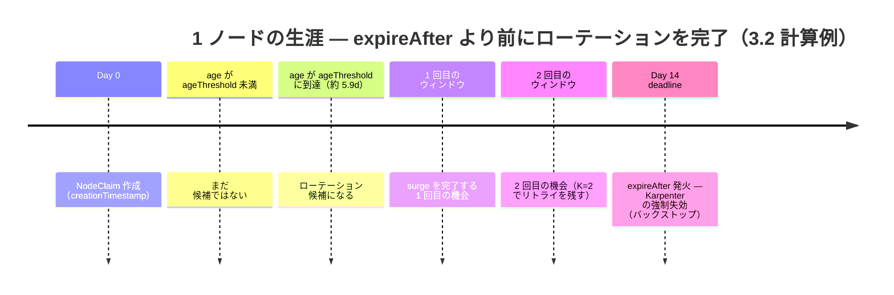
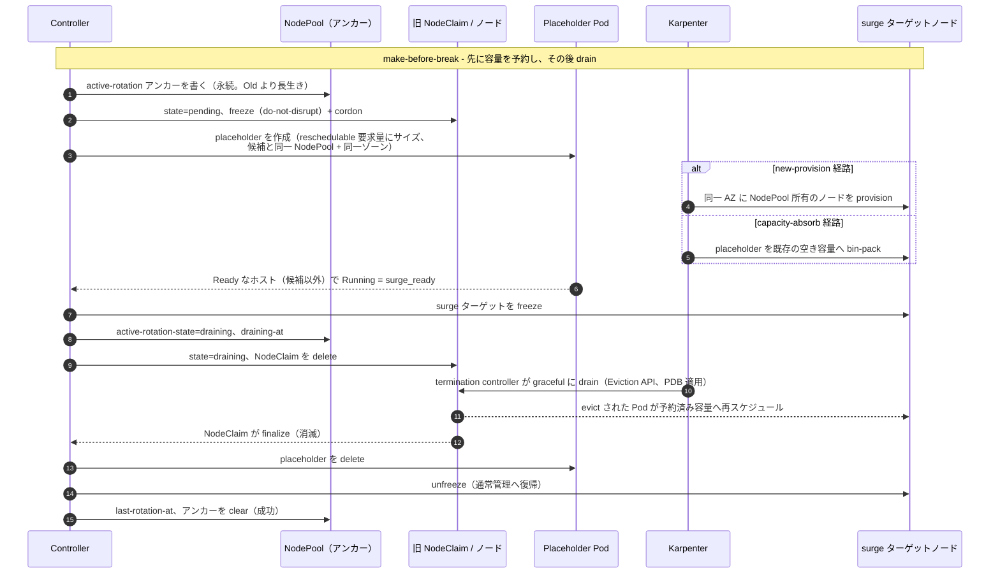
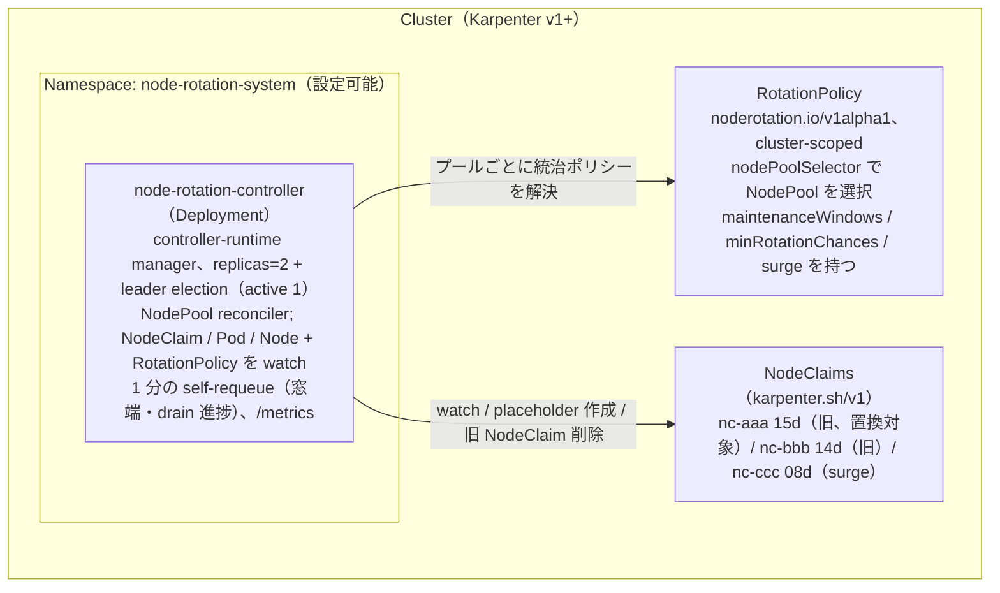
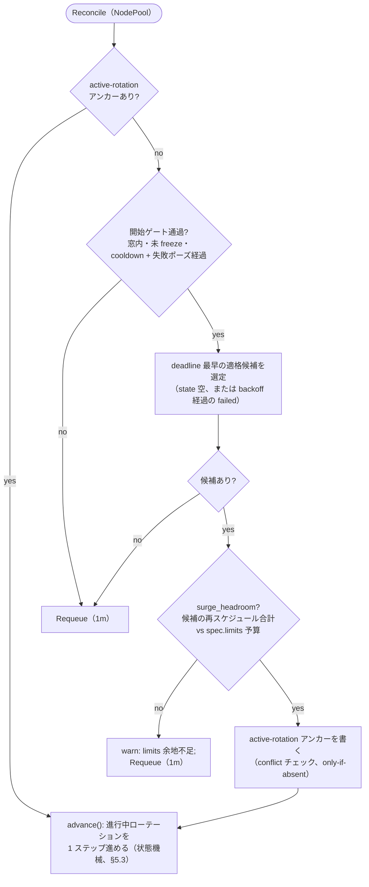
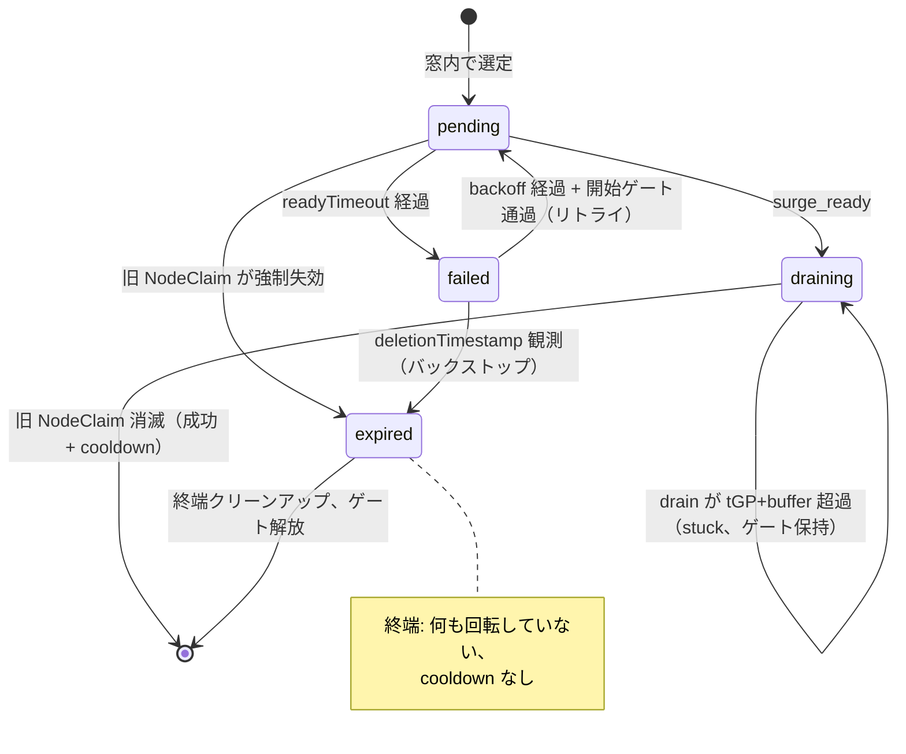

# node-rotation-controller — 仕様書

Karpenter 配下の Node を、設定可能なメンテナンスウィンドウ内で make-before-break（surge）型に先回り置換し、Karpenter の Forceful な `expireAfter` 発火を実質的に起こさないようにする Kubernetes コントローラの機能仕様。

英語原文: [docs/specification.md](../specification.md)

---

## 目次

1. **概要** — [1.1 背景](#11-背景) · [1.2 ゴール](#12-ゴール) · [1.3 非ゴール](#13-非ゴール) · [1.4 用語](#14-用語) · [1.5 Karpenter エコシステムでの位置付け](#15-karpenter-エコシステムでの位置付け)
2. **スコープ** — [2.1 スコープと互換性](#21-スコープと互換性) · [2.2 既存メカニズムとの関係](#22-既存メカニズムとの関係)
3. **設計** — [3.1 メンテナンスウィンドウ](#31-メンテナンスウィンドウ) · [3.2 候補選定](#32-候補選定) · [3.3 surge シーケンス（v1）](#33-surge-シーケンスv1) · [3.4 将来バージョン（v2）](#34-将来バージョンv2) · [3.5 バックストップ挙動](#35-バックストップ挙動)
4. **運用** — [4.1 Capacity / 可用性](#41-capacity--可用性) · [4.2 観測性](#42-観測性) · [4.3 RBAC と クラウド権限](#43-rbac-と-クラウド権限) · [4.4 コスト](#44-コスト)
5. **実装** — [5.1 アーキテクチャ](#51-アーキテクチャ) · [5.2 Reconcile ループ](#52-reconcile-ループ) · [5.3 状態モデル](#53-状態モデル) · [5.4 設定スキーマ](#54-設定スキーマ)
6. **リリース** — [6.1 バージョニングとリリース](#61-バージョニングとリリース) · [6.2 ロードマップ](#62-ロードマップ)
7. **リスクと状況** — [7.1 リスク](#71-リスク) · [7.2 検証済み前提](#72-検証済み前提) · [7.3 未決事項](#73-未決事項)

[参考](#参考)

---

## 1.1 背景

Karpenter（および Karpenter ベースの EKS Auto Mode）では Node の disruption を 2 種類に分類している。

| 分類 | 例 | NodePool Disruption Budgets | 代替 Node の事前起動 | PDB |
|------|-----|------------------------------|-----------------------|-----|
| Graceful | Drift, Consolidation | 適用される | する（make-before-break）| 厳密に尊重 |
| **Forceful** | **Expiration**, Spot Interruption | **適用されない** | **しない** | `terminationGracePeriod` でキャップ |

Expiration が意図的に Forceful とされているのは、AMI パッチやセキュリティ更新を Budgets / PDB の誤設定で無期限延期させない設計思想に基づく。これは Karpenter 公式 design [`forceful-expiration.md`](https://github.com/kubernetes-sigs/karpenter/blob/main/designs/forceful-expiration.md) に明文化されており、同 design は「**運用者が独自に graceful rotation を実装する**」ことも妥当な解の一つとして列挙している。EKS Auto Mode はさらに **21 日のノード最大寿命**を、ユーザが*短縮*はできても*除去*はできない制約として追加している — ノードは「最大 21 日の寿命を持ち、その後自動的に置き換えられる」（[EKS Auto Mode ユーザーガイド](https://docs.aws.amazon.com/eks/latest/userguide/automode.html)）。ノードの真の寿命は `expireAfter` の失効に加え最大 `terminationGracePeriod` の drain を**含む**ため、この上限は両者の**合計**に対する制約として課される: `expireAfter + terminationGracePeriod ≤ 21d`（AWS は「expireAfter と NodePool の terminationGracePeriod の合計値は 21 日を超えることはできません」と明記 — [AWS builders.flash, 2025-04](https://aws.amazon.com/jp/builders-flash/202504/dive-deep-eks-node-automated-update/)）。参考までに Auto Mode のデフォルトは `expireAfter` 336h（≈14d）、`terminationGracePeriod` 24h（[Create a Node Pool](https://docs.aws.amazon.com/eks/latest/userguide/create-node-pool.html)）。

現実的な帰結として、運用中のクラスタでは **PDB を厳しくしても Node は必ず Force drain される瞬間が来る**。Karpenter は drain 開始の **後から** 代替 Node を立ち上げるため、`request==limit` のような厳しい capacity 要件のワークロードではピーク時間と衝突した瞬間に Pod Pending が発生する。

## 1.2 ゴール

| # | ゴール |
|---|--------|
| G1 | age 閾値（メンテナンススケジュールと目標ローテーション回数から NodePool ごとに導出 — §3.2）に達した `NodeClaim` をメンテナンスウィンドウ内で voluntary 経路で先回り置換し、**Forceful Expiration を実質発火させない** |
| G2 | 代替の NodePool-owned ノードを先に追加して `Ready` を待ってから旧 `NodeClaim` を delete する（**ノードレベルの surge / make-before-break**。Pod レベルの順序付けは PDB に委譲 — §3.3）。Pod Pending の窓を 0 に近づける |
| G3 | 業務影響の少ない時間帯に置換を **閉じ込める**（曜日 / 時刻 / タイムゾーン設定） |
| G4 | 既存の保護機構（PDB、`topologySpreadConstraints`、preStop、Pod Readiness Gate、ALB Slow Start）と **共存して成立** する。置き換えない |

## 1.3 非ゴール

| # | 非ゴール | 理由 |
|---|----------|------|
| N1 | Karpenter Consolidation / Drift の置き換え | Karpenter の自発的最適化は引き続き有効。本コントローラは Expiration 経路のみ肩代わり |
| N2 | Spot Interruption への対応 | 2 分の hard limit がある AWS インフラ側イベント。[AWS Node Termination Handler](https://github.com/aws/aws-node-termination-handler) を使う |
| N3 | アプリケーションの warm-up 責務 | JVM 起動、コネクションプール初期化等は `readinessProbe` / `readinessGate` / ALB slow start の領分。本コントローラは **Node** の orchestration を提供し、アプリは自分の readiness を自分で表現する |
| N4 | `expireAfter == 0` 化、21 日 hard cap の解除 | Auto Mode の hard cap は回避不能。`expireAfter` はコントローラ停止時の **バックストップ** として意図的に残す |
| N5 | OS パッチ起因の Node 再起動 | スコープ外。[kured](https://github.com/kubereboot/kured) を使う |

## 1.4 用語

| 用語 | 定義 |
|------|------|
| **NodeClaim** | Karpenter v1 CRD。実インスタンス（EC2 等）に 1:1 対応 |
| **surge** | 旧 Node を抜く前に新 Node を立ち上げて `Ready` 化する make-before-break 戦略 |
| **メンテナンスウィンドウ** | コントローラが置換を **開始してよい** 曜日・時間帯の **和集合**（1 つ以上）。窓終端を跨いだ進行中の置換は完遂させる |
| **age 閾値** | `creationTimestamp` からの経過時間がこの値を超えた `NodeClaim` を候補とする値。スケジュールと目標ローテーション回数（`minRotationChances`）から NodePool ごとに **導出**、直接指定しない（§3.2）。実際のノード単位トリガは各 NodeClaim 自身の `spec.expireAfter` デッドラインに基づき、`ageThreshold` はその age 換算の代表値（§3.2）|
| **バックストップ** | コントローラが停止しても Karpenter 標準の `expireAfter`（Forceful Expiration）が最終的に Node を置換する安全装置。意図的に残す |

**記号** — §3〜§5 で頻出。完全な導出と「ノード単位か NodePool テンプレートか」の権威ある区別（下表の **取得元** 列）は §3.2 を参照。

| 記号 | 意味 |
|------|------|
| `E` | `expireAfter` — Forceful Expiration までの NodeClaim の寿命（ノード単位・権威: `NodeClaim.spec.expireAfter`） |
| `tGP` | `terminationGracePeriod` — Karpenter が drain を保持できる上限 |
| `P` | 最悪ウィンドウ周期 — 連続するメンテナンスウィンドウ機会の最大ギャップ（§3.1） |
| `t_rot` | 1 ノードのローテーション所要時間の上限 = `readyTimeout + tGP + buffer` |
| `K` | `minRotationChances` — 失効前に保証したいローテーション回数（下限 1） |
| `leadTime` | deadline のどれだけ前に選定するか = `K·P + t_rot` |
| `A` | `ageThreshold` — ノードが候補になる age。導出は `A = E − (K·P + t_rot)` |
| `G` | スケジュールが実際に保証するローテーション回数。auto 導出では `G = K`、明示的な `ageThreshold` override 時は再計算 |

## 1.5 Karpenter エコシステムでの位置付け

本コントローラは Karpenter 公式の設計方針と整合している。Karpenter 本体の挙動を変えるのではなく、その **上のレイヤ** で動作する。

### Karpenter 本体に同等機能が組み込まれない理由

[`forceful-expiration.md`](https://github.com/kubernetes-sigs/karpenter/blob/main/designs/forceful-expiration.md) は Expiration を Forceful に保つ判断を記録しており、graceful な expiration を求めるユーザに対し以下 3 オプションを提示している。

1. （推奨）Expiration は Forceful のまま
2. NodePool ごとに `expirationPolicy: Forceful | Graceful` を追加
3. **「運用者が独自に graceful rotation を実装する」**

本コントローラは Option 3 に該当する。Karpenter 本体に "graceful surge rotation for Expiration" が組み込まれる可能性は当面低く、ユーザ側実装が公式に妥当解として位置付けられている。

### Disruption Budgets では不十分な理由

`NodePool.spec.disruption.budgets` は `schedule + duration` をサポートし、表面的にはメンテナンスウィンドウに見える。実際には 2 つの構造的制約がある。

| 要件 | Karpenter 単体で実現可能か |
|------|----------------------------|
| 窓内のみ disruption を許可、窓外は拒否 | △ ブラックリスト方式のみ可能（複数 budget の **最小値が採用される** 仕様による）— [Discussion #1079](https://github.com/kubernetes-sigs/karpenter/discussions/1079) 参照 |
| 上記を **Expiration** にも適用 | ✗ Budgets は Drift / Consolidation のみが対象、**Expiration には適用されない** |
| Expiration 時に surge 置換 | ✗ Expiration は Forceful で代替 Node の事前起動なし |

本コントローラは下 2 行を埋め、1 行目も大幅に簡潔化する。

### 隣接プロジェクト

| プロジェクト | スコープ | 重複度 |
|------------|---------|--------|
| Karpenter NodePool Disruption Budgets | Drift / Consolidation のレート制御 | 補完関係、Expiration には適用外 |
| [kured](https://github.com/kubereboot/kured) | OS パッチ起因の Node 再起動 | 無、NodeClaim にタッチしない |
| [AWS Node Termination Handler](https://github.com/aws/aws-node-termination-handler) | Spot 中断 / Scheduled Event | 無、トリガが異なる |
| [descheduler](https://github.com/kubernetes-sigs/descheduler) | Pod 再配置 | 無、Node にタッチしない |
| EKS Node Auto Repair (AWS マネージド) | 故障 Node 置換 | 無、期限切れ駆動ではない |

---

## 2.1 スコープと互換性

### サポート対象環境

| 環境 | 状態 |
|------|------|
| EKS Auto Mode | 主対象（21 日 hard cap が最大の動機） |
| EKS 上の self-managed Karpenter v1+ | サポート |
| その他の CNCF 系（AKS NAP 等） | best-effort。CRD API は同じだが運用セマンティクスは差異あり |

### Karpenter 互換性ポリシー

`karpenter.sh/v1` 必須。`v1beta1`、`v1alpha5` は非サポート。

互換性の契約は **安定版 `karpenter.sh/v1` CRD サーフェスであり、特定の Karpenter コントローラのマイナーバージョンではない。** これは主対象である **EKS Auto Mode** において重要である: Auto Mode は管理対象の Karpenter マイナーをユーザに公開しないが、本コントローラは互換性のある `karpenter.sh/v1` `NodePool`/`NodeClaim` API を提供する任意のクラスタで動作する — 背後で Auto Mode が動かす Karpenter のバージョンに依存しない。

- **ランタイム対象。** EKS Auto Mode、および `karpenter.sh/v1` 互換の `NodePool`/`NodeClaim` API を提供する任意の Karpenter v1+ クラスタ。
- **ビルド/テスト基準。** 本リポジトリは [`go.mod`](../../go.mod) に固定された `sigs.k8s.io/karpenter` Go モジュールのバージョン（現在 `v1.13.0`）に対してコンパイル・テストする。これは *typed な Go API* の固定であって、クラスタがそのマイナーを動かすことを要求するものでは **ない**。
- **相互作用の境界。** 本コントローラは Karpenter コントローラの内部やクラウドプロバイダ API を一切呼ばない — Kubernetes API オブジェクト（`NodeClaim`/`NodePool` CRD と core の `Node`/`Pod`）のみを介して相互作用する。したがって、公開された `karpenter.sh/v1` サーフェスが互換である限り、未知の Auto Mode 内部は問題にならない（§4.3 はクラウド IAM を要求しない）。
- **ランタイム強制。** 起動時プリフライト（§5.1）が、クラスタが `karpenter.sh/v1` を `nodeclaims`/`nodepools` リソースとともに提供しない、または RBAC が読み取れない場合に fail fast する — 互換性ギャップを後続 reconcile での失敗ではなく即座の actionable なエラーにする。

**必須の互換性サーフェス。** 本コントローラは以下の公開 `karpenter.sh/v1` フィールド・ラベル・アノテーションのみに依存する。この集合の外（Karpenter コントローラの全内部を含む）は互換性に無関係である:

| Kind / フィールド / キー | 用途 |
|------------------------|------|
| `NodeClaim`, `NodePool`（`karpenter.sh/v1`） | ローテーション単位とその所有プール（§3.2, §3.3） |
| `NodeClaim.spec.expireAfter` | トリガを固定するノード単位の deadline（§3.2） |
| `NodeClaim.spec.terminationGracePeriod` | `t_rot` / lead time に効くノード単位の drain 上限（§3.2） |
| `NodeClaim.spec.requirements` | パリティキーがノードラベルとして現れない場合の placeholder requirement 複製のフォールバック源（§3.3） |
| `NodeClaim.status.nodeName` | claim と Node の対応付け（§3.3, §5.2） |
| `NodeClaim.status.conditions[Ready]` | 選定の適格性（§3.2） |
| `NodePool.spec.template.spec.expireAfter` | プール単位検証の代表値 `E`（§3.2） |
| `NodePool.spec.template.spec.terminationGracePeriod` | 代表値 `tGP`（§3.2） |
| `NodePool.spec.template.spec.requirements` | placeholder の requirement 複製（§3.3） |
| `NodePool.spec.template.spec.taints` | placeholder の tolerations（§3.3） |
| `NodePool.spec.limits` | surge ヘッドルームチェック（§3.2, §5.2） |
| `NodePool.status.resources` | ヘッドルームチェック用のプロビジョン済みフットプリント（§5.2） |
| ラベル `karpenter.sh/nodepool` | ノード / placeholder をプールへ対応付け（§3.3） |
| アノテーション `karpenter.sh/do-not-disrupt` | surge ペアを voluntary disruption から凍結（§3.3） |

## 2.2 既存メカニズムとの関係

| メカニズム | 関係 |
|-----------|------|
| Karpenter Consolidation / Drift | **共存**。本コントローラは Expiration 経路のみを肩代わり。Consolidation / Drift の voluntary 置換は Karpenter にそのまま委ねる |
| NodePool `expireAfter` | **共存**（バックストップ）。導出された `ageThreshold` は構成上つねに `expireAfter` を下回り（`A = E − (K·P + t_rot)`、§3.2）、スケジュールが設定したローテーション回数を保証できない場合は検証が **fatal** で失敗する — 両者のギャップは手動チューニングしない |
| NodePool `terminationGracePeriod` | **依存**。NodeClaim delete 後の drain は Karpenter の termination controller に委ね、PDB を尊重しつつ `terminationGracePeriod` でキャップされる経路を共用 |
| PodDisruptionBudget | **依存**。NodeClaim delete 後の drain は voluntary 経路で PDB が厳密に効く |
| `topologySpreadConstraints` | **依存**。surge しても旧 Node 上の全 Pod は drain 時に同時に消える。引き続き分散は必須 |

---

## 3.1 メンテナンスウィンドウ

```yaml
maintenanceWindows:        # リスト。実効ウィンドウは全エントリの和集合
  - timezone: Asia/Tokyo   # IANA tz データベース名
    days: [Wed, Sat]       # ISO 曜日名: Mon/Tue/Wed/Thu/Fri/Sat/Sun
    start: "02:00"
    end:   "06:00"
```

**セマンティクス**:

- Reconciler は常時稼働。窓判定は 1 分間隔の Ticker で評価
- `maintenanceWindows` は **リスト**。実効メンテナンスウィンドウは全エントリの **和集合**。平日枠＋週末枠のように組み合わせて置換頻度を上げられる
- （和集合）窓外は reconcile loop が no-op
- 窓は **置換開始** のみを制御。窓終端を跨いだ進行中の置換は完遂させる（中断のほうが危険）
- 個別 `NodePool` に annotation（例: `noderotation.io/freeze=<RFC3339>`）を付けると、その時刻まで置換を **凍結** できる（業務クリティカル期間用途）。*開始* のみをゲートする窓（上記）と異なり、freeze は **まだ `pending` にある進行中ローテーションも保留する**: drain は始まっていないため一時停止は安全であり、凍結が効いている間 pending ハンドラはエスカレーションを止める（§5.2）。この保留が止めるのは **エスカレーション** のみ — placeholder の（再）作成と `draining` への遷移 — であり、受動的な記録（保護用 `do-not-disrupt`/cordon マーカーの再表明、`surge-claim` 特定の永続化）は走り続ける。したがって freeze が §3.3 のクラッシュ復帰保証を弱めることはない。凍結が `readyTimeout` を超えて続いた場合、その試行は通常の失敗パスを通って単にロールバックする。すでに `draining` のローテーションは完遂させる — drain 途中の中断を試みないのと同じ理由である

この和集合から **最悪ウィンドウ周期 `P`**（連続するウィンドウ開始間隔の最大値）が定まり、§3.2 の `ageThreshold` 導出に渡される。例: 和集合 `{Wed 02:00, Sat 02:00}` のギャップは `Wed→Sat = 3d`, `Sat→Wed = 4d` なので `P = 4d`。**常時オープン（24/7）な和集合** — 例えばタイムゾーンをまたいで機会が週全体を覆うように併合されるもの — はローテーション機会の間に隙間がないため、`P` は週全体の `7d` ラップではなく reconcile tick 粒度まで縮む（`P = 0` は未定義で NoWindows fatal として報告される、§3.2）。したがって常時オープンなスケジュールはいつでもローテーションを許し、その理由で infeasible として拒否されることはない。

> **注（DST）。** `P` は繰り返す **壁時計** サイクル上で計算する。夏時間切替で個々のギャップが ±1h ずれ得るが、v1 はこれを既知の近似として特別扱いしない。

## 3.2 候補選定

`NodeClaim` 単位で以下を **すべて** 満たしたものを候補とする。

| 条件 | 既定値 | 備考 |
|------|--------|------|
| `now() > deadline − leadTime`（`deadline = NodeClaim.metadata.creationTimestamp + NodeClaim.spec.expireAfter`、`leadTime = K·P + t_rot`）| `leadTime` は **導出値**（下記）。直接指定しない | 各 NodeClaim **自身** の `spec.expireAfter`（権威ある期限）を起点とし、NodePool テンプレートは見ない。導出される `ageThreshold` はこのトリガの age 等価。既定 `auto`、明示上書きも可だが検証は走る |
| `RotationPolicy` に統治される `NodePool` 配下 | 必須 | いずれかの `RotationPolicy.spec.nodePoolSelector` でマッチした `NodePool` が対象。マッチしないプールはローテーションされない（§5.4）|
| `status.conditions[Ready] == True` | 必須 | NotReady な NodeClaim はスキップ — 既に不健全なノードは EKS Node Auto Repair と `expireAfter` バックストップに委ね、本コントローラでは置換しない（コントローラが面倒を見るのは surge で自ら作成したノードの健全性のみ）|
| `metadata.deletionTimestamp` が未設定 | 必須 | 既に削除が始まった claim — 典型的には進行中の Forceful Expiration（Auto Mode の `tGP = 24h` 下では、強制 drain 中の claim は何時間も生き続け、`Ready` のままでさえあり得る）— はもはや graceful にローテーションできない。これを選定すれば、NodePool ごとの直列ゲートを押さえては即座に中断する、を延々と繰り返して選定がライブロックし、他のすべての候補を飢餓させる（§5.2）。既に進行中だったローテーションは §5.2 の中断（abort）パスが扱う |
| `metadata.annotations["noderotation.io/state"]` が空、またはエスカレーション後の backoff を経過した `failed` | 必須 | `pending`/`draining` は進行中で §5.2 ステップ 1 が駆動し再選定しない。`failed` は **エスカレーションする** backoff（連続失敗ごとに倍増、§5.3）後に再試行。`expired` は **終端** — ローテーション途中で強制失効を捕捉された claim（§5.2）は決して再選定しない |
| ノードが運用者設定の `karpenter.sh/do-not-disrupt: "true"` を持たない | 必須 | 運用者自身の Karpenter disruption オプトアウトをここでも尊重する: 候補の **Node** から読む（Karpenter は登録済みノードに対し `do-not-disrupt` を NodeClaim ではなく Node 上で尊重する）。かつ、コントローラ自身の surge マーカー `noderotation.io/do-not-disrupt-owned` が **無い** 場合に限る — surge 中の候補ノードに付いたコントローラ自身の `do-not-disrupt` はオプトアウトとみなさない（§3.3, §5.3）。claim は `expireAfter` バックストップを保持したままであり、コントローラは *proactive* なローテーションを控えるだけである。適格性のみに作用: フィージビリティ検証で使う NodePool 台数 `N`（レイヤ1）や short-lead 計上（レイヤ3、下記）には影響しない |

複数該当時は **deadline の早い順** に並べる — deadline `= creationTimestamp + spec.expireAfter`、このローテーションがレースする Forceful Expiration の時刻 — 同値の場合は `creationTimestamp` の古い順、さらに NodeClaim 名でタイブレークする。生の `creationTimestamp` ではなく deadline で並べることで、最もリスクの高いノードを先にローテーションする: `expireAfter` が claim 間で **不均一** な場合（例えば NodePool テンプレートの `E` を引き上げた後、焼き込み済みの claim は短い値を保持し続ける）、**より若い** claim が **より短い** `expireAfter` を持つと、より長い値を持つ古い claim より先に deadline に到達し得るため、先にローテーションしないと自身の Forceful Expiration とレースになる。よくある **`expireAfter` 均一** ケースでは deadline 順は古い順と一致するため、選定結果は不変である。`creationTimestamp`/名前のタイブレークが必要なのは `creationTimestamp` が秒精度であり、Karpenter がバッチで生成した claim は同一 deadline を共有するのが日常的だからである — 安定した順序が無いと選定は非決定的な list 順に従い、reconcile ごとに揺れ得る。明示的な `ageThreshold` override 下ではトリガは純粋に age ベースで全適格 claim が単一の閾値を共有するため、順序は `creationTimestamp` の古い順に縮退する（`expireAfter` 均一時と同一挙動）。

### 欲しいローテーション回数から `ageThreshold` を導出する

`ageThreshold` を手で調整するのは誤りやすく（緩すぎると窓到来前に Forceful Expiration が発火する）、コントローラはスケジュールと目標ローテーション回数から **NodePool ごとに導出** する。

> **これが中心的なレースである。** Forceful Expiration はメンテナンスウィンドウや PDB に関係なく各ノードの `deadline` で発火するため、コントローラは毎サイクル、その時刻 **より前** に graceful な surge ローテーションを *完了* させなければならない。候補選定はまさにこの先読みである — ノードは `deadline` が now から `leadTime = K·P + t_rot` 以内に入った時点で選定される（= `age > ageThreshold`）。`leadTime` を左から読むと、窓を *捕まえる* ための `K` 回の最悪ウィンドウ周期（`K·P`）＋ その窓内で *完了する* ための 1 ノードの所要時間（`t_rot`）であり、`expireAfter` 発火前に少なくとも `K` 回、完了余裕のあるウィンドウを保証する。`K ≥ 2` なら窓を逃す/遅れてもリトライが手元に残る。下の導出はこれを満たす *最大の* 閾値を選び、安全な範囲で可能な限り遅くローテーションする。



**記号**（クイック用語集は §1.4。下表の **取得元** 列がノード単位か NodePool テンプレートかの権威ある区別）

| 記号 | 意味 | 取得元 |
|------|------|--------|
| `E` | `expireAfter` | ノード単位: **`NodeClaim.spec.expireAfter`**（権威ある値。NodeClaim の `creationTimestamp` 起点）。NodePool `spec.template.spec.expireAfter` は per-NodePool の検証/ログ用 **代表値** に限定 — 既存 NodeClaim には伝播しない（下の注参照）|
| `tGP` | `terminationGracePeriod` | ノード単位: `NodeClaim.spec.terminationGracePeriod`。NodePool `spec.template.spec.terminationGracePeriod` は代表値 |
| `P` | 最悪ウィンドウ周期（連続するウィンドウ機会の最大ギャップ） | `maintenanceWindows` の和集合から導出（§3.1） |
| `t_rot` | 1 ノードのローテーション所要上限 = `readyTimeout + tGP + buffer`（**`cooldownAfter` は含めない** — cooldown 前にノードは drain 済み。下のマージン注を参照）。`tGP` 未設定時（self-managed Karpenter は nil を許容）は、`drain_bound` が使うのと**同じ固定の代替上限**（§5.2、例 `1h`）をここでも `tGP` に代入する — さもなければ、drain が無制限になるまさにそのときに、この導出と下のレイヤ2チェックが未定義になってしまう | 設定 + NodePool から導出 |
| `K` | 欲しい保証ローテーション回数（`minRotationChances`） | ユーザ指定。下限 **1** |

**導出** — `[ageThreshold, E)` の中に `K` 回の完了可能なチャンスを保証する *最大の* 閾値を採用し、可能な限り遅くローテーションする（churn と surge コストを最小化）:

```
ageThreshold (A) = E − (K·P + t_rot)
```

これは、利用可能区間 `[A, E − t_rot]` が最悪位相でも `K` 回のウィンドウ機会を含み（`floor(((E − t_rot) − A) / P) ≥ K`）、各回が `E` 前に完了する `t_rot` の余裕を持つため成立する。

> **マージン。** この下界は **タイト** で、最悪位相での保証はちょうど `K`（`floor(K·P / P) = K`）であり、組み込みの余裕はない。このタイトさは §3.1 の DST 近似も継承する: `P` は壁時計上の最悪値なので、秋の fall-back 切替は単一のギャップを `P + 1h` まで引き伸ばし得、最もタイトな位相では `K` 回のチャンスのうち 1 回を失わせ得る。したがって安全マージンは `K` 自体で取るしかなく、1 回窓を逃す/遅れても（あるいは DST で伸びたギャップでも）リトライが残るよう `K ≥ 2` を推奨する。`cooldownAfter` はウィンドウ内で連続するローテーション *間* の整定休止であり、1 ノードの完了時間（`t_rot`、上で除外したのはこのため）には **含まれない** が、スループット（下のレイヤ2）には **効く**。

> **権威ある期限の取得元。** *ノード単位* のトリガを駆動する期限は、各 **`NodeClaim.spec.expireAfter`**（その NodeClaim の `creationTimestamp` 起点）から読む — NodePool の `spec.template.spec.expireAfter` ではない。Karpenter は生成時に `expireAfter` を NodeClaim へ焼き込み、Forceful Expiration は `creationTimestamp + NodeClaim.spec.expireAfter` で発火する。NodePool テンプレートを後から編集しても既存 NodeClaim には **伝播せず**、drift による置換を誘発するだけである。よってコントローラは `leadTime` を各ノード自身の `deadline` を起点に当て、テンプレート `E` は per-NodePool の起動時検証およびログ/導出 `ageThreshold`（§4.2）の **代表値** としてのみ用いる。あるノード自身の `spec.expireAfter` がテンプレートと異なる場合（drift 進行中やテンプレート変更後など）、そのトリガは自身の値に従う — 恒等式 `now() > deadline − leadTime ⟺ age > ageThreshold` が厳密に成立するのは両者が一致するときのみである。

**検証**（レイヤ1 — スケジュール充足性）

| 条件 | 判定 |
|------|------|
| `K < 1` | **fatal** — 不正な設定 |
| `K < 2`（= `K = 1`） | **warn** — 1 回でも窓を逃す/失敗すると Forceful Expiration までリトライ余地なし。DST のあるタイムゾーンでは fall-back 切替が 1 つのギャップを `P` 超に引き伸ばし得る（§3.1 注）ため、*ちょうど K* の下界が完了可能なチャンス **0 回** を意味し得る |
| `A ≤ 0`（= `E ≤ K·P + t_rot`。その構成では `K` 回すら保証不能） | **fatal** — `E` を上げる（Auto Mode は `21d − tGP` まで）、ウィンドウ機会を増やして `P` を縮める、または `K` を下げる。なおテンプレートの `E` 引き上げが直すのは**新規** NodeClaim のみ — 既存 NodeClaim は焼き込まれた値を保持し続け、ローテーションで入れ替わるまでノード単位チェック（下のレイヤ3）が表面化する |
| `0 < A < P`（ノードが 1 ウィンドウ周期分も生きないうちに候補化する） | **warn** — 過度に積極的: ノードが非常に若くして置換され churn / surge コストが最大化する。`E` を上げるか `K` を下げる |
| 明示的な `ageThreshold` 上書きで再計算した `G < 1`（= 上書き後の `A` で `floor(((E − t_rot) − A) / P) < 1`。下の `G` の注を参照） | **fatal** — その上書きでは `E` 前に完了可能なウィンドウ機会を 1 回も残せず、§2.2 の不変条件（「スケジュールが設定したローテーション回数を保証できない場合は検証が失敗する」）が黙って破られることになる。上書きは単に観測されるのではなく、拒否される |
| 明示的な `ageThreshold` 上書きで再計算した `1 ≤ G < K` | **warn** — 上書きは要求した `minRotationChances` を弱める。スケジュールが実際に保証するのは `K` ではなく `G` である |
| Auto Mode かつ `E + tGP > 21d` | **warn**（`HardCapExceeded`）— ハードキャップ違反。Auto Mode は NodePool API から確実には検出できないため、代表値の `E + tGP` を **無条件に** `21d` と比較する（厳密な `>`）。キャップが適用されない self-managed Karpenter では、この警告は助言的なものに留まり `A` を変えない |
| `tGP` 未設定（self-managed Karpenter では nil を許容） | **warn** — drain フェーズが Karpenter 側で無制限になる（ブロックする PDB やスタックした finalizer が永久に止め得る）。§5.2 の stuck-drain アラート**に加え、この導出とレイヤ2 が使う `t_rot`** も同じ固定の代替上限へフォールバックする（上の記号表参照） |
| `retryBackoff < readyTimeout` | **warn** — 失敗した試行はロールバックまでに最大 `readyTimeout` を要するため、それより短い基本 backoff では、リトライが失敗 surge のコスト（§4.4）を 1 回の試行の所要時間より速いペースで繰り返し得る。試行ごとの `started-at` 刻み直し（§5.3）によりリトライの*正しさ*自体は保たれるが、エスカレーションする backoff のコスト抑制意図を損なう設定である。既定値（30m vs 15m）はこのチェックを満たす |
| NodePool `spec.limits` のリソース予算（`{cpu, memory, …}`）に surge ノードの requests を収める余地がない（ノード 1 台分の余裕が枯渇） | **warn** — 空き予算がないと surge は着地できない。ノード 1 台分のリソースの余裕を残すよう `limits` を上げる。起動時は代表的なフットプリントで検証する。権威ある候補依存のチェック（`surge_headroom`、選定された候補の再スケジュール対象 Pod requests 合計）はローテーション開始時、候補選定の**後**に走る（§5.2 ステップ3）|

**検証**（レイヤ2 — スループット） — 導出とは独立で、**警告のみ**・`A` は変えない。ウィンドウ内のローテーションは直列で `cooldownAfter` を挟むため（NodePool ごとの start ゲートとして §5.2 ステップ2 で enforce）、尺 `D` の各ウィンドウ機会で `C = m · floor(D / (t_rot + cooldownAfter))` 台を捌ける（`m = surge.maxUnavailable`、v1 は `1` 固定）。この見積もりは意図的に**保守的**である: ウィンドウは置換の *開始* のみをゲートする（§3.1）ため、通常は窓の終端付近でもう 1 件を開始して窓を跨いで完了できるが、式はその最後の開始を無視し、警告が出やすい側に倒している。候補到来率が容量を超える（`C < N · P / A`、`N` は NodePool 台数）と候補が滞留し一部が Forceful Expiration し得る:

- **warn**: ウィンドウ拡張（`D` 増）、機会追加（`P` 縮小）、または `maxUnavailable` 引き上げ（将来バージョン用）。

上の定常状態条件はノード age が一様分布することを前提とする。**同期バッチ** — 初期起動・スケールアップ・NodePool 移行・コンソリデーション後の再収容など、`N` 台のノードがまとめて作成された場合 — は一つの `creationTimestamp` を共有し、したがって一つの deadline を共有し、同じウィンドウで競合する。その共通 deadline 前の `leadTime` は `K` 回のウィンドウ機会を保証し、各回で最大 `C` 台を処理できる。よって同期バッチが graceful に完了できるのは `K · C ≥ N` のときだけである。`N > K · C` の場合、余剰ノードはすべてのウィンドウを取りこぼし、（制御されない）deadline での Forceful Expiration に至る — これは定常状態の平均が**検出しない**ケースである。これは独立した **warn**（`ThroughputBurstShortfall`）として表面化される。

**検証**（レイヤ3 — ノード単位・ランタイム） — 上の 2 レイヤは NodePool **テンプレート** の `E`/`tGP` を代表値として使うが、実際のトリガは NodeClaim 単位である（上の *権威ある期限の取得元*）。よってテンプレートが検証を通っても、*既存* の全 claim が充足可能とは限らない — 例えば fatal を解消するためにテンプレートの `E` を引き上げた後も、焼き込み済みの claim は短い値を保持したままである。そのためコントローラは reconcile ごとに、対象の全 NodeClaim を各自の **`spec.expireAfter`** と突き合わせる: `E_node ≤ K·P + t_rot`（ノード単位の `A ≤ 0`）の claim はもはや `K` 回を保証できない — `noderotation_short_lead_nodes`（§4.2）で計数し、NodeClaim への `ShortLead` Warning Event（§4.2）で警告し、**最も早い機会にベストエフォートで** ローテーションする（上のトリガにより既に候補である）— ただし Karpenter の forceful 経路が実際に始まるまで: `deletionTimestamp` が付いた時点で選定から除外され（上の表）、以後は §5.2 の中断パスだけが適用される。

> **計算例。** NodePool の `terminationGracePeriod` を**既定の `24h` から `1h` に引き下げた** Auto Mode（下のキャリブレーション注を参照）, `E = 14d`, 和集合 `{Wed, Sat} 02:00–06:00` → `P = 4d`, `t_rot ≈ 1.5h`（`readyTimeout 15m + tGP 1h + buffer`）, `K = 2`。すると `A = 14d − (2·4d + 1.5h) ≈ 5.9d`: ノードは約 5.9d で候補化し、14d 前に 2 回の窓が保証される。スループット `C = floor(4h / (1.5h + 10m)) = 2`/機会（保守的 — 3 件目も窓が閉じる前に *開始* して窓を跨いで完了できる、§3.1）。
>
> **週次単独**窓 `{Sat}` は `P = 7d` なので `A = 14d − (2·7d + 1.5h) ≈ −1.5h ≤ 0` → **fatal**: 週次窓では `E = 14d` で 2 回を保証できない。これがまさに固定 `expireAfter − 4d` 既定が安全でなかった理由であり、導出がそれを表面化し、`E` を上げる（~`20d` で `A ≈ 6d`）か曜日を増やすよう運用者に促す。（`E` の引き上げが効くのは**新規** NodeClaim のみ。焼き込み済みの claim は入れ替わるまでレイヤ3のノード単位チェックが捕捉する。）
>
> **キャリブレーション注（Auto Mode 既定値）。** 素の `tGP = 24h`（§1.1）では `t_rot ≈ 24.5h`。レイヤ1 はなお通る（`A = 14d − (2·4d + 24.5h) ≈ 5d`）が、レイヤ2 は `C = floor(4h / (24.5h + 10m)) = 0` を計算し、**すべての**機会で警告する — 典型的な PDB 尊重の drain は数分で終わるとしても、モデルは各ローテーションの潜在的な drain 時間として `tGP` 全量を見込まなければならないからである。したがって Auto Mode の運用者は、NodePool の `terminationGracePeriod` を現実的なノード単位の drain 上限（上で使った `1h`）まで引き下げるべきである。これは 21 日キャップ（`E + tGP ≤ 21d`、§1.1）も緩める: `tGP = 1h` なら `E` は ~`20d` まで許容される — まさに上の週次窓 fatal への対処として提示した値である。トレードオフは、本当に遅い drain が `24h` ではなく `1h` で強制完了されること。上限はこの例からではなく、ワークロードの実際の PDB 尊重 drain 時間から選ぶこと。

導出された `A`、保証回数 `G`、`P` は NodePool ごとに起動時ログとメトリクス（§4.2）で露出する。auto 導出では構成上 `G = K` となる。`G` を別途持つのは、明示的な `ageThreshold` 上書き時に `G` を **その上書き値から再計算**（`G = floor(((E − t_rot) − A) / P)`）するためである — そして単に観測するだけでなく**検証**する: `G < 1` は **fatal**（その上書きでは `E` 前に完了可能なチャンスを 1 回も保証できない）、`G < K` は **warn**（上書きが要求した回数を弱める）— 上のレイヤ1 の表を参照。「明示上書きも可だが検証は走る」（§3.2 トリガ行、§5.4）の具体的な意味がこれである。

## 3.3 surge シーケンス（v1）

1 reconcile で 1 ノードを処理。v1 は **NodePool ごとに直列固定（`surge.maxUnavailable = 1`）** で blast radius を最小化。異なる NodePool 同士は並行してローテーションし得る。

### standalone ノードではなく *同一 NodePool* に surge する

代替ノードは、置換対象ノードと **同じ NodePool** に属さなければならない。したがって本コントローラは standalone な `NodeClaim` を作成して置換することは **しない**。（standalone NodeClaim は実際にプロビジョニング *可能* だが（§7.2 参照）、できたノードは NodePool owner を持たず、その Pod は NodePool 会計・expiry・drift・disruption budget の外にある「管理されないノード」に載り続ける。`api` / `batch` のように NodePool を意図的に分離している環境では受け入れられない。）

代わりに、一時的な **placeholder Pod** — コントローラが **直接作成・管理する**（あえて Deployment/ReplicaSet/Job を使わない）単一の低優先度 "pause" Pod — を作成し、Karpenter にその NodePool 内へ新ノードを誘発させる。そのスケジューリング要件は **置換対象ノード** から複製する — 最重要なのは AZ（`topology.kubernetes.io/zone`）で、加えて再スケジュールされる Pod が依存する arch / instance-type / capacity-type 制約も継承する（下の *ステートフル／ゾーン制約のワークロード* 参照）。resource requests は **置換対象ノードに現在スケジュールされている*再スケジュール対象*の Pod 群の requests 合計**（drain 後に再着地すべきワークロード）に設定する。この合計からは、Karpenter が新キャパに再収容する必要のない Pod を**除外**する: **DaemonSet** Pod（kube-proxy, CNI, CSI, ログ収集等）— Karpenter は*どの*新ノードにも DaemonSet オーバーヘッドを既に加算するため、ここで数えると**二重計上**になり過大プロビジョンになる — に加え、mirror/static Pod、完了済み（`Succeeded`/`Failed`）Pod、そして他所へ再着地できない当該ノード固定の Pod（例: hostname affinity）を除く。

さらに **soft** な `nodeAffinity`（`preferredDuringScheduling…`、`kubernetes.io/hostname NotIn {…}`、高 weight）で **置換対象ノード自身** を避けるよう誘導する — Pod の anti-affinity がマッチするのは *Pod* でありノードではないため、特定ノードを除外できる機構は hostname 項である — 加えて **自身のローテーショントリガを既に過ぎたすべてのノード**（NodeClaim の `deadline` が `leadTime` 以内、§3.2）も避ける: placeholder は、まさに drain しようとしているノード上に空間を確保すべきでなく、自身がまもなく失効する・次に回転されるホストへ absorb すべきでもない — その予約はホストの強制失効とともに消滅し、変位した Pod は直後のローテーションで再び drain されることになるからである。この除外は **hard な required ではなく preference（preferred）** である（issue #96）: Karpenter のプロビジョナは、**required** な `nodeAffinity` が `kubernetes.io/hostname` を参照する provisionable Pod を拒否する（このキーは `sigs.k8s.io/karpenter` の `RestrictedLabels` に含まれ、Karpenter は hostname を自身で割り当てる）ため、required な hostname 項は新規プロビジョニング経路をそもそもブロックし、capacity-absorb しか残らない。Karpenter の scheduler は preferred な node-affinity 項を *緩和* するだけで、構築する NodeClaim requirements には決して畳み込まない。よって **preferred** な hostname 項は拒否されず、新規プロビジョニング経路が進む。capacity-absorb 経路では `kube-scheduler` が引き続きこの preference（高 weight）を bin-pack 時に尊重する。**候補** の除外はこれによって弱まらない: コントローラは候補が `pending` に入ったとき — placeholder 作成より前に — 候補を **cordon**（`spec.unschedulable`）し、毎パス再表明するため、`kube-scheduler` は placeholder をそこへバインドしない。さらに `surge_ready` が、旧ノードを drain する前にバインド先ホストが候補でないことを再チェックする（§5.2）。したがって **期限間近** の除外は **ベストエフォート** である — 直下で既に受容済みの有界な残余と整合する。（どちらの除外リストも **placeholder の作成時に計算** され、preempt 後の再作成（§5.2）では再計算される。よって stale なスナップショットが生きるのは高々 placeholder 1 世代分 — `readyTimeout` で有界 — であり、最悪ケースはそのギャップの間に自身のトリガを跨いだノードへバインドすることだが、その Pod はそのノード自身のローテーションで単に再 drain されるだけである。）

最後に、required な **`karpenter.sh/nodepool = <候補の NodePool>`** ノードセレクタを **無条件に** 適用する — 設定可能な `matchNodeRequirements` リスト（§5.4）とは独立である。同一 NodePool は（上記のとおり）構造的不変条件であってチューニング項目ではないからだ。予約を正しいプールに閉じ込めるのは、サイズ設定ではなくこのセレクタである: 複数 NodePool のクラスタでは kube-scheduler が placeholder を*別*プールの空きノードへバインドし得るし、Karpenter は pending な Pod を weight に従い互換性のある任意の NodePool からプロビジョニングする — 新規プロビジョニング経路でも capacity-absorb 経路でも、その両方を排除できるのはラベルセレクタだけである。

placeholder はさらに **候補 NodePool の `spec.template.spec.taints` から複製した tolerations** を持つ。これにより、恒久 taint でキャパシティを分割する NodePool でも、（対応する toleration を持つ）実 Pod が着地できる一方で placeholder だけが unschedulable に陥ることを防ぐ — これが無いと、そうした NodePool のローテーションは毎回 `readyTimeout` を待ってロールバックしてしまう。複製するのは `taints` のみで `startupTaints` は対象外（ノード `Ready` 後に除去され、プロビジョニング判定でも無視される）。各 taint は完全一致の toleration になるため、placeholder は NodePool 自身の taint だけを許容し、workload が使えないキャパシティへアクセスすることはない。さらに `surge_ready` が belt-and-suspenders のガードとしてホストの `karpenter.sh/nodepool` ラベルを再チェックする（§5.2）。

このサイズ設定と制約により、**既存の空きキャパシティが吸収できない場合は常に**、Karpenter は同一ゾーンに、そのワークロードを収容できる大きさの新ノードをその NodePool 内へ起動せざるを得なくなる。scheduler が placeholder を*既存*の空きキャパシティへ bin-pack した場合も等しく受容する（**capacity-absorb 経路**）: そのとき placeholder は、退避するワークロード分の既存余力をちょうど*予約*しているのであり、新ノードなしでも drain は同等に安全である。これは再スケジュール対象の合計が小さい DaemonSet 主体・低使用率の候補ノードでの通常の帰結であり — どんなサイズ設定でも新ノードを強制できない以上、この分岐がなければ構造的にローテーション不能だったノードである。いずれの場合も placeholder が着地したノード（**surge ターゲット**）はローテーションの間凍結され（下の *surge 中の Consolidation レース対策* 参照）、旧ノードの drain 後に placeholder を削除し、surge ターゲットは NodePool の通常メンバーとして残る。

placeholder は **bare Pod**（どのコントローラにも管理されない）かつ低優先度のため、再スケジュールされたワークロード Pod がその領域を必要とすると scheduler が **preempt** し、placeholder は **再作成なしで単に削除** される。（Deployment/Job 配下の Pod なら再生成されて再 pending し、余計なノード churn を生む — bare な、コントローラ管理の Pod を使う理由はまさにこれ。）その唯一の役割は、drain が実 Pod を着地させるまで 1 ノード分の capacity を確保しておくことである。

**placeholder の優先度。** placeholder は **専用の `PriorityClass`**（`globalDefault: false`、通常ワークロードの `0` より低く、システム重要クラスよりはるかに低い**負値**）かつ `preemptionPolicy: Never` で動かす。これにより placeholder を意図的な preempt *被害者*にする: 再着地するワークロード（優先度 `≥ 0`）が上記のとおり placeholder を preempt する一方、placeholder 自身は実ワークロードやシステム重要 Pod を **決して preempt しない**: pending 中も場所を空けるために既存 Pod を退去させることはなく、純粋に*空いている*既存キャパシティへ収まる（上の capacity-absorb 経路）か、Karpenter が新ノードを足すのを待つかのどちらかである。**注意 — preempt は再着地ワークロードの専有ではない。** 負の優先度は placeholder を*最大限* preempt されやすくするため、優先度値だけでは **無関係な高優先度の pending Pod** が surge の途中（placeholder が空間を確保している当のワークロードが drain でまだ生まれてもいない時点）で placeholder を preempt するのを止められない。そうなった場合、状態機械は placeholder の喪失を検知して再作成する（pending ハンドラの冪等な再表明、§5.2）。このループは **無限ではなく有界** である: `pending` フェーズ全体が `readyTimeout` で打ち切られ、その後ローテーションは **ロールバック** して `expireAfter` ベースラインへ縮退する（§3.3 *ロールバック*）— よって執拗な敵対的 preempt のシナリオでさえ、永遠に churn せずクリーンな失敗へと自己終端する。

### surge 中の Consolidation レース対策

新旧ノードが共存する間、Karpenter の Consolidation / Drift がコントローラとレースし得る:

- **新** ノードは一時的に低利用率のため「empty/underutilized」と判定され即座に consolidate されうる
- **旧** ノードはコントローラの orchestration 完了前に consolidate / drift されたり、意図した順序より先に削除対象に選ばれうる

両方を防ぐため、surge の間 **旧ノードと surge ターゲット**（placeholder が着地したノード — 新規プロビジョニング、または capacity-absorb 経路では既存ノード）の両方に `karpenter.sh/do-not-disrupt` を付与し、併せて凍結した各ノードに `noderotation.io/surge-for=<旧 NodeClaim 名>` を付けて凍結をこのローテーションに帰属させる（§5.3） — このマーカーが、旧 NodeClaim 消滅後に surge ターゲットを再発見する手段である。クリーンアップが運用者自身の保護を決して剥がさないよう、`do-not-disrupt` の書き込みは **条件付き・所有権マーカー付き** とし、下記の cordon ガードと対称にする: コントローラは実際に `do-not-disrupt` を付与したときに限り `noderotation.io/do-not-disrupt-owned=true` を記録し、そのマーカー無しで運用者の有効な `do-not-disrupt: true` を既に持つノードに対しては annotation も所有権も触れない（ノードはローテーションに属するので `surge-for` は書く）。運用者の保護とみなすのは値が厳密に `true` の場合のみ — Karpenter のノード disruption 判定は `do-not-disrupt: true` だけを尊重するため、`false` やその他の非 `true` 値は保護では**なく**、コントローラは `true` に上書きして所有権を取り、surge ペアが確実に保護されるようにする。ロールバックと起動時 sweep は、所有権マーカーがコントローラに帰属させる場合に限って `do-not-disrupt` を除去する — 運用者が事前に設定していた `do-not-disrupt` は残る。（`surge-for` 自体ではこの所有権の区別を担えない: 運用者が既に保護していたノードであってもコントローラは凍結し、よって `surge-for` を付けるからである。）Karpenter の文書化された挙動上、この annotation がブロックするのは **voluntary disruption（Consolidation, Drift, Emptiness）のみ** であり、*forceful* な手法 — **Forceful Expiration（`expireAfter`）**、Interruption、Node Repair — からはノードを除外**しない**。（Karpenter の `nodeclaim/expiration` コントローラで確認済み: 期限切れ NodeClaim を `creationTimestamp + expireAfter` 到達と同時に annotation を一切参照せず削除する。ノードレベルの `do-not-disrupt` 判定は voluntary な候補選定経路にのみ存在する。）したがって Forceful Expiration とのレースに勝つのはこの annotation の役割では **ない** — それは §3.2 の `leadTime` サイジングが構造的に担保し、各ノードを `deadline` **より前** に graceful な surge を完了できるだけ早く選定する。ここでの annotation の役割はより限定的だが依然不可欠である: Karpenter 自身のオプティマイザが、組み立て途中の surge ペアをコントローラの背後で consolidate / drift してしまうのを止める。コントローラ自身の明示的な旧 NodeClaim `delete` は、annotation とは無関係に voluntary（termination controller）経路で drain を進める。annotation は最後に除去し、新ノードを通常管理へ戻す。（**残存リスク:** annotation は旧ノードの寿命を延ばさないため、surge が置換ノードの `Ready` 化を待っている最中に旧ノードの `deadline` が到来すると、Karpenter は予定どおり旧ノードを force-expire し、再スケジュール対象の Pod をまだ存在しないキャパシティへ着地させることになる。これは `leadTime` が tight なケース／最終ウィンドウの縁ケースであり、防止されるのではなくネイティブのベースラインへ縮退する — §3.5 参照。なお **surge ターゲット** 自身の `deadline` は構造的に扱われる: 上記の placeholder の soft な hostname 除外により、自身の deadline まで `leadTime` を切ったノードへの placeholder 着地を **ベストエフォート** で避けるため、surge ターゲットには通常 1 回のローテーションが要する時間よりはるかに長い残寿命がある。この除外は今や *preference* であるため（issue #96）、absorb 経路では稀なコーナーケースとして、scheduler に他に選択肢が無いときに期限間近のホストへ bin-pack され得る — これはまさに §3.3 で既に文書化済みの有界な残余である（その absorb された Pod はそのホスト自身のローテーションで単に再 drain される）。）

もう 1 つのガードは、disruption のレースではなく *サイズ設定* のレースを閉じる: `pending` 入りの時点でコントローラは **置換対象ノードを cordon** し（`spec.unschedulable = true`）、自身の操作であることを `noderotation.io/cordoned=true` で記録する — これによりロールバックと起動時 sweep はコントローラ自身が適用した cordon だけを解除し、運用者が事前に設定していた cordon には決して触れない（§5.3）。この保証を実装可能にするため、`cordon()` は **条件付き** である: マーカー無しで既に `unschedulable` なノードに対しては何もしない — フラグも反転させず、マーカーも付けない — ため、運用者の cordon がコントローラ自身のものとして取り込まれることは決してない。そのようなノードも選定・ローテーションの対象にはなる: 運用者の cordon は「新しいものを着地させない」目的を既に達成しており、cordon はローテーション拒否の手段ではない — その意図には `freeze`（§3.1）を使う。

1 つの残存レースは許容する: コントローラのマーカーが付いた**後**にローテーション中の運用者が cordon しても状態としては no-op であり、ロールバックの uncordon で巻き戻る — ローテーション試行を跨いでノードを cordon したままにしたい運用者は、代わりに NodePool を freeze すべきである。

placeholder の requests は作成時点で取得した、置換対象ノードの再スケジュール対象 Pod の **スナップショット** である。cordon がなければ、surge 待機中に置換対象ノードへ新たにスケジュールされた Pod はその予約の外にこぼれ、drain 後に pending のまま残り得る — まさにその差分について break-before-make となる。cordon はこのギャップを発生源で閉じる: ローテーションが始まった置換対象ノードには、新しいものは何も着地しない。cordon はロールバック時に（freeze と併せて）解除する。成功時はノード自体が drain で消えるため、解除すべきものは残らない。

以下の図は 1 回のローテーションの **論理** シーケンスである。単一のブロッキング呼び出しとしては **実行されない**。コントローラはこれを **非ブロッキングな requeue 駆動の状態機械**（§5.2）として実装し、進捗を旧 NodeClaim の `noderotation.io/state` annotation に保持し、ローテーション自体は NodePool の `noderotation.io/active-rotation` annotation にアンカーし、`noderotation.io/active-rotation-state` がローテーションが `draining` に到達したかどうかをミラーする — このアンカーは、成功時に削除される **旧 NodeClaim より長生き** し、完了ステップとその outcome を駆動する（§5.3）。各待機（`surge_ready` 待ち、その後の drain 完了待ち）は *後続の reconcile で再評価される状態* であって、worker をブロックする goroutine ではない。



図は **正常系** を示す。各ステップは §5.3 のラベルどおり `noderotation.io/state` annotation に対応し、2 つの失敗 outcome — `readyTimeout` ロールバックと surge 途中の強制失効 — は §5.3 の状態機械における `pending → failed` / `pending → expired` 遷移である（駆動は §5.2 の reconcile ループ）。

> placeholder の唯一の役割は、drain の前にちょうど 1 ノード分の capacity を予約しておくこと（make-before-break）。requests は **置換対象ノードの*再スケジュール対象* Pod requests 合計**（DaemonSet・mirror・完了済・ノード固定の Pod を除外 — 上の §3.3 参照）にサイズするので、既存の空きキャパシティに収まらない場合は常に Karpenter が *新* ノードを起動する。drain を守るガードは**物理的な予約**である: `surge_ready` は placeholder が **candidate 以外の** *Ready* なノード上で *Running* であることを要求する（candidate はスケジューリング時点でその **cordon**（placeholder 作成前、`pending` で適用）によって除外され、`surge_ready` が `host != candidate` を再チェックする — hostname の `nodeAffinity` 除外は今や soft な *preference* であり、もはや candidate を hard には除外しない、issue #96）。そのホストが新規プロビジョニングか既存か（上の capacity-absorb 経路）に関わらず、収容された時点で再スケジュール対象ワークロード分のキャパシティが物理的に押さえられている — よって実余力なしに旧ノードが削除されることは決して起きない。ただし **absorb** 経路についての正直な注記: そこでの予約は **集約値** — 既に他の Pod が走るホスト上に押さえた 1 ノード分の requests 合計 — であり、名目上のヘッドルームがあっても個々の変位 Pod がそれを使えないことはあり得る（常駐 Pod に対する pod anti-affinity、`hostPort` 衝突など）。これは下の *Pod レベルの挙動* と同じ Pod レベルの免責である: コントローラが保証するのはノードレベルのキャパシティであり、Pod 単位の配置は scheduler と PDB の領分に留まる。ホストの `creationTimestamp` が `started-at` より後かどうかは、真の surge と capacity absorption を区別するために引き続き記録する（イベント / メトリクス）が、これは観測のためであってゲートではない。これら requests は surge ノードのリソースフットプリントを定義するので、`surge_headroom` 事前チェックが NodePool の残り `spec.limits` リソース予算と突き合わせる対象でもある — したがってこのゲートは**候補依存**であり、候補非依存の start ゲート群の中ではなく、候補選定の*後*に走る（§5.2 ステップ3）（保守的: capacity-absorb 経路は新たな予算を消費しないが、v1 は開始前にこの余地を一律要求する）。v1 は上記の除外フィルタを適用し、Kubernetes の effective Pod requests を超える追加 padding は行わない。

### Pod レベルの挙動 — make-before-break はノードレベルのみ

本設計の make-before-break は **ノード** レベルであり、Pod レベルではない。コントローラは Pod の rolling update を **行わない**。すなわち、旧 Pod を終了させる前に surge ノードへ新 Pod を先に立てることはしない。surge ノードは **空の capacity** として追加される。

旧 `NodeClaim` を削除すると、Karpenter の termination controller が **Eviction API** 経由で旧ノードを drain する（PDB 尊重）。evict された各 Pod は削除され、その所有ワークロードのコントローラ（Deployment/ReplicaSet/StatefulSet）が **置き換え Pod** を生成し、scheduler が空きキャパ（典型的には surge ノード）へ配置する。これは本質的に **evict → 再スケジュール** であり、置き換え Pod が旧 Pod の終了前に `Ready` になる保証は *ない*（§4.1 参照）。

したがって surge ノードの役割は、Pod の順序付けではなく、**着地先を事前に用意して** PDB ゲートされた eviction が長い pending を伴わずに進めるようにすることである。Pod レベルの安全性はワークロードの **PodDisruptionBudget** と余剰レプリカに委譲される:

- 厳格な PDB（例: `minAvailable` を希望レプリカ数と等しく設定）の場合、Eviction API は置き換え Pod が `Ready` になるまで次の eviction をブロックする。surge ノードが置き換え Pod のスケジュール・`Ready` 化のための capacity を供給するため、drain は実質的に Pod レベルの make-before-break となる。
- PDB が緩い／無い場合、eviction は一括で進み `readyReplicas` が下がる（§4.1）。

要するに、コントローラが保証するのはノードレベルの surge であり、**Pod レベルの make-before-break は PDB + 余剰レプリカ（surge ノードの capacity がそれを可能にする）によって達成されるのであって、コントローラ自身が行うものではない**（G4 と整合）。

### ウィンドウ拘束型 forceful フォールバック（opt-in）

`surge.forcefulFallback.enabled: true` が設定されており、かつ候補が自身の deadline 前に graceful な surge を完了できない場合 — ウィンドウ内で `deadline − now < t_rot` として評価される。ここで `deadline = NodeClaim.creationTimestamp + spec.expireAfter`、`t_rot = readyTimeout + tGP + buffer`（§3.2）— コントローラは旧 `NodeClaim` を **make-before-break の surge なしで、メンテナンスウィンドウ内で削除する**（break-before-make）。トリガは auto モードの選定が既に使うノード単位の地平線と同一であり、ローテーションは NodePool ごとに直列のまま（`surge.maxUnavailable = 1`）。drain は引き続き Karpenter の termination controller を通じた voluntary 経路に従うため、**PDB は `terminationGracePeriod` まで尊重される** — これが緩和するのはノードレベルの make-before-break（「surge 専用」）プロパティのみであり、「Karpenter をバイパスしない」や G4 は緩和しない。制御されていない `expireAfter` の失効をウィンドウ内に引き込み、`readyTimeout` とプロビジョニング待機を省くことでスループットを向上させる。ブロッキング PDB のバイパスは明示的にスコープ外である。`expireAfter: Never`（nil）の候補は deadline を持たず、対象にならない。このフォールバックはデフォルトで無効。無効時の挙動は変わらない（余剰ノードはネイティブの `expireAfter` ベースラインに縮退する、§3.5）。コントローラは進行中の surge-less ローテーションを NodePool アンカー上の `noderotation.io/rotation-mode = forceful-fallback` annotation（§5.3）に記録し、開始時に `ForcefulFallback` Warning Event と `noderotation_forceful_fallback_total` カウンタ（§4.2）を出力する。

### ステートフル／ゾーン制約のワークロード — 置換ノードの要件一致

surge は容量を **足すだけ** で Pod を新ノードに固定しない（上記）ため、再スケジュールされた Pod は scheduler が配置できる場所に着地する。**zonal** な PersistentVolume にバインドした Pod — EBS `gp3`/`io2`、あるいは PV が `topology.kubernetes.io/zone` の `nodeAffinity` を持つ任意のボリューム — は、そのボリュームと **同じ AZ** のノードにしか再スケジュールできない。surge ノードが *別* の AZ にプロビジョニングされると、その Pod は着地先を失い、旧ノードの drain 後に `Pending` のまま残る — make-before-break を最も必要とするステートフルワークロードでこそ崩れる。

そのため placeholder は、単なる NodePool のラベルではなく **置換対象ノードのスケジューリング要件** を複製する。**どの** 要件を複製するかは `surge.matchNodeRequirements`（§5.4）で **設定可能** である。列挙した各キーを置換対象ノードからコピーし、placeholder へ **`required`**（ハード `nodeAffinity` / `nodeSelector`、値は候補ノードのもの）または **`preferred`**（ソフト `nodeAffinity`、容量逼迫時は緩和）の制約として付与する。

- 既定の `required` 集合は **`topology.kubernetes.io/zone`**（surge ノードを候補の AZ に固定し既存 EBS ボリュームを再アタッチ可能にする）に加え、arch/capacity の一致のための **`kubernetes.io/arch`** と **`karpenter.sh/capacity-type`**。これは正確な instance-type を固定せずに zonal-PV 再バインドを成立させる — instance-type まで固定するとスケジュール可能プールを不必要に狭め、同一 AZ の容量確保を難しくする。
- より厳密な一致が必要なら運用者がキーを追加する — 例: 正確なタイプ一致のための `node.kubernetes.io/instance-type`（またはファミリ）、あるいはワークロードの `nodeAffinity` / `nodeSelector` / `topologySpreadConstraints` が依存する任意のカスタムノードラベル。逆に厳密さとスケジュール可能性を引き換えにキーを `preferred` へ移すこともできる。

設定したキーは置換対象 `NodeClaim` の `spec.requirements` と置換対象ノードのラベルから読み取り、**NodePool の許容 requirements と交差** させる — この交差により、NodePool テンプレートが許容集合を後から狭めていても placeholder は NodePool 内でスケジュール可能なまま保たれる（さもなければ、今や非許容となった候補ラベルにより placeholder が永久に unschedulable となり、`readyTimeout` でロールバックに陥る）。候補ノードのラベルは **権威ある** 源（ノードの実際の配置）であり、衝突時はこれが **優先** される。ノードラベルとして現れないキー — 例えば Karpenter が `NodeClaim` に制約するがラベルへ射影しないカスタムなパリティキー — については、候補 `NodeClaim` 自身の `In` requirement 値を用いる（固定すべき具体値を持つのは `In` のみで、他の演算子は値を生まない）。設定にあって **両方** の源に無いキーはスキップする。交差は各 NodePool requirement をそれぞれの演算子で評価する — `karpenter.k8s.aws/instance-generation` のようなキーに Karpenter が用いる **数値演算子 `Gt`/`Lt`/`Gte`/`Lte`** も含む（`Gte`/`Lte` は Kubernetes の `Gt`/`Lt` に対する Karpenter の拡張）。候補値が数値境界を満たせば複製し、NodePool の許容集合から真に外れた場合にのみ落とす（境界が不正、または候補ノード値が整数でない場合はキーを落とす — スケジュール可能性を優先する既定動作）。運用者が要求したパリティキーが、その NodePool 制約が数値だからという理由だけで黙って弱められることはない。**検証:** `required` から `topology.kubernetes.io/zone` を外すと **警告** する — surge ノードが別 AZ に着地すると zonal-PV な Pod が宙吊りになりうるため。

これは **同一 AZ の着地先** を再生成するだけで、ストレージを **移動しない**。置き換え Pod がそこにスケジュールされると、CSI ドライバが既存の zonal ボリュームを同一 AZ の新ノードへ再アタッチする。zonal ストレージのクロス AZ 移行はスコープ外であり、surge が行えるものでも行うべきものでもない。（含意: 置換対象ノードの AZ に同一ゾーン置換のためのスケジュール可能なキャパシティが無い場合、surge は完了できず `readyTimeout` 経由でロールバックする（§3.3 *ロールバック*）。旧ノードはそのまま残り、`expireAfter` バックストップが引き続き効く。zonal-PV ワークロードを抱える NodePool は、使用中の各 AZ に surge の余裕を残すべきである — R3 参照。）

### ロールバック挙動

| 失敗 | 動作 |
|------|------|
| 新ノードが timeout 内に `Ready` 化しない | **placeholder が誘発した surge NodeClaim を、`noderotation.io/surge-claim` から特定して明示的に削除する。** この annotation は pending ハンドラが、**placeholder のバインド先（`spec.nodeName`）が観測可能になり次第** 永続化する — scheduler から観測できる唯一のシグナルである（`status.nominatedNodeName` が付くのは他 Pod を *preempt する* Pod だけであり、`preemptionPolicy: Never` の placeholder には決して付かない）— この失敗パスまで先送りしない。失敗パスの時点では placeholder（この特定手段の唯一の他の源）が既に消えていることがあるからだ（タイムアウト直前の preempt や外部からの削除）。ただしバインドには `Ready` なホストが要る（not-ready taint がスケジューリングを阻む）ため、`readyTimeout` の**最頻**原因 — 誘発したインスタンスが登録されない／`Ready` に達しない — ではバインドは一切発生せず、annotation は未設定のままになる。そこで失敗パスは順にフォールバックする: まだ残っている placeholder から再解決し、それも無ければ、その NodePool の **`started-at` より後に作成され、登録済み Node を持たない** NodeClaim を誘発 claim と特定する（起動途中の無関係なスケールアップ claim がこれに合致し得るが、それを回収しても pending のままの Pod のために Karpenter が再プロビジョニングするだけ — 自己回復的であり v1 では許容する）。どの源でも解決できない場合に限り回収はスキップ（no-op）される — その場合、孤児となった claim は自身の `expireAfter` まで課金され続けるが、これは有界かつアラートでカバーされた残存である。回収が誤った claim に触れないよう 2 つのガードを置く: **このローテーションの `started-at` より後に作成された** claim であること（既存の capacity-absorb ホストは健全な本番キャパシティであって surge の残骸ではない）、かつそのノードが **placeholder 以外を何もホストしていない**（DaemonSet Pod は除く）こと — **Node オブジェクトをそもそも持たない**（一度も登録されていない）claim はこのガードを自明に満たす一方、無関係な並行スケールアップから生まれ、placeholder が単に bin-pack されただけで既に実 Pod を載せた NodeClaim を回収してはならない。回収が先、placeholder の削除が後。両者の間のクラッシュは次のパスで annotation が治癒する（冪等な delete）。回収を Consolidation 任せに *しない*: consolidation が実質無効な NodePool（例: `WhenEmpty` + 長い `consolidateAfter`、窓外の `nodes: "0"` budgets）では、放棄された surge ノードが自身の `expireAfter` まで課金され続けるため。コントローラ自身の `do-not-disrupt`（その `noderotation.io/do-not-disrupt-owned` マーカーで判定。運用者が事前に設定したものは残す）およびコントローラの cordon（その `noderotation.io/cordoned` マーカーで判定）は **このローテーションのマーカーを持つ全ノード** から除去する — 旧ノードに加え、クラッシュ前に凍結済みなら surge ターゲットも（完了ハンドラと対称）。NodePool には、アンカーを clear するのと同一の update で `last-failure-at` を書く（NodePool レベルの試行間休止、§4.4）。旧はそのまま、failure メトリクス計上 + アラート発火 |
| 新ノードが旧 delete 後に `NotReady` 化 | 旧の drain は止められないため、再スケジュールされた Pod の capacity は Karpenter に修復を委ねる |
| Karpenter API 不達 | スキップ、次の reconcile で再評価 |
| surge 中にコントローラが死亡 | ローテーションは NodePool の `noderotation.io/active-rotation` アンカー（§5.2 ステップ1）からそのまま再開する。各状態ハンドラはそのフェーズの副作用を冪等に再表明するため、クラッシュで失われた freeze・placeholder・delete は次の reconcile で復元される（NodePool 凍結中は placeholder だけが例外 — その（再）作成はエスカレーションであり、凍結の解除を待つ、§3.1）。起動時 sweep はさらに、どのアンカーからも参照されないマーカーを掃除する（厳密な stale 判定規則は §5.3） |

> v1 は 1 サイクル 1 件処理。窓内に全候補を捌けない場合は次の窓へ持ち越し。`expireAfter` バックストップが効くため最悪でも最終的には（Forceful 経路で）置換される。

## 3.4 将来バージョン（v2）

v1 は意図的にアプリケーション層に踏み込まない。以下は拡張余地として確保する。

| バージョン | 追加 | 投入トリガー |
|-----------|------|-------------|
| v1 | surge + 順次 delete | 初版 |
| v2 | 代替 Node に pin したイメージ pre-pull Job を delete 前に実行 | 代替 Node 上での新 Pod 起動に image pull 遅延が観測された場合 |

§5.4 の設定スキーマには v2 用フィールドを v1 時点で開けてある。

> アプリケーション側 warm-up（delete 前に合成リクエスト / JVM JIT priming を行う）は**計画機能ではない** — `readinessProbe` / `readinessGate` / ALB slow start が担うアプリ層の readiness 関心事（Non-Goal N3）であり、その投入トリガー（置換後の 5xx）はコントローラからは観測できない。かつて確保していた v3 フックはロードマップから削除した。

## 3.5 バックストップ挙動

コントローラ停止時は以下が順に効く。

1. Karpenter Consolidation / Drift が一部 Node を voluntary 置換し得る（AMI drift 等）
2. NodePool `expireAfter` が期限超過 Node に対し Forceful drain を開始
3. NodePool `terminationGracePeriod` が drain を上限で打ち切る
4. Auto Mode の 21 日 hard cap が最終的な天井

> **重要**: バックストップ 2–4 は Forceful 経路で、PDB は `terminationGracePeriod` までしか守られない。コントローラの長期停止は元のリスクプロファイルを復活させる。surge 中にクラッシュしたコントローラがノードに残した **stale な `karpenter.sh/do-not-disrupt`** はこれを変えない: ノードレベルの `do-not-disrupt` が抑止するのは voluntary disruption（経路 1）のみで、`expireAfter`（経路 2）は抑止**しない**。よって経路 2 は予定どおり発火し、ノードが `deadline` を超えて生き延びることはない。起動時 sweep は stale なマーカーを除去するが、そもそもこのマーカーはノードの寿命を延ばしてはいなかった。

> **graceful な縮退 — 現状より悪くならない。** あらゆる失敗モードは Karpenter 標準の Forceful Expiration（経路 2）へ縮退する。ローテーションが失敗しても、メンテナンスウィンドウを逃しても、コントローラが完全に不在でも、ノードは **本コントローラが無い場合とまったく同じように** `expireAfter` で期限切れ・drain される — §3.3 の残存リスク、すなわち surge 中に `deadline` が到来して置換ノードの `Ready` 化前に旧ノードが force-expire されるケースを含め（forceful だが、コントローラが無い場合と同一）。コントローラはローテーションを *より早く*・*graceful に* するだけであり、設計上、安全網を取り除くことはなく、また — ノードレベルの `do-not-disrupt` が `expireAfter` に何ら影響しない以上 — ノードの寿命を `expireAfter` を超えて延ばすこともできない。したがって **最悪ケースは現状のベースラインと同一** — forceful だが上限あり — であり、これこそが本設計を段階的に安全導入できる理由であり、§3.2 のリードタイムが *失敗時* の安全のためではなく *通常時* にレースを勝つために設計されている理由でもある。

キャパシティが需要を下回ると（`C · A < N · P`、または `N > K·C` の同期バッチ）、純粋な graceful 保証は不可能となり、forceful な disruption は避けられない。デフォルトの挙動では、それはネイティブの**制御されない** `expireAfter` deadline で発生する。`surge.forcefulFallback.enabled`（§3.3）を設定すると、コントローラはリスクのある候補に対し、メンテナンスウィンドウ内で**制御された** surge-less ローテーション（§3.3）を代わりに実行する。`NodeClaim.spec` はイミュータブルなため、コントローラは `expireAfter` バックストップのタイミングを変更できない。唯一のレバーは置換である。

---

## 4.1 Capacity / 可用性

| 観点 | 扱い |
|------|------|
| 置換時の Pod Pending 時間 | surge により 0 に近づく（Karpenter Graceful セマンティクスと同等）|
| `readyReplicas` が希望数を一時的に下回る | Eviction API 経路での構造的制約。surge しても新 Pod は即時 Ready にはならない。緩和はアプリ層（余剰レプリカ + PDB）の責務でスコープ外 |
| 並列 surge 数 | v1 は `surge.maxUnavailable = 1` を **NodePool ごと** に固定（NodePool 内は直列、異なる NodePool 同士は並行 surge し得る）。代替ノードは placeholder Pod 経由で誘発される **NodePool-owned** ノード（§3.3）。ここで `spec.limits` は **リソース予算**（`{cpu, memory, …}`）であって**ノード台数ではない**点に注意 — 実際の前提条件は、placeholder の requests（surge ノードのリソースフットプリント、§3.3）が NodePool の*残り*予算（`limits − 既プロビジョニング分`）に収まることであり、加えて外部の EC2 vCPU クォータも要る。直感的には「ベースライン +1 ノード」だが、これは台数ではなく**リソース**チェックとして enforce される。コントローラは **ローテーション開始前にこの余地を事前確認** し（§5.2 ステップ3 — placeholder の requests は選定された候補が定義するため、候補選定の後）、残り予算がノード 1 台分のリソースを収められなければ警告してスキップする。`maxUnavailable > 1` は将来バージョン用の予約で、その場合ノード `m` 台分の余裕が要る |

## 4.2 観測性

`/metrics` で Prometheus メトリクスを公開。

| メトリクス | 種別 | ラベル | 用途 |
|-----------|------|--------|------|
| `noderotation_candidates` | Gauge | `nodepool` | 候補 NodeClaim 数 |
| `noderotation_in_progress` | Gauge | `nodepool` | 進行中置換数 |
| `noderotation_completed_total` | Counter | `nodepool`, `outcome` | 累積完了数。outcome ∈ {success, failure, expired} — `expired` は旧 NodeClaim が graceful なローテーション完了前に強制失効したケース（`pending` または `failed` のまま `deletionTimestamp` が現れた時点で捕捉するか、`draining` ミラー無しでの消滅により捕捉する — §5.2。ローテーションごとに 1 回だけ計上し、決して success には計上しない）|
| `noderotation_forceful_fallback_total` | Counter | `nodepool` | 開始された surge-less ウィンドウ拘束型 forceful フォールバックローテーションの累積数（§3.3）。完了時ではなく surge-less 開始時に増分する（完了は引き続き `noderotation_completed_total` を増分する）|
| `noderotation_duration_seconds` | Histogram | `nodepool`, `phase` | phase ∈ {surge_wait, drain} ごとの所要時間。`surge_wait` = `started-at → surge_ready`、`drain` = `draining-at → 旧 NodeClaim の finalize`。`drain` は `pending → draining` 遷移時にスタンプされる NodePool の `draining-at` annotation をアンカーとする — 旧 NodeClaim の `deletionTimestamp` は、ヒストグラムを一度だけ観測する唯一の完了地点までに finalize されて失われているため、このプール側アンカーが必要（§5.3）|
| `noderotation_window_active` | Gauge | `nodepool` | NodePool の統治ポリシーのウィンドウ所属か（0/1）|
| `noderotation_policy_conflict` | Gauge | `nodepool` | 0/1: NodePool が RotationPolicy の競合（同一 specificity のセレクタ衝突、またはランタイム不正な統治ポリシー、§5.4）でローテーションをブロックされている。ブロック中は 1、単一の有効なポリシーが統治すると 0 |
| `noderotation_freeze_until_timestamp` | Gauge | `nodepool` | 凍結期限 Unix 時刻（0 = 凍結なし）|
| `noderotation_age_threshold_seconds` | Gauge | `nodepool` | 導出された `ageThreshold`（§3.2）|
| `noderotation_rotation_chances` | Gauge | `nodepool` | 導出閾値での保証ローテーション回数 `G` |
| `noderotation_window_period_seconds` | Gauge | `nodepool` | スケジュール和集合の最悪ウィンドウ周期 `P` |
| `noderotation_short_lead_nodes` | Gauge | `nodepool` | **自身の** `spec.expireAfter` ではもはや `K` 回を保証できない NodeClaim 数（ノード単位の `A ≤ 0`、§3.2 レイヤ3）|
| `noderotation_drain_stuck` | Gauge | `nodepool` | 0/1: 進行中ローテーションの drain が `tGP + buffer` を超過（§5.2）|
| `noderotation_retry_count` | Gauge | `nodepool` | その NodePool の NodeClaim 群における `noderotation.io/retry-count`（§5.3）の最大値（無ければ 0）— 系統的失敗のシグナル。annotation だけでは Prometheus アラートの入力にならない |

> **ラベルに関する注記。** per-NodePool のメンテナンスウィンドウ（各 NodePool が自身の統治 `RotationPolicy` を解決する、§5.4）により、`noderotation_window_period_seconds` と `noderotation_window_active` はいずれも**意味を持つ** `nodepool` ラベルを持つ — ポリシーが異なる `maintenanceWindows` を持てば `P` とウィンドウ*membership* はプール間で異なりうる。`noderotation_age_threshold_seconds` と `noderotation_rotation_chances` も同様に NodePool ごとに値が変わる（各プールの代表 `expireAfter`/`terminationGracePeriod` *と* そのポリシーの `K` を畳み込むため）。これは、単一のクラスタ共通ウィンドウがこれらの系列をプール間で同一にしていた以前の草案の v1 簡略化を解消する。

> **ライフサイクルに関する注記。** `nodepool` 単位の系列は **NodePool が削除された時点で消去する** — コントローラが削除 reconcile で破棄する。ゲージは reconcile ごとに再計算されるため、削除されて reconcile が止まったプールはそのままだと最後の値を永遠にラッチしてしまう（消えたはずの `noderotation_drain_stuck = 1` が無限にアラートし続ける）。統治ポリシーを失った NodePool（もはやどの `RotationPolicy` にもマッチしない）も、もはやローテーションされないため同様にその系列が破棄される（§5.4）。そのようなプールにアンカーされた進行中ローテーションは、placeholder と `do-not-disrupt` マーカーが孤児化しないよう先にロールバックされる（§5.4）。

**Kubernetes Events。** 毎 reconcile で計算される警告レベルの条件は Kubernetes
の `Warning` Event としても発行され、オペレーターはメトリクスを読まずとも
`kubectl describe` で確認できる:

| サーフェス | オブジェクト | reason | 発火タイミング |
|-----------|------------|--------|--------------|
| 非致命的 schedule 所見（§3.2 layer 1–2） | NodePool | 所見コード（例: `KBelowTwo`, `AVeryAggressive`, `TGPUnset`, `HardCapExceeded`, `RetryBackoffShort`, `ThroughputZero`, `ThroughputBelowArrival`, `ThroughputBurstShortfall`, `OverrideGBelowK`） | その所見が NodePool で有効化されたとき |
| short-lead NodeClaim（§3.2 layer 3） | NodeClaim | `ShortLead` | claim 自身の `expireAfter` が `K` 回の機会を保証できなくなったとき |
| surge-less forceful フォールバック（§3.3） | NodePool | `ForcefulFallback` | 候補の deadline 前に graceful な surge を完了できないため surge-less なウィンドウ拘束型ローテーションを開始するとき（opt-in の `surge.forcefulFallback`）|

Event は**条件に入った遷移時に発行することでデデュープ**される: 一度解消され
後で再発生した所見/claim は再発火する。デデュープ状態はインメモリのため、
コントローラ再起動時には有効な各警告が一度だけ再発行される。致命的所見は
Event 化されない — §5.2 の feasibility ゲートがローテーション開始をブロック
しログに記録する。

> **生存性（liveness）は警告ログではなくメトリクスから判断する。** 同じ遷移
> デデュープが `INFO` レベルの警告**ログ**行にも適用されるため、定常状態 —
> 所見が安定し遷移が起きない状態 — では、健全な reconcile ループが多数のパスに
> わたって**ゼロ行**のログしか出さないことがある。したがってデデュープされた
> 警告ログは liveness シグナルでは**ない**: reconcile の生存性は、所見の変化に
> 関係なく毎パス進む `controller_runtime_reconcile_total` /
> `controller_runtime_reconcile_time_seconds_*` カウンタと `workqueue_*`
> メトリクス（depth・adds・work duration）から読み取らねばならない。デバッグ時
> にログで毎パスの活動を*見たい*場合は、コントローラのログ詳細度を上げる
> （`--zap-devel` / より高い `-v`）。デバッグ詳細度（`V(1)`）では、コントローラは
> 追加で、**毎パス・デデュープなしに**現在の所見と、軽量な reconcile ごとの
> `reconcile` ハートビート（phase・候補数・claim 数・in-window・所見数）を出力
> する。このデバッグ出力は純粋に付加的であり — `INFO` ログや Warning Event の
> デデュープも、いかなるメトリクスも変更しない — 人間が読むための補助にすぎ
> ない。上記のメトリクスが権威ある liveness シグナルである。

推奨アラート:

- `increase(noderotation_completed_total{outcome=~"failure|expired"}[1h]) > 0`
- `noderotation_candidates > 0` が 2 窓連続で減らない（コントローラが追いついていない）
- `noderotation_window_active == 1` の窓全期間で完了 0 件かつ候補 > 0
- `noderotation_drain_stuck == 1`（drain が `tGP + buffer` を超えてブロック — PDB かスタックした finalizer、§5.2）
- `noderotation_short_lead_nodes > 0`（焼き込まれた `expireAfter` ではもはや `K` 回を保証できない NodeClaim あり、§3.2 レイヤ3）
- `noderotation_retry_count >= 3`（同じローテーションが失敗し続けている — 執拗な placeholder preempt や同一 AZ 容量不足といった系統的原因、§5.3）

> Helm chart はこの 6 アラートを **任意の** `PrometheusRule` として同梱する（`prometheusRule.enabled` で切替、既定 `false`）。スケジュール依存のレンジ（2 ウィンドウ分・ウィンドウ長分）は `P`/`D` が運用者の `maintenanceWindows` 由来であるため chart の値になっている。各メトリクスの読み方とアラートの調整は[運用ランブック](runbook.md)を参照。

## 4.3 RBAC と クラウド権限

### Kubernetes RBAC

```yaml
- apiGroups: ["karpenter.sh"]
  resources: ["nodeclaims"]
  # create なし: v1 は NodeClaim を決して作成しない（§3.3）。update/patch は
  # noderotation.io/* の state annotation を担い、delete がローテーションと失敗時の回収を駆動する
  verbs: ["get", "list", "watch", "update", "patch", "delete"]
- apiGroups: ["karpenter.sh"]
  resources: ["nodepools"]
  # update/patch: active-rotation アンカー、active-rotation-state ミラー、
  # last-rotation-at / last-failure-at annotation（§5.2/§5.3）が NodePool 上にあるため
  verbs: ["get", "list", "watch", "update", "patch"]
- apiGroups: [""]
  resources: ["nodes"]
  # update/patch: do-not-disrupt / do-not-disrupt-owned / surge-for / cordoned annotation + spec.unschedulable
  # （cordon、§3.3）。Node の書き込みは nodeclaims/nodepools と同じ full-object の
  # update-under-retry パス（§5.3）を使うため、patch に加えて update が必要
  verbs: ["get", "list", "watch", "update", "patch"]
- apiGroups: [""]
  resources: ["pods"]
  # placeholder Pod はコントローラが直接作成・管理する（§3.3）
  verbs: ["get", "list", "watch", "create", "delete"]
- apiGroups: [""]
  # core/v1 Events: leader election が Lease イベントをレガシー recorder 経由で記録する
  resources: ["events"]
  verbs: ["create", "patch"]
- apiGroups: ["events.k8s.io"]
  # events.k8s.io/v1 Events: §4.2 / §3.2 layer-3 の警告 Event は cluster-scoped な
  # NodePool/NodeClaim オブジェクトに対し新 recorder API で発行され、これらの Event は
  # "default" namespace に作成される（cluster-wide で付与）
  resources: ["events"]
  verbs: ["create", "patch"]
- apiGroups: ["coordination.k8s.io"]
  resources: ["leases"]
  verbs: ["get", "list", "watch", "create", "update", "patch", "delete"]
```

placeholder 専用の `PriorityClass`（§3.3）はランタイムに作成するのではなく、**Helm チャートが静的にインストール** する — したがってコントローラに `priorityclasses` 権限は不要である。

### クラウド（例: AWS）IAM

v1 ではクラウド API を直接叩かない。すべて Karpenter の `NodeClaim` CRD 経由。

v2（pre-pull）の Job は新 Node 上の Pod として動き、その Node のロールを継承するため、コントローラ自体への追加権限は不要。

## 4.4 コスト

各置換で旧・新 Node が短時間並行課金される。1 置換あたり概算: オンデマンド 1 台 × 10〜20 分。週次で N 件置換なら月額追加は `≈ N × 4 × 時間単価 × 0.25` で、ベース Node コストに対して小さい。ローテーションは *NodePool ごと* には直列だが NodePool *間* では並行する（§3.3）ため、ピークの重なり（= 瞬間的な追加コストのピーク）は同時にローテーション中の NodePool 数に比例する。**失敗した** surge 試行も surge ノードを短時間（最大 `readyTimeout`。その後、**まだ無人であれば**明示的に回収 — §3.3 *ロールバック*。その間に無関係な preemptor が着地した surge ノードは意図的に回収*せず*、NodePool の通常キャパシティとしてそのまま残る — リークではなく転用である）課金し得る。失敗がこのコストを繰り返す速さは 2 つの機構が抑える: エスカレーションする `retryBackoff`（§5.3）が *同一* claim のリトライを抑え、**NodePool レベルの試行間休止**（`last-failure-at` + `cooldownAfter`、§5.2 ステップ2）が候補の*巡回*を抑える — 後者がなければ、触れる claim をことごとく失敗させる系統的原因（執拗な placeholder preempt、持続的な同一 AZ 容量不足）は 1 分程度で次の候補へ移り、候補ごとに `readyTimeout` 分の失敗 surge 課金を焼き続けることになる。休止があれば、系統的失敗下の NodePool が走らせるのは最大でも **`readyTimeout + cooldownAfter` あたり 1 試行**（既定値で約 25m）であり、そのパターンには `noderotation_retry_count` がアラートする（§4.2）。

---

## 5.1 アーキテクチャ



Reconciler は各 NodePool の **統治 `RotationPolicy`** を毎パス解決する（§5.4）: クラスタのポリシーを列挙し、`nodePoolSelector` がそのプールに最も特定的にマッチするものを選び、そこから `maintenanceWindows`・`minRotationChances`・`surge` を読む。`RotationPolicy` の create/update/delete はすべての NodePool を再エンキューする — 1 つのポリシー変更がどのプールでどのポリシーが勝つかを変えうるためである。ポリシー（`RotationPolicy` spec、望ましい設定）はローテーション **状態**（`NodeClaim`/`NodePool` の annotation と一時的な Node/placeholder マーカー、§5.3）とは区別して保たれる: CRD は権威ある実行時状態を一切持たない。

**起動時プリフライト（Karpenter v1 API サーフェス）。** マネージャが reconcile を
開始する前に、依存する公開 Karpenter API が不在または読み取り不能であれば fail
fast する: クラスタが **`karpenter.sh/v1`** を `nodeclaims` と `nodepools` の両リソース
とともに提供していること、および自身の RBAC が両 kind の list を許可していることを
検証する。互換性の契約は `karpenter.sh/v1` という **group/version** であり、管理対象の
Karpenter マイナーには意図的に依存しない（EKS Auto Mode はそれを公開しない）— §1.1
参照。CRD サーフェスの欠如・非互換や RBAC の不足は、後続の reconcile での失敗ではなく
即座の actionable な起動エラーとなる。typed list はスキーマ互換性のプローブも兼ねる
（コントローラがビルド対象とする v1 型のデコード成功は、提供スキーマが wire 互換である
ことを確認する）。フィールド単位の CRD OpenAPI introspection は意図的に行わない —
typed な `karpenter.sh/v1` 契約が必要なフィールドを既にカバーしているためである。

## 5.2 Reconcile ループ

[controller-runtime](https://github.com/kubernetes-sigs/controller-runtime) で実装。Reconciler は `NodePool` をキーとし、`NodeClaim`（その所有 NodePool へマップ）に加え、進行中の `pending` ローテーションを進める 2 つの readiness シグナル — placeholder `Pod` の `Running` 到達と surge ホスト `Node` の `Ready` 到達 — を watch することで、次の定期パスを待たずに即座に観測する。窓端・凍結解除・drain 進捗・強制失効の検知は、定期的な self-requeue がバックストップとして担い続ける。

各 `Reconcile` 呼び出しは **非ブロッキングな 1 ステップだけ**を実行して `Requeue` を返す。**ブロッキング待機は存在しない**（15 分の surge 待ちや drain 待ちは `started-at`/削除タイムスタンプに対する *経過時間チェック* で、後続の reconcile で再評価される）。したがって worker は占有されず、進捗はコントローラ再起動を跨いで残る — 全状態は annotation から読み戻す（§5.3）。直列処理は、新規開始の **前に**進行中の置換を処理することで担保する。

1 つの NodePool に対する判断フローは下図のとおり。`advance()` の状態ごとの処理は §5.3 の状態機械であり、（クラッシュ回復の全不変条件を含む）権威ある正確なアルゴリズムは続く擬似コードである。



```text
Reconcile(req):                              # req は NodeClaim イベントまたは定期 Tick
  if req is Tick:                            # Tick は単一オブジェクトに紐づかない
      for np in in_scope_nodepools():        #   → 選定された全 NodePool に fan out
          reconcile_nodepool(np)
      return Requeue(1m)
  return reconcile_nodepool(nodepool(req.obj))

reconcile_nodepool(np):
  # ── 1. まず進行中の置換を駆動（直列: NodePool ごと高々 1 件）。
  #       キーは annotation 付き NodeClaim の発見ではなく、NodePool の active-rotation
  #       アンカー — 旧 NodeClaim はローテーション成功時に消滅するが、その後も下の
  #       完了側の副作用は実行されなければならない。
  if name := np[active-rotation]:
      return advance(np, name)

  # ── 2. 進行中なし → 候補非依存の start ゲート群。
  #       start_gates(np) は failed → pending 再入（下の case failed）とそのまま共有する:
  #       再入は「新規の試行」であり、2 つのゲート集合は決して乖離してはならない。
  start_gates(np) :=
      in_window(now) and not frozen(np)
      and since_last_rotation(np) >= cooldownAfter   # 成功後の整定休止。since_* = now − NodePool の
      and since_last_failure(np)  >= cooldownAfter   #   annotation、未設定なら +∞。失敗側の休止は、系統的な
                                                     #   失敗原因下での候補の巡回を抑える（§4.4）
  if not start_gates(np): return Requeue(1m)

  # ── 3. 新規置換を開始: 候補を選び、「その候補の」余地でゲートし、それからアンカー ──
  cand := pick_earliest_deadline_eligible(np) # state 空、またはエスカレーション後 backoff を経過した failed
  if cand == nil: return Requeue(1m)
  if not surge_headroom(np, cand):           # cand の再スケジュール対象 Pod requests 合計（= placeholder の
                                             #   requests、§3.3）vs (spec.limits − プロビジョニング済): この
                                             #   ゲートは定義上候補依存なので、選定の「後」に走る
      warn("insufficient limits headroom; cannot surge"); return Requeue(1m)
  annotate(np, active-rotation=cand.name)    # 他のどの副作用よりも先にアンカー。conflict チェック付きの
                                             #   only-if-absent 書込（resourceVersion の楽観ロック / SSA）:
                                             #   Tick と NodeClaim イベントは別々のキーで queue されるため、
                                             #   同一 NodePool 上で 2 つの reconcile がレースし得る — 敗者の
                                             #   書込は失敗し、requeue 以外は何もしない
  return advance(np, cand.name)              # 下の冪等な pending ハンドラへ合流

# advance() は進行中のローテーションをアンカーをキーに 1 ステップ進める:
advance(np, name):
  cand := nodeclaim(name)
  if cand == nil:                            # 旧 NodeClaim が finalize 消滅 → いずれにせよ終端。だがどちらの形で?
      delete(placeholder(name))              # まだ残っていれば
      for node in nodes_with(surge-for=name):    # 旧 claim なしで surge ターゲットを解決
          unfreeze(node)                     # surge-for + コントローラ自身の do-not-disrupt を除去
                                             #   （do-not-disrupt-owned マーカーで判定。運用者のものは残す）
                                             #   + noderotation.io/cordoned マーカーがあれば uncordon も
      if np[active-rotation-state] == draining:  # コントローラ駆動の drain → 真のローテーション
          annotate(np, last-rotation-at=now) # cooldown のアンカー
          emit_metrics(success, duration[drain]=now − np[draining-at])  # §4.2 の drain フェーズ。draining-at が
                                             #   不在なら（このアンカー導入前に draining へ到達したローテーション）
                                             #   スキップ — 誤アンカーよりも未計上を選ぶ
      else:                                  # pending から消滅（例: surge 中の force-expire、§3.3
          emit_metrics(expired); alert       #   残存リスク）: 何も回転していない — cooldown も不要
      clear(np, active-rotation, active-rotation-state, draining-at)  # 同一オブジェクト → 1 回の update。ゲート解放は最後
      return Requeue(1m)                     # cooldown はステップ2の start ゲートで enforce

  switch cand.state:
  case (none) | pending:                     # 冪等: このフェーズに必要なものを毎回（再）表明する
      if cand.deletionTimestamp != nil:      # 強制失効を現行犯で捕捉（§3.3 残存リスク）: Karpenter の
                                             #   forceful 経路が先に到達した。他のすべてより先にチェックする —
                                             #   死につつある claim を draining にエスカレーションしてはならず
                                             #   （ミラーが success と誤ラベルする、§4.2）、タイムアウトで
                                             #   failed にしてもならない
          delete(placeholder(name))
          for node in nodes_with(surge-for=name):
              unfreeze(node)                 # surge-for + コントローラ自身の do-not-disrupt（owned マーカー）（+ cordoned マーカーで uncordon）
          annotate(cand, state=expired,      # 終端マーカーをプール側 clear より先に: tGP=24h 下では強制 drain
                   clear=[started-at, surge-claim])  # 中の claim が（deadline 超過ゆえ最早のまま）何時間も生き続ける — この書込と
                                             #   §3.2 の deletionTimestamp 除外がなければ、選定が毎分これを
                                             #   再選択して直列ゲートをライブロックさせる
          emit_metrics(expired); alert       # 何も回転していない — 決して success にしない。cooldown も無し。
                                             #   計上は 1 回だけ: 下の expired ケースは再計上しない（at-most-once）
          clear(np, active-rotation, active-rotation-state)
          return Requeue(1m)                 # claim は自力で finalize を終える
      annotate(cand, state=pending)          # 設定済みなら no-op
      annotate_once(cand, started-at=now)    # 試行ごとに write-once: 下の failed 書込で消去されるため、
                                             #   リトライは自分のタイムアウトを刻み直す
      if elapsed(cand.started-at) > readyTimeout:        # 既定 15m。最初にチェックする: この失敗パスの途中で
                                             #   クラッシュしても、下の再作成分岐で placeholder を蘇生させないため。
          if cand[surge-claim] unset and c := induced_claim(name):
              annotate(cand, surge-claim=c.name)   # 最終手段に限る — 通常は下の pending 再表明が、バインドが
                                             #   観測可能になった時点で永続化済み。induced_claim は「started-at
                                             #   より後に作成され、登録済み Node を持たない」プール内 claim への
                                             #   フォールバックを持つ（never-Ready: バインドが一度も起きない、
                                             #   最頻のタイムアウト原因 — §3.3 ロールバック）
          reap_surge_claim(cand[surge-claim]) # 冪等な delete。未設定／消滅済みなら no-op。ガード付き:
                                             #   started-at より後に作成され、かつそのノードが placeholder
                                             #   （+ DaemonSet）以外を何もホストしない claim のみ。Node 未登録は
                                             #   この条件を自明に満たす — absorb ホストも、既に実 Pod を載せた
                                             #   claim も決して回収しない（§3.3 ロールバック）
          delete(placeholder(name))
          for node in nodes_with(surge-for=name):  # 旧ノード — 加えてクラッシュ前に凍結済みなら
              unfreeze(node)                 #   surge ターゲットも。完了ハンドラと対称
          annotate(cand, state=failed, failed-at=now, retry-count+=1,
                   clear=[started-at, surge-claim])  # 単一 update（同一オブジェクト） — 半端な中間状態を残さない
          emit_metrics(failure); alert       # アンカー clear より先: ここでクラッシュしても失われるのは高々
                                             #   この 1 増分（下の failed ケースは再計上しない）
          annotate(np, last-failure-at=now,  # NodePool レベルの試行間休止のアンカー（§4.4） — ゲートを
                   clear=[active-rotation, active-rotation-state])  # 解放する update と同一の単一 update で書く。
          return Requeue(1m)                 #   ゲート解放は最後 — failed claim は backoff 経由で再入する
      freeze(cand.node, surge-for=name)      # クラッシュで失われた do-not-disrupt を再表明（§3.3） — 下の
                                             #   freeze ホールドより前に: 保護マーカーは受動的で常に再表明する。
                                             #   freeze が止めるのはエスカレーションのみ（§3.1）
      cordon(cand.node)                      # 同じく再表明。noderotation.io/cordoned を付け、ロールバックと
                                             #   sweep がコントローラ自身の cordon だけを解除するようにする —
                                             #   マーカー無しで既に unschedulable なノードには no-op（フラグも
                                             #   マーカーも書かない）: 運用者の cordon は決して取り込まない（§3.3）
      if c := induced_claim(name):           # バインド先（spec.nodeName）が観測可能 → 特定を「いま」永続化する。
          annotate(cand, surge-claim=c.name) #   失敗パスでは行わない: その時点では placeholder（唯一の他の源）
                                             #   が消えていることがある（§3.3 ロールバック）。設定済みなら no-op。
                                             #   受動的な記録 — 下の freeze ホールドで先送りされることはない
      if frozen(np): return Requeue(1m)      # pending 途中で freeze が入った: 全エスカレーションを HOLD（§3.1）
                                             #   — placeholder の（再）作成も draining への遷移もしない。凍結が
                                             #   readyTimeout を超えて続けば、試行は上でタイムアウトして
                                             #   クリーンにロールバックする
      if placeholder(name) is missing:       # 喪失 / preempt / 作成前のクラッシュ
          create_placeholder(np, cand)       # requests = Σ 再スケジュール対象 Pod requests（§3.3 の除外:
          return Requeue(30s)                #   DaemonSet/mirror/完了済/ノード固定）; do-not-disrupt
                                             #   annotation; required な karpenter.sh/nodepool セレクタ（§3.3）;
                                             #   SOFT preferred nodeAffinity hostname NotIn {cand.node, 期限間近のノード}
                                             #   （候補の hard 除外は cordon + surge_ready が担い、この項ではない; #96）
                                             #   — どちらの除外リストも（再）作成のたびに再計算
      if surge_ready(cand):                  # placeholder が Running かつ terminating でない（deletionTimestamp 未設定）
                                             #   状態で cand.node 以外の Ready なホスト上にあり、かつ
                                             #   ホストの karpenter.sh/nodepool ラベル == np.name（placeholder の
                                             #   required セレクタへの belt-and-suspenders、§3.3）。grace 中に preempt
                                             #   された placeholder は deletionTimestamp 付きのまま Running に留まる;
                                             #   その予約は既に除去されつつあるため ready とはしない（§5.2 が消滅後に
                                             #   再作成、readyTimeout で有界）。
          host := placeholder_node(name)     # 新規プロビジョニングまたは既存（capacity-absorb、§3.3）
          freeze(host, surge-for=name)
          annotate(np, active-rotation-state=draining, draining-at=now)   # 永続的なフェーズ記録を delete より
          annotate(cand, state=draining)                 #   先に（完了時の outcome を決める、§5.3）。
                                             #   draining-at（write-once）は §4.2 の drain 所要時間のアンカー
          delete(cand)                       # 明示削除。do-not-disrupt にブロックされない
          return Requeue(30s)
      return Requeue(30s)
  case draining:                             # 旧 NodeClaim の finalize 消滅待ち
      annotate(np, active-rotation-state=draining)   # 冪等な再表明（通常は no-op。np 側は cand.state より先に
                                             #   書かれる）。draining-at はここでバックフィルしない: アンカー導入前に
                                             #   draining へ到達したローテーションは未計上のまま — 誤アンカーより
                                             #   未計上を選ぶ（§4.2）
      if cand.deletionTimestamp == nil:      # state 書込と delete(cand) の間のクラッシュ
          delete(cand)                       # 冪等な再発行 — これがないとローテーションは永久にハングする
          return Requeue(30s)
      if elapsed(cand.deletionTimestamp) > drain_bound(np):   # tGP + buffer。tGP 未設定なら固定の代替値
          alert(stuck_drain)                 # 一度だけ。state は draining のまま — ゲートは意図的に保持（下記）
      return Requeue(30s)
  case failed:
      if cand.deletionTimestamp != nil:      # バックストップがロールバック済みの claim に到達した（ここに
          annotate(cand, state=expired)      #   いるのは再選択かクラッシュ復帰でアンカーされたから）: 進行中の
          emit_metrics(expired); alert       #   ものは無い — 失敗パスがランタイムオブジェクトを清掃済み。
          clear(np, active-rotation, active-rotation-state)  # 終端化して再選定を封じ、ゲートを解放する
          return Requeue(1m)
      if start_gates(np)                     # ステップ 2 の start ゲート「すべて」（窓 / 凍結 / cooldown /
         and elapsed(cand.failed-at) >= escalated_backoff(cand)
         and surge_headroom(np, cand):       #   失敗休止）に加え、ステップ 3 の候補ゲートも: 再入は進行中の
                                             #   継続ではなく「新規の試行」であり、新規開始が通るものすべてを
                                             #   通らなければならない — このパスには、failed 書込と clear の
                                             #   間のクラッシュ + backoff を超える停止により、stale な条件
                                             #   （凍結中のプール、消えた余地）のまま到達し得る
          annotate(cand, state=pending)      # §5.3 の failed → pending 再入: ステップ 3 が backoff 経過後に
          return advance(np, name)           #   この claim を再選択した。pending ハンドラへ合流し、
                                             #   started-at（失敗時に消去済み）を刻み直す — このリセットが
                                             #   ないと下の分岐との間で永久にピンポンする
      annotate(np, last-failure-at=max(np[last-failure-at], cand.failed-at),
               clear=[active-rotation, active-rotation-state])
                                             # それ以外: failed 書込とプール側 update の間のクラッシュ —
      return Requeue(1m)                     #   半端な書込の「両半分」を修復する。アンカーだけ clear すると
                                             #   last-failure-at が未設定のまま残り（since_last_failure = +∞ で
                                             #   ゲート素通り）、まさにこのクラッシュ経路のために存在する §4.4
                                             #   の試行間休止が無効化される。max() はより新しい休止アンカーを
                                             #   上書きしない
  case expired:                              # 終端（§5.3）: abort パスがこれを書いた後、アンカー clear 前に
      delete(placeholder(name))              #   クラッシュした — クリーンアップを冪等に再実行してゲートを
      for node in nodes_with(surge-for=name):    # 解放する。メトリクス／アラートは再計上しない
          unfreeze(node)                     #   （abort 自身が計上済み。at-most-once — 下の注記参照）
      clear(np, active-rotation, active-rotation-state)
      return Requeue(1m)
```

`pick_earliest_deadline_eligible` は **`deletionTimestamp` の無い** claim のうち、`state` が空（新規）か、`failed` かつ `now − failed-at` がエスカレーション後の backoff（`retryBackoff · 2^(retry-count − 1)`、上限 8 倍）を超えたものを選ぶ。`pending`/`draining` は新規候補として再選定されず（ステップ 1 が駆動）、`expired` は終端であり、削除が既に始まった claim は問答無用で除外される（§3.2） — それはもはやローテーションできず、選定すれば強制 drain がその claim を生かしている間じゅう、直列ゲートを押さえては中断する、を延々と繰り返すだけだからである。`failed` な claim の再選択はアンカーを書いて `advance()` の `failed` ケースに入り、そこで `state` をリセットすることが実際の `failed → pending` 再入となる — `started-at` は failed 書込で消去済みなので、新しい試行は自分の `readyTimeout` 期限を刻み直す（`retryBackoff` ≥ `readyTimeout` — 既定値 30m vs 15m で成立し、違反時は §3.2 が警告する — のもとでは、古いタイムスタンプを引き継いだリトライは placeholder を一度も作れずに即時失敗してしまう）。このリセットがなければ §5.3 の `failed → pending` 遷移を実行するパスがどこにも存在しない: 毎 reconcile が claim を再選択し、アンカーを書き、アンカーを消すクラッシュ復帰分岐に落ちてループし — その NodePool の他のすべての候補を飢餓させる。Leader election は `coordination.k8s.io/Lease` 標準。リーダー交代時、新リーダーは annotation のみから再開する。

ステップ 1 のキーは **NodePool の `active-rotation` アンカー** であり、annotation 付き NodeClaim の発見ではない: ローテーションごとの `state` の担い手である旧 NodeClaim は成功時に削除されるため、それに依存する発見方法は、完了側の副作用（placeholder 除去・surge ターゲットの unfreeze・`last-rotation-at`）を実行すべきまさにその瞬間に盲目になる。アンカーは開始時に他のどの副作用 **よりも先に** 書き、完了/失敗時に **最後に** 消す — どのクラッシュ地点でも再開可能な記録が残る。アンカーの書込自体は **conflict チェック付きの only-if-absent な update**（`resourceVersion` による楽観的並行性制御、または不在を前提条件とする SSA）である: Tick と NodeClaim イベントは別々のキーで workqueue に入るため、informer キャッシュのスキュー下では同一 NodePool 上で 2 つの reconcile がレースし*得る* — この前提条件がレースを無害化する。書込はちょうど 1 つだけが成立し、敗者は requeue 以外何もしないからだ。したがって直列化は workqueue のキー設計ではなく、アンカー自体に立脚する。

完了時の **outcome** は NodePool 側のフェーズミラー `active-rotation-state` が決める: ローテーションが `draining` に入るとき（コントローラの `delete` の直前に）書かれ、旧 NodeClaim が消えた後に「ローテーションがどこまで進んでいたか」を伝える唯一の永続記録となる — コントローラ駆動の drain は `success` として完了し（cooldown を消費）、`pending` からの強制失効（§3.3 残存リスク）は `expired` としてアラート付きで記録され、cooldown は **消費しない**: 回転していないノードを success に数えれば失敗アラートが沈黙し、次の正規ローテーションを遅らせることになる。

強制失効は **2 つ** の経路で捕捉される: 早期には、まだ `pending` のまま claim に `deletionTimestamp` が現れることで — pending ハンドラでは他のすべてより先にチェックするため、死につつある claim が `draining` にエスカレーションされる（ミラーが反転し、outcome を `success` と誤ラベルする。`tGP = 24h` が強制 drain 中の claim を何時間も生かしておく Auto Mode で特に効く）ことも、`readyTimeout` によって `failed` に落とされる（アンカーが clear され、`expired` の記録が完全に失われる）こともない — 後期には、`draining` ミラー無しでの消滅によって。早期経路はさらに、アンカーを解放する**前に**終端の `state=expired` を claim へ書き込む: Auto Mode の `tGP = 24h` 下では強制 drain 中の claim が — `Ready` かつ最早（deadline 超過ゆえ）かつそれ以外は適格なまま — 何時間も生き延び得るため、この終端マーカー（と対になる §3.2 選定の `deletionTimestamp` 除外）がなければ、毎 reconcile がそれを再選択してアンカーを書き、中断し、clear する — `expired` カウンタを撒き散らしつつ NodePool 内の他のすべての候補を飢餓させるライブロックになる。

これと相補的に、各状態ハンドラは一回限りのアクションではなくフェーズの望ましい状態の **冪等な再表明** である: pending ハンドラは旧ノードの freeze と placeholder の存在を毎パス再表明し（開始時の副作用のどの 2 つの間でクラッシュしても次の reconcile で治癒する）、draining ハンドラは旧 NodeClaim に `deletionTimestamp` が無ければ冪等な `delete` を再発行する（state 書込と delete の間のクラッシュは、これがなければ誰も要求していない削除を待ち続けてローテーションが永久にハングする）。

観測性については、作り込みで排除する代わりに 2 つの狭いスキューを v1 では許容する。**ミラー書込〜delete 間ギャップでの強制失効の誤ラベル:** フェーズミラーはコントローラの `delete` の直前に書かれるため、そのギャップでのクラッシュに停止中の旧ノード強制失効が重なると、`success` として記録される — だがその時点で `surge_ready` は既に成立しており（代替キャパシティは予約済み）、実質的な結果はコントローラ駆動の drain と一致する。ずれるのはラベルだけであり、露出はちょうど停止直前の 1 reconcile ステップに限られる。**at-least-once / at-most-once なメトリクス送出:** メトリクス書込は annotation 更新とトランザクショナルではない。完了ハンドラはアンカー clear より先に送出するため、両者の間のクラッシュは完了処理を再実行して `success`/`expired` を二重計上し得る（at-least-once）。失敗パスは failed 書込の後に送出するため、両者の間のクラッシュは高々その 1 件の `failure` 増分を失う（at-most-once） — `failed` 状態と `noderotation_retry_count` ゲージは claim 上に残るため、系統的失敗のアラートは引き続き発火する。expired-abort は claim 側の `state=expired` 書込とアンカー clear の間で計上し、`case expired` の復帰は再計上しない — 同じく at-most-once である。窓付きの `increase(...)` で組んだアラートルールはどちらのスキューも許容する。

drain が `drain_bound`（= `tGP + buffer`。`tGP` 未設定時は固定の既定値、例 `1h` — §3.2 レイヤ1の警告参照）を超えたら stuck-drain アラート（`noderotation_drain_stuck`、§4.2 — ライブ状態から各 reconcile で再計算する 0/1 ゲージで、drain 完了時にラッチせず 0 へ戻る）を発火するが、**直列ゲートは意図的に保持し続ける**: `draining` のローテーションはロールバックできず（旧 NodeClaim には既に `deletionTimestamp` が付いている）、ゲートを解放すれば 1 台目がまだ半分 drain された状態のまま 2 台目の disruption を開始することになり、`maxUnavailable = 1` に違反する。是正は運用者側 — ブロックしている PDB かスタックした finalizer を解消する。`tGP` が設定されていれば最終的に Karpenter 自身が drain を強制する。

ステップ2の `cooldownAfter` ゲートは、成功完了ごとに **NodePool** へ書く `noderotation.io/last-rotation-at` をアンカーにする。旧 NodeClaim には載せない: ローテーションごとの state を担うその object はローテーション完了時に削除されるため、それをキーにした requeue は no-op になる（旧来の「削除済み claim への `Requeue(cooldown=…)`」が実際には休止を enforce せず、次の Tick で即ローテーションを開始し得たのはこのため）。生存する NodePool にアンカーすることで、完了境界とリーダー交代をまたいで休止が持続する。ゲートは NodePool ごとに評価され、NodePool ごと直列のモデルと整合する（別 NodePool は引き続き並行ローテーション可）。

## 5.3 状態モデル

進行状態は Kubernetes オブジェクト（NodePool、旧 `NodeClaim`、新旧 2 ノード、一時的な placeholder Pod）にのみ持つ — **外部データストア不要**。ローテーション **状態**（本節）はローテーション **ポリシー**（`RotationPolicy` CRD、§5.4）とは厳密に分離される: ポリシーはオペレーターが書く望ましい設定であり、以下の annotation とマーカーはコントローラが書き戻して読む権威ある実行時の真実である。CRD はパスごとに解決され進行中の状態を一切保存しない — `status` サブリソースも観測用のみ — ので、「外部データストア不要」の不変条件はポリシー担体によらず成立する。永続的な真実は 2 つの担体に分かれる: NodePool の `active-rotation` アンカーが **どの** ローテーションが進行中かを記録し（成功時の旧 NodeClaim 削除を生き延びる。`active-rotation-state` が `draining` 到達の有無をミラーし、旧 NodeClaim 消滅後に完了ハンドラが正しい outcome を選ぶための記録となる）、旧 NodeClaim の `state` annotation がそのローテーションが **どこまで** 進んだかを記録する。placeholder Pod とノード上のマーカーはランタイムオブジェクトであり、失われてもこの 2 つから冪等なハンドラ（§5.2）が再作成・再表明する。

| キー | 付与先 | 値 | 用途 |
|------|-------|-----|------|
| `noderotation.io/active-rotation` | NodePool | 旧 NodeClaim の `metadata.name` | 進行中ローテーションの **永続アンカー**。§5.2 ステップ 1 を駆動し、旧 NodeClaim より長生きするため完了ハンドラも駆動する。開始時は他のどの副作用よりも先に書き、完了/失敗時は最後に消す。NodePool ごとの直列ゲートでもある |
| `noderotation.io/active-rotation-state` | NodePool | `draining` | アンカーされたローテーションのフェーズミラー。コントローラによる旧 NodeClaim の `delete` の直前に書く。不在ならローテーションは `pending` を出ていない。完了ハンドラが — `state` の担体である旧 NodeClaim の消滅後に — outcome を選ぶために読む: `draining` → `success` + cooldown、不在 → `expired` + アラート、cooldown なし（§5.2）。完了パス・失敗パスの**両方**でアンカーと同一 update で消去する（同一オブジェクト → アトミック）|
| `noderotation.io/draining-at` | NodePool | RFC3339 タイムスタンプ | `drain` フェーズの `noderotation_duration_seconds` ヒストグラム（§4.2）の **drain 開始アンカー**。`pending → draining` 遷移時に `active-rotation-state=draining` と同一 update で **write-once** にスタンプされる。本来の drain 開始 — 旧 NodeClaim の `deletionTimestamp` — は、ヒストグラムを一度だけ観測する唯一の完了地点までに finalize されて失われているため、所要時間にはこのプール側アンカーが必要。完了時に読み（`now − draining-at`）、アンカーと同一 update で消去する |
| `noderotation.io/rotation-mode` | NodePool | `forceful-fallback` | 進行中のローテーションの実行方式を記録する。surge-less ウィンドウ拘束型 forceful フォールバック（§3.3）の開始時にアンカー上にスタンプされる（成功時の候補 NodeClaim 削除を生き延びる）。**不在 = 既定の surge**（make-before-break）ローテーション。ゲート解放（完了・失敗・中断）のたびにアンカーと同時に消去される |
| `noderotation.io/state` | 旧 NodeClaim | `pending` / `draining` / `failed` / `expired` | アンカーされたローテーションの進行ステート。`expired` は **終端**: claim が強制失効を現行犯で捕捉されたとき abort パスが書き（§5.2）、強制 drain 下で最大 `tGP` 生き続けるその claim が finalize を終えるまでの再選定をブロックする |
| `noderotation.io/started-at` | 旧 NodeClaim | RFC3339 | `readyTimeout` の期限 + observability。**試行ごとに** write-once: failed 書込で消去される — `state=failed`/`failed-at`/`retry-count` と併せて**単一 update**（§5.2）なので、どのクラッシュも半端な中間状態を残せない — 上で、リトライが自分の期限を刻み直す（さもなければ `retryBackoff` ≥ `readyTimeout` — 既定値で成立し、違反時は §3.2 が警告する — のため、すべてのリトライが即時タイムアウトする）|
| `noderotation.io/failed-at` | 旧 NodeClaim | RFC3339 | 失敗後の再選定 backoff の基点 |
| `noderotation.io/retry-count` | 旧 NodeClaim | 整数 | この claim の連続失敗回数。backoff をエスカレーションさせ（`retryBackoff · 2^(retry-count − 1)`、上限 8 倍）、`noderotation_retry_count` ゲージ（§4.2）として露出され系統的失敗のアラートに供する |
| `noderotation.io/surge-claim` | 旧 NodeClaim | 誘発した surge NodeClaim の `metadata.name` | placeholder のバインド先（`spec.nodeName`）が観測可能になり次第、**pending ハンドラが** 書く — これが scheduler から観測できる唯一のシグナルである（`status.nominatedNodeName` は他 Pod を *preempt する* Pod にしか付かず、`preemptionPolicy: Never` の placeholder には決して付かない）。placeholder はこの特定手段の唯一の他の源であり、いつでも消え得る（preempt、外部からの削除）ため、特定は決して失敗パスを待たない。失敗パスは、まだ残っている placeholder から、または — バインドが一度も起きなかった場合（インスタンスが登録されない／`Ready` に達しない、最頻のタイムアウト原因）— 「`started-at` より後に作成され、登録済み Node を持たない」プール内 claim として再解決する（§3.3 *ロールバック*）。failed 書込と同一 update で消去する |
| `noderotation.io/surge-for` | placeholder Pod **および** コントローラが凍結した各ノード | 旧 NodeClaim の `metadata.name` | 対応関係: placeholder の発見・クリーンアップ。旧 NodeClaim 消滅後の完了時に **surge ターゲット** を解決。凍結ノードには常に付与される（ノードはローテーションに属する）ため、`do-not-disrupt` の所有権を **それ自体では** 示さない — 所有権は下記の `do-not-disrupt-owned` が担う |
| `karpenter.sh/do-not-disrupt` | 旧ノード + surge ターゲットノード | `true` | surge 中の Karpenter **voluntary disruption のみ**（Consolidation/Drift/Emptiness）をブロック — `expireAfter`・Interruption・Node Repair は**ブロックしない**（§3.3）。ノード上では、運用者が事前に設定した `do-not-disrupt` をコントローラが見つけなかった場合に限り付与し、その際 `noderotation.io/do-not-disrupt-owned` マーカーと対にする。最後に除去。残存値はノードの寿命を延ばさない（§3.5 参照）。この annotation はここでコントローラが **書く** だけでなく、任意の候補ノード上で運用者のローテーション opt-out として候補選定時に **読まれる**（§3.2）: `do-not-disrupt-owned` マーカー（下記）を伴わない運用者設定の `true` は、その claim を proactive なローテーションから除外する。新たな annotation キーは導入しない |
| `noderotation.io/do-not-disrupt-owned` | 旧ノード + surge ターゲットノード | `true` | ノードの `karpenter.sh/do-not-disrupt` が**コントローラ付与**であることを示し、ロールバックと起動時 sweep がコントローラ自身が設定したものだけを除去するようにする — 運用者が事前に設定していた `do-not-disrupt`（マーカー無し）には決して触れない。`noderotation.io/cordoned` の do-not-disrupt 版: `freeze()` は実際に `do-not-disrupt` を付与したときに限りこれを付け、マーカー無しで運用者の有効な `do-not-disrupt: true` を既に持つノードには決して付けない。非 `true` 値は運用者の保護ではなく（Karpenter は `true` のみ尊重）、上書きして所有する（§3.3）|
| `karpenter.sh/do-not-disrupt` | placeholder Pod | `true` | 上のノードレベル行とは別物の **Pod レベル** annotation: placeholder が*走っている*ノードがどれであれ、その voluntary disruption をブロックし、コントローラのノードレベル freeze が効く前のバインド → `surge_ready` のギャップで surge ターゲットをカバーする（§3.3 の図。`create_placeholder` で設定、§5.2）。Pod 上の `surge-for` **ラベル**と対 |
| `noderotation.io/cordoned` | 旧（候補）ノード | `true` | cordon（`spec.unschedulable`、§3.3）が**コントローラ付与**であることを示し、ロールバックと起動時 sweep がコントローラ自身の cordon だけを解除するようにする — 運用者が事前に設定していた cordon（マーカー無し）には決して触れない。コントローラ自身がフラグを反転させたときに限り付与する: マーカー無しで既に unschedulable なノードに対して `cordon()` は no-op — フラグもマーカーも書かない（§3.3）|
| `noderotation.io/last-failure-at` | NodePool | RFC3339 タイムスタンプ | `last-rotation-at` の失敗側の対: NodePool レベルの**試行間休止**（§5.2 ステップ2 で `cooldownAfter` とともにゲート）のアンカーとなり、系統的な失敗原因下での候補の巡回を抑える（§4.4）。失敗パスでアンカーを clear するのと同一の update で書く。`case failed` のクラッシュ復帰分岐が stale なアンカーを clear する際にも（claim の `failed-at` との `max` で）刻み直すため、半端な失敗書込が休止を無効化することはない（§5.2）|
| `noderotation.io/freeze` | NodePool | RFC3339（凍結期限）| その時刻まで置換抑制 |
| `noderotation.io/last-rotation-at` | NodePool | RFC3339 タイムスタンプ | その NodePool の最後のローテーション完了時刻。`cooldownAfter` の start ゲート（§5.2 ステップ2）のアンカー。ローテーションごとの state を担う旧 NodeClaim が成功時に削除されるため、休止がその削除を越えて持続するよう **NodePool** に置く |

### 状態遷移

旧 NodeClaim の `noderotation.io/state` が §5.2 の状態機械を駆動し、NodePool の `active-rotation` がそれをアンカーする。クラッシュ復帰は annotation の書き順だけでなく 2 つの規則に立脚する: **アンカーがローテーションを挟み込む**（最初に書き、最後に消す）こと、そして **全ハンドラがそのフェーズの副作用を冪等に再表明する** こと — どの 2 つの書き込みの間でクラッシュしても、半端に適用されたステップが残るのではなく次の reconcile で治癒する。



図は構造を示す。下の表は各遷移の権威ある **副作用**（図が省く冪等な回復セルフループを含む）である。`pending`/`draining` はいずれも §5.2 ステップ 1 が駆動し、新規候補として再選択されることはない。

| From | イベント | To | 副作用 |
|------|---------|----|--------|
| *(なし)* | 窓内で選定 | `pending` | NodePool に `active-rotation` アンカーを書く（最初。conflict チェック付き only-if-absent — §5.2）。旧ノードを凍結（`do-not-disrupt` + `do-not-disrupt-owned` マーカー + `surge-for`。ノードが運用者の有効な `do-not-disrupt: true` を既に持つ場合は do-not-disrupt 系を除く）。旧ノードを cordon（+ `cordoned` マーカー）。placeholder 作成（required な `karpenter.sh/nodepool` セレクタ。Pod レベルの `do-not-disrupt`。**soft** preferred な hostname `NotIn` で旧ノードと期限間近のホストを除外 — 候補は上記の cordon で hard に除外、§3.3 / #96）|
| `pending` | 各 reconcile（リカバリ）| `pending` | 旧ノードの凍結 + cordon を再表明し、placeholder のバインド先が観測可能になり次第 `surge-claim` を永続化する — これらは受動的なステップで **NodePool 凍結中も走る**。placeholder 不在なら再作成（`readyTimeout` 未経過の間のみ — タイムアウトを最初にチェックする、§5.2。除外リストは再計算）— placeholder の（再）作成とエスカレーションは凍結中**保留**される（§3.1）|
| `pending` | placeholder が旧ノード以外の Ready なホスト上で Running **かつ terminating でない**（`deletionTimestamp` 未設定）、かつホストが同一 NodePool | `draining` | surge ターゲットを凍結（`do-not-disrupt` + `do-not-disrupt-owned` マーカー + `surge-for`。ノードが運用者の有効な `do-not-disrupt: true` を既に持つ場合は do-not-disrupt 系を除く）。NodePool に `active-rotation-state=draining` + `draining-at=now`（write-once、delete より先 — §4.2 の drain 所要時間アンカー）を書く。旧 NodeClaim を `delete` |
| `pending` | `readyTimeout` 経過 | `failed` | 誘発した claim を `surge-claim` から回収（`pending` 中に永続化済み。未設定時は、まだ残っている placeholder から、または「`started-at` より後に作成 + 登録済み Node 無し」の claim として再解決。ガード: `started-at` より後に作成 **かつ** placeholder のみをホスト — Node 未登録は自明に満たす — §3.3 *ロールバック*）。placeholder 削除。このローテーションのマーカーを持つノードを unfreeze + uncordon。単一 update: `state=failed`、`failed-at`、`retry-count += 1`、`started-at` + `surge-claim` 消去。failure 計上 + アラート。NodePool への 1 回の update（最後）: `last-failure-at` を書き、アンカー + `active-rotation-state` を clear |
| `pending` | 旧 NodeClaim が強制失効中（`deletionTimestamp` を観測 — ハンドラで最初にチェック、§5.2）| `expired`（終端）| placeholder 削除。マーカーを持つノードを unfreeze + uncordon。プール側 clear より**先に** `state=expired` を書く（`started-at` + `surge-claim` 消去）— §3.2 の `deletionTimestamp` 除外とあわせて再選定をブロックし、sweep の不変条件を保つ。`expired` 計上 + アラート（1 回だけ）。`last-rotation-at` は書か**ない**（何も回転していない → cooldown 不要）。アンカー + `active-rotation-state` clear（最後）|
| `pending` | 旧 NodeClaim が `draining` ミラー無しで既に**消滅**（§3.3）| *(中断)* | placeholder 削除。マーカーを持つノードを unfreeze + uncordon。`expired` 計上 + アラート。`last-rotation-at` は書か**ない**（cooldown 不要）。アンカー + `active-rotation-state` clear（最後）|
| `draining` | 旧 NodeClaim に `deletionTimestamp` が無い（リカバリ）| `draining` | 冪等な `delete` を再発行（未設定の `draining-at` はそのまま — 誤アンカーより未計上を選ぶ、§4.2）|
| `draining` | drain が `tGP + buffer` を超過 | `draining`（stuck）| `noderotation_drain_stuck` 0/1 ゲージによる stuck-drain シグナル — 一度きりの送出ではなく、各 reconcile で再計算する（drain 完了時に 0 へ戻る）。直列ゲートは意図的に保持 — §5.2 参照 |
| `draining` | 旧 NodeClaim 消滅 | *(完了)* | placeholder 削除。`surge-for` を持つノードを unfreeze（+ マーカーで uncordon）。`last-rotation-at` 書込。success 計上 + `drain` フェーズ所要時間（`now − draining-at`、アンカーがある場合）。アンカー + `active-rotation-state` + `draining-at` clear（最後）|
| `failed` | エスカレーション後の backoff 経過、**かつすべての start ゲートを通過** — ステップ 2 の集合（窓 / 凍結 / cooldown / 失敗休止）に加え、この claim の `surge_headroom`（§5.2）| `pending` | `advance()` の `failed` ケースが `state` を `pending` に戻す（§5.2）— `retry-count` は維持、`started-at` は新しい試行が刻み直す。再入は進行中の継続ではなく**新規の試行**であり、新規開始が通るものすべてに従う。連続失敗は `expireAfter` backstop が担保 |
| `failed` | アンカーされた状態で `deletionTimestamp` を観測（再選択またはクラッシュ復帰、§5.2）| `expired`（終端）| バックストップがロールバック済みの claim に到達した — ランタイムオブジェクトは失敗パスが清掃済み。`state=expired` を書く。`expired` 計上 + アラート。アンカー + `active-rotation-state` clear |
| `expired` | アンカーが残ったままの各 reconcile（終端書込とプール側 clear の間のクラッシュ、§5.2）| `expired` | クリーンアップを冪等に再実行（placeholder 削除。マーカーで unfreeze + uncordon）。アンカー + `active-rotation-state` clear。メトリクス／アラートは**再計上しない** |

`pending`/`draining` は §5.2 ステップ 1 が駆動し、新規候補として再選定されない。これが直列（`surge.maxUnavailable = 1`）処理も担保する。完了したローテーションは、claim 単位の annotation の担体である旧 NodeClaim ごと削除されるため per-claim の状態を残さない。NodePool に残るのは `last-rotation-at` のみ。

**起動時 sweep — stale 判定規則。** `active-rotation` アンカーが設定された NodePool は **stale ではない**: 最初の reconcile でステップ 1 がそれを再開する（それが通常のリカバリ経路であり、sweep の仕事ではない）。sweep が掃除するのは **どのアンカーからも参照されない** マーカーのみ: `surge-for` の指す claim がもはや存在しないか、アンカーされていない placeholder Pod は削除する。ノード上のマーカーも同様に `noderotation.io/surge-for` を除去し、*併せて* コントローラが所有する場合は対の `karpenter.sh/do-not-disrupt`（その `noderotation.io/do-not-disrupt-owned` マーカーごと）も除去する。アンカーされたローテーションが無いのに `noderotation.io/cordoned` を持つノードは uncordon し、マーカーを除去する。sweep が `do-not-disrupt` を剥がすのは、コントローラ自身の `noderotation.io/do-not-disrupt-owned` マーカーを持つノード **のみ** であり、uncordon するのもコントローラの `cordoned` マーカーを持つノード **のみ** — 運用者が付与した `do-not-disrupt` や cordon（マーカー無し）には、コントローラが凍結したノード上であっても決して触れない（その `surge-for` マーカーは除去されるが、運用者の `do-not-disrupt` は残る）。`failed` と `expired` の claim は annotation を保持する（`failed` は backoff 再入を駆動し、`expired` は強制 drain 下で finalize しつつある claim の終端マークである — どちらも stale ではない）。アンカーの無い NodePool に `pending`/`draining` の claim が存在する状況は、どのクラッシュ地点からも生じ得ない（アンカーは最初に書かれ最後に消される。expired-abort も同様に、アンカー解放*前*に claim を `expired` へ書き換える）。それでも観測された場合（手動編集）、`failed` に設定してアラートする。同様に、アンカーを伴わない `active-rotation-state`（これもどのクラッシュ地点からも生じ得ない — 両者は同一オブジェクト上で 1 回の update により消去される）は単に除去する。

sweep は **ちょうど 1 回、最初の reconcile が何らかの作業をする前にゲートして** 実行する — 独立した manager runnable としてではない。後者は controller-runtime が reconcile ループと並行に起動するため、reconcile ループとの順序が保証されないからである。この順序保証こそが sweep の前提条件である: まだどの reconcile も新しいアンカーやその artifact を作成できない時点でアンカーのスナップショットを読むため、コントローラ起動直後に開始したローテーションが、作りたての placeholder・ノードマーカー・処理中の claim を orphan と誤認されて掃除されることは決して起きない。sweep はベストエフォートである: 項目ごとのエラーはログに記録するのみで致命的とはせず、次回のコントローラ再起動で再試行する。

## 5.4 設定スキーマ

設定キャリアは cluster-scoped な `RotationPolicy` CRD であり、NodePool ごとに異なるポリシーを表現できる（issue #119）。コントローラは各 NodePool の統治ポリシーをクラスタの `RotationPolicy` オブジェクトから reconcile 時に解決する — もはや旧来の単一 `policy.yaml` ConfigMap は読まない。ConfigMap は本節末尾に歴史的参照のためにのみ記載する。もはや消費されず、Helm chart からも削除済みで、chart は代わりに CRD とサンプルの `RotationPolicy` を同梱する。

### RotationPolicy CRD (`noderotation.io/v1alpha1`)

`RotationPolicy` は cluster-scoped（NodePool が cluster-scoped であり、namespaced なポリシーはインピーダンスミスマッチになる）で、自身の `nodePoolSelector` とポリシーブロック一式を持つ。フィールド形は旧来の ConfigMap と 1:1 で、これはキャリアの変更（1 つの ConfigMap → N 個の CRD オブジェクト）であってポリシーフィールドの再定義ではない。バージョンは `v1alpha1`（1.0 前で凍結しない）で、1.0 マイルストーンで `v1` に安定化する。CRD の OpenAPI スキーマが構造ルールを admission 時に強制し、typo が実行時にしか落ちなかった ConfigMap の弱点を塞ぐ — ノードを削除するコントローラでは重要。OpenAPI スキーマで表現できないフィールド横断ルール（ウィンドウの `end` は `start` より後、surge の各 duration は厳密に正）はポリシー解決時に reconcile 時に検証され、これらに失敗したポリシーは（実行されず）競合（下記）として扱われる。

```yaml
apiVersion: noderotation.io/v1alpha1
kind: RotationPolicy
metadata:
  name: api                       # cluster-scoped。NodePool ポリシーごとに 1 オブジェクト
spec:
  nodePoolSelector:               # このポリシーが統治する NodePool を選択
    matchLabels:
      workload: api
  ageThreshold: auto              # "auto"（NodePool ごとに導出、§3.2）または Go duration による上書き
  minRotationChances: 2           # K。下限 1、2 未満は警告のみ
  maintenanceWindows:             # 現在はポリシーごと。実効ウィンドウは全エントリの和集合（§3.1）
    - timezone: Asia/Tokyo
      days: [Wed, Sat]
      start: "02:00"
      end:   "06:00"
  surge:
    maxUnavailable: 1             # v1 は 1 固定（直列）。OpenAPI スキーマが 1 以外を拒否
    readyTimeout: 15m             # 0 超でなければならない（実行時に検証）
    cooldownAfter: 10m            # 0 超でなければならない
    retryBackoff: 30m             # 0 超でなければならない
    matchNodeRequirements:        # placeholder が複製する候補ノードの requirement（§3.3）
      required:                   # 空のとき以下の集合にデフォルト（実行時に適用）
        - topology.kubernetes.io/zone
        - kubernetes.io/arch
        - karpenter.sh/capacity-type
      preferred: []
    forcefulFallback:             # opt-in の surge-less ウィンドウ拘束型 forceful フォールバック（§3.3）。既定で無効
      enabled: false
  prePull:                        # v2（v1 では無効）。`enabled` のみ受理
    enabled: false
status:                           # 観測／導出のみ — 権威ある実行時状態ではない（§5.3）
  observedGeneration: 3           # このステータスの算出元となった spec の generation
  matchedNodePools: 2             # セレクタの specificity でこのポリシーが勝っている NodePool 数
  rotatingNodePools: 1            # そのうち in-flight なローテーションを持つ NodePool 数
  conditions:
    - type: Ready
      status: "True"
      reason: Accepted            # または False/Invalid（spec 解析不能）、False/Conflict（同一 specificity 競合）
      message: "policy is valid and governs 2 NodePool(s)"
```

**opt-in（ADR-0001）。** `surge.forcefulFallback.enabled`（boolean、既定 `false`）— `true` のとき §3.3 の surge-less ウィンドウ拘束型 forceful フォールバックを有効化する: 自身の deadline 前に graceful な surge を完了できない候補を、ウィンドウ内で voluntary 経路を通じて（PDB は尊重される）surge-less にローテーションする。既定の無効は surge 専用の挙動を維持する。CRD は `enabled: true` を受理する（フィールドは設定可能であり、アドミッションで拒否されなくなった）。挙動は §3.2/§3.3/§3.5、決定は ADR-0001 を参照。

専用のステータス専用 reconciler（`RotationPolicyStatusReconciler`）が、`RotationPolicy` または `NodePool` の変更があるたびにこのビューを生成する — ローテーション状態機械・annotation・マーカーには一切触れない。`matchedNodePools` は spec の有効性に関わらず、セレクタの specificity でこのポリシーが勝っている NodePool 数を反映する。`rotatingNodePools` は、そのうち `noderotation.io/active-rotation` アンカー（in-flight なローテーション）を持つ NodePool 数を導出する。単一の `Ready` 条件がポリシーの有効性を要約する: reason が `Accepted` ならポリシーは有効かつ競合なし、`Invalid` なら OpenAPI スキーマでは弾けない reconcile 時検証の失敗（例: 日をまたぐウィンドウ）、`Conflict` なら少なくとも 1 つの NodePool で同一 specificity の競合が発生中であることを示す。`Invalid` は `Conflict` より優先される — 固有の欠陥が先に報告される。ステータスは観測用のみであり、ローテーション判断の source of truth にはならない。永続的な状態は `NodeClaim`/`NodePool` の annotation に置く（§5.3）。

#### ターゲティング・競合解決・フォールバック

`RotationPolicy` は、その `nodePoolSelector` がマッチする NodePool を統治する（標準のラベルセレクタ — `matchLabels` および/または `matchExpressions`）。1 つの NodePool に複数のポリシーがマッチしうる。コントローラは以下の確定ルールでプールごとに **単一の** 統治ポリシーを解決する（issue #119 §3–§4）:

- **最も特定的なマッチが勝つ。** specificity はセレクタが持つラベルキー制約の数（`matchLabels` のエントリ数 + `matchExpressions` のエントリ数）。ある NodePool にマッチするポリシーのうち、specificity が最も高いものがそれを統治する。空の（catch-all）セレクタは 0 点なので、いかなるキー付きセレクタにも負ける — 任意のより狭いポリシーが上書きする広いデフォルトを書く意図された方法である。
- **同一 specificity の同点はハードエラー。** 2 つ以上のマッチするポリシーが最上位の specificity で並ぶ場合、コントローラは **その NodePool をローテーションすることを拒否する** — どのポリシーが適用されるか推測しない。推測を誤れば誤ったノードを削除するためである。NodePool に `PolicyConflict` Warning イベントを発行し、`noderotation_policy_conflict{nodepool} = 1` をセットする（§4.2）。プールは次回の reconcile および任意の `RotationPolicy` 変更時に再評価される。上記の reconcile 時検証に失敗した統治ポリシー（例: 日をまたぐウィンドウ）も同様に表面化される。
- **どのポリシーにもマッチしない NodePool はローテーションされない。** 暗黙のクラスタデフォルトポリシーは存在しない。マッチしないプールは安全な no-op である（その `expireAfter` バックストップは従来どおりそのまま効く）。一律のカバレッジを望むオペレーターは広い/空のセレクタを持つ catch-all な `RotationPolicy` を書く。統治されていない間、プールのメトリクス系列は削除されたプールと同様に破棄される（§4.2）。

**ローテーション中のガバナンス喪失はリークにならない。** 上記の両分岐 — 同点（またはランタイム不正なポリシー）と、どのポリシーにもマッチしないプール — はいずれもコントローラがそのプールを前進させるのを止めるため、そこにアンカーされた進行中ローテーション（`noderotation.io/active-rotation` アンカーがセット済み、§5.3）はそのままだと **孤児化** する: その placeholder Pod はキャパシティを掴み続け、その候補ノードはコントローラ所有の `karpenter.sh/do-not-disrupt` マーカーを保持し続け、そのノードに対する Karpenter の自発的 Consolidation/Drift を無期限に黙って阻む — しかもそれを掃除する後続 reconcile は存在しない。起動時 sweep も助けにならない（アンカーされた claim を稼働中とみなすため、§5.3）。そこで、ローテーションがアンカーされたままプールが統治を失った場合、コントローラはまずその **ローテーションをロールバックする**: placeholder を削除し、このローテーションの `surge-for` マーカーを持つ全ノードを unfreeze し（コントローラの `do-not-disrupt` と cordon を解除しつつ、運用者が自前で設定した保護は残す、§3.3/§5.3）、アンカーを clear する — 完了/失効したローテーションが残すのと同じクリーンな終端状態（§5.3）にする — そして NodePool に `GovernanceLost` Warning イベントを発行する。同点分岐は引き続き `noderotation_policy_conflict` を上げ `PolicyConflict` イベントを再発火する: 孤児を回収しても、喪失を招いた設定ミスを覆い隠すことはしない。アンカーされたローテーションが無いときロールバックは no-op なので、統治されていないアイドルなプールは純粋な no-op のままである。（これはハッピーパスではなくガバナンス喪失のロバストネス経路である: プールをスコープ外に出す操作 — ローテーションの一時停止、ポリシーの再スコープ — を数分の surge ウィンドウ中に行うことは現実的にありうる、issue #141。）

1 つの `RotationPolicy` の変更が、そのセレクタが触れる任意のプールについてどのポリシーが勝つか — または同点が存在するか — を変えうるため、任意の `RotationPolicy` の create/update/delete は **すべての** NodePool を再解決のために再エンキューする。

`maintenanceWindows` は各ポリシーに載るようになったため、メンテナンスウィンドウは **NodePool ごと**（統治ポリシーから解決される）であり、和集合のセマンティクス（§3.1）は 1 つのポリシーのリスト内で適用される。これが `noderotation_window_active` と `noderotation_window_period_seconds` が意味を持つ `nodepool` ラベルを持つ理由である（§4.2）。

### ConfigMap（legacy — コントローラはもはや読まない）

以下の単一 `policy.yaml` ConfigMap は v0.x のキャリアであった。コントローラはもはやこれを読まない。`RotationPolicy` への 1:1 のフィールドマッピング（`nodepoolSelectors[].matchLabels` → `spec.nodePoolSelector.matchLabels`、その他のフィールドは不変）を文書化するためにのみ残す。Helm chart はもはや ConfigMap を同梱せず、代わりに CRD とサンプルの `RotationPolicy` をインストールする。

```yaml
apiVersion: v1
kind: ConfigMap
metadata:
  name: node-rotation-config
  namespace: node-rotation-system
data:
  policy.yaml: |
    nodepoolSelectors:
      - matchLabels:
          # NodePool のラベルに合わせて調整
          workload: api

    ageThreshold: auto         # NodePool ごとに導出（§3.2）。明示的な duration 上書きも可だが検証は走る —
                               #   再計算した G < 1 は fatal、G < K は警告（§3.2 レイヤ1）
    minRotationChances: 2      # K。下限 1、2 未満は警告のみ

    maintenanceWindows:        # リスト。実効ウィンドウは全エントリの和集合（§3.1）
      - timezone: Asia/Tokyo
        days: [Wed, Sat]
        start: "02:00"
        end:   "06:00"

    surge:
      maxUnavailable: 1        # v1 は 1 固定（直列）。> 1 は将来バージョン用の予約。明示値として有効なのは 1 のみ:
                               #   未設定は 1 にデフォルトされるが、明示的な 0 は（強制変換せず）拒否される。誤設定を
                               #   見逃さず、Helm schema の const 1 とコントローラを一致させるため
      readyTimeout: 15m        # surge ノードがこの時間内に Ready にならなければ state=failed。0 超でなければならない（バリデーションが ≤ 0 を拒否）
      cooldownAfter: 10m       # ウィンドウ内で連続するローテーション間の整定休止（t_rot には含めない。スループットに
                               #   影響、§3.2）。「失敗した」試行後の NodePool レベルの試行間休止としても再利用される
                               #   （last-failure-at をアンカーに、§5.2 ステップ2 / §4.4） — v1 では別ノブを設けない。0 超でなければならない
      retryBackoff: 30m        # failed な NodeClaim を再選定するまでの基本待機。連続失敗ごとに倍増、上限 8 倍（§5.3）。0 超でなければならない
      matchNodeRequirements:   # placeholder が複製する候補ノードの requirement（§3.3「ステートフル／ゾーン制約の
                               #   ワークロード」）。required な karpenter.sh/nodepool セレクタはここには載らない —
                               #   常に無条件で適用される: 同一 NodePool は構造的不変条件（§3.3）でありチューニング項目ではない
        required:              # ハード nodeAffinity。値は候補ノードからコピー。NodePool の許容 requirements と交差
          - topology.kubernetes.io/zone   # 既定: zonal-PV（EBS）再バインドのため同一 AZ。外すと警告のみ
          - kubernetes.io/arch
          - karpenter.sh/capacity-type
        preferred: []          # ソフト nodeAffinity。容量逼迫時は緩和。例: node.kubernetes.io/instance-type

    prePull:                   # v2（v1 では無効）。v1 では `enabled` のみ受理
      enabled: false
```

---

## 6.1 バージョニングとリリース

- セマンティックバージョニング（`vMAJOR.MINOR.PATCH`）
- v1 スコープと CRD 形が固まるまで pre-1.0（`v0.x.y`）
- API 互換境界: `RotationPolicy` CRD スキーマ（`v1alpha1` → `v1` へ安定化中）、Prometheus メトリクス名、annotation キー
- **配布.** `vX.Y.Z` の git タグを push すると、コントローライメージ（マルチアーキ
  `ghcr.io/akashisn/node-rotation-controller`、`linux/amd64,linux/arm64`）と Helm
  チャート（`oci://ghcr.io/akashisn/charts/node-rotation-controller`）を、同一
  バージョンで GitHub Container Registry（ghcr.io）に OCI アーティファクトとして
  publish する。リリースパイプラインは publish 前にタグが `Chart.yaml` の
  `version`==`appVersion` と一致することを検証する（タグが正）。
- インストール: `helm install ... oci://ghcr.io/akashisn/charts/node-rotation-controller --version X.Y.Z`。

## 6.2 ロードマップ

| マイルストーン | 内容 |
|---------------|------|
| v0.1（spec）| 本ドキュメント |
| v0.2（skeleton）| プロジェクト構成、controller-runtime bootstrap、leader election、CI |
| v0.3（MVP, v1 surge）| Reconcile + surge + drain + metrics + Helm chart |
| v0.4 | pre-pull（v2 機能）|
| v1.0 | `RotationPolicy` CRD（`v1`）安定、production runbook、実 EKS Auto Mode クラスタでのソーク済 |

---

## 7.1 リスク

| # | リスク | 対策 |
|---|--------|------|
| R1 | コントローラ Pod クラッシュ / リーダー喪失 | `replicas=2` + leader election、`expireAfter` バックストップ、failure メトリクスでアラート |
| R2 | 窓内に全候補を捌けない | §3.2 のスループット検証が事前に警告。`noderotation_candidates` が 2 窓連続で減らない場合にアラート。将来バージョンで `maxUnavailable > 1` を検討 |
| R3 | 代替 NodeClaim が立たない（容量不足 / AZ 枯渇 / NodePool の `limits` リソース予算が枯渇）| コントローラは開始前に NodePool `limits` のリソース予算の余地を事前確認し（§5.2）、placeholder の requests が収まらなければ警告。それ以外は Ready タイムアウトでロールバック。NodePool は複数 AZ / 複数インスタンスタイプを許容する設計を維持。**ゾーンの注意点:** surge ノードは zonal-PV 再バインドのため置換対象の AZ に固定される（§3.3 *ステートフル／ゾーン制約のワークロード*）ため、同一 AZ の容量不足を別ゾーンへフォールバックできない — zonal-PV ワークロードを抱える NodePool では各 AZ ごとに surge の余裕を残すこと |
| R4 | 誤設定の PDB で drain がブロックされる | Karpenter の `terminationGracePeriod` で最終的に強制 drain。PDB のレビューはアプリ owner の責務 |
| R5 | 業務クリティカル期間の freeze 付与忘れ | freeze annotation は GitOps 等で宣言的に管理する設計を推奨 |
| R6 | テストクラスタが日次で turnover する場合の検証ギャップ | age 閾値を超えるソーク期間を設けて end-to-end 置換を検証 |

## 7.2 検証済み前提

| 前提 | 状態 | 根拠 |
|------|------|------|
| standalone（NodePool-owned でない）`NodeClaim` が EKS Auto Mode で *プロビジョニング可能* | **検証済** — K8s 1.35 / `karpenter.sh/v1`（2026-05-29）| `nodeClassRef`（マネージド `eks.amazonaws.com/NodeClass`）+ `requirements` のみの NodeClaim が約 30 秒で `Ready`（実 EC2・node 登録）に到達。admission も受理（`--dry-run=server`）、finalizer 駆動の graceful 削除も確認 |
| §3.3 の **placeholder Pod surge** が NodePool-owned な置換を誘発し make-before-break で完了する | **検証済** — EKS Auto Mode / K8s 1.33 / `karpenter.sh/v1`（2026-06-22）| 低優先度の placeholder Pod が新規 NodePool-owned な surge `NodeClaim` を誘発し、それが旧 `NodeClaim` 削除 **より前に** `Ready`（約 30 秒）に到達。削除により旧ノードは voluntary 経路で drain され、ワークロードは surge ノードへ再スケジュール。`noderotation_completed_total{outcome="success"}` が増加 |
| 同一 AZ surge により EBS CSI ドライバが **zonal な EBS ボリューム** を再アタッチできる（zonal-PV 再バインド、§3.3）| **検証済** — EKS Auto Mode（2026-06-22）| StatefulSet の gp3 PVC が `us-west-2a` にバインド。複数回のローテーションを通じて `matchNodeRequirements` の zone パリティが全ての surge ノードを `us-west-2a` に保ち、**同一** PV が（再プロビジョニングでなく）再アタッチされ sentinel データが保持された |
| `readyTimeout` に間に合わなかった surge が **クリーンにロールバック** する（§3.2 / §5.2、R3）| **検証済** — EKS Auto Mode（2026-06-22）| `readyTimeout` をノード Ready 到達時間より短く設定すると attempt がタイムアウト → 誘発した surge claim を reap、placeholder 削除、候補ノードを uncordon/unfreeze、候補は **保持**（ローテーションされず）、`retry-count` 増加、`noderotation_completed_total{outcome="failure"}` 増加 |
| NodePool `limits` 枯渇が surge を開始前に **ゲート** する（§5.2 ステップ3）| **検証済** — EKS Auto Mode（2026-06-22）| `spec.limits.cpu` で余地を残さないと、適格な候補（`noderotation_candidates=1`）でも surge せず — コントローラは `insufficient limits headroom; cannot surge` をログし、`noderotation_in_progress` は 0 のまま、置換ノードは作られなかった |
| required な `karpenter.sh/nodepool` セレクタが surge のバインドとプロビジョニングを候補のプールに **閉じ込める**（§3.3）| **検証済** — EKS Auto Mode（2026-06-22）| 2 つ目の非 in-scope NodePool が同一 AZ に ~1.7 cpu 空き（~1 cpu の placeholder には十分）のノードを持つ状態でも、nrc-poc の surge は nrc-poc に留まった — surge `NodeClaim` は `karpenter.sh/nodepool=nrc-poc`、placeholder は `pool=poc` ノードにバインド、他プールの `NodeClaim` 一覧は不変（吸収もプロビジョニングもなし）|
| 明示的な `NodeClaim` 削除が旧ノードを Karpenter の **voluntary（PDB 尊重）** 経路で drain する（§3.3）| **検証済** — EKS Auto Mode（2026-06-22）| ブロッキング PDB（`minAvailable=2`、2 レプリカ）で drain が **停滞** — 両レプリカが旧ノードに留まり旧 `NodeClaim` も残存（forceful 経路なら即 evict）。`minAvailable=1` に緩和するとレプリカが 1 台ずつ移動しローテーション完了 |
| コントローラが surge 中の **新旧両ノード** に `karpenter.sh/do-not-disrupt` を付与し、完了時に除去する（§3.3）| **検証済** — EKS Auto Mode（2026-06-22）| surge 中、旧候補ノードと新 surge ホストの両方が `karpenter.sh/do-not-disrupt=true` とコントローラの `do-not-disrupt-owned` マーカーを保持。完了時の unfreeze で両方除去（`expireAfter` をブロックしないことは文書化済み Karpenter 挙動で再検証せず）|
| pending 中に **捕捉された強制失効** が success/failure ではなく `outcome="expired"` を記録する（§5.2）| **検証済** — EKS Auto Mode（2026-06-22）| プールを freeze し pending 中の候補 `NodeClaim` を削除すると `abortPendingExpiry` が走り、`state=expired`・プールアンカー clear・surge 残存なし・`noderotation_completed_total{outcome="expired"}` が増加 |
| `expireAfter` がコントローラの lead time が勝ち切る **バックストップ** であり続ける（R6）| **検証済**（構成上 + 実観測）— EKS Auto Mode（2026-06-22）| 候補は `expireAfter=336h` を保持しつつ、コントローラは `ageThreshold=5m` でローテーション。`noderotation_rotation_chances=13`・`noderotation_short_lead_nodes=0`。スケール版 soak（3 回連続ローテーション）で全ノードが約 5m で入れ替わり（`completed_total{outcome="success"}` +3、`expired`/`failure` なし、`short_lead_nodes` 0 一貫）、バックストップの遥か手前。フルな数時間の *接戦* soak は先送り（日次ウィンドウは大きな `expireAfter` を強制するため接戦にならない）|
| placeholder が新ノードを誘発せず **同一プールの既存空きキャパへ bin-pack** する（capacity-absorb 経路、§3.3）| **検証済** — EKS Auto Mode（2026-06-23）| *若い*（`ageThreshold` 未満＝非候補）同一 AZ の空きノードが ~1970m 空きを持つ状態で、候補の 250m placeholder が **そのノードへ直接** スケジュールされ（`Successfully assigned`、`FailedScheduling` なし）、**新規 `NodeClaim` は一切誘発されなかった** — プールの claim 数はローテーション全体で 2 のまま（3 にならず）。`surge-for` マーカーは **既存** の空きノード（surge ターゲット）に付き、drain された候補 Pod は予約済みヘッドルームへ再着地、プールは 1 ノードへ収束し、`noderotation_completed_total{outcome="success"}` が増加。（この経路を強制するのは非自明: 空きノードは若くなければならない — 期限間近の空きノードは soft 除外され（§3.3、issue #96）Karpenter がプロビジョニングのレースに勝ってしまう — かつ両ワークロードは相互の Pod anti-affinity を持ってはならない。anti-affinity は対称的で、drain された Pod が空きノードへ再着地するのを阻むため。2 ノードはサイズ設定で分離する。）|
| 新 leader が **進行中ローテーションを annotation のみから再開** する（§5.1）| **検証済** — EKS Auto Mode（2026-06-23）| ローテーション途中（`state=pending`、`surge-claim`/`started-at` 記録済み）で leader Pod を kill すると、新レプリカが Lease を取得し **同一** ローテーションを継続 — `surge-claim` と `started-at` が同一のまま pending→draining→complete へ進行 — in-memory 状態なし、ローテーションのやり直しなし |
| 進行中ローテーションは **ウィンドウ境界を越えて完了** し、境界後は新規ローテーションが始まらない（§3.1）| **検証済** — EKS Auto Mode（2026-06-23）| ウィンドウ内で開始したローテーション（`state=pending`）は、ウィンドウを閉じても（`maintenanceWindows` 変更 + コントローラ再起動）中断されず完了。一方 2 つ目の適格候補（`noderotation_candidates=1`、`noderotation_window_active=0`）は開始せず、`noderotation_in_progress=0` |
| placeholder は **preempt の被害者**（負優先度、`preemptionPolicy: Never`、bare Pod）であり、持続的な高優先度の圧力は **`readyTimeout` で有界な rollback** に終わる（§3.3）| **検証済** — EKS Auto Mode（2026-06-23）| 高優先度 Pod が placeholder を preempt（`Preempted` イベント）。placeholder は場所を空けるために他を preempt せず（`preemption: not eligible due to preemptionPolicy=Never`）、bare Pod なので再 pending しない（コントローラのみが再作成）。高優先度 blocker が唯一の同一 AZ 空きを占有し新ノードが `limits` で禁止された状態で、placeholder は `readyTimeout` まで `Pending` のまま → クリーンな rollback: 候補は保持 + uncordon、surge は reap、`noderotation_completed_total{outcome="failure"}` +1、`retry-count=1` |
| Karpenter が voluntary（Drift）disruption に対して `do-not-disrupt` を **honor する**（§3.3、#95）| **検証済** — EKS Auto Mode（2026-06-23）| `karpenter.sh/do-not-disrupt=true`（コントローラが付与するのと同じ値）を持ち、NodePool `spec.template` 変更で `Drifted=True` にしたノードは 3 分以上置換されなかった。annotation を除去すると Karpenter は即座に drift で置換（make-before-break）。上の「適用する」行を補完する — コントローラの annotation は surge 中に honor される（`expireAfter` をブロックしないことは文書化済み Karpenter 挙動で再検証せず）|
| ウィンドウ有界の **surge-less forceful fallback** が、graceful surge を期限までに完了できないとき、危険な `NodeClaim` を voluntary 経路でウィンドウ内削除する（§3.3、ADR-0001、#156）| **検証済** — EKS Auto Mode / K8s 1.36（2026-07-04）| 同期した 12 ノードのバッチ（共有の **固定** 2h `expireAfter`）で `N=12 > K·C=2` の状況が graceful + forceful の **混在** としてローテーション: 先頭 6 台は graceful（placeholder surge）、余剰 6 台は共有期限の `t_rot` 内に入った時点で **surge-less** — 進行中は NodePool アンカー `noderotation.io/rotation-mode=forceful-fallback`、claim ごとに `Warning`/`ForcefulFallback` イベント（*"…surge-less: a graceful surge cannot complete before its deadline; deleting in-window via the voluntary path (PDBs apply)"*）、forceful 候補には **placeholder Pod なし**（`surge_wait` ヒストグラムは graceful 6 台のみを計上）、`noderotation_forceful_fallback_total` は **`0→6`** にクリーンに増加（surge-less 1 本ごとに +1、コントローラは全期間 `restartCount=0`）。PDB（`minAvailable=11`）は一貫して維持（voluntary 経路）、`expired` バックストップは **ゼロ**。`expireAfter` は一切 patch せず — forceful はバッチのスループット不足のみで誘発（トリックなし）|
| ローテーションは候補を **最早期限順**（`creationTimestamp + expireAfter`、次に `creationTimestamp`、次に `Name`）で消費する（§3.2、#157）| **検証済** — EKS Auto Mode / K8s 1.36（2026-07-04）| 12 ノードのバッチは `creationTimestamp`（＝期限）を共有するため順序は `Name` タイブレークに縮退し、正確に昇順で消費された: `2rvd5 < 6ssql < dtkgz < fswsg < gxsfs < krcdc < nkfbh < pdfwl < s7l9r < vvsqr < w9kx7 < wcmwr` |
| オペレータの `karpenter.sh/do-not-disrupt` がノードをローテーション候補選択から **除外** する（§3.2、#170）| **検証済** — EKS Auto Mode / K8s 1.36（2026-07-04）| 進行中でない候補のノードに `karpenter.sh/do-not-disrupt=true`（オペレータ所有 — コントローラの `do-not-disrupt-owned` マーカーなし）を付与すると `noderotation_candidates{nodepool="nodepool-ff"}` が **4→3** に低下し、そのノードは選ばれなかった（`NodeClaim` 保持、`deletionTimestamp` なし）。annotation を **除去** するとゲージは再び上昇 — 双方向で除外を確認（idle で凍結中のプールは reconcile 間隔が長いため nudge が必要）|

> **なぜ surge 機構ではなく「能力」として記録するか。** standalone NodeClaim の結果は、コントローラが作成した NodeClaim を Karpenter が尊重することを示し、プロジェクトのリスクを下げる。しかし surge 設計（§3.3）はこれを **使わない**: standalone ノードは NodePool に owned されず、Pod が NodePool 会計・expiry・drift・budget の外のノードに載り続け、意図的な NodePool 分離を壊すため。placeholder 方式が成立しない場合の **fallback** として文書化しておく。
>
> **現在の検証状況（PoC スコープ）:** primary な placeholder Pod surge 機構、新規プロビジョニング経路、同一 AZ zonal-PV 再バインド、`readyTimeout` ロールバック + クリーンアップ、NodePool `limits` ゲート、複数 NodePool の閉じ込め、voluntary な PDB 尊重 drain、新旧両 surge ノードの `do-not-disrupt` マーカー、強制失効の `expired` outcome、スケール版 R6 soak、capacity-absorb 経路、placeholder の preemption（被害者 + `readyTimeout` 有界 rollback）、ウィンドウ境界の開始/停止、leader 交代の再開、voluntary disruption に対する `do-not-disrupt` の honor は上の検証済み行に記録済みである。v0.4 以降の追加 — ウィンドウ有界の **surge-less forceful fallback**（#156）、**最早期限**の候補順序付け（#157）、候補選択からの **`do-not-disrupt` 除外**（#170）— は 2026-07-04 の 3 行に記録済みで、`expireAfter` を固定したまま（トリックなし）graceful + forceful の混在として実 EKS 上で end-to-end に検証した。実クラウドで未了: 本物の同一 AZ **キャパシティ不足（ICE）** による rollback 誘発（オンデマンドで決定的に再現できないため短い `readyTimeout` で代替）、そしてフルな数時間の *接戦* `expireAfter` soak（日次ウィンドウでは到達不能）。RBAC の十分性と `karpenter.sh/v1` CRD デコードは暗黙に検証済み — コントローラは surge オブジェクトの create/patch/delete と実 `NodeClaim` の reconcile をエラーなく実施。

## 7.3 未決事項

1. **祝日対応**（土曜が祝日と重なる場合スキップ）。v1 は意図的に無視
2. v2 の pre-pull イメージ取得方式（Karpenter NodeClass 標準機能 vs 専用 Job）
3. EKS Auto Mode 以外（AKS NAP / GKE）への **マルチクラウド検証**

> `RotationPolicy` CRD（issue #119）により解決済み: *NodePool が別々のローテーションポリシーを必要とする場合の CRD ベースのポリシー移行* と *NodePool ごとのメンテナンスウィンドウ vs クラスタ単一窓* — いずれも NodePool ごとの `RotationPolicy`（§5.4）で提供される。

---

## 参考

- [Karpenter Disruption（公式）](https://karpenter.sh/docs/concepts/disruption/)
- [Karpenter forceful-expiration design](https://github.com/kubernetes-sigs/karpenter/blob/main/designs/forceful-expiration.md) — 「ユーザ側実装」を妥当解として位置付ける根拠
- [Karpenter Discussion #1079 — Schedule for disruption](https://github.com/kubernetes-sigs/karpenter/discussions/1079) — Disruption Budgets の whitelist 限界
- [EKS Auto Mode 公式ドキュメント](https://docs.aws.amazon.com/eks/latest/userguide/automode.html)
- [EKS Auto Mode and maintenance window for "Drifted" nodes (AWS re:Post)](https://repost.aws/articles/ARbff3_8A_R7uiPMpCfjHznw/eks-auto-mode-and-maintenance-window-for-drifted-nodes)
