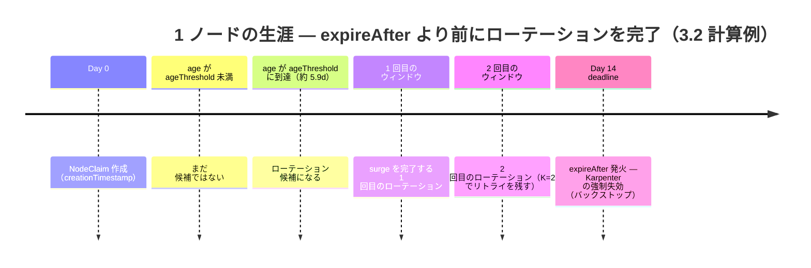
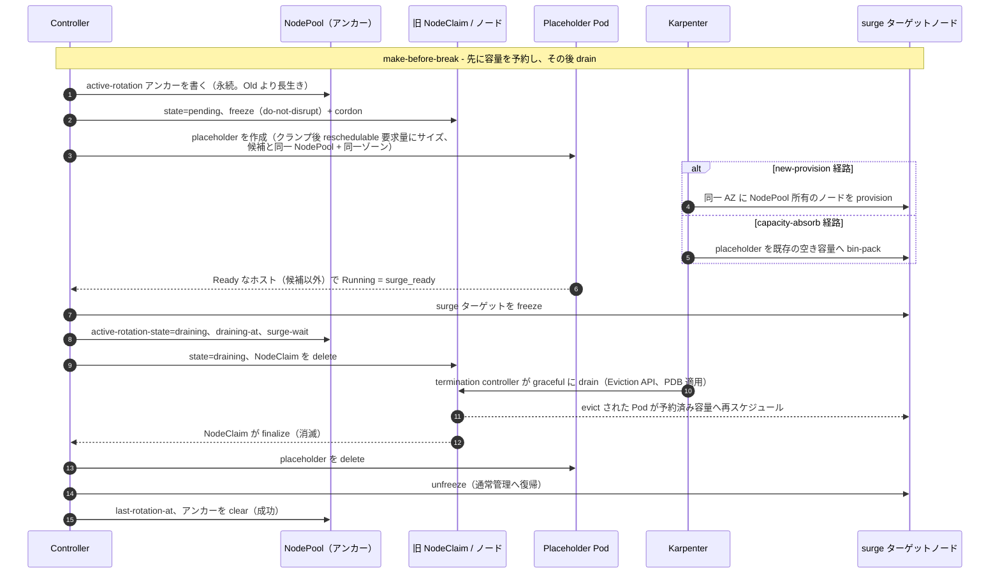

# 3. 設計

## 3.1 メンテナンスウィンドウ

```yaml
maintenanceWindows:        # リスト。実効ウィンドウは全エントリの和集合
  - timezone: Asia/Tokyo   # IANA tz データベース名
    days: [Wed, Sat]       # ISO 曜日名: Mon/Tue/Wed/Thu/Fri/Sat/Sun
    start: "02:00"
    end:   "06:00"
```

**セマンティクス**:

- Reconciler は**常時稼働**。ウィンドウ判定は毎 reconcile tick（1 分間隔の Ticker）で評価
- `maintenanceWindows` は **リスト**。実効メンテナンスウィンドウは全エントリの **和集合**。平日枠＋週末枠のように組み合わせてローテーション頻度を上げられる
- （和集合）ウィンドウ外は reconcile loop が no-op
- ウィンドウは **ローテーション開始** のみを制御。ウィンドウ終端を跨いだ進行中のローテーションは完遂させる（中断のほうが危険）
- 個別 `NodePool` に annotation（例: `noderotation.io/freeze=<RFC3339>`）を付けると、その時刻までローテーションを **凍結** できる（業務クリティカル期間用途）。*開始* のみをゲートするウィンドウ（上記）と異なり、freeze は **まだ `pending` にある進行中ローテーションも保留する**: drain は始まっていないため一時停止は安全であり、凍結が効いている間 pending ハンドラはエスカレーションを止める（§5.2）。この保留が止めるのは **エスカレーション** のみ — placeholder の（再）作成と `draining` への遷移 — であり、受動的な記録（保護用 `do-not-disrupt`/cordon マーカーの再表明、`surge-claim` 特定の永続化）は走り続ける。したがって freeze が §3.3 のクラッシュ復帰保証を弱めることはない。凍結が `readyTimeout` を超えて続いた場合、その試行は通常の失敗パスを通って単にロールバックする。すでに `draining` のローテーションは完遂させる — drain 途中の中断を試みないのと同じ理由である

この和集合から **最悪ウィンドウ周期 `P`**（連続するウィンドウ開始間隔の最大値）が定まり、§3.2 の `ageThreshold` 導出に渡される。例: 和集合 `{Wed 02:00, Sat 02:00}` のギャップは `Wed→Sat = 3d`, `Sat→Wed = 4d` なので `P = 4d`。**常時オープン（24/7）な和集合** — 例えばタイムゾーンをまたいでウィンドウ機会が週全体を覆うように併合されるもの — はローテーション機会の間に隙間がないため、`P` は週全体の `7d` ラップではなく reconcile tick 粒度まで縮む（`P = 0` は未定義で NoWindows fatal として報告される、§3.2）。したがって常時オープンなスケジュールはいつでもローテーションを許し、その理由で infeasible として拒否されることはない。

> **注（DST）。** `P` は繰り返す **壁時計** サイクル上で計算する。夏時間切替で個々のギャップが ±1h ずれ得るが、v1 はこれを既知の近似として特別扱いしない。

## 3.2 候補選定

`NodeClaim` 単位で以下を **すべて** 満たしたものを候補とする。

| 条件 | 既定値 | 備考 |
|------|--------|------|
| `now() > deadline − leadTime`（`deadline = NodeClaim.metadata.creationTimestamp + NodeClaim.spec.expireAfter`、`leadTime = K·P + t_rot`）| `leadTime` は **導出値**（下記）。直接指定しない | 各 NodeClaim **自身** の `spec.expireAfter`（権威ある期限）を起点とし、NodePool テンプレートは見ない。導出される `ageThreshold` はこのトリガの age 等価。既定 `auto`、明示上書きも可だが検証は走る |
| `RotationPolicy` に統治される `NodePool` 配下 | 必須 | いずれかの `RotationPolicy.spec.nodePoolSelector` でマッチした `NodePool` が対象。マッチしないプールはローテーションされない（§5.4）|
| `status.conditions[Ready] == True` | 必須 | NotReady な NodeClaim はスキップ — 既に不健全なノードは EKS Node Auto Repair と `expireAfter` バックストップに委ね、本コントローラではローテーションしない（コントローラが健全性に責任を持つのは surge で自ら作成したノードのみ）|
| `metadata.deletionTimestamp` が未設定 | 必須 | 既に削除が始まった claim — 典型的には進行中の Forceful Expiration（Auto Mode の `tGP = 24h` 下では、強制 drain 中の claim は何時間も生き続け、`Ready` のままでさえあり得る）— はもはや graceful にローテーションできない。これを選定すれば、NodePool ごとの直列ゲートを押さえては即座に中断する、を延々と繰り返して選定がライブロックし、他のすべての候補を飢餓させる（§5.2）。既に進行中だったローテーションは §5.2 の中断（abort）パスが扱う |
| `metadata.annotations["noderotation.io/state"]` が空、またはエスカレーション後の backoff を経過した `failed` | 必須 | `pending`/`draining` は進行中で §5.2 ステップ 1 が駆動し再選定しない。`failed` は **エスカレーションする** backoff（連続失敗ごとに倍増、§5.3）後に再試行。`expired` は **終端** — ローテーション途中で強制失効を捕捉された claim（§5.2）は決して再選定しない |
| ノードが運用者設定の `karpenter.sh/do-not-disrupt: "true"` を持たない | 必須 | 運用者自身の Karpenter disruption オプトアウトをここでも尊重する: 候補の **Node** から読む（Karpenter は登録済みノードに対し `do-not-disrupt` を NodeClaim ではなく Node 上で尊重する）。かつ、コントローラ自身の surge マーカー `noderotation.io/do-not-disrupt-owned` が **無い** 場合に限る — surge 中の候補ノードに付いたコントローラ自身の `do-not-disrupt` はオプトアウトとみなさない（§3.3, §5.3）。claim は `expireAfter` バックストップを保持したままであり、コントローラは *proactive* なローテーションを控えるだけである。適格性のみに作用: フィージビリティ検証で使う NodePool 台数 `N` や short-lead 計上（レイヤ 3、下記）には影響しない |

複数該当時は **deadline の早い順** に並べる — deadline `= creationTimestamp + spec.expireAfter`、このローテーションがレースする Forceful Expiration の時刻 — 同値の場合は `creationTimestamp` の古い順、さらに NodeClaim 名でタイブレークする。生の `creationTimestamp` ではなく deadline で並べることで、最もリスクの高いノードを先にローテーションする: `expireAfter` が claim 間で **不均一** な場合（例えば NodePool テンプレートの `E` を引き上げた後、焼き込み済みの claim は短い値を保持し続ける）、**より若い** claim が **より短い** `expireAfter` を持つと、より長い値を持つ古い claim より先に deadline に到達し得るため、先にローテーションしないと自身の Forceful Expiration とレースになる。よくある **`expireAfter` 均一** ケースでは deadline 順は古い順と一致するため、選定結果は不変である。`creationTimestamp`/名前のタイブレークが必要なのは `creationTimestamp` が秒精度であり、Karpenter がバッチで生成した claim は同一 deadline を共有するのが日常的だからである — 安定した順序が無いと選定は非決定的な list 順に従い、reconcile ごとに揺れ得る。明示的な `ageThreshold` override 下ではトリガは純粋に age ベースで全適格 claim が単一の閾値を共有するため、順序は `creationTimestamp` の古い順に縮退する（`expireAfter` 均一時と同一挙動）。

### 欲しいローテーション回数から `ageThreshold` を導出する

`ageThreshold` の手動調整は誤りやすい（緩すぎるとウィンドウ到来前に Forceful Expiration が発火する）ため、コントローラはスケジュールと目標ローテーション回数から **NodePool ごとに導出** する。

> **これが中心的なレースである。** Forceful Expiration はメンテナンスウィンドウや PDB に関係なく各ノードの `deadline` で発火するため、コントローラはローテーションする各ノードについて、その時刻 **より前** に graceful な surge ローテーションを *完了* させなければならない。候補選定はまさにこの先読みである — ノードは `deadline` が now から `leadTime = K·P + t_rot` 以内に入った時点で選定される（= `age > ageThreshold`）。`leadTime` を左から読むと、ウィンドウを *捕まえる* ための `K` 回の最悪ウィンドウ周期（`K·P`）＋ そのウィンドウ内で *完了する* ための 1 ノードの所要時間（`t_rot`）であり、`expireAfter` 発火前に少なくとも `K` 回、完了余裕のあるウィンドウを保証する。`K ≥ 2` ならウィンドウを逃す/遅れてもリトライが手元に残る。下の導出はこれを満たす *最大の* 閾値を選び、安全な範囲で可能な限り遅くローテーションする。



**記号**（クイック用語集は §1.4。下表の **取得元** 列がノード単位か NodePool テンプレートかの権威ある区別）

| 記号 | 意味 | 取得元 |
|------|------|--------|
| `E` | `expireAfter` | ノード単位: **`NodeClaim.spec.expireAfter`**（権威ある値。NodeClaim の `creationTimestamp` 起点）。NodePool `spec.template.spec.expireAfter` は per-NodePool の検証/ログ用 **代表値** に限定 — 既存 NodeClaim には伝播しない（下の注参照）|
| `tGP` | `terminationGracePeriod` | ノード単位: `NodeClaim.spec.terminationGracePeriod`。NodePool `spec.template.spec.terminationGracePeriod` は代表値 |
| `P` | 最悪ウィンドウ周期（連続するウィンドウ機会の最大ギャップ） | `maintenanceWindows` の和集合から導出（§3.1） |
| `t_rot` | 1 ノードのローテーション所要上限 = `readyTimeout + tGP + buffer`（**`cooldownAfter` は含めない** — cooldown 前にノードは drain 済み。下のマージン注を参照）。`tGP` 未設定時（self-managed Karpenter は nil を許容）は、`drain_bound` が使うのと**同じ固定の代替上限**（§5.2、例 `1h`）をここでも `tGP` に代入する — さもなければ、drain が無制限になるまさにそのときに、この導出と下のレイヤ 2予測が未定義になってしまう。`t_rot` は**上界**であり、`leadTime`・`A`・`G`・§3.3 の forceful-fallback deadline レース・§5.2 の drain 上限が消費する。レイヤ 2 はこれを使わない — `t_rot_est` を参照 | 設定 + NodePool から導出 |
| `drainEstimate` | 健全で PDB を尊重する drain の期待所要時間（`surge.drainEstimate`）。未設定 ⇒ `min(tGP, 10m)`。`tGP` を超える明示値は到達不能 — Karpenter は `tGP` で drain を強制完了する — ため**警告**（`DrainEstimateAboveTGP`）してクランプする。`tGP` 未設定時はクランプ対象の deadline がなく、明示値はそのまま使う | 設定 |
| `provisioningEstimate` | 健全な surge プロビジョニング（候補作成 → 新ノード Ready）の期待所要時間（`surge.provisioningEstimate`）。未設定 ⇒ `min(readyTimeout, 5m)`。`readyTimeout` を超える明示値は到達不能 — surge 試行は `readyTimeout` で放棄される — ため**警告**（`ProvisioningEstimateAboveReadyTimeout`）してクランプする。`drainEstimate` と同形（ADR-0003） | 設定 |
| `t_rot_est` | 期待ローテーションサービス時間 = `provisioningEstimate + drainEstimate`。レイヤ 2 のスループット予測**のみ**が使う。実行時ゲートではなく予測の分母である。deadline 項（`readyTimeout`・`tGP`）も `buffer` も含まない — それらは試行が放棄・強制 kill される時刻をモデル化するものであって、健全なローテーションの所要時間ではない（ADR-0003） | 設定から導出 |
| `buffer` | `t_rot` に含まれる固定スラックで、コントローラ**自身の検出ラグ**（2 つのフェーズタイムアウトの外側）を覆う: `pending→draining→complete` の各遷移は最大で 1 reconcile 周期（`shortRequeue`）遅れて観測され、これに patch/`Delete` の往復が加わる。**deadline 側のみ**に効く — 期待サービス時間にスラックの居場所はないため `t_rot_est` には効かない（ADR-0003）。運用者が設定する値ではない — 運用者がコントローラ以上に知り得ない周期を覆う量であり、`4·shortRequeue = 2m` に固定し compile-time assertion でそこにピン留めする（§5.2 の周期、issue #215） | 固定のコントローラ定数 |
| `K` | 欲しい保証ローテーション回数（`minRotationChances`） | ユーザ指定。下限 **1** |

**導出** — `[ageThreshold, E)` の中に `K` 回の完了可能なローテーションを保証する *最大の* 閾値を採用し、安全な範囲で可能な限り遅くローテーションする（churn と surge コストを最小化）:

```
ageThreshold (A) = E − (K·P + t_rot)
```

これは、利用可能区間 `[A, E − t_rot]` が最悪位相でも `K` 回のウィンドウ機会を含み（`floor(((E − t_rot) − A) / P) ≥ K`）、各回が `E` 前に完了する `t_rot` の余裕を持つため成立する。

> **マージン。** この下界は **タイト** で、最悪位相での保証はちょうど `K`（`floor(K·P / P) = K`）であり、組み込みの余裕はない。このタイトさは §3.1 の DST 近似も継承する: `P` は壁時計上の最悪値なので、秋の fall-back 切替は単一のギャップを `P + 1h` まで引き伸ばし得、最もタイトな位相では `K` 回のローテーションのうち 1 回を失わせ得る。したがって安全マージンは `K` 自体で取るしかなく、1 回ウィンドウを逃す/遅れても（あるいは DST で伸びたギャップでも）リトライが残るよう `K ≥ 2` を推奨する。`cooldownAfter` はウィンドウ内で連続するローテーション *間* の整定休止であり、1 ノードの完了時間（`t_rot`、上で除外したのはこのため）には **含まれない** が、スループット（下のレイヤ 2）には **効く**。

> **権威ある期限の取得元。** *ノード単位* のトリガを駆動する期限は、各 **`NodeClaim.spec.expireAfter`**（その NodeClaim の `creationTimestamp` 起点）から読む — NodePool の `spec.template.spec.expireAfter` ではない。Karpenter は生成時に `expireAfter` を NodeClaim へ焼き込み、Forceful Expiration は `creationTimestamp + NodeClaim.spec.expireAfter` で発火する。NodePool テンプレートを後から編集しても既存 NodeClaim には **伝播せず**、drift による置換を誘発するだけである。よってコントローラは `leadTime` を各ノード自身の `deadline` を起点に当て、テンプレート `E` は per-NodePool の起動時検証およびログ/導出 `ageThreshold`（§4.2）の **代表値** としてのみ用いる。あるノード自身の `spec.expireAfter` がテンプレートと異なる場合（drift 進行中やテンプレート変更後など）、そのトリガは自身の値に従う — 恒等式 `now() > deadline − leadTime ⟺ age > ageThreshold` が厳密に成立するのは両者が一致するときのみである。

**検証**（レイヤ 1 — スケジュール充足性）

| 条件 | 判定 |
|------|------|
| `P = 0`（メンテナンスウィンドウ機会が 1 つも無い — 空または充足不能なスケジュール。常時開放の 24/7 union はこれに **該当しない**、その `P` はゼロではなく reconcile-tick 粒度に収束する、§3.1） | **fatal**（`NoWindows`）— ウィンドウ周期が無ければ `ageThreshold` を導出できない。少なくとも 1 つのウィンドウ機会を定義すること |
| `K < 1` | **fatal** — 不正な設定 |
| `K < 2`（= `K = 1`） | **warn** — 1 回でもウィンドウを逃す/失敗すると Forceful Expiration までリトライ余地なし。DST のあるタイムゾーンでは fall-back 切替が 1 つのギャップを `P` 超に引き伸ばし得る（§3.1 注）ため、*ちょうど K* の下界が完了可能なローテーション **0 回** を意味し得る |
| `A ≤ 0`（= `E ≤ K·P + t_rot`。その構成では `K` 回すら保証不能） | **fatal** — `E` を上げる（Auto Mode は `21d − tGP` まで）、ウィンドウ機会を増やして `P` を縮める、または `K` を下げる。なおテンプレートの `E` 引き上げが直すのは**新規** NodeClaim のみ — 既存 NodeClaim は焼き込まれた値を保持し続け、入れ替わるまでノード単位チェック（下のレイヤ 3）がそれを捕捉し続ける |
| `0 < A < P`（ノードが 1 ウィンドウ周期分も生きないうちに候補化する） | **warn** — 過度に積極的: ノードが非常に若くしてローテーションされ churn / surge コストが最大化する。`E` を上げるか `K` を下げる |
| 明示的な `ageThreshold` 上書きで再計算した `G < 1`（= 上書き後の `A` で `floor(((E − t_rot) − A) / P) < 1`。下の `G` の注を参照） | **fatal** — その上書きでは `E` 前に完了可能なウィンドウ機会を 1 回も残せず、§2.2 の不変条件（「スケジュールが設定したローテーション回数を保証できない場合は検証が失敗する」）が黙って破られることになる。上書きは単に観測されるのではなく、拒否される |
| 明示的な `ageThreshold` 上書きで再計算した `1 ≤ G < K` | **warn** — 上書きは要求した `minRotationChances` を弱める。スケジュールが実際に保証するのは `K` ではなく `G` である |
| Auto Mode かつ `E + tGP > 21d` | **warn**（`HardCapExceeded`）— ハードキャップ違反。Auto Mode は NodePool API から確実には検出できないため、代表値の `E + tGP` を **無条件に** `21d` と比較する（厳密な `>`）。キャップが適用されない self-managed Karpenter では、この警告は助言的なものに留まり `A` を変えない |
| `tGP` 未設定（self-managed Karpenter では nil を許容） | **warn** — drain フェーズが Karpenter 側で無制限になる（ブロックする PDB やスタックした finalizer が永久に止め得る）。§5.2 の stuck-drain アラートとこの導出が使う `t_rot` は、いずれも同じ固定の代替上限へフォールバックする（上の記号表参照）。レイヤ 2 の `t_rot_est` 予測は**影響を受けない** — 呼び出し側が未設定の `tGP` にその同じ固定上限を代入し、`drainEstimate` はどちらにせよ `min(tGP, 10m) = 10m` に既定される（`min(上限, 10m) = 10m`）ため、`tGP` が未設定でも大きくても `t_rot_est` は同一である |
| `retryBackoff < readyTimeout` | **warn** — 失敗した試行はロールバックまでに最大 `readyTimeout` を要するため、それより短い基本 backoff では、リトライが失敗 surge のコスト（§4.4）を 1 回の試行の所要時間より速いペースで繰り返し得る。試行ごとの `started-at` 刻み直し（§5.3）によりリトライの*正しさ*自体は保たれるが、エスカレーションする backoff のコスト抑制意図を損なう設定である。既定値（30m vs 15m）はこのチェックを満たす |
| NodePool `spec.limits` のリソース予算（`{cpu, memory, …}`）に surge ノードの requests を収める余地がない（ノード 1 台分の余裕が枯渇） | **warn** — 空き予算がないと surge は着地できない。ノード 1 台分のリソースの余裕を残すよう `limits` を上げる。起動時は代表的なフットプリントで検証する。権威ある候補依存のチェック（`surge_headroom`、選定された候補の**クランプ後 placeholder フットプリント** — §3.3 の allocatable クランプ後の再スケジュール対象 Pod requests 合計。拒否時は完全な drain を保つ）はローテーション開始時、候補選定の**後**に走る（§5.2 ステップ 3）|

**検証**（レイヤ 2 — スループット） — 導出とは独立で、**警告のみ**・`A` は変えない。ウィンドウ内のローテーションは直列で `cooldownAfter` を挟むため（NodePool ごとの start ゲートとして §5.2 ステップ 2 で enforce）、長さ `D` のウィンドウ機会の中で合法な開始時刻は `k · (t_rot_est + cooldownAfter) < D`（`k = 0, 1, 2, …`）である。ウィンドウはローテーションの *開始* のみをゲートし（§3.1）、実行中のローテーションはウィンドウの終端を越えて継続するため、その個数は floor ではなく **ceil** で数える: `C = m · ceil(D / (t_rot_est + cooldownAfter))`（`m = surge.maxUnavailable`、v1 は `1` 固定）。したがって長さが正のウィンドウ機会は必ず 1 件以上の開始を許す（`C ≥ 1`）。`C = 0` は「長さが正のウィンドウで 1 台も回せない」という主張になるが、start ゲートの意味論上それは起こり得ない。`C` は `t_rot` ではなく `t_rot_est` から計算する。`t_rot_est` は 2 つの期待フェーズ所要時間 — プロビジョニング（`provisioningEstimate`、候補 → Ready）と drain（`drainEstimate`） — の和のみで、deadline 項も `buffer` も含まない。`tGP` は Karpenter が drain を強制完了させる deadline、`readyTimeout` は surge 試行が放棄される deadline であって、健全な drain やプロビジョニングの所要時間ではない。いずれを見込んでも予測は潰れる（素の Auto Mode では `t_rot ≈ 24h17m` となり、あらゆる現実的なウィンドウで `C = 1` になる）。`C` の良さはこの 2 つの見積もりの良さ止まりである。既定値では、両者の事前分布がともに**高めに**倒すため**保守的**に保たれる: `provisioningEstimate` は `min(readyTimeout, 5m)`（実際の `1〜3m` に対して `5m`）に、`drainEstimate` は `min(tGP, 10m)` に既定される一方、ローテーションは surge ノードが `Ready` になり古い `NodeClaim` が finalize されて消えた瞬間に前進するので、実際のスループットは通常 `C` を上回る。クラスタやワークロードが実際に要するフェーズより小さい見積もりを設定した運用者はこれを反転させる: そのとき `C` は容量を過大評価する。候補到来率が容量を超える（`C < N · P / A`、`N` は NodePool 台数）と候補が滞留し一部が Forceful Expiration し得る:

- **warn**: ウィンドウ拡張（`D` 増）、ウィンドウ機会の追加（`P` 縮小）、または `maxUnavailable` 引き上げ（将来バージョン用）。

上の定常状態条件はノード age が一様分布することを前提とする。**同期バッチ** — 初期起動・スケールアップ・NodePool 移行・コンソリデーション後の再収容など、`N` 台のノードがまとめて作成された場合 — は一つの `creationTimestamp` を共有し、したがって一つの deadline を共有し、同じウィンドウで競合する。その共通 deadline 前の `leadTime` は `K` 回のウィンドウ機会を保証し、各回で最大 `C` 台を処理できる。よって同期バッチが graceful に完了できるのは `K · C ≥ N` のときだけである。`N > K · C` の場合、余剰ノードはすべてのウィンドウを取りこぼし、（制御されない）deadline での Forceful Expiration に至る — これは定常状態の平均が**検出しない**ケースである。これは独立した **warn**（`ThroughputBurstShortfall`）として表面化される。

`C` が数えるのは**一つのウィンドウ機会の内側**にある合法な開始時刻であって、連続するウィンドウ機会が互いに独立であることまでは保証しない。ウィンドウは開始のみをゲートするため、スループットモデルは隣接する開始を `t_rot_est + cooldownAfter` の間隔で見積もる — これは機会の内側で開始を間引くのと同じ分母であり、`cooldownAfter` はローテーションの*完了*から数えるので `t_rot_est` 経過後もなお開始をブロックするためである。ここでの `t_rot_est` はその予測上の分母であって、ランタイムのゲート**ではない**: 実行時に開始を実際にブロックするのは `cooldownAfter`、freeze マーカー、そして active-rotation アンカーである。その分母が `gap`（ウィンドウ和集合が**閉じている**最短の区間。連続する機会 `i`, `i+1` について `gap_i = start_{i+1} − start_i − D_i`）を超えると、ある機会の終端付近で始まったローテーションは、次の機会が開くところへ食い込むと**予測**される。その機会は部分的または全面的に食い潰されるので、隣接する機会がそれぞれ `C` 台分をまるまる提供するわけではなく、上の `K · C` は**上界**として読まねばならない。これは独立した **warn**（`RotationSpansNextWindow`）として表面化される。`C` と同じ理由で `t_rot_est` により評価する: 両者は構成上ひとつの分母を共有し、deadline 上界なら素の Auto Mode で日次以上の頻度のスケジュールすべてで発火してしまうためである。対処はウィンドウ機会の間隔を広げるか、`surge.provisioningEstimate`・`surge.drainEstimate` または `cooldownAfter` を下げること — `tGP` **ではない**。この警告は `K · C` を割り引くのではなく `ThroughputBurstShortfall` と**併記**する: 各 finding は一つの条件のみを名指すべきであり、二つの近似モデルを一つの数値に合成するとどちらが発火したのかが隠れてしまうためである。連続開放のウィンドウ和集合は決して閉じず、跨ぐべき「次の機会」を持たないので、この検査は適用されない（§3.1）。

**検証**（レイヤ 3 — ノード単位・ランタイム） — 上の 2 レイヤは NodePool **テンプレート** の `E`/`tGP` を代表値として使うが、実際のトリガは NodeClaim 単位である（上の *権威ある期限の取得元*）。よってテンプレートが検証を通っても、*既存* の全 claim が充足可能とは限らない — 例えば fatal を解消するためにテンプレートの `E` を引き上げた後も、焼き込み済みの claim は短い値を保持したままである。そのためコントローラは reconcile ごとに、対象の全 NodeClaim を各自の **`spec.expireAfter`** と突き合わせる: `E_node ≤ K·P + t_rot`（ノード単位の `A ≤ 0`）の claim はもはや `K` 回を保証できない — `noderotation_short_lead_nodes`（§4.2）で計数し、NodeClaim への `ShortLead` Warning Event（§4.2）で警告し、**最も早いウィンドウ機会にベストエフォートで** ローテーションする（上のトリガにより既に候補である）— ただし Karpenter の forceful 経路が実際に始まるまで: `deletionTimestamp` が付いた時点で選定から除外され（上の表）、以後は §5.2 の中断パスだけが適用される。

> **計算例。** NodePool の `terminationGracePeriod` を**既定の `24h` から `1h` に引き下げた** Auto Mode（下のキャリブレーション注を参照）, `E = 14d`, 和集合 `{Wed, Sat} 02:00–06:00` → `P = 4d`, `t_rot ≈ 1h17m`（`readyTimeout 15m + tGP 1h + buffer`）, `K = 2`。すると `A = 14d − (2·4d + 1h17m) ≈ 5.9d`: ノードは約 5.9d で候補化し、14d 前に 2 回のウィンドウが保証される。スループット `C = ceil(4h / (t_rot_est 15m + cooldownAfter 10m)) = 10`/ウィンドウ機会。ここで `t_rot_est = provisioningEstimate 5m + drainEstimate 10m` であり、`provisioningEstimate` は `min(readyTimeout 15m, 5m) = 5m` に、`drainEstimate` は `min(tGP 1h, 10m) = 10m` に既定される — 10 件目はウィンドウが閉じる直前に開始し、ウィンドウを跨いで完了する。start ゲートはそれを許す（§3.1）。2 つの機会の間でウィンドウが閉じている時間は `68h` と `92h` であり、予測が隣接するローテーション開始の間隔として見込む `25m`（`t_rot_est + cooldownAfter`）よりはるかに長いので、次の機会に食い込むものはない。
>
> **週次単独**ウィンドウ `{Sat}` は `P = 7d` なので `A = 14d − (2·7d + 1h17m) ≈ −1h17m ≤ 0` → **fatal**: 週次のウィンドウでは `E = 14d` で 2 回を保証できない。これがまさに固定 `expireAfter − 4d` 既定が安全でなかった理由であり、導出がそれを表面化し、`E` を上げる（~`20d` で `A ≈ 6d`）か曜日を増やすよう運用者に促す。（`E` の引き上げが効くのは**新規** NodeClaim のみ。焼き込み済みの claim は入れ替わるまでレイヤ 3のノード単位チェックが捕捉する。）
>
> **キャリブレーション注（Auto Mode 既定値）。** 素の `tGP = 24h`（§1.1）では `t_rot ≈ 24h17m` だが、レイヤ 2 は `t_rot_est = 15m`（既定の `provisioningEstimate = min(15m, 5m) = 5m` と `drainEstimate = min(24h, 10m) = 10m`）で予測するので、`C = ceil(4h / 25m) = 10`、`K · C = 20` となる。レイヤ 1 はなお通る（`A = 14d − (2·4d + 24h17m) ≈ 5d`）。
>
> `tGP` を下げても `C` はもう上がらない: `drainEstimate` が `10m`、`provisioningEstimate` が `5m` に既定されるため、`tGP = 1h` でも `tGP = 24h` でも `C = 10` である。下げる理由は 2 つ残る。`tGP` は `t_rot` の内側にあるので、小さい `tGP` は `A` を伸ばし（`24h → 1h` で `A` は `119h43m` から `142h43m` へ）、`ThroughputBelowArrival` が `C·A` を `N·P` と比べるため到来チェックを間接的に緩める — `C = 10` では警告を出さない最大の `N` を 12 から 14 に上げる。また 21 日キャップ（`E + tGP ≤ 21d`、§1.1）も緩める: `tGP = 1h` なら `E` は ~`20d` まで許容される。明示的な `ageThreshold` override 下では `A` の経路すら閉じ、`tGP` はレイヤ 2 にまったく到達しない。
>
> `tGP` は、本当に遅い PDB 尊重の drain を pod が強制 kill されるまでどれだけ*待てる*かから選ぶ — リスク許容度の判断である。`drainEstimate` は健全な drain が実際にどれだけ*かかる*かから、`provisioningEstimate` は健全なプロビジョニングが `Ready` までどれだけ*かかる*かから選ぶ。これらは異なる数値であり、deadline と見積もりを混同したことが以前 `C` を使い物にならなくしていた。

導出された `A`、保証回数 `G`、`P` は NodePool ごとに起動時ログとメトリクス（§4.2）で露出する。auto 導出では構成上 `G = K` となる。`G` を別途持つのは、明示的な `ageThreshold` 上書き時に `G` を **その上書き値から再計算**（`G = floor(((E − t_rot) − A) / P)`）するためである — そして単に観測するだけでなく**検証**する: `G < 1` は **fatal**（その上書きでは `E` 前に完了可能なローテーションを 1 回も保証できない）、`G < K` は **warn**（上書きが要求した回数を弱める）— 上のレイヤ 1 の表を参照。「明示上書きも可だが検証は走る」（§3.2 トリガ行、§5.4）の具体的な意味がこれである。

## 3.3 surge シーケンス（v1）

1 reconcile で 1 ノードを処理。v1 は **NodePool ごとに直列固定（`surge.maxUnavailable = 1`）** で blast radius を最小化。異なる NodePool 同士は並行してローテーションし得る。

### standalone ノードではなく *同一 NodePool* に surge する

代替ノードは、候補ノードと **同じ NodePool** に属さなければならない。したがって本コントローラは standalone な `NodeClaim` を作成して置換することは **しない**。（standalone NodeClaim は実際にプロビジョニング *可能* だが（§7.2 参照）、できたノードは NodePool owner を持たず、その Pod は NodePool 会計・expiry・drift・disruption budget の外にある「管理されないノード」に載り続ける。`api` / `batch` のように NodePool を意図的に分離している環境では受け入れられない。）

代わりに、一時的な **placeholder Pod** — コントローラが **直接作成・管理する**（あえて Deployment/ReplicaSet/Job を使わない）単一の低優先度 "pause" Pod — を作成し、Karpenter にその NodePool 内へ新ノードを誘発させる。そのスケジューリング要件は **候補ノード** から複製する — 最重要なのは AZ（`topology.kubernetes.io/zone`）で、加えて再スケジュールされる Pod が依存する arch / instance-type / capacity-type 制約も継承する（下の *ステートフル／ゾーン制約のワークロード* 参照）。resource requests は **候補ノードに現在スケジュールされている*再スケジュール対象*の Pod 群の requests 合計**（drain 後に再着地すべきワークロード）に設定する。この合計からは、Karpenter が新キャパに再収容する必要のない Pod を**除外**する: **DaemonSet** Pod（kube-proxy, CNI, CSI, ログ収集等）— Karpenter は*どの*新ノードにも DaemonSet オーバーヘッドを既に加算するため、ここで数えると**二重計上**になり過大プロビジョンになる — に加え、mirror/static Pod、完了済み（`Succeeded`/`Failed`）Pod、そして他所へ再着地できない当該ノード固定の Pod（例: hostname affinity）を除く。

さらに **soft** な `nodeAffinity`（`preferredDuringScheduling…`、`kubernetes.io/hostname NotIn {…}`、高 weight）で **候補ノード自身** を避けるよう誘導する — Pod の anti-affinity がマッチするのは *Pod* でありノードではないため、特定ノードを除外できる機構は hostname 項である — 加えて **自身のローテーショントリガを既に過ぎたすべてのノード**（NodeClaim の `deadline` が `leadTime` 以内、§3.2）も避ける: placeholder は、まさに drain しようとしているノード上に空間を確保すべきでなく、自身がまもなく失効する・次にローテーションされるホストへ absorb すべきでもない — その予約はホストの強制失効とともに消滅し、追い出された Pod は直後のローテーションで再び drain されることになるからである。

- **候補ノード — cordon が本命（preference ではない）。** **候補** の除外はこの soft 項によって弱まらない: コントローラは候補が `pending` に入ったとき — placeholder 作成より前に — 候補を **cordon**（`spec.unschedulable`）し、毎パス再表明するため、`kube-scheduler` は placeholder をそこへバインドしない。さらに `surge_ready` が、旧ノードを drain する前にバインド先ホストが候補でないことを再チェックする（§5.2）。
- **期限間近ノード — ベストエフォート。** したがって **期限間近** の除外は **ベストエフォート** である — 直下で既に受容済みの有界な残余と整合する。
- **なぜ hard な required ではなく preference か（issue #96）。** Karpenter のプロビジョナは、**required** な `nodeAffinity` が `kubernetes.io/hostname` を参照する provisionable Pod を拒否する（このキーは `sigs.k8s.io/karpenter` の `RestrictedLabels` に含まれ、Karpenter は hostname を自身で割り当てる）ため、required な hostname 項は新規プロビジョニング経路をそもそもブロックし、capacity-absorb しか残らない。Karpenter の scheduler は preferred な node-affinity 項を *緩和* するだけで、構築する NodeClaim requirements には決して畳み込まない。よって **preferred** な hostname 項は拒否されず、新規プロビジョニング経路が進む。capacity-absorb 経路では `kube-scheduler` が引き続きこの preference（高 weight）を bin-pack 時に尊重する。
- **再計算と stale の上限。** どちらの除外リストも **placeholder の作成時に計算** され、preempt 後の再作成（§5.2）では再計算される。よって stale なスナップショットが生きるのは高々 placeholder 1 世代分 — `readyTimeout` で有界 — であり、最悪ケースはそのギャップの間に自身のトリガを跨いだノードへバインドすることだが、その Pod はそのノード自身のローテーションで単に再 drain されるだけである。

最後に、required な **`karpenter.sh/nodepool = <候補の NodePool>`** ノードセレクタを **無条件に** 適用する — 設定可能な `matchNodeRequirements` リスト（§5.4）とは独立である。同一 NodePool は（上記のとおり）構造的不変条件であってチューニング項目ではないからだ。予約を正しいプールに閉じ込めるのは、サイズ設定ではなくこのセレクタである: 複数 NodePool のクラスタでは kube-scheduler が placeholder を*別*プールの空きノードへバインドし得るし、Karpenter は pending な Pod を weight に従い互換性のある任意の NodePool からプロビジョニングする — 新規プロビジョニング経路でも capacity-absorb 経路でも、その両方を排除できるのはラベルセレクタだけである。

placeholder はさらに **候補 NodePool の `spec.template.spec.taints` から複製した tolerations** を持つ。これにより、恒久 taint でキャパシティを分割する NodePool でも、（対応する toleration を持つ）実 Pod が着地できる一方で placeholder だけが unschedulable に陥ることを防ぐ — これが無いと、そうした NodePool のローテーションは毎回 `readyTimeout` を待ってロールバックしてしまう。複製するのは `taints` のみで `startupTaints` は対象外（ノード `Ready` 後に除去され、プロビジョニング判定でも無視される）。各 taint は完全一致の toleration になるため、placeholder は NodePool 自身の taint だけを許容し、workload が使えないキャパシティへアクセスすることはない。さらに `surge_ready` が belt-and-suspenders のガードとしてホストの `karpenter.sh/nodepool` ラベルを再チェックする（§5.2）。

このサイズ設定と制約により、**既存の空きキャパシティが吸収できない場合は常に**、Karpenter は同一ゾーンに、そのワークロードを収容できる大きさの新ノードをその NodePool 内へ起動せざるを得なくなる。scheduler が placeholder を*既存*の空きキャパシティへ bin-pack した場合も等しく受容する（**capacity-absorb 経路**）: そのとき placeholder は、退避するワークロード分の既存余力をちょうど*予約*しているのであり、新ノードなしでも drain は同等に安全である。これは、再スケジュール対象の合計が小さい DaemonSet 主体・低使用率の候補ノードでは通常の帰結である — そうしたノードはどんなサイズ設定でも新ノードを強制できないため、この経路がなければ構造的にローテーション不能だった。いずれの場合も placeholder が着地したノード（**surge ターゲット**）はローテーションの間凍結され（下の *surge 中の disruption からの保護* 参照）、旧ノードの drain 後に placeholder を削除し、surge ターゲットは NodePool の通常メンバーとして残る。

**Karpenter が実際にプロビジョニングできる大きさへのサイズのクランプ（issue #224）。** 上記の再スケジュール対象合計は再着地すべきワークロードであるが、Karpenter が*収容できる*フットプリントとは限らない。Karpenter はインスタンスタイプごとに**1 つ**の推定 allocatable をキャッシュする一方、クラウドプロバイダは同一インスタンスタイプでも AZ ごとにわずかに異なるメモリ量を報告し得る。実 `allocatable` がそのキャッシュ推定値を上回るノードは、`kube-scheduler` によって Karpenter が計画する量を超えて充填され得る。その過充填ノードにサイズした placeholder はスケジュール不能となり — Karpenter は `no instance type has enough resources` と応答する — ローテーションは `readyTimeout` を浪費して永遠にリトライし、そのノードは**恒久的にローテーション不能**になる（さらに悪いことに、各ローテーションはその Pod を生存ノードへ drain するため、時間とともにそのようなノードを増産する）。そこでコントローラは placeholder の requests を、リソースごとに、Karpenter 自身の*「このプールに対して私がプロビジョニングするノードはどれだけの大きさか」*への答え — 候補 `NodeClaim` の `status.allocatable` — から、Karpenter が新ノードごとに加える DaemonSet オーバーヘッドを差し引いた値に**クランプ**する:

```
limit    = NodeClaim.status.allocatable − (候補ノードの DaemonSet Pod の requests 合計)   // リソースごと、0 で下限
requests = min(再スケジュール対象合計, limit)                                              // リソースごと
```

`status.allocatable` を読むことで、コントローラはキャパシティキャッシュ・AZ ごとのばらつき・kubelet 予約・インスタンスタイプを一切知らずに済む — それらのいずれが変わっても正しさを保つ。`status.allocatable` が**空または欠落**（まだ登録されていない NodeClaim）の場合は信頼できる上限が無いため、クランプは **no-op** となる: 0 へクランプ（何も予約せず make-before-break を静かに壊す）するのではなく、完全な再スケジュール対象合計へフォールバックする。候補依存の `surge_headroom` ゲート（§5.2 ステップ 3）は**クランプ後**の requests — 実際の placeholder のフットプリント — を NodePool の `spec.limits` と突き合わせる。クランプ前の大きい合計で判定すると、残り予算がタイトだが Karpenter が実際にプロビジョニングする分には十分、というまさにこのクランプが救おうとしているほぼ満杯のノードを弾いてしまうためである。

このクランプは make-before-break 保証を**意図的かつ有界に弱める**: placeholder はもはや必ずしも drain *全体*を予約しない。不足分は AZ ごとのキャパシティ帯 — リソースごとの `band = Node.status.allocatable − NodeClaim.status.allocatable`（報告事例では ≤ 169 Mi、単一 Pod の一部）— で有界であり、surge が既に依存している 2 つの機構で吸収される: placeholder の負の優先度（`preemptionPolicy: Never`、優先度 −10）により drain された Pod がそれを **preempt** でき、なお収まらない Pod は数秒で **Karpenter のフォローアッププロビジョニング**を誘発する。これは他で成立している不変条件を壊すものではない — 「1 placeholder = 1 ノード分を 1 ノード上に」という予約は capacity-absorb 経路では既に集約値である — 単に、drain が実際に必要とする以上に厳しいフットプリントをコントローラが要求するのを止めるだけである。クランプは帯を*塞がない*（新たに surge されたノードは依然として大きい実 `allocatable` を得て、後で帯の中まで再充填され得る）。それをローテーション**可能**にするのがクランプであり、それこそが重要な性質である。

不足分が帯の内側に収まることは**仮定ではなく恒等式**である: kube-scheduler は候補上の消費 Pod をすべて収容したので `reschedulable ≤ Node.allocatable − daemonSet` であり、`limit = NodeClaim.allocatable − daemonSet` とすれば DaemonSet 項が相殺して `shortfall ≤ band` となる。これは両辺が同じ Pod を数えるときのみ成り立つ — だからこそ `daemonSet` は*実行中*の DaemonSet Pod のみ合算する（完了した Pod は allocatable を消費せず、scheduler も数えない）。同じ理屈から 2 つの端が導かれる:

- **拒否。** ある要求リソースについて DaemonSet オーバーヘッドだけで `NodeClaim.status.allocatable` 以上になる場合、`limit ≤ 0` となる: どんなクランプ値でもノードを誘発できず、placeholder を 0 にサイズすると既存ノードに bind して**何も予約せずに** `surge_ready` を満たしてしまう — 静かな break-before-make である。そこでクランプは**拒否**する: placeholder は完全な drain を保ち、スケジュール不能のまま留まり、ローテーションは `expireAfter` backstop へロールバックする。surge なしのローテーションを望む運用者は `surge.forcefulFallback`（ADR-0001、ウィンドウ有界かつ明示的）に opt-in する。クランプが偶発的にそれになってはならない。
- **帯超過の警告。** 発火したクランプの不足分が測定された帯を超えた場合、上記の恒等式が破れている — コントローラの requests 会計が scheduler のそれと乖離している。ローテーションは**続行する**（止めれば、有界でウィンドウ内・PDB を尊重する drain を、ウィンドウも PDB も尊重しない Forceful Expiration に置き換えることになる）が、その乖離は沈黙させず表面化する。

クランプが発火したときは**告知される** — `surge placeholder created` ログ行への `clamped`/`unclamped`/`limit`/`shortfall` の内訳と、NodeClaim 上の `Normal` `SurgeClamped` イベント、そして不足分が帯を超えた場合は `bandExceeded` フィールドと `Warning` `SurgeClampBandExceeded` イベント。拒否時は `clampRefused` と `Warning` `SurgeClampRefused` イベントをログ・記録する。drain が limit 内に収まる通常経路では**沈黙**する。

placeholder は **bare Pod**（どのコントローラにも管理されない）かつ低優先度のため、再スケジュールされたワークロード Pod がその領域を必要とすると scheduler が **preempt** し、placeholder は **再作成なしで単に削除** される。（Deployment/Job 配下の Pod なら再生成されて再 pending し、余計なノード churn を生む — bare な、コントローラ管理の Pod を使う理由はまさにこれ。）その唯一の役割は、drain が実 Pod を着地させるまで 1 ノード分の capacity を確保しておくことである。

**placeholder の優先度。** placeholder は **専用の `PriorityClass`**（`globalDefault: false`、通常ワークロードの `0` より低く、システム重要クラスよりはるかに低い**負値**）かつ `preemptionPolicy: Never` で動かす。これにより placeholder を意図的な preempt *被害者*にする: 再着地するワークロード（優先度 `≥ 0`）が上記のとおり placeholder を preempt する一方、placeholder 自身は実ワークロードやシステム重要 Pod を **決して preempt しない**: pending 中も場所を空けるために既存 Pod を退去させることはなく、純粋に*空いている*既存キャパシティへ収まる（上の capacity-absorb 経路）か、Karpenter が新ノードを足すのを待つかのどちらかである。**注意 — preempt は再着地ワークロードの専有ではない。** 負の優先度は placeholder を*最大限* preempt されやすくするため、優先度値だけでは **無関係な高優先度の pending Pod** が surge の途中（placeholder が空間を確保している当のワークロードが drain でまだ生まれてもいない時点）で placeholder を preempt するのを止められない。そうなった場合、状態機械は placeholder の喪失を検知して再作成する（pending ハンドラの冪等な再表明、§5.2）。このループは **無限ではなく有界** である: `pending` フェーズ全体が `readyTimeout` で打ち切られ、その後ローテーションは **ロールバック** して `expireAfter` ベースラインへ縮退する（§3.3 *ロールバック*）— よって執拗な敵対的 preempt のシナリオでさえ、永遠に churn せずクリーンな失敗へと自己終端する。

### surge 中の disruption からの保護

新旧ノードが共存する間、Karpenter の Consolidation / Drift がコントローラとレースし得る:

- **新** ノードは一時的に低利用率のため「empty/underutilized」と判定され即座に consolidate されうる
- **旧** ノードはコントローラの orchestration 完了前に consolidate / drift されたり、意図した順序より先に削除対象に選ばれうる

両方を防ぐため、surge の間 **旧ノードと surge ターゲット**（placeholder が着地したノード — 新規プロビジョニング、または capacity-absorb 経路では既存ノード）の両方に `karpenter.sh/do-not-disrupt` を付与し、併せて凍結した各ノードに `noderotation.io/surge-for=<旧 NodeClaim 名>` を付けて凍結をこのローテーションに帰属させる（§5.3） — このマーカーが、旧 NodeClaim 消滅後に surge ターゲットを再発見する手段である。クリーンアップが運用者自身の保護を決して剥がさないよう、`do-not-disrupt` の書き込みは **条件付き・所有権マーカー付き** とし、下記の cordon ガードと対称にする: コントローラは実際に `do-not-disrupt` を付与したときに限り `noderotation.io/do-not-disrupt-owned=true` を記録し、そのマーカー無しで運用者の有効な `do-not-disrupt: true` を既に持つノードに対しては annotation も所有権も触れない（ノードはローテーションに属するので `surge-for` は書く）。運用者の保護とみなすのは値が厳密に `true` の場合のみ — Karpenter のノード disruption 判定は `do-not-disrupt: true` だけを尊重するため、`false` やその他の非 `true` 値は保護では**なく**、コントローラは `true` に上書きして所有権を取り、surge ペアが確実に保護されるようにする。ロールバックと起動時 sweep は、所有権マーカーがコントローラに帰属させる場合に限って `do-not-disrupt` を除去する — 運用者が事前に設定していた `do-not-disrupt` は残る。（`surge-for` 自体ではこの所有権の区別を担えない: 運用者が既に保護していたノードであってもコントローラは凍結し、よって `surge-for` を付けるからである。）

Karpenter の文書化された挙動上、この annotation がブロックするのは **voluntary disruption（Consolidation, Drift, Emptiness）のみ** であり、*forceful* な手法 — **Forceful Expiration（`expireAfter`）**、Interruption、Node Repair — からはノードを除外**しない**。（Karpenter の `nodeclaim/expiration` コントローラで確認済み: 期限切れ NodeClaim を `creationTimestamp + expireAfter` 到達と同時に annotation を一切参照せず削除する。ノードレベルの `do-not-disrupt` 判定は voluntary な候補選定経路にのみ存在する。）したがって Forceful Expiration とのレースに勝つのはこの annotation の役割では **ない** — それは §3.2 の `leadTime` サイジングが構造的に担保し、各ノードを `deadline` **より前** に graceful な surge を完了できるだけ早く選定する。ここでの annotation の役割はより限定的だが依然不可欠である: Karpenter 自身のオプティマイザが、組み立て途中の surge ペアをコントローラの背後で consolidate / drift してしまうのを止める。コントローラ自身の明示的な旧 NodeClaim `delete` は、annotation とは無関係に voluntary（termination controller）経路で drain を進める。annotation は最後に除去し、新ノードを通常管理へ戻す。

（**残存リスク:** annotation は旧ノードの寿命を延ばさないため、surge が代替ノードの `Ready` 化を待っている最中に旧ノードの `deadline` が到来すると、Karpenter は予定どおり旧ノードを force-expire し、再スケジュール対象の Pod を、まだ存在しないかもしれないキャパシティへ着地させることになる。これは `leadTime` が tight なケース／最終ウィンドウの縁ケースであり、防止されるのではなくネイティブのベースラインへ縮退する — §3.5 参照。なお **surge ターゲット** 自身の `deadline` は構造的に扱われる: 上記の placeholder の soft な hostname 除外により、自身の deadline まで `leadTime` を切ったノードへの placeholder 着地を **ベストエフォート** で避けるため、surge ターゲットには通常 1 回のローテーションが要する時間よりはるかに長い残寿命がある。この除外は今や *preference* であるため（issue #96）、absorb 経路では稀なコーナーケースとして、scheduler に他に選択肢が無いときに期限間近のホストへ bin-pack され得る — これはまさに §3.3 で既に文書化済みの有界な残余である（その absorb された Pod はそのホスト自身のローテーションで単に再 drain される）。）

もう 1 つのガードは、disruption のレースではなく *サイズ設定* のレースを閉じる: `pending` 入りの時点でコントローラは **候補ノードを cordon** し（`spec.unschedulable = true`）、自身の操作であることを `noderotation.io/cordoned=true` で記録する — これによりロールバックと起動時 sweep はコントローラ自身が適用した cordon だけを解除し、運用者が事前に設定していた cordon には決して触れない（§5.3）。この保証を実装可能にするため、`cordon()` は **条件付き** である: マーカー無しで既に `unschedulable` なノードに対しては何もしない — フラグも反転させず、マーカーも付けない — ため、運用者の cordon がコントローラ自身のものとして取り込まれることは決してない。そのようなノードも選定・ローテーションの対象にはなる: 運用者の cordon は「新しいものを着地させない」目的を既に達成しており、cordon はローテーション拒否の手段ではない — その意図には `freeze`（§3.1）を使う。

1 つの残存レースは許容する: コントローラのマーカーが付いた**後**にローテーション中の運用者が cordon しても状態としては no-op であり、ロールバックの uncordon で巻き戻る — ローテーション試行を跨いでノードを cordon したままにしたい運用者は、代わりに NodePool を freeze すべきである。

placeholder の requests は作成時点で取得した、候補ノードの再スケジュール対象 Pod の **スナップショット** である。cordon がなければ、surge 待機中に候補ノードへ新たにスケジュールされた Pod はその予約の外にこぼれ、drain 後に pending のまま残り得る — まさにその差分について break-before-make となる。cordon はこのギャップを発生源で閉じる: ローテーションが始まった候補ノードには、新しいものは何も着地しない。cordon はロールバック時に（freeze と併せて）解除する。成功時はノード自体が drain で消えるため、解除すべきものは残らない。

以下の図は 1 回のローテーションの **論理** シーケンスである。単一のブロッキング呼び出しとしては **実行されない**。コントローラはこれを **非ブロッキングな requeue 駆動の状態機械**（§5.2）として実装し、進捗を旧 NodeClaim の `noderotation.io/state` annotation に保持し、ローテーション自体は NodePool の `noderotation.io/active-rotation` annotation にアンカーし、`noderotation.io/active-rotation-state` がローテーションが `draining` に到達したかどうかをミラーする — このアンカーは、成功時に削除される **旧 NodeClaim より長生き** し、完了ステップとその outcome を駆動する（§5.3）。各待機（`surge_ready` 待ち、その後の drain 完了待ち）は *後続の reconcile で再評価される状態* であって、worker をブロックする goroutine ではない。



図は **正常系** を示す。各ステップは §5.3 のラベルどおり `noderotation.io/state` annotation に対応し、2 つの失敗 outcome — `readyTimeout` ロールバックと surge 途中の強制失効 — は §5.3 の状態機械における `pending → failed` / `pending → expired` 遷移である（駆動は §5.2 の reconcile ループ）。

> placeholder の唯一の役割は、drain の前にちょうど 1 ノード分の capacity を予約しておくこと（make-before-break）。requests は **候補ノードの*再スケジュール対象* Pod requests 合計**（DaemonSet・mirror・完了済・ノード固定の Pod を除外 — 上の §3.3 参照）を、Karpenter が実際にプロビジョニングできるよう **`NodeClaim.status.allocatable − DaemonSet オーバーヘッド` にクランプ**した値（そのクランプでも収まらない場合は拒否して完全な drain のまま — 上の §3.3）にサイズするので、既存の空きキャパシティに収まらない場合は常に Karpenter が *新* ノードを起動する。drain を守るガードは**物理的な予約**である: `surge_ready` は placeholder が **candidate 以外の** *Ready* なノード上で *Running* であることを要求する（candidate はスケジューリング時点でその **cordon**（placeholder 作成前、`pending` で適用）によって除外され、`surge_ready` が `host != candidate` を再チェックする — hostname の `nodeAffinity` 除外は今や soft な *preference* であり、もはや candidate を hard には除外しない、issue #96）。そのホストが新規プロビジョニングか既存か（上の capacity-absorb 経路）に関わらず、収容された時点で再スケジュール対象ワークロード分のキャパシティが物理的に押さえられている — よって実余力なしに旧ノードが削除されることは決して起きない。ただし **absorb** 経路について率直に補足すると: そこでの予約は **集約値** — 既に他の Pod が走るホスト上に押さえた 1 ノード分の requests 合計 — であり、名目上のヘッドルームがあっても個々の追い出された Pod がそれを使えないことはあり得る（常駐 Pod に対する pod anti-affinity、`hostPort` 衝突など）。これは下の *Pod レベルの挙動* と同じ Pod レベルの免責である: コントローラが保証するのはノードレベルのキャパシティであり、Pod 単位の配置は scheduler と PDB の領分に留まる。ホストの `creationTimestamp` が `started-at` より後かどうかは、真の surge と capacity absorption を区別するために引き続き記録する（イベント / メトリクス）が、これは観測のためであってゲートではない。これらクランプ後の requests は surge ノードのリソースフットプリントを定義するので、`surge_headroom` 事前チェックが NodePool の残り `spec.limits` リソース予算と突き合わせる対象でもある（生の合計ではなくクランプ後のフットプリント — 上の §3.3）— したがってこのゲートは**候補依存**であり、候補非依存の start ゲート群の中ではなく、候補選定の*後*に走る（§5.2 ステップ 3）（保守的: capacity-absorb 経路は新たな予算を消費しないが、v1 は開始前にこの余地を一律要求する）。v1 は上記の除外フィルタを適用し、Kubernetes の effective Pod requests を超える追加 padding は行わない。

### Pod レベルの挙動 — make-before-break はノードレベルのみ

本設計の make-before-break は **ノード** レベルであり、Pod レベルではない。コントローラは Pod の rolling update を **行わない**。すなわち、旧 Pod を終了させる前に surge ノードへ新 Pod を先に立てることはしない。surge ノードは **空の capacity** として追加される。

旧 `NodeClaim` を削除すると、Karpenter の termination controller が **Eviction API** 経由で旧ノードを drain する（PDB 尊重）。evict された各 Pod は削除され、その所有ワークロードのコントローラ（Deployment/ReplicaSet/StatefulSet）が **置き換え Pod** を生成し、scheduler が空きキャパ（典型的には surge ノード）へ配置する。これは本質的に **evict → 再スケジュール** であり、置き換え Pod が旧 Pod の終了前に `Ready` になる保証は *ない*（§4.1 参照）。

したがって surge ノードの役割は、Pod の順序付けではなく、**着地先を事前に用意して** PDB ゲートされた eviction が長い pending を伴わずに進めるようにすることである。Pod レベルの安全性はワークロードの **PodDisruptionBudget** と余剰レプリカに委譲される:

- 厳格な PDB（例: `minAvailable` を希望レプリカ数と等しく設定）の場合、Eviction API は置き換え Pod が `Ready` になるまで次の eviction をブロックする。surge ノードが置き換え Pod のスケジュール・`Ready` 化のための capacity を供給するため、drain は実質的に Pod レベルの make-before-break となる。
- PDB が緩い／無い場合、eviction は一括で進み `readyReplicas` が下がる（§4.1）。

要するに、コントローラが保証するのはノードレベルの surge であり、**Pod レベルの make-before-break は PDB + 余剰レプリカ（surge ノードの capacity がそれを可能にする）によって達成されるのであって、コントローラ自身が行うものではない**（G4 と整合）。

### ウィンドウ有界 forceful fallback（opt-in）

`surge.forcefulFallback.enabled: true` が設定されており、かつ候補が自身の deadline 前に graceful な surge を完了できない場合 — ウィンドウ内で `deadline − now < t_rot` として評価される。ここで `deadline = NodeClaim.creationTimestamp + spec.expireAfter`、`t_rot = readyTimeout + tGP + buffer`（§3.2）— コントローラは旧 `NodeClaim` を **make-before-break の surge なしで、メンテナンスウィンドウ内で削除する**（break-before-make）。トリガは、`auto`（自動導出）モードの選定が既に用いる候補ごとの先読み条件と同一であり、ローテーションは NodePool ごとに直列のまま（`surge.maxUnavailable = 1`）。drain は引き続き Karpenter の termination controller を通じた voluntary 経路に従うため、**PDB は `terminationGracePeriod` まで尊重される** — これが緩和するのはノードレベルの make-before-break（「surge 専用」）プロパティのみであり、「Karpenter をバイパスしない」や G4 は緩和しない。制御されていない `expireAfter` の失効をウィンドウ内に引き込み、`readyTimeout` とプロビジョニング待機を省くことでスループットを向上させる。ブロッキング PDB のバイパスは明示的にスコープ外である。`expireAfter: Never`（nil）の候補は deadline を持たず、対象にならない。このフォールバックはデフォルトで無効。無効時の挙動は変わらない（余剰ノードはネイティブの `expireAfter` ベースラインに縮退する、§3.5）。コントローラは進行中の surge-less ローテーションを NodePool アンカー上の `noderotation.io/rotation-mode = forceful-fallback` annotation（§5.3）に記録し、開始時に `ForcefulFallback` Warning Event と `noderotation_forceful_fallback_total` カウンタ（§4.2）を出力する。

### ステートフル／ゾーン制約のワークロード — 代替ノードの要件一致

surge は容量を **足すだけ** で Pod を新ノードに固定しない（上記）ため、再スケジュールされた Pod は scheduler が配置できる場所に着地する。**zonal** な PersistentVolume にバインドした Pod — EBS `gp3`/`io2`、あるいは PV が `topology.kubernetes.io/zone` の `nodeAffinity` を持つ任意のボリューム — は、そのボリュームと **同じ AZ** のノードにしか再スケジュールできない。surge ノードが *別* の AZ にプロビジョニングされると、その Pod は着地先を失い、旧ノードの drain 後に `Pending` のまま残る — make-before-break を最も必要とするステートフルワークロードでこそ崩れる。

そのため placeholder は、単なる NodePool のラベルではなく **候補ノードのスケジューリング要件** を複製する。**どの** 要件を複製するかは `surge.matchNodeRequirements`（§5.4）で **設定可能** である。列挙した各キーを候補ノードからコピーし、placeholder へ **`required`**（ハード `nodeAffinity` / `nodeSelector`、値は候補ノードのもの）または **`preferred`**（ソフト `nodeAffinity`、容量逼迫時は緩和）の制約として付与する。

- 既定の `required` 集合は **`topology.kubernetes.io/zone`**（surge ノードを候補の AZ に固定し既存 EBS ボリュームを再アタッチ可能にする）に加え、arch/capacity の一致のための **`kubernetes.io/arch`** と **`karpenter.sh/capacity-type`**。これは正確な instance-type を固定せずに zonal-PV 再バインドを成立させる — instance-type まで固定するとスケジュール可能プールを不必要に狭め、同一 AZ の容量確保を難しくする。
- より厳密な一致が必要なら運用者がキーを追加する — 例: 正確なタイプ一致のための `node.kubernetes.io/instance-type`（またはファミリ）、あるいはワークロードの `nodeAffinity` / `nodeSelector` / `topologySpreadConstraints` が依存する任意のカスタムノードラベル。逆に厳密さとスケジュール可能性を引き換えにキーを `preferred` へ移すこともできる。

設定したキーは候補 `NodeClaim` の `spec.requirements` と候補ノードのラベルから読み取り、**NodePool の許容 requirements と交差** させる — この交差により、NodePool テンプレートが許容集合を後から狭めていても placeholder は NodePool 内でスケジュール可能なまま保たれる（さもなければ、今や非許容となった候補ラベルにより placeholder が永久に unschedulable となり、`readyTimeout` でロールバックに陥る）。候補ノードのラベルは **権威ある** 源（ノードの実際の配置）であり、衝突時はこれが **優先** される。ノードラベルとして現れないキー — 例えば Karpenter が `NodeClaim` に制約するがラベルへ射影しないカスタムなパリティキー — については、候補 `NodeClaim` 自身の `In` requirement 値を用いる（固定すべき具体値を持つのは `In` のみで、他の演算子は値を生まない）。設定にあって **両方** の源に無いキーはスキップする。交差は各 NodePool requirement をそれぞれの演算子で評価する — `karpenter.k8s.aws/instance-generation` のようなキーに Karpenter が用いる **数値演算子 `Gt`/`Lt`/`Gte`/`Lte`** も含む（`Gte`/`Lte` は Kubernetes の `Gt`/`Lt` に対する Karpenter の拡張）。候補値が数値境界を満たせば複製し、NodePool の許容集合から真に外れた場合にのみ落とす（境界が不正、または候補ノード値が整数でない場合はキーを落とす — スケジュール可能性を優先する既定動作）。運用者が要求したパリティキーが、その NodePool 制約が数値だからという理由だけで黙って弱められることはない。**検証:** `required` から `topology.kubernetes.io/zone` を外すと **警告** する — surge ノードが別 AZ に着地すると zonal-PV な Pod が宙吊りになりうるため。

これは **同一 AZ の着地先** を再生成するだけで、ストレージを **移動しない**。置き換え Pod がそこにスケジュールされると、CSI ドライバが既存の zonal ボリュームを同一 AZ の新ノードへ再アタッチする。zonal ストレージのクロス AZ 移行はスコープ外であり、surge が行えるものでも行うべきものでもない。（含意: 候補ノードの AZ に同一ゾーン置換のためのスケジュール可能なキャパシティが無い場合、surge は完了できず `readyTimeout` 経由でロールバックする（§3.3 *ロールバック*）。旧ノードはそのまま残り、`expireAfter` バックストップが引き続き効く。zonal-PV ワークロードを抱える NodePool は、使用中の各 AZ に surge の余裕を残すべきである — R3 参照。）

### ロールバック挙動

| 失敗 | 動作 |
|------|------|
| 新ノードが timeout 内に `Ready` 化しない | **1. 誘発した surge NodeClaim を回収する**（`noderotation.io/surge-claim` から特定）。この annotation は pending ハンドラが、**placeholder のバインド先（`spec.nodeName`）が観測可能になり次第** 永続化する — scheduler から観測できる唯一のシグナルである（`status.nominatedNodeName` が付くのは他 Pod を *preempt する* Pod だけであり、`preemptionPolicy: Never` の placeholder には決して付かない）— この失敗パスまで先送りしない。失敗パスの時点では placeholder（この特定手段の唯一の他の源）が既に消えていることがあるからだ（タイムアウト直前の preempt や外部からの削除）。ただしバインドには `Ready` なホストが要る（not-ready taint がスケジューリングを阻む）ため、`readyTimeout` の**最頻**原因 — 誘発したインスタンスが登録されない／`Ready` に達しない — ではバインドは一切発生せず、annotation は未設定のままになる。そこで失敗パスは順にフォールバックする: まだ残っている placeholder から再解決し、それも無ければ、その NodePool の **`started-at` より後に作成され、登録済み Node を持たない** NodeClaim を誘発 claim と特定する（起動途中の無関係なスケールアップ claim がこれに合致し得るが、それを回収しても pending のままの Pod のために Karpenter が再プロビジョニングするだけ — 自己回復的であり v1 では許容する）。どの源でも解決できない場合に限り回収はスキップ（no-op）される — その場合、孤児となった claim は自身の `expireAfter` まで課金され続けるが、これは有界かつアラートでカバーされた残存である。回収が誤った claim に触れないよう 2 つのガードを置く: **このローテーションの `started-at` より後に作成された** claim であること（既存の capacity-absorb ホストは健全な本番キャパシティであって surge の残骸ではない）、かつそのノードが **placeholder 以外を何もホストしていない**（DaemonSet Pod は除く）こと — **Node オブジェクトをそもそも持たない**（一度も登録されていない）claim はこのガードを自明に満たす一方、無関係な並行スケールアップから生まれ、placeholder が単に bin-pack されただけで既に実 Pod を載せた NodeClaim を回収してはならない。回収が先、placeholder の削除が後。両者の間でクラッシュしても、次のパスが annotation を頼りに治癒する（冪等な delete）。回収を Consolidation 任せに *しない*: consolidation が実質無効な NodePool（例: `WhenEmpty` + 長い `consolidateAfter`、ウィンドウ外の `nodes: "0"` budgets）では、放棄された surge ノードが自身の `expireAfter` まで課金され続けるため。<br>**2. このローテーションのノードを凍結解除する。** コントローラ自身の `do-not-disrupt`（その `noderotation.io/do-not-disrupt-owned` マーカーで判定。運用者が事前に設定したものは残す）およびコントローラの cordon（その `noderotation.io/cordoned` マーカーで判定）は **このローテーションのマーカーを持つ全ノード** から除去する — 旧ノードに加え、クラッシュ前に凍結済みなら surge ターゲットも（完了ハンドラと対称）。<br>**3. 失敗を記録して終える。** NodePool には、アンカーを clear するのと同一の update で `last-failure-at` を書く（NodePool レベルの試行間休止、§4.4）。旧ノードはそのまま残す。failure メトリクス計上 + アラート発火 |
| 新ノードが旧 delete 後に `NotReady` 化 | 旧の drain は止められないため、再スケジュールされた Pod の capacity は Karpenter に修復を委ねる |
| Karpenter API 不達 | スキップし、次の reconcile で再試行 |
| surge 中にコントローラが死亡 | ローテーションは NodePool の `noderotation.io/active-rotation` アンカー（§5.2 ステップ 1）からそのまま再開する。各状態ハンドラはそのフェーズの副作用を冪等に再表明するため、クラッシュで失われた freeze・placeholder・delete は次の reconcile で復元される（NodePool 凍結中は placeholder だけが例外 — その（再）作成はエスカレーションであり、凍結の解除を待つ、§3.1）。起動時 sweep はさらに、どのアンカーからも参照されないマーカーを掃除する（厳密な stale 判定規則は §5.3） |

> v1 は 1 サイクル 1 件処理。ウィンドウ内に全候補を捌けない場合は次のウィンドウへ持ち越し。`expireAfter` バックストップが効くため最悪でも最終的には（Forceful 経路で）置換される。

## 3.4 将来バージョン（v2）

v1 は意図的にアプリケーション層に踏み込まない。以下は拡張余地として確保する。

| バージョン | 追加 | 投入トリガー |
|-----------|------|-------------|
| v1 | surge + 順次 delete | 初版 |
| v2 | 代替ノードに pin したイメージ pre-pull Job を delete 前に実行 | コールドな（イメージキャッシュのない）代替ノードで image pull 遅延が観測された場合 |

§5.4 の設定スキーマには v2 用のフィールドを v1 時点から確保してある。

> アプリケーション側 warm-up（delete 前に合成リクエスト / JVM JIT priming を行う）は**計画機能ではない** — `readinessProbe` / `readinessGate` / ALB slow start が担うアプリ層の readiness 関心事（Non-Goal N3）であり、その投入トリガー（置換後の 5xx）はコントローラからは観測できない。かつて確保していた v3 フックはロードマップから削除した。

## 3.5 バックストップ挙動

コントローラ停止時は以下が順に効く。

1. Karpenter Consolidation / Drift が一部ノードを voluntary 置換し得る（AMI drift 等）
2. NodePool `expireAfter` が期限超過 Node に対し Forceful drain を開始
3. NodePool `terminationGracePeriod` が drain の長さに上限を与える
4. Auto Mode の 21 日 hard cap が最終的な天井

> **重要**: バックストップ 2–4 は Forceful 経路で、PDB は `terminationGracePeriod` までしか守られない。コントローラの長期停止は元のリスクプロファイルを復活させる。surge 中にクラッシュしたコントローラがノードに残した **stale な `karpenter.sh/do-not-disrupt`** はこれを変えない: ノードレベルの `do-not-disrupt` が抑止するのは voluntary disruption（経路 1）のみで、`expireAfter`（経路 2）は抑止**しない**。よって経路 2 は予定どおり発火し、ノードが `deadline` を超えて生き延びることはない。起動時 sweep は stale なマーカーを除去するが、そもそもこのマーカーはノードの寿命を延ばしてはいなかった。

> **graceful な縮退 — 現状より悪くならない。** あらゆる失敗モードは Karpenter 標準の Forceful Expiration（経路 2）へ縮退する。ローテーションが失敗しても、メンテナンスウィンドウを逃しても、コントローラが完全に不在でも、ノードは **本コントローラが無い場合とまったく同じように** `expireAfter` で期限切れ・drain される — §3.3 の残存リスク、すなわち surge 中に `deadline` が到来して代替ノードの `Ready` 化前に旧ノードが force-expire されるケースを含め（forceful だが、コントローラが無い場合と同一）。コントローラはローテーションを *より早く*・*graceful に* するだけであり、設計上、安全網を取り除くことはなく、また — ノードレベルの `do-not-disrupt` が `expireAfter` に何ら影響しない以上 — ノードの寿命を `expireAfter` を超えて延ばすこともできない。したがって **最悪ケースは現状のベースラインと同一** — forceful だが上限あり — であり、これこそが本設計を段階的に安全導入できる理由であり、§3.2 のリードタイムが *失敗時* の安全のためではなく *通常時* にレースに勝つために設計されている理由でもある。

キャパシティが需要を下回ると（`C · A < N · P`、または `N > K·C` の同期バッチ）、純粋な graceful 保証は不可能となり、forceful な disruption は避けられない。デフォルトの挙動では、それはネイティブの**制御されない** `expireAfter` deadline で発生する。`surge.forcefulFallback.enabled`（§3.3）を設定すると、コントローラはリスクのある候補に対し、メンテナンスウィンドウ内で**制御された** surge-less ローテーション（§3.3）を代わりに実行する。`NodeClaim.spec` はイミュータブルなため、コントローラは `expireAfter` バックストップのタイミングを変更できない。唯一のレバーは置換である。
