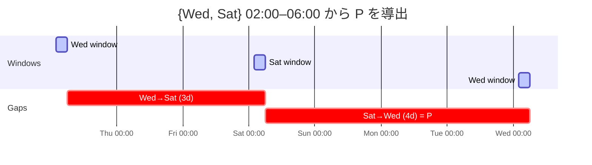
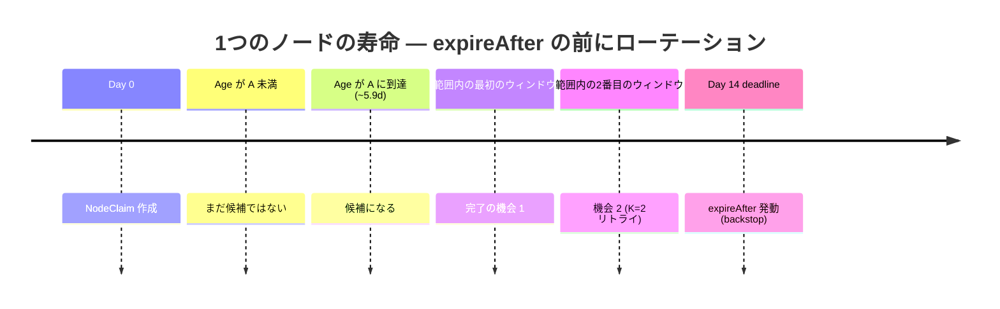
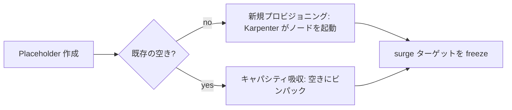
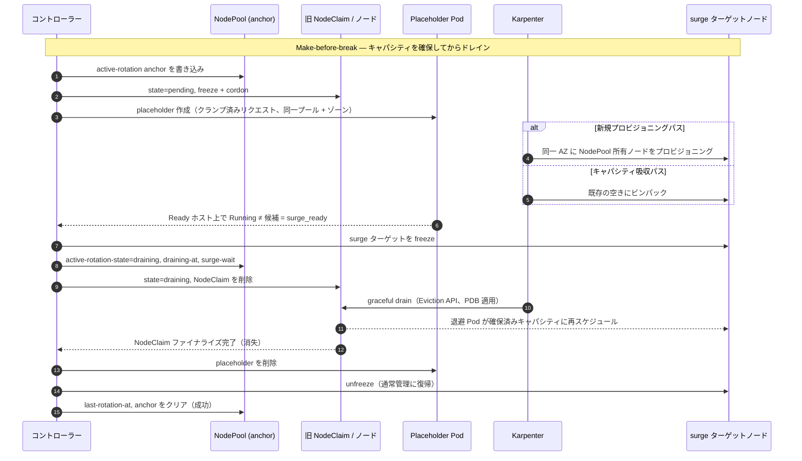

# 3. 設計

## 3.1 メンテナンスウィンドウ

::: tip このセクションの定義
メンテナンスウィンドウはローテーションの **開始** を制御する。進行中のローテーションは境界を超えて完了する。最悪ケースのウィンドウ周期 `P` が `ageThreshold` の導出に使用される（§3.2）。
:::

```yaml
maintenanceWindows:        # リスト; 有効なウィンドウ = すべてのエントリの和集合
  - timezone: Asia/Tokyo   # IANA tz データベース名
    days: [Wed, Sat]       # Mon/Tue/Wed/Thu/Fri/Sat/Sun
    start: "02:00"
    end:   "06:00"
```

### セマンティクス

- Reconciler は **常時稼働**; ウィンドウのメンバーシップは各 tick（1分）で評価。
- `maintenanceWindows` は **リスト**; 有効なウィンドウはすべてのエントリの **和集合**。
- 和集合の外では reconcile ループは no-op。
- ウィンドウは **ローテーション開始** のみを制御。進行中のローテーションは境界を超えて継続。
- **freeze** アノテーション（`noderotation.io/freeze=<RFC3339 タイムスタンプ>`）が指定時刻までローテーションを抑制。

### freeze の動作

ウィンドウ（開始のみゲート）とは異なり、freeze は進行中の `pending` ローテーションも **保留** する：

- **エスカレーションのみ** を停止 — placeholder の（再）作成と `draining` への遷移
- **パッシブなブックキーピングは継続** — `do-not-disrupt`/cordon マーカーの再アサート、`surge-claim` の識別を永続化
- freeze が `readyTimeout` を超えた場合 → 通常の失敗パスでロールバック
- `draining` 状態のローテーションは完了まで継続（ドレイン中の中止は危険）

### 最悪ケースのウィンドウ周期 `P`

`P` は繰り返しサイクルにおける、ある発生の開始から次の発生の開始までの最大ギャップ。



- **例:** 和集合 `{Wed, Sat}` 02:00–06:00 → ギャップ `3d` と `4d` → `P = 4d`
- **24/7 連続オープンの和集合:** `P` は reconcile tick の粒度に縮退（`7d` ではない）
- **DST に関する注記:** `P` は繰り返し壁時計サイクルで計算。DST 遷移により個別ギャップが ±1h シフトする可能性; v1 ではこれを既知の近似として扱う

## 3.2 候補選定

::: tip このセクションの定義
3つの問い: **(1)** ノードはいつ候補になるか? **(2)** `ageThreshold` はどう導出され `expireAfter` の前にコントローラーが完了することを保証するか? **(3)** どのバリデーションが実行可能性を確認するか? 中心公式: `A = E − (K·P + t_rot)`。
:::

### 選定条件

`NodeClaim` が候補になるには **すべて** が成立する必要がある：

| 条件 | 備考 |
|-----------|-------|
| `now() > deadline − leadTime` | 各 NodeClaim **自身** の `spec.expireAfter` に基づく |
| governed な NodePool に所属 | `RotationPolicy` にマッチ（§5.4） |
| `Ready == True` | NotReady → Auto Repair / backstop に委ねる |
| `deletionTimestamp` 未設定 | 削除中 → 除外 |
| `state` が空、または `failed` でバックオフ経過 | `pending`/`draining` は進行中; `expired` は終端 |
| オペレーター `do-not-disrupt` なし | オペレーター独自のオプトアウトを尊重 |

- **期限の計算:** `deadline = creationTimestamp + NodeClaim.spec.expireAfter`
- **ソート順:** 期限が早い順、同一の場合は `creationTimestamp` が古い順、次に名前順
- **異種の `expireAfter`:** 短い `expireAfter` を持つ若いノードが早い期限を持つ可能性があり、先にローテーションされる
- **オペレーターのオプトアウト:** Node 上の `karpenter.sh/do-not-disrupt: "true"`（`do-not-disrupt-owned` マーカーなし）がプロアクティブなローテーションから除外。`expireAfter` backstop は維持

### `ageThreshold` の導出

手動調整（エラーを起こしやすい — 緩すぎると Forceful Expiration が発動）ではなく、コントローラーはスケジュールと目標ローテーション回数から **NodePool ごとに `ageThreshold` を導出** する。

**中心的なレース:** Forceful Expiration はウィンドウや PDB に関係なく各ノードの `deadline` で発動する。コントローラーはその瞬間 **より前に** graceful surge ローテーションを完了しなければならない。



**公式:**

```
ageThreshold (A) = E − (K·P + t_rot)
```

`leadTime = K·P + t_rot` を左から右に読む:
- `K` 回の最悪ケースウィンドウサイクル（`K·P`）でウィンドウを *捕捉*
- プラス 1 回の完了時間（`t_rot`）でその中で *完了*
- `expireAfter` の前に `K` 回のメンテナンスウィンドウを十分なヘッドルームで保証

#### シンボル（権威的ソース）

| シンボル | ソース |
|--------|--------|
| `E` | ノードごと: **`NodeClaim.spec.expireAfter`**（権威的）。テンプレートはバリデーション用の代表値のみ |
| `tGP` | ノードごと: `NodeClaim.spec.terminationGracePeriod`; テンプレートは代表値 |
| `P` | `maintenanceWindows` 和集合から導出（§3.1） |
| `t_rot` | `readyTimeout + tGP + buffer`。`tGP` 未設定時 → 固定フォールバック（例: `1h`） |
| `t_rot_est` | `provisioningEstimate + drainEstimate`。Layer-2 のみ、期限項なし |
| `buffer` | 固定 `4·shortRequeue = 2m`。期限側のみ、`t_rot_est` には含まれない |

#### 権威的な有効期限ソース

ノードごとのトリガーは **`NodeClaim.spec.expireAfter`** から読み取り、その NodeClaim の `creationTimestamp` に基づく。NodePool テンプレートへの後の編集は既存の NodeClaim に伝播 **しない**（drift のみをトリガー）。テンプレート `E` は NodePool ごとのバリデーションとメトリクスの代表値としてのみ使用。

#### マージンと `cooldownAfter`

- 限界は **タイト** — 正確に `K` 回の機会、組み込みスラックなし
- 安全マージンは `K` 自体から — `K ≥ 2` を推奨
- `cooldownAfter` は連続ローテーション間の成功後の安定化待機 — `t_rot` の一部 **ではない**
- `failurePause`（gate B、§4.4、ADR-0004）はスループット項に影響しない別フィールド

::: details バリデーション詳細（レイヤー 1–3）— クリックで展開

#### レイヤー 1 — スケジューリングの実行可能性

| 条件 | 結果 |
|-----------|---------|
| `P = 0`（ウィンドウ発生なし） | **fatal**（`NoWindows`） |
| `K < 1` | **fatal** — 無効な設定 |
| `K < 2`（つまり `K = 1`） | **warn** — ウィンドウを逃すとリトライなし |
| `A ≤ 0`（`E ≤ K·P + t_rot`） | **fatal** — `E` を上げる、ウィンドウを追加、または `K` を下げる |
| `0 < A < P` | **warn** — 極めて攻撃的なローテーション |
| 明示的オーバーライドで `G < 1` | **fatal** — オーバーライド拒否 |
| 明示的オーバーライドで `1 ≤ G < K` | **warn** — 保証回数が弱化 |
| `E + tGP > 21d` | **warn**（`HardCapExceeded`）— Auto Mode 違反 |
| `tGP` 未設定 | **warn** — ドレインフェーズが無制限 |
| `retryBackoff < readyTimeout` | **warn** — リトライが試行より速い |
| `spec.limits` にヘッドルームなし | **warn** — surge 不可 |

#### レイヤー 2 — スループット

発生あたりの容量: `C = m · ceil(D / (t_rot_est + cooldownAfter))`。

- **`C` は `t_rot_est`**（期待サービス時間）を使用、`t_rot`（期限上限）ではない
- 正の長さの発生は少なくとも 1 回の開始を許容（`C ≥ 1`）
- 到着が容量を超えた場合（`C < N · P / A`）: **warn** — ウィンドウを拡大または発生を追加

**同期バッチ:** 同一期限の `N` ノード。graceful に完了するには `K · C ≥ N` が必要。それ以外は **warn**（`ThroughputBurstShortfall`）。

**スピルオーバー:** `t_rot_est + cooldownAfter > gap` の場合、遅く開始されたローテーションが次の発生に持ち越される。**warn**（`RotationSpansNextWindow`）— 隣接する発生がそれぞれフル `C` を提供しない。

#### レイヤー 3 — ノードごと（ランタイム）

テンプレートレベルのチェックはすべての既存 claim が満たされることを証明しない。各 reconcile でコントローラーはすべてのスコープ内 NodeClaim を **自身の** `spec.expireAfter` に対してチェック:

- `E_node ≤ K·P + t_rot`（ノードごと `A ≤ 0`）→ `noderotation_short_lead_nodes` にカウント、`ShortLead` Event で警告
- **最初の機会にベストエフォート** でローテーション
- `deletionTimestamp` がセットされたら → 選定から除外、abort パスが適用（§5.2）

:::

::: details 計算例 — クリックで展開

**設定:** Auto Mode、`tGP` を `1h` に引き下げ、`E = 14d`、和集合 `{Wed, Sat}` 02:00–06:00。

- `P = 4d`
- `t_rot = 15m + 1h + 2m ≈ 1h17m`
- `K = 2`
- `A = 14d − (2·4d + 1h17m) ≈ 5.9d`

ノードは ~5.9d で候補になり、14d の前に 2 回のウィンドウが保証される。

**スループット:**
- `provisioningEstimate = min(15m, 5m) = 5m`
- `drainEstimate = min(1h, 10m) = 10m`
- `t_rot_est = 15m`
- `C = ceil(4h / (15m + 10m)) = 10`（発生あたり）

**fatal の例:** 週1ウィンドウ `{Sat}` → `P = 7d` → `A = 14d − (14d + 1h17m) ≈ −1h17m ≤ 0` → **fatal**。修正: `E` を ~20d に上げるかウィンドウ日を追加。

**キャリブレーション注記:** ストック `tGP = 24h` では `t_rot ≈ 24h17m` だが `t_rot_est` は `15m` のまま（同じ `C = 10`）。`tGP` を下げる利点: (1) `A` が長くなる、(2) 21日キャップが緩和。`tGP` はリスク許容度から選択; `drainEstimate`/`provisioningEstimate` は観測された所要時間から選択。

:::

## 3.3 surge シーケンス

::: tip このセクションの定義
単一の reconcile サイクルで **1つ** のノードを処理: NodePool 内はシリアル（`maxUnavailable = 1`）、NodePool 間はコンカレント。placeholder Pod が NodePool 所有の代替キャパシティを誘導する。
:::

### 同一 NodePool である理由（スタンドアロン NodeClaim ではない）

スタンドアロン `NodeClaim` は NodePool のアカウンティング、expiry、drift、disruption budgets の外にある **非所有** ノードを生成し、意図的な NodePool 分離を破壊する。

### placeholder Pod

| プロパティ | 値 |
|----------|-------|
| Kind | Bare Pod（コントローラーなし） |
| Priority | 専用の負の `PriorityClass` |
| Preemption | `preemptionPolicy: Never` |
| Requests | 再スケジュール可能 Pod 合計（クランプ済み） |
| Node selector | `karpenter.sh/nodepool = <pool>` |
| Node affinity | Soft: 候補 + 期限近いノードを回避 |
| Tolerations | NodePool `spec.template.spec.taints` から |

#### リクエスト合計からの除外

Karpenter が再配置不要な Pod:

- **DaemonSet Pod** — Karpenter が各新ノードにオーバーヘッドを追加（二重カウント）
- **Mirror / static Pod**
- **完了した Pod**（`Succeeded` / `Failed`）
- **ノード固定 Pod**（hostname affinity）

#### ホスト名除外（soft、hard ではない）

- 候補の除外は **cordon** で強制（この preference ではない）
- 期限近いノードの除外はベストエフォート
- **required にしない理由（issue #96）:** Karpenter は required `kubernetes.io/hostname` affinity（制限付きラベル）を拒否
- 除外リストは各（再）作成時に再計算; 陳腐化寿命 ≤ `readyTimeout`

#### 2つのプロビジョニングパス



- **新規プロビジョニング:** Karpenter が同一 AZ に NodePool 所有ノードをプロビジョニング
- **キャパシティ吸収:** スケジューラーが既存の空きキャパシティに placeholder を配置

いずれの場合も、ホストが **surge ターゲット** になり、ローテーション中 freeze される。

### placeholder のサイジングクランプ（issue #224）

**問題:** Karpenter はインスタンスタイプごとに 1 つの `allocatable` 推定値をキャッシュするが、実際の allocatable は AZ ごとに高い可能性がある。キャッシュ推定値を超えて満たされたノードは、プロビジョニング不可能な placeholder を生成する。

**解決策:**

```
limit    = NodeClaim.status.allocatable − DaemonSet オーバーヘッド（リソースごと、下限 0）
requests = min(再スケジュール可能合計, limit)                    （リソースごと）
```

- `status.allocatable` を使用 — インスタンスタイプやキャッシュの知識不要
- `status.allocatable` が存在しない場合 → クランプは no-op
- `surge_headroom`（§5.2）は **クランプ済み** フットプリントをテスト

**エッジケース:**

- **Refused**（`limit ≤ 0`）: DaemonSet オーバーヘッドが allocatable を消費 → placeholder はフルドレインを維持し、スケジュール不可のまま、ローテーションはロールバック
- **Band-exceeded**（shortfall > 計測バンド）: `SurgeClampBandExceeded` Warning Event; ローテーションは続行
- **通常ケース**（limit 内に収まる）: サイレント

### placeholder の優先度とプリエンプション

- **設計上の犠牲者:** 負の priority + `preemptionPolicy: Never` → ワークロードがプリエンプト; placeholder は何もプリエンプトしない
- **Bare Pod:** プリエンプトされると消失 — 状態マシンが検出し再作成（`readyTimeout` で制限）
- **敵対的プリエンプション:** 繰り返しプリエンプションは `readyTimeout` で自己終了 → クリーンなロールバック

### シーケンス図（ハッピーパス）



#### `surge_ready` の条件

placeholder が以下を満たす必要がある:
- **Running** かつ **terminating でない**（`deletionTimestamp` 未設定）
- 候補ノード ≠ の **Ready** ホスト上
- ホストの `karpenter.sh/nodepool` ラベル == プール名

プリエンプトされた placeholder は `deletionTimestamp` 付きで Running のまま → ready ではない（予約が解除中）。消失後に再作成、`readyTimeout` で制限。

#### キャパシティ予約のセマンティクス

placeholder は 1 ノード分のキャパシティを予約する。保護は **物理的予約**: `surge_ready` は placeholder が候補以外の Ready ノード上で Running であることを要求する。新規でも既存でも、そのホストの承認は再スケジュール可能キャパシティが物理的に保持されていることを意味する。

::: warning 吸収パスの制限
吸収パスでは、予約は集約的 — 既に他の Pod が稼働するホスト上に 1 ノード分のリクエストが保持される。個別の退避 Pod がそれを利用できない場合がある（Pod anti-affinity、`hostPort` 衝突）。コントローラーはノードレベルのキャパシティを保証; Pod ごとの配置はスケジューラーと PDB の領域（§3.5）。
:::

## 3.4 surge 中の保護

::: tip このセクションの定義
新旧ノードが共存する間、コントローラーは Karpenter のオプティマイザが構築途中の surge ペアを consolidate/drift するのを防止する。
:::

### メカニズム: `do-not-disrupt` アノテーション

ローテーション中、旧ノードと surge ターゲットの **両方** に適用。

#### ブロック対象

| Disruption タイプ | ブロック? |
|-----------------|----------|
| Consolidation | はい |
| Drift | はい |
| Emptiness | はい |
| Forceful Expiration | **いいえ** |
| Interruption | **いいえ** |
| Node Repair | **いいえ** |

- `expireAfter` とのレースに勝つのは `leadTime` の仕事（§3.2）であり、このアノテーションの役割ではない
- アノテーションの役割: オプティマイザが構築途中のペアを disrupt するのを防止

#### オーナーシップ追跡

- `noderotation.io/do-not-disrupt-owned=true` はコントローラーが `do-not-disrupt` を実際に適用した場合のみ書き込み
- オペレーターの既存 `do-not-disrupt: true`（マーカーなし）は **決して変更しない**
- 非 `true` 値はオペレーター保護ではない — 上書きして own
- クリーンアップは owned マーカーがある場合のみ `do-not-disrupt` を削除

#### `surge-for` マーカー

freeze された各ノードが `noderotation.io/surge-for=<旧 NodeClaim 名>` を保持:
- freeze をこのローテーションに帰属
- 旧 NodeClaim 削除後に surge ターゲットを発見
- `do-not-disrupt` のオーナーシップセマンティクスは **持たない**

### メカニズム: cordon

`pending` に入る際、コントローラーが **候補ノードを cordon**:

- **目的:** surge 待機中に新しい Pod が候補に着地するのを防止（placeholder リクエストはスナップショット）
- **マーカー:** `noderotation.io/cordoned=true` — ロールバック/sweep はコントローラーの cordon のみを解除
- **条件付き:** マーカーなしで既に `unschedulable` → no-op（オペレーターの cordon は採用しない）
- **ローテーション拒否ではない:** cordon されたノードは引き続き選定される。ローテーションを抑制するには `freeze` を使用

### 残存リスク

surge がまだ代替ノードの Ready 待ちの間に旧ノードの `deadline` が到来した場合 → Karpenter がスケジュール通りに force-expire。これはタイト `leadTime` / 最終ウィンドウのエッジケースであり、ネイティブベースラインに **退化** する（§3.9）。防止されるシナリオではない。

## 3.5 Pod レベルの動作

::: tip 要点
Make-before-break は **ノード** レベルであり、Pod レベルではない。Pod レベルの安全性は PDB + レプリカヘッドルームに委譲。
:::

コントローラーは Pod のローリングアップデートを **行わない**。surge ノードは **空のキャパシティ** として追加される。

旧 `NodeClaim` が削除されると:
1. Karpenter の termination controller が **Eviction API** でドレイン（PDB 尊重）
2. 各退避 Pod が削除される
3. 所有するワークロードコントローラーが代替 Pod を作成
4. スケジューラーが利用可能なキャパシティ（通常は surge ノード）に配置

これは **evict-then-reschedule** — 代替 Pod が旧 Pod 終了前に `Ready` であることは保証されない（§4.1）。

**surge ノードの役割:** PDB ゲート付き eviction が長い pending ウィンドウなしで進行するようにランディングゾーンを事前配置。

- **厳格な PDB**（`minAvailable` = 希望カウント）: 代替が `Ready` になるまで eviction ブロック → 実質的に Pod レベル make-before-break（surge ノードのキャパシティにより実現）
- **緩い/なしの PDB:** eviction が一括で進行、`readyReplicas` がディップ（§4.1）

**まとめ:** コントローラーはノードレベルの surge を保証; Pod レベルの make-before-break は PDB + レプリカヘッドルームで達成され、surge ノードのキャパシティがそれを *可能にする* — G4 と一致。

## 3.6 強制フォールバック（オプトイン）

::: tip このセクションの定義
`surge.forcefulFallback.enabled: true` で、graceful surge が候補の期限前に完了できない場合、コントローラーは `NodeClaim` を **surge なし、ウィンドウ内** で voluntary パス経由で削除する（PDB 適用）。
:::

### トリガー

```
deadline − now < t_rot
```

ここで `deadline = creationTimestamp + spec.expireAfter`、`t_rot = readyTimeout + tGP + buffer`。

### 動作

- 旧 `NodeClaim` をウィンドウ内で **make-before-break なし** で削除（break-before-make）
- 引き続き voluntary パス — **PDB 尊重**（`terminationGracePeriod` まで）
- ノードレベル surge プロパティのみ緩和。「Karpenter をバイパスしない」や G4 は維持
- 制御不能な expiration をウィンドウ内に引き込む
- `readyTimeout` とプロビジョニング待機をドロップ → スループット向上

### 制約

- NodePool 内シリアル（`maxUnavailable = 1`）
- `expireAfter: Never`（nil）の候補は期限なし → 該当しない
- デフォルト **off** — off の場合、余剰ノードはネイティブ `expireAfter` ベースラインに退化（§3.9）
- `noderotation.io/rotation-mode = forceful-fallback` で anchor に記録（§5.3）
- `ForcefulFallback` Warning Event + `noderotation_forceful_fallback_total` カウンター（§4.2）を発行

## 3.7 ゾーンワークロード

::: tip このセクションの定義
ゾーン PV Pod は同一 AZ でのみ再スケジュール可能。placeholder は候補のゾーン（および他の設定可能な要件）を複製し、surge ノードが正しい AZ に着地する。
:::

### 問題

ゾーン PersistentVolume（EBS `gp3`/`io2`）にバインドされた Pod は **同一 AZ** でのみ再スケジュール可能。surge ノードが異なる AZ に着地すると、その Pod は `Pending` のまま。

### 解決策: `matchNodeRequirements`

placeholder が候補ノードから設定可能なスケジューリング要件を複製:

| カテゴリ | デフォルトキー | 目的 |
|----------|-------------|---------|
| `required` | `topology.kubernetes.io/zone`, `kubernetes.io/arch`, `karpenter.sh/capacity-type` | 同一 AZ、アーキテクチャ、キャパシティタイプに固定 |
| `preferred` | *（空）* | キャパシティ圧力下で緩和 |

- オペレーターがより厳密なパリティのためにキーを追加（インスタンスタイプ、カスタムラベル）
- キーを `preferred` に移動して厳密性とスケジュール可能性をトレード

### 要件の解決

キーは候補 `NodeClaim.spec.requirements` とノードラベルから読み取り、**NodePool の許可された要件と交差**:

- 交差により placeholder がプール内でスケジュール可能に維持
- ノードラベルが **権威的**（実際の配置）でコンフリクト時に優先
- ラベルとして表面化しないキー → `NodeClaim.spec.requirements` の `In` 値を使用
- 両ソースに存在しない → スキップ
- 数値演算子（`Gt`/`Lt`/`Gte`/`Lte`）を正しく処理 — サイレントに弱化しない
- `topology.kubernetes.io/zone` を `required` から除去 → **warn**（ゾーン PV Pod がストランドする可能性）

### 制限事項

- 同一 AZ ランディングゾーンの再作成のみ; ストレージの **移動はしない**
- CSI ドライバーが代替 Pod のスケジュール後に既存ボリュームを再アタッチ
- AZ にスケジュール可能なキャパシティがない場合 → `readyTimeout` でロールバック; backstop 適用
- ゾーン PV ワークロードを持つ NodePool は AZ ごとの surge ヘッドルームを確保すべき（R3）

## 3.8 ロールバック動作

| 失敗 | アクション |
|---------|--------|
| 新ノードがタイムアウト内に Ready にならない | surge claim を reap、placeholder 削除、unfreeze、失敗を記録 |
| 旧削除後に新ノードが NotReady | ドレイン進行中、逆転不可; Karpenter がキャパシティを調整 |
| Karpenter API 利用不可 | スキップ; 次の reconcile でリトライ |
| コントローラーが surge 中にクラッシュ | `active-rotation` anchor から再開（§5.2）; 冪等な再アサート |

### タイムアウトロールバックの詳細

`readyTimeout` が超過した場合:

1. **誘導された surge NodeClaim を reap** — `noderotation.io/surge-claim` から特定（placeholder の bind ターゲットが観測可能になり次第永続化）
2. **ノードを unfreeze** — コントローラーの `do-not-disrupt`（owned マーカーによる）と cordon（`cordoned` マーカーによる）を削除
3. **失敗を記録** — NodePool に `last-failure-at` を書き込み、anchor をクリア、失敗メトリクス + アラートを発行

#### surge-claim の特定

`surge-claim` アノテーションは pending ハンドラーで **placeholder の bind ターゲットが観測可能になり次第** 永続化 — `spec.nodeName`（non-preempting Pod の唯一のスケジューラー可視シグナル）。失敗パスでのフォールバック解決順:

1. まだ存在する placeholder から再解決
2. プールの `started-at` 以降に作成された、登録済み Node のない `NodeClaim`

#### reap ガード

誤った claim を reap しないための 2 つのガード:
- **`started-at` 以降に作成** されていなければならない（既存のキャパシティ吸収ホストは surge デブリではない）
- ノードが **placeholder のみ** + DaemonSet をホスト（実際の Pod なし）

::: warning
v1 はサイクルごとに 1 ノードを処理。未処理候補は次のウィンドウに繰り越される。`expireAfter` backstop が最終的なローテーションを保証。
:::

## 3.9 バックストップ動作

::: tip 要点
すべての失敗モードは Karpenter のネイティブ Forceful Expiration に退化する — **本コントローラーなしの現状より悪くならない**。
:::

コントローラーが利用不可の場合、安全ネットが順に作動:

1. **Consolidation / Drift** — voluntary パスで一部ノードをローテーションする可能性
2. **`expireAfter`** — 超過ノードで Forceful drain を発動
3. **`terminationGracePeriod`** — ドレインを制限
4. **Auto Mode 21日ハードキャップ** — 最終上限

### 陳腐化した `do-not-disrupt` はリスクではない

クラッシュしたコントローラーが残した `karpenter.sh/do-not-disrupt`:
- **voluntary** disruption（パス 1）のみを抑制
- `expireAfter`（パス 2）を **ブロックしない** — ノードは期限を超えて存続できない
- 起動時 sweep がクリアするが、そもそもノード寿命を延長していなかった

### graceful な退化保証

コントローラーはローテーションをより **早い段階** に移動し **graceful** にするのみ。以下は行わない:
- 安全ネットの除去
- `expireAfter` を超えたノード寿命の延長（ノードレベル `do-not-disrupt` は効果なし）

**最悪ケースは現在のベースラインと同等** — forceful だが制限付き。段階的に安全に導入可能。

### graceful な保証が不可能な場合

キャパシティが需要を下回る（`C · A < N · P` またはバッチ `N > K·C`）と、一部の forceful disruption は避けられない:

- **デフォルト:** ネイティブの制御不能な `expireAfter` 期限で発生
- **`forcefulFallback` あり:** コントローラーがウィンドウ内で制御された surge なしローテーションを実行（§3.6）
- `NodeClaim.spec` は不変 — コントローラーは `expireAfter` のタイミングを変更できない; 唯一のレバーは置換