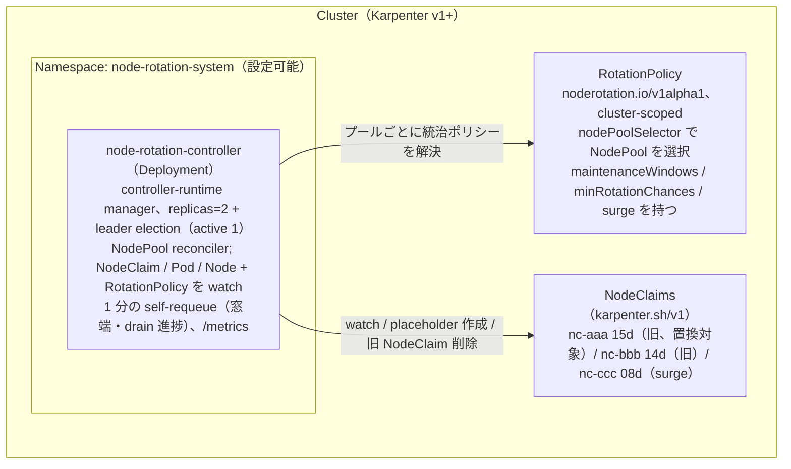
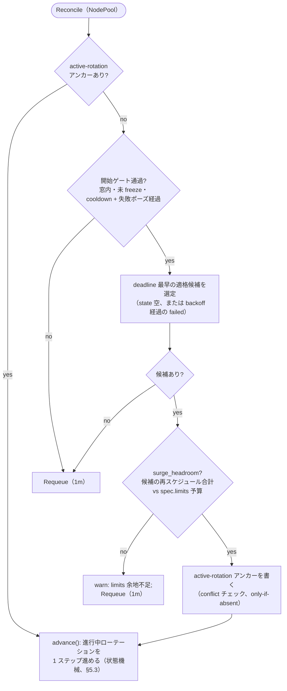
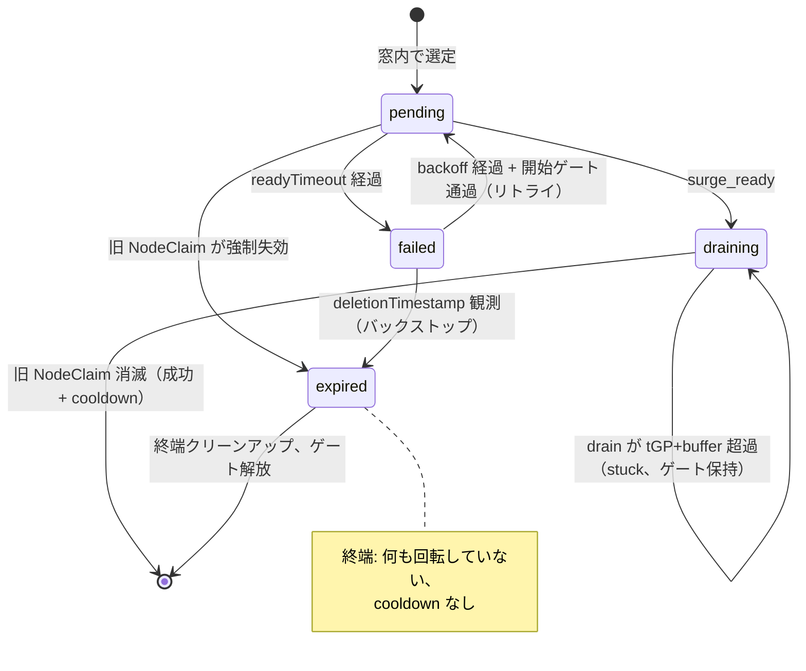

# 5. 実装

## 5.1 アーキテクチャ



Reconciler は各 NodePool の **統治 `RotationPolicy`** を毎パス解決する（§5.4）: クラスタのポリシーを列挙し、`nodePoolSelector` がそのプールに最も特定的にマッチするものを選び、そこから `maintenanceWindows`・`minRotationChances`・`surge` を読む。`RotationPolicy` の create/update/delete はすべての NodePool を再エンキューする — 1 つのポリシー変更がどのプールでどのポリシーが勝つかを変えうるためである。ポリシー（`RotationPolicy` spec、望ましい設定）はローテーション **状態**（`NodeClaim`/`NodePool` の annotation と一時的な Node/placeholder マーカー、§5.3）とは区別して保たれる: CRD は権威ある実行時状態を一切持たない。

**起動時プリフライト（Karpenter v1 API サーフェス）。** マネージャが reconcile を
開始する前に、依存する公開 Karpenter API が不在または読み取り不能であれば fail
fast する: クラスタが **`karpenter.sh/v1`** を `nodeclaims` と `nodepools` の両リソース
とともに提供していること、および自身の RBAC が両 kind の list を許可していることを
検証する。互換性の契約は `karpenter.sh/v1` という **group/version** であり、管理対象の
Karpenter マイナーには意図的に依存しない（EKS Auto Mode はそれを公開しない）— §1.1
参照。CRD サーフェスの欠如・非互換や RBAC の不足は、後続の reconcile での失敗ではなく
即座の actionable な起動エラーとなる。typed list はスキーマ互換性のプローブも兼ねる
（コントローラがビルド対象とする v1 型のデコード成功は、提供スキーマが wire 互換である
ことを確認する）。フィールド単位の CRD OpenAPI introspection は意図的に行わない —
typed な `karpenter.sh/v1` 契約が必要なフィールドを既にカバーしているためである。

## 5.2 Reconcile ループ

[controller-runtime](https://github.com/kubernetes-sigs/controller-runtime) で実装。Reconciler は `NodePool` をキーとし、`NodeClaim`（その所有 NodePool へマップ）に加え、進行中の `pending` ローテーションを進める 2 つの readiness シグナル — placeholder `Pod` の `Running` 到達と surge ホスト `Node` の `Ready` 到達 — を watch することで、次の定期パスを待たずに即座に観測する。窓端・凍結解除・drain 進捗・強制失効の検知は、定期的な self-requeue がバックストップとして担い続ける。

各 `Reconcile` 呼び出しは **非ブロッキングな 1 ステップだけ**を実行して `Requeue` を返す。**ブロッキング待機は存在しない**（15 分の surge 待ちや drain 待ちは `started-at`/削除タイムスタンプに対する *経過時間チェック* で、後続の reconcile で再評価される）。したがって worker は占有されず、進捗はコントローラ再起動を跨いで残る — 全状態は annotation から読み戻す（§5.3）。直列処理は、新規開始の **前に**進行中の置換を処理することで担保する。

1 つの NodePool に対する判断フローは下図のとおり。`advance()` の状態ごとの処理は §5.3 の状態機械であり、（クラッシュ回復の全不変条件を含む）権威ある正確なアルゴリズムは続く擬似コードである。



```text
Reconcile(req):                              # req は NodeClaim イベントまたは定期 Tick
  if req is Tick:                            # Tick は単一オブジェクトに紐づかない
      for np in in_scope_nodepools():        #   → 選定された全 NodePool に fan out
          reconcile_nodepool(np)
      return Requeue(1m)
  return reconcile_nodepool(nodepool(req.obj))

reconcile_nodepool(np):
  # ── 1. まず進行中の置換を駆動（直列: NodePool ごと高々 1 件）。
  #       キーは annotation 付き NodeClaim の発見ではなく、NodePool の active-rotation
  #       アンカー — 旧 NodeClaim はローテーション成功時に消滅するが、その後も下の
  #       完了側の副作用は実行されなければならない。
  if name := np[active-rotation]:
      return advance(np, name)

  # ── 2. 進行中なし → 候補非依存の start ゲート群。
  #       start_gates(np) は failed → pending 再入（下の case failed）とそのまま共有する:
  #       再入は「新規の試行」であり、2 つのゲート集合は決して乖離してはならない。
  start_gates(np) :=
      in_window(now) and not frozen(np)
      and since_last_rotation(np) >= cooldownAfter   # 成功後の整定休止。since_* = now − NodePool の
      and since_last_failure(np)  >= cooldownAfter   #   annotation、未設定なら +∞。失敗側の休止は、系統的な
                                                     #   失敗原因下での候補の巡回を抑える（§4.4）
  if not start_gates(np): return Requeue(1m)

  # ── 3. 新規置換を開始: 候補を選び、「その候補の」余地でゲートし、それからアンカー ──
  cand := pick_earliest_deadline_eligible(np) # state 空、またはエスカレーション後 backoff を経過した failed
  if cand == nil: return Requeue(1m)
  if not surge_headroom(np, cand):           # cand の再スケジュール対象 Pod requests 合計（= placeholder の
                                             #   requests、§3.3）vs (spec.limits − プロビジョニング済): この
                                             #   ゲートは定義上候補依存なので、選定の「後」に走る
      warn("insufficient limits headroom; cannot surge"); return Requeue(1m)
  annotate(np, active-rotation=cand.name)    # 他のどの副作用よりも先にアンカー。conflict チェック付きの
                                             #   only-if-absent 書込（resourceVersion の楽観ロック / SSA）:
                                             #   Tick と NodeClaim イベントは別々のキーで queue されるため、
                                             #   同一 NodePool 上で 2 つの reconcile がレースし得る — 敗者の
                                             #   書込は失敗し、requeue 以外は何もしない
  return advance(np, cand.name)              # 下の冪等な pending ハンドラへ合流

# advance() は進行中のローテーションをアンカーをキーに 1 ステップ進める:
advance(np, name):
  cand := nodeclaim(name)
  if cand == nil:                            # 旧 NodeClaim が finalize 消滅 → いずれにせよ終端。だがどちらの形で?
      delete(placeholder(name))              # まだ残っていれば
      for node in nodes_with(surge-for=name):    # 旧 claim なしで surge ターゲットを解決
          unfreeze(node)                     # surge-for + コントローラ自身の do-not-disrupt を除去
                                             #   （do-not-disrupt-owned マーカーで判定。運用者のものは残す）
                                             #   + noderotation.io/cordoned マーカーがあれば uncordon も
      if np[active-rotation-state] == draining:  # コントローラ駆動の drain → 真のローテーション
          annotate(np, last-rotation-at=now) # cooldown のアンカー
          emit_metrics(success, duration[drain]=now − np[draining-at])  # §4.2 の drain フェーズ。draining-at が
                                             #   不在なら（このアンカー導入前に draining へ到達したローテーション）
                                             #   スキップ — 誤アンカーよりも未計上を選ぶ
      else:                                  # pending から消滅（例: surge 中の force-expire、§3.3
          emit_metrics(expired); alert       #   残存リスク）: 何も回転していない — cooldown も不要
      clear(np, active-rotation, active-rotation-state, draining-at)  # 同一オブジェクト → 1 回の update。ゲート解放は最後
      return Requeue(1m)                     # cooldown はステップ2の start ゲートで enforce

  switch cand.state:
  case (none) | pending:                     # 冪等: このフェーズに必要なものを毎回（再）表明する
      if cand.deletionTimestamp != nil:      # 強制失効を現行犯で捕捉（§3.3 残存リスク）: Karpenter の
                                             #   forceful 経路が先に到達した。他のすべてより先にチェックする —
                                             #   死につつある claim を draining にエスカレーションしてはならず
                                             #   （ミラーが success と誤ラベルする、§4.2）、タイムアウトで
                                             #   failed にしてもならない
          delete(placeholder(name))
          for node in nodes_with(surge-for=name):
              unfreeze(node)                 # surge-for + コントローラ自身の do-not-disrupt（owned マーカー）（+ cordoned マーカーで uncordon）
          annotate(cand, state=expired,      # 終端マーカーをプール側 clear より先に: tGP=24h 下では強制 drain
                   clear=[started-at, surge-claim])  # 中の claim が（deadline 超過ゆえ最早のまま）何時間も生き続ける — この書込と
                                             #   §3.2 の deletionTimestamp 除外がなければ、選定が毎分これを
                                             #   再選択して直列ゲートをライブロックさせる
          emit_metrics(expired); alert       # 何も回転していない — 決して success にしない。cooldown も無し。
                                             #   計上は 1 回だけ: 下の expired ケースは再計上しない（at-most-once）
          clear(np, active-rotation, active-rotation-state)
          return Requeue(1m)                 # claim は自力で finalize を終える
      annotate(cand, state=pending)          # 設定済みなら no-op
      annotate_once(cand, started-at=now)    # 試行ごとに write-once: 下の failed 書込で消去されるため、
                                             #   リトライは自分のタイムアウトを刻み直す
      if elapsed(cand.started-at) > readyTimeout:        # 既定 15m。最初にチェックする: この失敗パスの途中で
                                             #   クラッシュしても、下の再作成分岐で placeholder を蘇生させないため。
          if cand[surge-claim] unset and c := induced_claim(name):
              annotate(cand, surge-claim=c.name)   # 最終手段に限る — 通常は下の pending 再表明が、バインドが
                                             #   観測可能になった時点で永続化済み。induced_claim は「started-at
                                             #   より後に作成され、登録済み Node を持たない」プール内 claim への
                                             #   フォールバックを持つ（never-Ready: バインドが一度も起きない、
                                             #   最頻のタイムアウト原因 — §3.3 ロールバック）
          reap_surge_claim(cand[surge-claim]) # 冪等な delete。未設定／消滅済みなら no-op。ガード付き:
                                             #   started-at より後に作成され、かつそのノードが placeholder
                                             #   （+ DaemonSet）以外を何もホストしない claim のみ。Node 未登録は
                                             #   この条件を自明に満たす — absorb ホストも、既に実 Pod を載せた
                                             #   claim も決して回収しない（§3.3 ロールバック）
          delete(placeholder(name))
          for node in nodes_with(surge-for=name):  # 旧ノード — 加えてクラッシュ前に凍結済みなら
              unfreeze(node)                 #   surge ターゲットも。完了ハンドラと対称
          annotate(cand, state=failed, failed-at=now, retry-count+=1,
                   clear=[started-at, surge-claim])  # 単一 update（同一オブジェクト） — 半端な中間状態を残さない
          emit_metrics(failure); alert       # アンカー clear より先: ここでクラッシュしても失われるのは高々
                                             #   この 1 増分（下の failed ケースは再計上しない）
          annotate(np, last-failure-at=now,  # NodePool レベルの試行間休止のアンカー（§4.4） — ゲートを
                   clear=[active-rotation, active-rotation-state])  # 解放する update と同一の単一 update で書く。
          return Requeue(1m)                 #   ゲート解放は最後 — failed claim は backoff 経由で再入する
      freeze(cand.node, surge-for=name)      # クラッシュで失われた do-not-disrupt を再表明（§3.3） — 下の
                                             #   freeze ホールドより前に: 保護マーカーは受動的で常に再表明する。
                                             #   freeze が止めるのはエスカレーションのみ（§3.1）
      cordon(cand.node)                      # 同じく再表明。noderotation.io/cordoned を付け、ロールバックと
                                             #   sweep がコントローラ自身の cordon だけを解除するようにする —
                                             #   マーカー無しで既に unschedulable なノードには no-op（フラグも
                                             #   マーカーも書かない）: 運用者の cordon は決して取り込まない（§3.3）
      if c := induced_claim(name):           # バインド先（spec.nodeName）が観測可能 → 特定を「いま」永続化する。
          annotate(cand, surge-claim=c.name) #   失敗パスでは行わない: その時点では placeholder（唯一の他の源）
                                             #   が消えていることがある（§3.3 ロールバック）。設定済みなら no-op。
                                             #   受動的な記録 — 下の freeze ホールドで先送りされることはない
      if frozen(np): return Requeue(1m)      # pending 途中で freeze が入った: 全エスカレーションを HOLD（§3.1）
                                             #   — placeholder の（再）作成も draining への遷移もしない。凍結が
                                             #   readyTimeout を超えて続けば、試行は上でタイムアウトして
                                             #   クリーンにロールバックする
      if placeholder(name) is missing:       # 喪失 / preempt / 作成前のクラッシュ
          create_placeholder(np, cand)       # requests = Σ 再スケジュール対象 Pod requests（§3.3 の除外:
          return Requeue(30s)                #   DaemonSet/mirror/完了済/ノード固定）; do-not-disrupt
                                             #   annotation; required な karpenter.sh/nodepool セレクタ（§3.3）;
                                             #   SOFT preferred nodeAffinity hostname NotIn {cand.node, 期限間近のノード}
                                             #   （候補の hard 除外は cordon + surge_ready が担い、この項ではない; #96）
                                             #   — どちらの除外リストも（再）作成のたびに再計算
      if surge_ready(cand):                  # placeholder が Running かつ terminating でない（deletionTimestamp 未設定）
                                             #   状態で cand.node 以外の Ready なホスト上にあり、かつ
                                             #   ホストの karpenter.sh/nodepool ラベル == np.name（placeholder の
                                             #   required セレクタへの belt-and-suspenders、§3.3）。grace 中に preempt
                                             #   された placeholder は deletionTimestamp 付きのまま Running に留まる;
                                             #   その予約は既に除去されつつあるため ready とはしない（§5.2 が消滅後に
                                             #   再作成、readyTimeout で有界）。
          host := placeholder_node(name)     # 新規プロビジョニングまたは既存（capacity-absorb、§3.3）
          freeze(host, surge-for=name)
          annotate(np, active-rotation-state=draining, draining-at=now)   # 永続的なフェーズ記録を delete より
          annotate(cand, state=draining)                 #   先に（完了時の outcome を決める、§5.3）。
                                             #   draining-at（write-once）は §4.2 の drain 所要時間のアンカー
          delete(cand)                       # 明示削除。do-not-disrupt にブロックされない
          return Requeue(30s)
      return Requeue(30s)
  case draining:                             # 旧 NodeClaim の finalize 消滅待ち
      annotate(np, active-rotation-state=draining)   # 冪等な再表明（通常は no-op。np 側は cand.state より先に
                                             #   書かれる）。draining-at はここでバックフィルしない: アンカー導入前に
                                             #   draining へ到達したローテーションは未計上のまま — 誤アンカーより
                                             #   未計上を選ぶ（§4.2）
      if cand.deletionTimestamp == nil:      # state 書込と delete(cand) の間のクラッシュ
          delete(cand)                       # 冪等な再発行 — これがないとローテーションは永久にハングする
          return Requeue(30s)
      if elapsed(cand.deletionTimestamp) > drain_bound(np):   # tGP + buffer。tGP 未設定なら固定の代替値
          alert(stuck_drain)                 # 一度だけ。state は draining のまま — ゲートは意図的に保持（下記）
      return Requeue(30s)
  case failed:
      if cand.deletionTimestamp != nil:      # バックストップがロールバック済みの claim に到達した（ここに
          annotate(cand, state=expired)      #   いるのは再選択かクラッシュ復帰でアンカーされたから）: 進行中の
          emit_metrics(expired); alert       #   ものは無い — 失敗パスがランタイムオブジェクトを清掃済み。
          clear(np, active-rotation, active-rotation-state)  # 終端化して再選定を封じ、ゲートを解放する
          return Requeue(1m)
      if start_gates(np)                     # ステップ 2 の start ゲート「すべて」（窓 / 凍結 / cooldown /
         and elapsed(cand.failed-at) >= escalated_backoff(cand)
         and surge_headroom(np, cand):       #   失敗休止）に加え、ステップ 3 の候補ゲートも: 再入は進行中の
                                             #   継続ではなく「新規の試行」であり、新規開始が通るものすべてを
                                             #   通らなければならない — このパスには、failed 書込と clear の
                                             #   間のクラッシュ + backoff を超える停止により、stale な条件
                                             #   （凍結中のプール、消えた余地）のまま到達し得る
          annotate(cand, state=pending)      # §5.3 の failed → pending 再入: ステップ 3 が backoff 経過後に
          return advance(np, name)           #   この claim を再選択した。pending ハンドラへ合流し、
                                             #   started-at（失敗時に消去済み）を刻み直す — このリセットが
                                             #   ないと下の分岐との間で永久にピンポンする
      annotate(np, last-failure-at=max(np[last-failure-at], cand.failed-at),
               clear=[active-rotation, active-rotation-state])
                                             # それ以外: failed 書込とプール側 update の間のクラッシュ —
      return Requeue(1m)                     #   半端な書込の「両半分」を修復する。アンカーだけ clear すると
                                             #   last-failure-at が未設定のまま残り（since_last_failure = +∞ で
                                             #   ゲート素通り）、まさにこのクラッシュ経路のために存在する §4.4
                                             #   の試行間休止が無効化される。max() はより新しい休止アンカーを
                                             #   上書きしない
  case expired:                              # 終端（§5.3）: abort パスがこれを書いた後、アンカー clear 前に
      delete(placeholder(name))              #   クラッシュした — クリーンアップを冪等に再実行してゲートを
      for node in nodes_with(surge-for=name):    # 解放する。メトリクス／アラートは再計上しない
          unfreeze(node)                     #   （abort 自身が計上済み。at-most-once — 下の注記参照）
      clear(np, active-rotation, active-rotation-state)
      return Requeue(1m)
```

`pick_earliest_deadline_eligible` は **`deletionTimestamp` の無い** claim のうち、`state` が空（新規）か、`failed` かつ `now − failed-at` がエスカレーション後の backoff（`retryBackoff · 2^(retry-count − 1)`、上限 8 倍）を超えたものを選ぶ。`pending`/`draining` は新規候補として再選定されず（ステップ 1 が駆動）、`expired` は終端であり、削除が既に始まった claim は問答無用で除外される（§3.2） — それはもはやローテーションできず、選定すれば強制 drain がその claim を生かしている間じゅう、直列ゲートを押さえては中断する、を延々と繰り返すだけだからである。`failed` な claim の再選択はアンカーを書いて `advance()` の `failed` ケースに入り、そこで `state` をリセットすることが実際の `failed → pending` 再入となる — `started-at` は failed 書込で消去済みなので、新しい試行は自分の `readyTimeout` 期限を刻み直す（`retryBackoff` ≥ `readyTimeout` — 既定値 30m vs 15m で成立し、違反時は §3.2 が警告する — のもとでは、古いタイムスタンプを引き継いだリトライは placeholder を一度も作れずに即時失敗してしまう）。このリセットがなければ §5.3 の `failed → pending` 遷移を実行するパスがどこにも存在しない: 毎 reconcile が claim を再選択し、アンカーを書き、アンカーを消すクラッシュ復帰分岐に落ちてループし — その NodePool の他のすべての候補を飢餓させる。Leader election は `coordination.k8s.io/Lease` 標準。リーダー交代時、新リーダーは annotation のみから再開する。

ステップ 1 のキーは **NodePool の `active-rotation` アンカー** であり、annotation 付き NodeClaim の発見ではない: ローテーションごとの `state` の担い手である旧 NodeClaim は成功時に削除されるため、それに依存する発見方法は、完了側の副作用（placeholder 除去・surge ターゲットの unfreeze・`last-rotation-at`）を実行すべきまさにその瞬間に盲目になる。アンカーは開始時に他のどの副作用 **よりも先に** 書き、完了/失敗時に **最後に** 消す — どのクラッシュ地点でも再開可能な記録が残る。アンカーの書込自体は **conflict チェック付きの only-if-absent な update**（`resourceVersion` による楽観的並行性制御、または不在を前提条件とする SSA）である: Tick と NodeClaim イベントは別々のキーで workqueue に入るため、informer キャッシュのスキュー下では同一 NodePool 上で 2 つの reconcile がレースし*得る* — この前提条件がレースを無害化する。書込はちょうど 1 つだけが成立し、敗者は requeue 以外何もしないからだ。したがって直列化は workqueue のキー設計ではなく、アンカー自体に立脚する。

完了時の **outcome** は NodePool 側のフェーズミラー `active-rotation-state` が決める: ローテーションが `draining` に入るとき（コントローラの `delete` の直前に）書かれ、旧 NodeClaim が消えた後に「ローテーションがどこまで進んでいたか」を伝える唯一の永続記録となる — コントローラ駆動の drain は `success` として完了し（cooldown を消費）、`pending` からの強制失効（§3.3 残存リスク）は `expired` としてアラート付きで記録され、cooldown は **消費しない**: 回転していないノードを success に数えれば失敗アラートが沈黙し、次の正規ローテーションを遅らせることになる。

強制失効は **2 つ** の経路で捕捉される: 早期には、まだ `pending` のまま claim に `deletionTimestamp` が現れることで — pending ハンドラでは他のすべてより先にチェックするため、死につつある claim が `draining` にエスカレーションされる（ミラーが反転し、outcome を `success` と誤ラベルする。`tGP = 24h` が強制 drain 中の claim を何時間も生かしておく Auto Mode で特に効く）ことも、`readyTimeout` によって `failed` に落とされる（アンカーが clear され、`expired` の記録が完全に失われる）こともない — 後期には、`draining` ミラー無しでの消滅によって。早期経路はさらに、アンカーを解放する**前に**終端の `state=expired` を claim へ書き込む: Auto Mode の `tGP = 24h` 下では強制 drain 中の claim が — `Ready` かつ最早（deadline 超過ゆえ）かつそれ以外は適格なまま — 何時間も生き延び得るため、この終端マーカー（と対になる §3.2 選定の `deletionTimestamp` 除外）がなければ、毎 reconcile がそれを再選択してアンカーを書き、中断し、clear する — `expired` カウンタを撒き散らしつつ NodePool 内の他のすべての候補を飢餓させるライブロックになる。

これと相補的に、各状態ハンドラは一回限りのアクションではなくフェーズの望ましい状態の **冪等な再表明** である: pending ハンドラは旧ノードの freeze と placeholder の存在を毎パス再表明し（開始時の副作用のどの 2 つの間でクラッシュしても次の reconcile で治癒する）、draining ハンドラは旧 NodeClaim に `deletionTimestamp` が無ければ冪等な `delete` を再発行する（state 書込と delete の間のクラッシュは、これがなければ誰も要求していない削除を待ち続けてローテーションが永久にハングする）。

観測性については、作り込みで排除する代わりに 2 つの狭いスキューを v1 では許容する。**ミラー書込〜delete 間ギャップでの強制失効の誤ラベル:** フェーズミラーはコントローラの `delete` の直前に書かれるため、そのギャップでのクラッシュに停止中の旧ノード強制失効が重なると、`success` として記録される — だがその時点で `surge_ready` は既に成立しており（代替キャパシティは予約済み）、実質的な結果はコントローラ駆動の drain と一致する。ずれるのはラベルだけであり、露出はちょうど停止直前の 1 reconcile ステップに限られる。**at-least-once / at-most-once なメトリクス送出:** メトリクス書込は annotation 更新とトランザクショナルではない。完了ハンドラはアンカー clear より先に送出するため、両者の間のクラッシュは完了処理を再実行して `success`/`expired` を二重計上し得る（at-least-once）。失敗パスは failed 書込の後に送出するため、両者の間のクラッシュは高々その 1 件の `failure` 増分を失う（at-most-once） — `failed` 状態と `noderotation_retry_count` ゲージは claim 上に残るため、系統的失敗のアラートは引き続き発火する。expired-abort は claim 側の `state=expired` 書込とアンカー clear の間で計上し、`case expired` の復帰は再計上しない — 同じく at-most-once である。窓付きの `increase(...)` で組んだアラートルールはどちらのスキューも許容する。

drain が `drain_bound`（= `tGP + buffer`。`tGP` 未設定時は固定の既定値、例 `1h` — §3.2 レイヤ1の警告参照）を超えたら stuck-drain アラート（`noderotation_drain_stuck`、§4.2 — ライブ状態から各 reconcile で再計算する 0/1 ゲージで、drain 完了時にラッチせず 0 へ戻る）を発火するが、**直列ゲートは意図的に保持し続ける**: `draining` のローテーションはロールバックできず（旧 NodeClaim には既に `deletionTimestamp` が付いている）、ゲートを解放すれば 1 台目がまだ半分 drain された状態のまま 2 台目の disruption を開始することになり、`maxUnavailable = 1` に違反する。是正は運用者側 — ブロックしている PDB かスタックした finalizer を解消する。`tGP` が設定されていれば最終的に Karpenter 自身が drain を強制する。

ステップ2の `cooldownAfter` ゲートは、成功完了ごとに **NodePool** へ書く `noderotation.io/last-rotation-at` をアンカーにする。旧 NodeClaim には載せない: ローテーションごとの state を担うその object はローテーション完了時に削除されるため、それをキーにした requeue は no-op になる（旧来の「削除済み claim への `Requeue(cooldown=…)`」が実際には休止を enforce せず、次の Tick で即ローテーションを開始し得たのはこのため）。生存する NodePool にアンカーすることで、完了境界とリーダー交代をまたいで休止が持続する。ゲートは NodePool ごとに評価され、NodePool ごと直列のモデルと整合する（別 NodePool は引き続き並行ローテーション可）。

## 5.3 状態モデル

進行状態は Kubernetes オブジェクト（NodePool、旧 `NodeClaim`、新旧 2 ノード、一時的な placeholder Pod）にのみ持つ — **外部データストア不要**。ローテーション **状態**（本節）はローテーション **ポリシー**（`RotationPolicy` CRD、§5.4）とは厳密に分離される: ポリシーはオペレーターが書く望ましい設定であり、以下の annotation とマーカーはコントローラが書き戻して読む権威ある実行時の真実である。CRD はパスごとに解決され進行中の状態を一切保存しない — `status` サブリソースも観測用のみ — ので、「外部データストア不要」の不変条件はポリシー担体によらず成立する。永続的な真実は 2 つの担体に分かれる: NodePool の `active-rotation` アンカーが **どの** ローテーションが進行中かを記録し（成功時の旧 NodeClaim 削除を生き延びる。`active-rotation-state` が `draining` 到達の有無をミラーし、旧 NodeClaim 消滅後に完了ハンドラが正しい outcome を選ぶための記録となる）、旧 NodeClaim の `state` annotation がそのローテーションが **どこまで** 進んだかを記録する。placeholder Pod とノード上のマーカーはランタイムオブジェクトであり、失われてもこの 2 つから冪等なハンドラ（§5.2）が再作成・再表明する。

| キー | 付与先 | 値 | 用途 |
|------|-------|-----|------|
| `noderotation.io/active-rotation` | NodePool | 旧 NodeClaim の `metadata.name` | 進行中ローテーションの **永続アンカー**。§5.2 ステップ 1 を駆動し、旧 NodeClaim より長生きするため完了ハンドラも駆動する。開始時は他のどの副作用よりも先に書き、完了/失敗時は最後に消す。NodePool ごとの直列ゲートでもある |
| `noderotation.io/active-rotation-state` | NodePool | `draining` | アンカーされたローテーションのフェーズミラー。コントローラによる旧 NodeClaim の `delete` の直前に書く。不在ならローテーションは `pending` を出ていない。完了ハンドラが — `state` の担体である旧 NodeClaim の消滅後に — outcome を選ぶために読む: `draining` → `success` + cooldown、不在 → `expired` + アラート、cooldown なし（§5.2）。完了パス・失敗パスの**両方**でアンカーと同一 update で消去する（同一オブジェクト → アトミック）|
| `noderotation.io/draining-at` | NodePool | RFC3339 タイムスタンプ | `drain` フェーズの `noderotation_duration_seconds` ヒストグラム（§4.2）の **drain 開始アンカー**。`pending → draining` 遷移時に `active-rotation-state=draining` と同一 update で **write-once** にスタンプされる。本来の drain 開始 — 旧 NodeClaim の `deletionTimestamp` — は、ヒストグラムを一度だけ観測する唯一の完了地点までに finalize されて失われているため、所要時間にはこのプール側アンカーが必要。完了時に読み（`now − draining-at`）、アンカーと同一 update で消去する |
| `noderotation.io/rotation-mode` | NodePool | `forceful-fallback` | 進行中のローテーションの実行方式を記録する。surge-less ウィンドウ拘束型 forceful フォールバック（§3.3）の開始時にアンカー上にスタンプされる（成功時の候補 NodeClaim 削除を生き延びる）。**不在 = 既定の surge**（make-before-break）ローテーション。ゲート解放（完了・失敗・中断）のたびにアンカーと同時に消去される |
| `noderotation.io/state` | 旧 NodeClaim | `pending` / `draining` / `failed` / `expired` | アンカーされたローテーションの進行ステート。`expired` は **終端**: claim が強制失効を現行犯で捕捉されたとき abort パスが書き（§5.2）、強制 drain 下で最大 `tGP` 生き続けるその claim が finalize を終えるまでの再選定をブロックする |
| `noderotation.io/started-at` | 旧 NodeClaim | RFC3339 | `readyTimeout` の期限 + observability。**試行ごとに** write-once: failed 書込で消去される — `state=failed`/`failed-at`/`retry-count` と併せて**単一 update**（§5.2）なので、どのクラッシュも半端な中間状態を残せない — 上で、リトライが自分の期限を刻み直す（さもなければ `retryBackoff` ≥ `readyTimeout` — 既定値で成立し、違反時は §3.2 が警告する — のため、すべてのリトライが即時タイムアウトする）|
| `noderotation.io/failed-at` | 旧 NodeClaim | RFC3339 | 失敗後の再選定 backoff の基点 |
| `noderotation.io/retry-count` | 旧 NodeClaim | 整数 | この claim の連続失敗回数。backoff をエスカレーションさせ（`retryBackoff · 2^(retry-count − 1)`、上限 8 倍）、`noderotation_retry_count` ゲージ（§4.2）として露出され系統的失敗のアラートに供する |
| `noderotation.io/surge-claim` | 旧 NodeClaim | 誘発した surge NodeClaim の `metadata.name` | placeholder のバインド先（`spec.nodeName`）が観測可能になり次第、**pending ハンドラが** 書く — これが scheduler から観測できる唯一のシグナルである（`status.nominatedNodeName` は他 Pod を *preempt する* Pod にしか付かず、`preemptionPolicy: Never` の placeholder には決して付かない）。placeholder はこの特定手段の唯一の他の源であり、いつでも消え得る（preempt、外部からの削除）ため、特定は決して失敗パスを待たない。失敗パスは、まだ残っている placeholder から、または — バインドが一度も起きなかった場合（インスタンスが登録されない／`Ready` に達しない、最頻のタイムアウト原因）— 「`started-at` より後に作成され、登録済み Node を持たない」プール内 claim として再解決する（§3.3 *ロールバック*）。failed 書込と同一 update で消去する |
| `noderotation.io/surge-for` | placeholder Pod **および** コントローラが凍結した各ノード | 旧 NodeClaim の `metadata.name` | 対応関係: placeholder の発見・クリーンアップ。旧 NodeClaim 消滅後の完了時に **surge ターゲット** を解決。凍結ノードには常に付与される（ノードはローテーションに属する）ため、`do-not-disrupt` の所有権を **それ自体では** 示さない — 所有権は下記の `do-not-disrupt-owned` が担う |
| `karpenter.sh/do-not-disrupt` | 旧ノード + surge ターゲットノード | `true` | surge 中の Karpenter **voluntary disruption のみ**（Consolidation/Drift/Emptiness）をブロック — `expireAfter`・Interruption・Node Repair は**ブロックしない**（§3.3）。ノード上では、運用者が事前に設定した `do-not-disrupt` をコントローラが見つけなかった場合に限り付与し、その際 `noderotation.io/do-not-disrupt-owned` マーカーと対にする。最後に除去。残存値はノードの寿命を延ばさない（§3.5 参照）。この annotation はここでコントローラが **書く** だけでなく、任意の候補ノード上で運用者のローテーション opt-out として候補選定時に **読まれる**（§3.2）: `do-not-disrupt-owned` マーカー（下記）を伴わない運用者設定の `true` は、その claim を proactive なローテーションから除外する。新たな annotation キーは導入しない |
| `noderotation.io/do-not-disrupt-owned` | 旧ノード + surge ターゲットノード | `true` | ノードの `karpenter.sh/do-not-disrupt` が**コントローラ付与**であることを示し、ロールバックと起動時 sweep がコントローラ自身が設定したものだけを除去するようにする — 運用者が事前に設定していた `do-not-disrupt`（マーカー無し）には決して触れない。`noderotation.io/cordoned` の do-not-disrupt 版: `freeze()` は実際に `do-not-disrupt` を付与したときに限りこれを付け、マーカー無しで運用者の有効な `do-not-disrupt: true` を既に持つノードには決して付けない。非 `true` 値は運用者の保護ではなく（Karpenter は `true` のみ尊重）、上書きして所有する（§3.3）|
| `karpenter.sh/do-not-disrupt` | placeholder Pod | `true` | 上のノードレベル行とは別物の **Pod レベル** annotation: placeholder が*走っている*ノードがどれであれ、その voluntary disruption をブロックし、コントローラのノードレベル freeze が効く前のバインド → `surge_ready` のギャップで surge ターゲットをカバーする（§3.3 の図。`create_placeholder` で設定、§5.2）。Pod 上の `surge-for` **ラベル**と対 |
| `noderotation.io/cordoned` | 旧（候補）ノード | `true` | cordon（`spec.unschedulable`、§3.3）が**コントローラ付与**であることを示し、ロールバックと起動時 sweep がコントローラ自身の cordon だけを解除するようにする — 運用者が事前に設定していた cordon（マーカー無し）には決して触れない。コントローラ自身がフラグを反転させたときに限り付与する: マーカー無しで既に unschedulable なノードに対して `cordon()` は no-op — フラグもマーカーも書かない（§3.3）|
| `noderotation.io/last-failure-at` | NodePool | RFC3339 タイムスタンプ | `last-rotation-at` の失敗側の対: NodePool レベルの**試行間休止**（§5.2 ステップ2 で `cooldownAfter` とともにゲート）のアンカーとなり、系統的な失敗原因下での候補の巡回を抑える（§4.4）。失敗パスでアンカーを clear するのと同一の update で書く。`case failed` のクラッシュ復帰分岐が stale なアンカーを clear する際にも（claim の `failed-at` との `max` で）刻み直すため、半端な失敗書込が休止を無効化することはない（§5.2）|
| `noderotation.io/freeze` | NodePool | RFC3339（凍結期限）| その時刻まで置換抑制 |
| `noderotation.io/last-rotation-at` | NodePool | RFC3339 タイムスタンプ | その NodePool の最後のローテーション完了時刻。`cooldownAfter` の start ゲート（§5.2 ステップ2）のアンカー。ローテーションごとの state を担う旧 NodeClaim が成功時に削除されるため、休止がその削除を越えて持続するよう **NodePool** に置く |

### 状態遷移

旧 NodeClaim の `noderotation.io/state` が §5.2 の状態機械を駆動し、NodePool の `active-rotation` がそれをアンカーする。クラッシュ復帰は annotation の書き順だけでなく 2 つの規則に立脚する: **アンカーがローテーションを挟み込む**（最初に書き、最後に消す）こと、そして **全ハンドラがそのフェーズの副作用を冪等に再表明する** こと — どの 2 つの書き込みの間でクラッシュしても、半端に適用されたステップが残るのではなく次の reconcile で治癒する。



図は構造を示す。下の表は各遷移の権威ある **副作用**（図が省く冪等な回復セルフループを含む）である。`pending`/`draining` はいずれも §5.2 ステップ 1 が駆動し、新規候補として再選択されることはない。

| From | イベント | To | 副作用 |
|------|---------|----|--------|
| *(なし)* | 窓内で選定 | `pending` | NodePool に `active-rotation` アンカーを書く（最初。conflict チェック付き only-if-absent — §5.2）。旧ノードを凍結（`do-not-disrupt` + `do-not-disrupt-owned` マーカー + `surge-for`。ノードが運用者の有効な `do-not-disrupt: true` を既に持つ場合は do-not-disrupt 系を除く）。旧ノードを cordon（+ `cordoned` マーカー）。placeholder 作成（required な `karpenter.sh/nodepool` セレクタ。Pod レベルの `do-not-disrupt`。**soft** preferred な hostname `NotIn` で旧ノードと期限間近のホストを除外 — 候補は上記の cordon で hard に除外、§3.3 / #96）|
| `pending` | 各 reconcile（リカバリ）| `pending` | 旧ノードの凍結 + cordon を再表明し、placeholder のバインド先が観測可能になり次第 `surge-claim` を永続化する — これらは受動的なステップで **NodePool 凍結中も走る**。placeholder 不在なら再作成（`readyTimeout` 未経過の間のみ — タイムアウトを最初にチェックする、§5.2。除外リストは再計算）— placeholder の（再）作成とエスカレーションは凍結中**保留**される（§3.1）|
| `pending` | placeholder が旧ノード以外の Ready なホスト上で Running **かつ terminating でない**（`deletionTimestamp` 未設定）、かつホストが同一 NodePool | `draining` | surge ターゲットを凍結（`do-not-disrupt` + `do-not-disrupt-owned` マーカー + `surge-for`。ノードが運用者の有効な `do-not-disrupt: true` を既に持つ場合は do-not-disrupt 系を除く）。NodePool に `active-rotation-state=draining` + `draining-at=now`（write-once、delete より先 — §4.2 の drain 所要時間アンカー）を書く。旧 NodeClaim を `delete` |
| `pending` | `readyTimeout` 経過 | `failed` | 誘発した claim を `surge-claim` から回収（`pending` 中に永続化済み。未設定時は、まだ残っている placeholder から、または「`started-at` より後に作成 + 登録済み Node 無し」の claim として再解決。ガード: `started-at` より後に作成 **かつ** placeholder のみをホスト — Node 未登録は自明に満たす — §3.3 *ロールバック*）。placeholder 削除。このローテーションのマーカーを持つノードを unfreeze + uncordon。単一 update: `state=failed`、`failed-at`、`retry-count += 1`、`started-at` + `surge-claim` 消去。failure 計上 + アラート。NodePool への 1 回の update（最後）: `last-failure-at` を書き、アンカー + `active-rotation-state` を clear |
| `pending` | 旧 NodeClaim が強制失効中（`deletionTimestamp` を観測 — ハンドラで最初にチェック、§5.2）| `expired`（終端）| placeholder 削除。マーカーを持つノードを unfreeze + uncordon。プール側 clear より**先に** `state=expired` を書く（`started-at` + `surge-claim` 消去）— §3.2 の `deletionTimestamp` 除外とあわせて再選定をブロックし、sweep の不変条件を保つ。`expired` 計上 + アラート（1 回だけ）。`last-rotation-at` は書か**ない**（何も回転していない → cooldown 不要）。アンカー + `active-rotation-state` clear（最後）|
| `pending` | 旧 NodeClaim が `draining` ミラー無しで既に**消滅**（§3.3）| *(中断)* | placeholder 削除。マーカーを持つノードを unfreeze + uncordon。`expired` 計上 + アラート。`last-rotation-at` は書か**ない**（cooldown 不要）。アンカー + `active-rotation-state` clear（最後）|
| `draining` | 旧 NodeClaim に `deletionTimestamp` が無い（リカバリ）| `draining` | 冪等な `delete` を再発行（未設定の `draining-at` はそのまま — 誤アンカーより未計上を選ぶ、§4.2）|
| `draining` | drain が `tGP + buffer` を超過 | `draining`（stuck）| `noderotation_drain_stuck` 0/1 ゲージによる stuck-drain シグナル — 一度きりの送出ではなく、各 reconcile で再計算する（drain 完了時に 0 へ戻る）。直列ゲートは意図的に保持 — §5.2 参照 |
| `draining` | 旧 NodeClaim 消滅 | *(完了)* | placeholder 削除。`surge-for` を持つノードを unfreeze（+ マーカーで uncordon）。`last-rotation-at` 書込。success 計上 + `drain` フェーズ所要時間（`now − draining-at`、アンカーがある場合）。アンカー + `active-rotation-state` + `draining-at` clear（最後）|
| `failed` | エスカレーション後の backoff 経過、**かつすべての start ゲートを通過** — ステップ 2 の集合（窓 / 凍結 / cooldown / 失敗休止）に加え、この claim の `surge_headroom`（§5.2）| `pending` | `advance()` の `failed` ケースが `state` を `pending` に戻す（§5.2）— `retry-count` は維持、`started-at` は新しい試行が刻み直す。再入は進行中の継続ではなく**新規の試行**であり、新規開始が通るものすべてに従う。連続失敗は `expireAfter` backstop が担保 |
| `failed` | アンカーされた状態で `deletionTimestamp` を観測（再選択またはクラッシュ復帰、§5.2）| `expired`（終端）| バックストップがロールバック済みの claim に到達した — ランタイムオブジェクトは失敗パスが清掃済み。`state=expired` を書く。`expired` 計上 + アラート。アンカー + `active-rotation-state` clear |
| `expired` | アンカーが残ったままの各 reconcile（終端書込とプール側 clear の間のクラッシュ、§5.2）| `expired` | クリーンアップを冪等に再実行（placeholder 削除。マーカーで unfreeze + uncordon）。アンカー + `active-rotation-state` clear。メトリクス／アラートは**再計上しない** |

`pending`/`draining` は §5.2 ステップ 1 が駆動し、新規候補として再選定されない。これが直列（`surge.maxUnavailable = 1`）処理も担保する。完了したローテーションは、claim 単位の annotation の担体である旧 NodeClaim ごと削除されるため per-claim の状態を残さない。NodePool に残るのは `last-rotation-at` のみ。

**起動時 sweep — stale 判定規則。** `active-rotation` アンカーが設定された NodePool は **stale ではない**: 最初の reconcile でステップ 1 がそれを再開する（それが通常のリカバリ経路であり、sweep の仕事ではない）。sweep が掃除するのは **どのアンカーからも参照されない** マーカーのみ: `surge-for` の指す claim がもはや存在しないか、アンカーされていない placeholder Pod は削除する。ノード上のマーカーも同様に `noderotation.io/surge-for` を除去し、*併せて* コントローラが所有する場合は対の `karpenter.sh/do-not-disrupt`（その `noderotation.io/do-not-disrupt-owned` マーカーごと）も除去する。アンカーされたローテーションが無いのに `noderotation.io/cordoned` を持つノードは uncordon し、マーカーを除去する。sweep が `do-not-disrupt` を剥がすのは、コントローラ自身の `noderotation.io/do-not-disrupt-owned` マーカーを持つノード **のみ** であり、uncordon するのもコントローラの `cordoned` マーカーを持つノード **のみ** — 運用者が付与した `do-not-disrupt` や cordon（マーカー無し）には、コントローラが凍結したノード上であっても決して触れない（その `surge-for` マーカーは除去されるが、運用者の `do-not-disrupt` は残る）。`failed` と `expired` の claim は annotation を保持する（`failed` は backoff 再入を駆動し、`expired` は強制 drain 下で finalize しつつある claim の終端マークである — どちらも stale ではない）。アンカーの無い NodePool に `pending`/`draining` の claim が存在する状況は、どのクラッシュ地点からも生じ得ない（アンカーは最初に書かれ最後に消される。expired-abort も同様に、アンカー解放*前*に claim を `expired` へ書き換える）。それでも観測された場合（手動編集）、`failed` に設定してアラートする。同様に、アンカーを伴わない `active-rotation-state`（これもどのクラッシュ地点からも生じ得ない — 両者は同一オブジェクト上で 1 回の update により消去される）は単に除去する。

sweep は **ちょうど 1 回、最初の reconcile が何らかの作業をする前にゲートして** 実行する — 独立した manager runnable としてではない。後者は controller-runtime が reconcile ループと並行に起動するため、reconcile ループとの順序が保証されないからである。この順序保証こそが sweep の前提条件である: まだどの reconcile も新しいアンカーやその artifact を作成できない時点でアンカーのスナップショットを読むため、コントローラ起動直後に開始したローテーションが、作りたての placeholder・ノードマーカー・処理中の claim を orphan と誤認されて掃除されることは決して起きない。sweep はベストエフォートである: 項目ごとのエラーはログに記録するのみで致命的とはせず、次回のコントローラ再起動で再試行する。

## 5.4 設定スキーマ

設定キャリアは cluster-scoped な `RotationPolicy` CRD であり、NodePool ごとに異なるポリシーを表現できる（issue #119）。コントローラは各 NodePool の統治ポリシーをクラスタの `RotationPolicy` オブジェクトから reconcile 時に解決する。Helm chart は CRD とサンプルの `RotationPolicy` を同梱する。

### RotationPolicy CRD (`noderotation.io/v1alpha1`)

`RotationPolicy` は cluster-scoped（NodePool が cluster-scoped であり、namespaced なポリシーはインピーダンスミスマッチになる）で、自身の `nodePoolSelector` とポリシーブロック一式を持つ。バージョンは `v1alpha1`（1.0 前で凍結しない）で、1.0 マイルストーンで `v1` に安定化する。CRD の OpenAPI スキーマが構造ルールを admission 時に強制し、typo は実行時ではなく admission 時に弾かれる — ノードを削除するコントローラでは重要。OpenAPI スキーマで表現できないフィールド横断ルール（ウィンドウの `end` は `start` より後、surge の各 duration は厳密に正）はポリシー解決時に reconcile 時に検証され、これらに失敗したポリシーは（実行されず）競合（下記）として扱われる。

```yaml
apiVersion: noderotation.io/v1alpha1
kind: RotationPolicy
metadata:
  name: api                       # cluster-scoped。NodePool ポリシーごとに 1 オブジェクト
spec:
  nodePoolSelector:               # このポリシーが統治する NodePool を選択
    matchLabels:
      workload: api
  ageThreshold: auto              # "auto"（NodePool ごとに導出、§3.2）または Go duration による上書き
  minRotationChances: 2           # K。下限 1、2 未満は警告のみ
  maintenanceWindows:             # 現在はポリシーごと。実効ウィンドウは全エントリの和集合（§3.1）
    - timezone: Asia/Tokyo
      days: [Wed, Sat]
      start: "02:00"
      end:   "06:00"
  surge:
    maxUnavailable: 1             # v1 は 1 固定（直列）。OpenAPI スキーマが 1 以外を拒否
    readyTimeout: 15m             # 0 超でなければならない（実行時に検証）
    cooldownAfter: 10m            # 0 超でなければならない
    retryBackoff: 30m             # 0 超でなければならない
    matchNodeRequirements:        # placeholder が複製する候補ノードの requirement（§3.3）
      required:                   # 空のとき以下の集合にデフォルト（実行時に適用）
        - topology.kubernetes.io/zone
        - kubernetes.io/arch
        - karpenter.sh/capacity-type
      preferred: []
    forcefulFallback:             # opt-in の surge-less ウィンドウ拘束型 forceful フォールバック（§3.3）。既定で無効
      enabled: false
  prePull:                        # v2（v1 では無効）。`enabled` のみ受理
    enabled: false
status:                           # 観測／導出のみ — 権威ある実行時状態ではない（§5.3）
  observedGeneration: 3           # このステータスの算出元となった spec の generation
  matchedNodePools: 2             # セレクタの specificity でこのポリシーが勝っている NodePool 数
  rotatingNodePools: 1            # そのうち in-flight なローテーションを持つ NodePool 数
  conditions:
    - type: Ready
      status: "True"
      reason: Accepted            # または False/Invalid（spec 解析不能）、False/Conflict（同一 specificity 競合）
      message: "policy is valid and governs 2 NodePool(s)"
```

**opt-in（ADR-0001）。** `surge.forcefulFallback.enabled`（boolean、既定 `false`）— `true` のとき §3.3 の surge-less ウィンドウ拘束型 forceful フォールバックを有効化する: 自身の deadline 前に graceful な surge を完了できない候補を、ウィンドウ内で voluntary 経路を通じて（PDB は尊重される）surge-less にローテーションする。既定の無効は surge 専用の挙動を維持する。CRD は `enabled: true` を受理する（フィールドは設定可能であり、アドミッションで拒否されなくなった）。挙動は §3.2/§3.3/§3.5、決定は ADR-0001 を参照。

専用のステータス専用 reconciler（`RotationPolicyStatusReconciler`）が、`RotationPolicy` または `NodePool` の変更があるたびにこのビューを生成する — ローテーション状態機械・annotation・マーカーには一切触れない。`matchedNodePools` は spec の有効性に関わらず、セレクタの specificity でこのポリシーが勝っている NodePool 数を反映する。`rotatingNodePools` は、そのうち `noderotation.io/active-rotation` アンカー（in-flight なローテーション）を持つ NodePool 数を導出する。単一の `Ready` 条件がポリシーの有効性を要約する: reason が `Accepted` ならポリシーは有効かつ競合なし、`Invalid` なら OpenAPI スキーマでは弾けない reconcile 時検証の失敗（例: 日をまたぐウィンドウ）、`Conflict` なら少なくとも 1 つの NodePool で同一 specificity の競合が発生中であることを示す。`Invalid` は `Conflict` より優先される — 固有の欠陥が先に報告される。ステータスは観測用のみであり、ローテーション判断の source of truth にはならない。永続的な状態は `NodeClaim`/`NodePool` の annotation に置く（§5.3）。

#### ターゲティング・競合解決・フォールバック

`RotationPolicy` は、その `nodePoolSelector` がマッチする NodePool を統治する（標準のラベルセレクタ — `matchLabels` および/または `matchExpressions`）。1 つの NodePool に複数のポリシーがマッチしうる。コントローラは以下の確定ルールでプールごとに **単一の** 統治ポリシーを解決する（issue #119 §3–§4）:

- **最も特定的なマッチが勝つ。** specificity はセレクタが持つラベルキー制約の数（`matchLabels` のエントリ数 + `matchExpressions` のエントリ数）。ある NodePool にマッチするポリシーのうち、specificity が最も高いものがそれを統治する。空の（catch-all）セレクタは 0 点なので、いかなるキー付きセレクタにも負ける — 任意のより狭いポリシーが上書きする広いデフォルトを書く意図された方法である。
- **同一 specificity の同点はハードエラー。** 2 つ以上のマッチするポリシーが最上位の specificity で並ぶ場合、コントローラは **その NodePool をローテーションすることを拒否する** — どのポリシーが適用されるか推測しない。推測を誤れば誤ったノードを削除するためである。NodePool に `PolicyConflict` Warning イベントを発行し、`noderotation_policy_conflict{nodepool} = 1` をセットする（§4.2）。プールは次回の reconcile および任意の `RotationPolicy` 変更時に再評価される。上記の reconcile 時検証に失敗した統治ポリシー（例: 日をまたぐウィンドウ）も同様に表面化される。
- **どのポリシーにもマッチしない NodePool はローテーションされない。** 暗黙のクラスタデフォルトポリシーは存在しない。マッチしないプールは安全な no-op である（その `expireAfter` バックストップは従来どおりそのまま効く）。一律のカバレッジを望むオペレーターは広い/空のセレクタを持つ catch-all な `RotationPolicy` を書く。統治されていない間、プールのメトリクス系列は削除されたプールと同様に破棄される（§4.2）。

**ローテーション中のガバナンス喪失はリークにならない。** 上記の両分岐 — 同点（またはランタイム不正なポリシー）と、どのポリシーにもマッチしないプール — はいずれもコントローラがそのプールを前進させるのを止めるため、そこにアンカーされた進行中ローテーション（`noderotation.io/active-rotation` アンカーがセット済み、§5.3）はそのままだと **孤児化** する: その placeholder Pod はキャパシティを掴み続け、その候補ノードはコントローラ所有の `karpenter.sh/do-not-disrupt` マーカーを保持し続け、そのノードに対する Karpenter の自発的 Consolidation/Drift を無期限に黙って阻む — しかもそれを掃除する後続 reconcile は存在しない。起動時 sweep も助けにならない（アンカーされた claim を稼働中とみなすため、§5.3）。そこで、ローテーションがアンカーされたままプールが統治を失った場合、コントローラはまずその **ローテーションをロールバックする**: placeholder を削除し、このローテーションの `surge-for` マーカーを持つ全ノードを unfreeze し（コントローラの `do-not-disrupt` と cordon を解除しつつ、運用者が自前で設定した保護は残す、§3.3/§5.3）、アンカーを clear する — 完了/失効したローテーションが残すのと同じクリーンな終端状態（§5.3）にする — そして NodePool に `GovernanceLost` Warning イベントを発行する。同点分岐は引き続き `noderotation_policy_conflict` を上げ `PolicyConflict` イベントを再発火する: 孤児を回収しても、喪失を招いた設定ミスを覆い隠すことはしない。アンカーされたローテーションが無いときロールバックは no-op なので、統治されていないアイドルなプールは純粋な no-op のままである。（これはハッピーパスではなくガバナンス喪失のロバストネス経路である: プールをスコープ外に出す操作 — ローテーションの一時停止、ポリシーの再スコープ — を数分の surge ウィンドウ中に行うことは現実的にありうる、issue #141。）

1 つの `RotationPolicy` の変更が、そのセレクタが触れる任意のプールについてどのポリシーが勝つか — または同点が存在するか — を変えうるため、任意の `RotationPolicy` の create/update/delete は **すべての** NodePool を再解決のために再エンキューする。

`maintenanceWindows` は各ポリシーに載るようになったため、メンテナンスウィンドウは **NodePool ごと**（統治ポリシーから解決される）であり、和集合のセマンティクス（§3.1）は 1 つのポリシーのリスト内で適用される。これが `noderotation_window_active` と `noderotation_window_period_seconds` が意味を持つ `nodepool` ラベルを持つ理由である（§4.2）。
