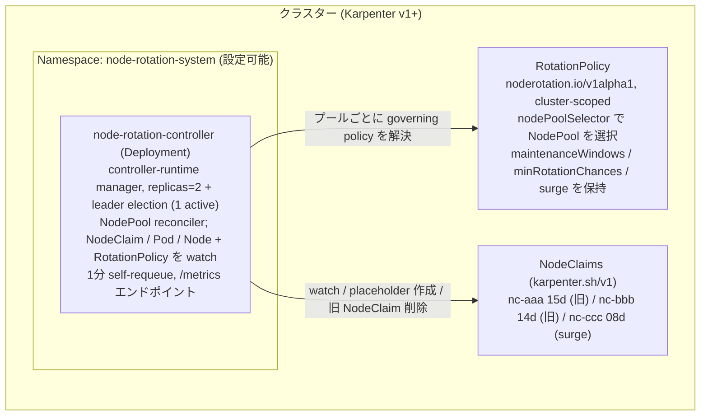
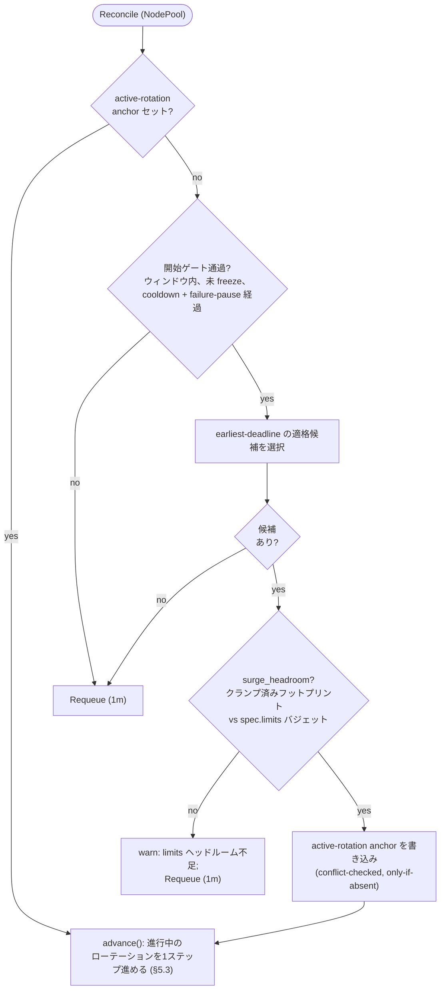
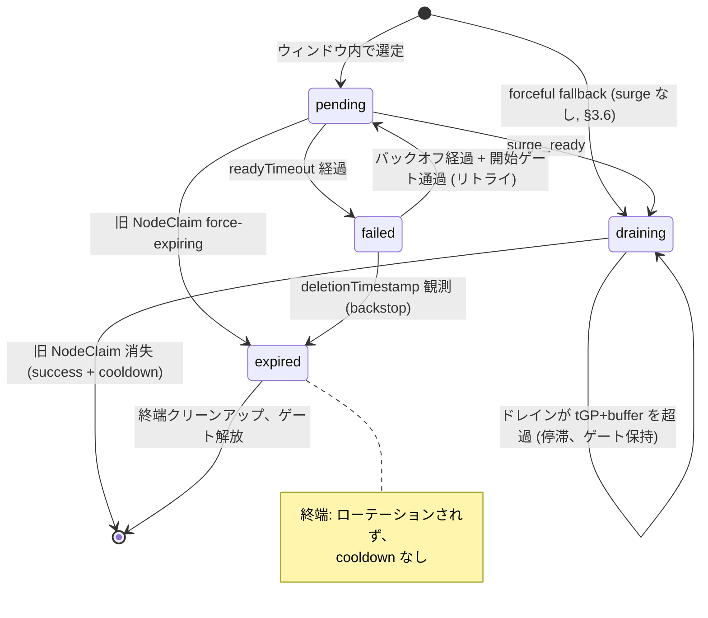

# 5. 実装

## 5.1 アーキテクチャ

::: tip このセクションの定義
コントローラーは controller-runtime マネージャー（Deployment、replicas=2、リーダー選出）であり、NodePool ごとに reconcile し、各パスで governing `RotationPolicy` を解決する。
:::



### ポリシーと状態の分離

- **ポリシー** = `RotationPolicy` spec（オペレーターが作成する望ましい設定）
- **状態** = `NodeClaim`/`NodePool` 上のアノテーション + 一時的な Node/placeholder マーカー（§5.3）
- CRD は権威的なランタイム状態を保持しない — `status` は観測用のみ

### 起動時 preflight

reconcile 開始前に、以下の場合コントローラーは即座に失敗:
- クラスターが `karpenter.sh/v1` の `nodeclaims`/`nodepools` リソースを提供しない
- RBAC がそれらを読み取れない

互換性の契約は `karpenter.sh/v1` **グループ/バージョン** であり、管理された Karpenter マイナーとは独立（EKS Auto Mode はそれを公開しない）。v1 型のデコード成功はワイヤー互換スキーマを確認。フィールドごとの CRD イントロスペクションは行わない。

## 5.2 Reconcile ループ

::: tip このセクションの定義
各 `Reconcile` 呼び出しは **正確に 1 つのノンブロッキングステップ** を実行し `Requeue` を返す。ブロッキング待機なし — すべての状態はアノテーションから読み取られ、再起動を生き延びる。
:::

Reconciler は `NodePool` をキーとし、以下を watch:
- `NodeClaim`（所有 NodePool にマッピング）
- placeholder `Pod` が `Running` に到達
- surge ホスト `Node` が `Ready` に到達

定期的な self-requeue がウィンドウエッジ、freeze 解除、ドレイン進捗、force-expiry の backstop として残る。

### 判断フロー



### 開始ゲート（ステップ 2）

新しいローテーションを開始するには以下のすべてが通過する必要がある:

- `in_window(now)` — メンテナンスウィンドウがオープン
- `not frozen(np)` — freeze アノテーションなし
- `since_last_rotation(np) >= cooldownAfter` — gate A: 成功後の安定化待機
- `since_last_failure(np) >= failurePause` — gate B: 失敗後の一時停止（§4.4、ADR-0004）

### 候補選定（ステップ 3）

`pick_earliest_deadline_eligible` は以下の claim を選定:
- `deletionTimestamp` なし
- `state` が空（新規）または `failed` でエスカレーティングバックオフ経過（`retryBackoff · 2^(retry-count − 1)`、8× で上限）
- `pending`/`draining` は再選定されない; `expired` は終端

### anchor のセマンティクス

`active-rotation` anchor は:
- 開始時にすべての他の副作用 **より前** に書き込み
- 完了/失敗時に **最後** にクリア
- **Conflict-checked, only-if-absent** 書き込み（楽観的並行制御）
- Tick と NodeClaim イベントが同一 NodePool でレース可能 — 前提条件によりレースは無害

### 完了結果

NodePool 側の `active-rotation-state` ミラーにより決定:
- `draining` あり → **success**（cooldown 消費）
- `draining` なし → **expired**（アラート、cooldown なし）

### force-expiry の検出

2 つのパスで捕捉:
- **早期:** `pending` のまま `deletionTimestamp` 出現 — すべてに先行してチェック
- **後期:** `draining` ミラーなしで旧 NodeClaim 消失

早期パスは anchor 解放前に `state=expired` を書き込む（Auto Mode の `tGP = 24h` 下でのライブロック防止）。

### ドレイン停滞

`tGP + buffer` を超えるドレインは `noderotation_drain_stuck` を発生させるが **シリアルゲートを保持** — `draining` のローテーションはロールバック不可（delete 済み）、ゲート解放は `maxUnavailable = 1` に違反する。

### cooldown anchor

`last-rotation-at` は **NodePool** 上に存在（削除された旧 NodeClaim ではない）。一時停止は完了境界とリーダー変更を跨いで永続的。

::: details 完全な擬似コード — クリックで展開

```text
Reconcile(req):
  if req is Tick:
      for np in in_scope_nodepools():
          reconcile_nodepool(np)
      return Requeue(1m)
  return reconcile_nodepool(nodepool(req.obj))

reconcile_nodepool(np):
  # ── 1. 進行中のローテーションを先に駆動（シリアル: NodePool あたり最大 1）
  if name := np[active-rotation]:
      return advance(np, name)

  # ── 2. 開始ゲート
  start_gates(np) :=
      in_window(now) and not frozen(np)
      and since_last_rotation(np) >= cooldownAfter   # gate A
      and since_last_failure(np)  >= failurePause    # gate B
  if not start_gates(np): return Requeue(1m)

  # ── 3. 候補選定、ヘッドルームチェック、anchor
  cand := pick_earliest_deadline_eligible(np)
  if cand == nil: return Requeue(1m)
  surgeless := forceful_fallback(np, cand)
  if not surgeless and not surge_headroom(np, cand):
      warn("insufficient limits headroom"); return Requeue(1m)
  annotate(np, active-rotation=cand.name)    # conflict-checked, only-if-absent
  if surgeless:
      annotate(np, rotation-mode=forceful-fallback,
               active-rotation-state=draining, draining-at=now)
      annotate(cand, state=draining)
      emit_metrics(forceful_fallback); event
      delete(cand)
      return Requeue(30s)
  return advance(np, cand.name)

advance(np, name):
  cand := nodeclaim(name)
  if cand == nil:                            # 旧 NodeClaim ファイナライズ完了
      delete(placeholder(name))
      for node in nodes_with(surge-for=name):
          unfreeze(node)
      if np[active-rotation-state] == draining:
          annotate(np, last-rotation-at=now)
          emit_metrics(success, duration)
      else:
          emit_metrics(expired); alert
      clear(np, anchor)
      return Requeue(1m)

  switch cand.state:
  case (none) | pending:
      if cand.deletionTimestamp != nil:      # force-expiry 捕捉
          delete(placeholder(name))
          for node in nodes_with(surge-for=name): unfreeze(node)
          annotate(cand, state=expired, clear=[started-at, surge-claim])
          emit_metrics(expired); alert
          clear(np, anchor)
          return Requeue(1m)
      annotate(cand, state=pending)
      annotate_once(cand, started-at=now)
      if elapsed(cand.started-at) > readyTimeout:
          reap_surge_claim(cand[surge-claim])
          delete(placeholder(name))
          for node in nodes_with(surge-for=name): unfreeze(node)
          annotate(cand, state=failed, failed-at=now, retry-count+=1,
                   clear=[started-at, surge-claim])
          emit_metrics(failure); alert
          annotate(np, last-failure-at=now, clear=anchor)
          return Requeue(1m)
      freeze(cand.node, surge-for=name)
      cordon(cand.node)
      if c := induced_claim(name):
          annotate(cand, surge-claim=c.name)
      if frozen(np): return Requeue(1m)      # エスカレーション保留
      if placeholder(name) is missing:
          create_placeholder(np, cand)
          return Requeue(30s)
      if surge_ready(cand):
          host := placeholder_node(name)
          freeze(host, surge-for=name)
          annotate(np, active-rotation-state=draining, draining-at=now,
                   surge-wait=now − cand.started-at)
          annotate(cand, state=draining)
          delete(cand)
          return Requeue(30s)
      return Requeue(30s)

  case draining:
      annotate(np, active-rotation-state=draining)
      if cand.deletionTimestamp == nil:      # クラッシュリカバリ
          delete(cand)
          return Requeue(30s)
      if elapsed(cand.deletionTimestamp) > drain_bound(np):
          alert(stuck_drain)
      return Requeue(30s)

  case failed:
      if cand.deletionTimestamp != nil:
          annotate(cand, state=expired)
          emit_metrics(expired); alert
          clear(np, anchor)
          return Requeue(1m)
      if start_gates(np) and elapsed(cand.failed-at) >= escalated_backoff(cand)
         and surge_headroom(np, cand):
          annotate(cand, state=pending)
          return advance(np, name)
      annotate(np, last-failure-at=max(np[last-failure-at], cand.failed-at),
               clear=anchor)
      return Requeue(1m)

  case expired:                              # 終端クリーンアップ
      delete(placeholder(name))
      for node in nodes_with(surge-for=name): unfreeze(node)
      clear(np, anchor)
      return Requeue(1m)
```

:::

### 冪等リカバリ

各状態ハンドラーはフェーズの望ましい状態を **再アサート** する（ワンショットアクションではない）:
- `pending` は各パスで freeze、cordon、placeholder 存在を再アサート
- `draining` は `deletionTimestamp` がない場合に冪等な `delete` を再発行（状態書き込みと delete 間のクラッシュ）

### オブザーバビリティのスキュー（v1 で許容）

- **ミラーから delete 間のギャップ:** そこでのクラッシュ後に force-expiry が発生すると `success` と記録（surge は確保済み — 実質的結果は一致）
- **メトリクス発行:** 完了は anchor クリア前に発行（クラッシュ時 at-least-once）; 失敗は状態書き込み後に発行（クラッシュ時 at-most-once）。`increase(...)` を使用するアラートルールは両方を許容

## 5.3 状態モデル

::: tip このセクションの定義
すべての状態は Kubernetes オブジェクト上に存在 — 外部データストアなし。NodePool の `active-rotation` anchor が **どの** ローテーションが進行中かを記録; 旧 NodeClaim の `state` が **どこ** にあるかを記録。
:::

### アノテーションリファレンス

| キー | ターゲット | 値 | 目的 |
|-----|--------|-------|---------|
| `active-rotation` | NodePool | NodeClaim 名 | 永続 anchor + シリアルゲート |
| `active-rotation-state` | NodePool | `draining` | 完了結果のフェーズミラー |
| `draining-at` | NodePool | RFC3339 | ドレイン所要時間 anchor（§4.2） |
| `surge-wait` | NodePool | Go duration | 完了ログの surge フェーズ所要時間 |
| `rotation-mode` | NodePool | `forceful-fallback` | surge なしパスマーカー |
| `state` | 旧 NodeClaim | `pending`/`draining`/`failed`/`expired` | 進捗状態 |
| `started-at` | 旧 NodeClaim | RFC3339 | `readyTimeout` 期限 |
| `failed-at` | 旧 NodeClaim | RFC3339 | バックオフ anchor |
| `retry-count` | 旧 NodeClaim | 整数 | バックオフをエスカレート |
| `surge-claim` | 旧 NodeClaim | NodeClaim 名 | 誘導された surge の特定 |
| `surge-for` | Pod + freeze ノード | NodeClaim 名 | ローテーションのペアリング |
| `do-not-disrupt` | 旧 + surge ノード | `true` | voluntary disruption をブロック |
| `do-not-disrupt-owned` | 旧 + surge ノード | `true` | コントローラーオーナーシップマーカー |
| `cordoned` | 旧ノード | `true` | コントローラーの cordon マーカー |
| `last-failure-at` | NodePool | RFC3339 | 試行間一時停止 anchor |
| `freeze` | NodePool | RFC3339 | 指定時刻までローテーション抑制 |
| `last-rotation-at` | NodePool | RFC3339 | `cooldownAfter` ゲート anchor |

すべてのキーは `noderotation.io/` プレフィックスを使用（`karpenter.sh/do-not-disrupt` を除く）。

::: details アノテーション詳細 — クリックで展開

- **`active-rotation`:** すべての副作用に先行して書き込み、最後にクリア。旧 NodeClaim の削除を生き延びる（成功時に削除されるため）。`maxUnavailable = 1` のシリアルゲートも兼ねる
- **`active-rotation-state`:** `delete(cand)` の直前に書き込み。不在 = ローテーションが `pending` を離れなかった。旧 NodeClaim 消失後に完了ハンドラーが読み取り
- **`draining-at`:** `pending → draining` で write-once。旧 NodeClaim の `deletionTimestamp` は完了時に消失 — この anchor が必要
- **`surge-wait`:** `pending → draining` で write-once。旧 NodeClaim（`started-at` のキャリア）がその遷移で削除される
- **`rotation-mode`:** forceful-fallback 開始時に anchor にスタンプ。不在 = デフォルト surge。すべての終了パスで anchor とともにクリア
- **`state`:** `expired` は終端 — forceful drain 下でファイナライズ中の claim の再選定をブロック
- **`started-at`:** 試行ごとに write-once。failed 書き込み時にクリア（`state=failed` と単一更新）。リトライ時に再スタンプ
- **`surge-claim`:** placeholder の bind ターゲット（`spec.nodeName`）が観測可能になり次第永続化。failed 書き込み時にクリア
- **`surge-for`:** freeze ノード上で、freeze をこのローテーションに帰属。Pod 上で発見用にペアリング
- **`do-not-disrupt-owned`:** コントローラーが実際に `do-not-disrupt` を適用した場合のみセット。オペレーターの既存アノテーション（マーカーなし）は変更しない
- **`cordoned`:** コントローラーが `spec.unschedulable` をフリップした場合のみセット。オペレーターの cordon（マーカーなし）は採用しない
- **`last-failure-at`:** クラッシュリカバリブランチで `max` セマンティクスにより一時停止の無効化を防止

:::

### 状態遷移



::: details 遷移の副作用 — クリックで展開

| From | イベント | To | 副作用 |
|------|-------|----|--------------|
| *(none)* | ウィンドウ内で選定 | `pending` | anchor 書き込み（最初）; 旧ノード freeze; 旧ノード cordon; placeholder 作成 |
| *(none)* | forceful fallback | `draining` | anchor + `rotation-mode` + `draining-at` 書き込み; `state=draining`; 旧 NodeClaim 削除（surge なし） |
| `pending` | 各 reconcile | `pending` | freeze + cordon 再アサート; `surge-claim` 永続化; placeholder 再作成（freeze 中は保留） |
| `pending` | `surge_ready` | `draining` | surge ターゲット freeze; `draining-at` + `surge-wait` 書き込み; 旧 NodeClaim 削除 |
| `pending` | `readyTimeout` | `failed` | surge claim reap; placeholder 削除; unfreeze; `state=failed` + `last-failure-at`; anchor クリア |
| `pending` | force-expiring | `expired` | placeholder 削除; unfreeze; `state=expired`; expired 発行; anchor クリア |
| `draining` | `deletionTimestamp` なし | `draining` | delete 再発行（クラッシュリカバリ） |
| `draining` | ドレイン > `tGP + buffer` | `draining` | stuck-drain ゲージ; ゲート保持 |
| `draining` | NodeClaim 消失 | *(success)* | unfreeze; `last-rotation-at`; success 発行; anchor クリア |
| `failed` | バックオフ + ゲート通過 | `pending` | `state` リセット; 新試行で `started-at` 再スタンプ |
| `failed` | `deletionTimestamp` | `expired` | `state=expired`; expired 発行; anchor クリア |
| `expired` | まだ anchor あり | `expired` | 冪等クリーンアップ; anchor クリア（メトリクスは再発行しない） |

:::

### anchor のクリア

`clear(np, anchor)` はローテーションスコープのセット全体を削除する **単一更新**:
- `active-rotation`, `active-rotation-state`, `draining-at`, `surge-wait`, `rotation-mode`

コンパニオンフィールドがローテーションを超えて存続することはない。失敗パスは同じ更新に `last-failure-at` も追加で書き込む。

### 起動時 sweep

**最初の reconcile の前にゲートされ、1 回だけ** 実行。anchor が参照しないマーカーのみをクリーン:

- **Placeholder Pod** — `surge-for` の claim が不在/非 anchor → 削除
- **ノードマーカー**（`surge-for`、コントローラーの `do-not-disrupt`（owned マーカーによる））→ 削除
- **`cordoned` マーカー** — anchor なしのローテーション → uncordon して削除

ルール:
- anchor がある NodePool は **陳腐化していない** — ステップ 1 が通常通り再開
- `failed`/`expired` claim はアノテーションを保持（バックオフ再入 / 終端マーカー）
- anchor なしの `pending`/`draining` claim（クラッシュポイントからは不可能）→ `failed` に設定 + アラート
- anchor なしの孤立 `active-rotation-state` → 単純に削除
- ベストエフォート: アイテムごとのエラーはログ、fatal にしない

## 5.4 設定スキーマ

::: tip このセクションの定義
`RotationPolicy` CRD（cluster-scoped、`v1alpha1`）が NodePool ごとのローテーション設定を保持。コントローラーはセレクタの specificity で各 NodePool の governing policy を解決する。
:::

### RotationPolicy CRD（`noderotation.io/v1alpha1`）

```yaml
apiVersion: noderotation.io/v1alpha1
kind: RotationPolicy
metadata:
  name: api                       # cluster-scoped; ポリシーごとに 1 つ
spec:
  nodePoolSelector:               # governed NodePool を選択
    matchLabels:
      workload: api
  ageThreshold: auto              # "auto"（導出、§3.2）または Go duration オーバーライド
  minRotationChances: 2           # K; 下限 1
  maintenanceWindows:             # ポリシーごと; 和集合セマンティクス（§3.1）
    - timezone: Asia/Tokyo
      days: [Wed, Sat]
      start: "02:00"
      end:   "06:00"
  surge:
    maxUnavailable: 1             # v1 では 1 固定（OpenAPI が他を拒否）
    readyTimeout: 15m             # > 0 必須
    cooldownAfter: 10m            # gate A; 0 も可
    # failurePause: 10m           # gate B; 未設定 → max(10m, cooldownAfter)
    # drainEstimate: 10m          # layer-2 のみ; 未設定 → min(tGP, 10m)
    # provisioningEstimate: 5m    # layer-2 のみ; 未設定 → min(readyTimeout, 5m)
    retryBackoff: 30m             # > 0 必須
    matchNodeRequirements:        # placeholder 要件の複製（§3.7）
      required:
        - topology.kubernetes.io/zone
        - kubernetes.io/arch
        - karpenter.sh/capacity-type
      preferred: []
    forcefulFallback:             # オプトイン surge なしフォールバック（§3.6）
      enabled: false
  prePull:                        # v2（v1 では無効）
    enabled: false
status:
  observedGeneration: 3
  matchedNodePools: 2
  rotatingNodePools: 1
  conditions:
    - type: Ready
      status: "True"
      reason: Accepted
```

### status サブリソース

- **`matchedNodePools`:** このポリシーがセレクタ specificity で勝利するプール数
- **`rotatingNodePools`:** そのうち進行中のローテーションがある数
- **`Ready` condition:**
  - `Accepted` — 有効かつ競合なし
  - `Invalid` — reconcile 時バリデーション失敗
  - `Conflict` — 同一 specificity タイ（§下記）
- `Invalid` が `Conflict` に優先
- status は観測用のみ — ローテーション判断の権威的ソースではない

専用の `RotationPolicyStatusReconciler` がこのビューを更新。楽観的並行制御の競合はサイレント requeue として扱う。

### ターゲティングと競合解決

| ルール | 動作 |
|------|----------|
| 最も specific が勝利 | Specificity = ラベルキー制約数 |
| 同一 specificity タイ | **ハードエラー** — その NodePool のローテーションを拒否 |
| ポリシーなし | ローテーションしない（安全な no-op） |

- **Specificity:** `matchLabels` エントリ + `matchExpressions` エントリ。空（catch-all）セレクターはスコア 0 — 任意のキー付きセレクターに負ける
- **タイ:** `PolicyConflict` Warning Event + `noderotation_policy_conflict{nodepool} = 1` をセット
- **マッチなし:** 暗黙のデフォルトなし; ブランケットカバレッジが必要ならオペレーターが catch-all を作成

### ローテーション中のガバナンス喪失

ローテーションが anchor されている間にプールのガバナンスが失われた場合、コントローラーは **ロールバック**:
- placeholder 削除
- ノードの unfreeze（オペレーター独自の保護は維持）
- anchor クリア
- `GovernanceLost` Warning Event 発行

孤立した placeholder と陳腐化した `do-not-disrupt` マーカーが Karpenter の voluntary 操作を無期限にブロックするのを防止。

### ポリシー変更の伝播

任意の `RotationPolicy` の create/update/delete は **すべての** NodePool を再解決のために再エンキュー（1 つの変更が任意のプールでどのポリシーが勝利するかを変更しうるため）。

### NodePool ごとのメンテナンスウィンドウ

`maintenanceWindows` は各ポリシーに存在するため、ウィンドウは NodePool ごと。和集合セマンティクス（§3.1）は 1 つのポリシーのリスト内で適用。`noderotation_window_active` と `noderotation_window_period_seconds` がロードベアリングな `nodepool` ラベルを持つ理由（§4.2）。