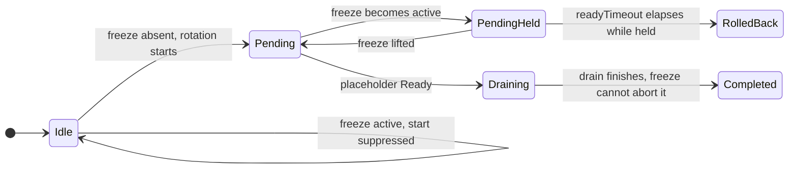
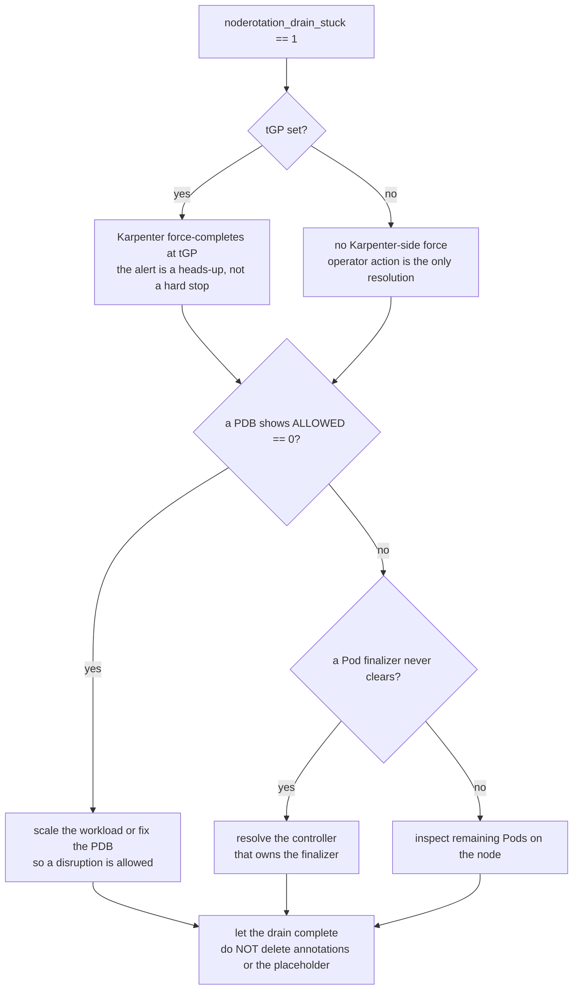

# Production runbook

Operational guidance for running `node-rotation-controller` on a real cluster.
The [specification](specification/) is the source of truth for *why* the
controller behaves as it does; this runbook is the operator-facing *how*. Every
section links back to the relevant spec section.

Japanese translation: [docs/ja/runbook.md](ja/runbook.md).

> The controller is pre-1.0. EKS Auto Mode PoC runs have validated the core surge
> path, but edge cases and a full multi-hour tight-race soak remain open (see
> [§7.2 validated assumptions](specification/07-risks.md#72-validated-assumptions)). Treat
> this runbook as the starting point for a production rollout, not a guarantee.

> **Responding to an incident right now?** Start at
> [§7 Troubleshooting: symptom-based index](#7-troubleshooting-symptom-based-index) —
> it maps each observable symptom to the metric/event that confirms it and the
> section that fixes it.

## Contents

1. [Per-AZ surge headroom for zonal-PV workloads](#1-per-az-surge-headroom-for-zonal-pv-workloads)
2. [Calibrating the drain: `drainEstimate` vs `terminationGracePeriod`](#2-calibrating-the-drain-drainestimate-vs-terminationgraceperiod)
3. [Interpreting the `noderotation_*` metrics](#3-interpreting-the-noderotation_-metrics)
4. [The freeze workflow](#4-the-freeze-workflow)
5. [Handling a stuck drain](#5-handling-a-stuck-drain)
6. [Alerting (PrometheusRule)](#6-alerting-prometheusrule)
7. [Troubleshooting: symptom-based index](#7-troubleshooting-symptom-based-index)
8. [Upgrading and rolling back the controller](#8-upgrading-and-rolling-back-the-controller)
9. [Sizing the controller at scale (Pod cache)](#9-sizing-the-controller-at-scale-pod-cache)

---

## 1. Per-AZ surge headroom for zonal-PV workloads

**Applies to:** any NodePool that fronts workloads bound to a **zonal**
PersistentVolume — EBS `gp3`/`io2`, or any PV whose `nodeAffinity` carries a
`topology.kubernetes.io/zone` constraint.

**Why it matters.** Surge is make-before-break: the controller adds a
replacement node *before* draining the old one. For zonal-PV workloads the
replacement node is **pinned to the candidate's AZ** so the existing volume can
re-attach — `topology.kubernetes.io/zone` is in the default `required` set of
`surge.matchNodeRequirements`
([§3.3 *Stateful and zonal workloads*](specification/03-design.md#33-surge-sequence-v1)).
The controller cannot and does not migrate zonal storage across AZs.

The consequence is a **hard constraint**: a same-AZ capacity shortage **cannot
fall back to another zone**. If the candidate's AZ has no schedulable capacity
for a same-zone replacement, the surge cannot complete. The placeholder Pod
never goes `Running`, `readyTimeout` fires, and the rotation rolls back to the
`expireAfter` baseline ([§3.3 *Rollback behavior*](specification/03-design.md#33-surge-sequence-v1)).
Repeated same-AZ shortages surface as an escalating `noderotation_retry_count`
(risk [R3](specification/07-risks.md#71-risks)).

**Guidance.** For each NodePool fronting zonal-PV workloads, **keep one node's
worth of surge headroom per in-use AZ**:

- Ensure the NodePool's `requirements` permit **every in-use AZ** (do not narrow
  `topology.kubernetes.io/zone` to a single zone if your volumes span zones).
- Size the NodePool `spec.limits` resource budget so that, in *each* AZ, there
  is room for one additional node beyond the steady-state footprint. The
  controller pre-checks pool-wide `limits` headroom before starting a rotation
  (§5.2 step 3), but `limits` is a **pool-wide resource budget, not a per-AZ
  count** — it cannot express "one spare node in `us-east-1a`". Per-AZ headroom
  is therefore the operator's responsibility.
- Confirm the underlying provider has capacity (and that any EC2 vCPU quota
  leaves room) in **each** AZ the workload uses, not just in aggregate.
- Where the cloud provider supports it, consider a capacity reservation in each
  in-use AZ for the surge node's instance shape.

**How to detect a shortfall.** A same-AZ shortage manifests as
`readyTimeout`-driven rollbacks (a `failure` outcome on
`noderotation_completed_total`) and a climbing `noderotation_retry_count`
(alert: `NodeRotationRetryCountHigh`, see [§6](#6-alerting-prometheusrule)). When
that alert fires for a zonal-PV NodePool, suspect a per-AZ capacity gap first.

---

## 2. Calibrating the drain: `drainEstimate` vs `terminationGracePeriod`

**Applies to:** any NodePool whose layer-2 throughput forecast (`C`) looks too
low, and EKS Auto Mode NodePools specifically (where the stock
`terminationGracePeriod` (`tGP`) default is `24h`).

**Why it matters.** Two different durations are easy to conflate:

- `surge.drainEstimate` — how long a **healthy, PDB-respecting drain actually
  takes**, and `surge.provisioningEstimate` — how long a **healthy surge
  provisioning** (candidate → new node `Ready`) actually takes. These are the two
  **throughput knobs**. The controller forecasts capacity from their sum: the
  expected rotation service time is
  `t_rot_est = provisioningEstimate + drainEstimate` (ADR-0003), and a window of
  duration `D` admits `C = ceil(D / (t_rot_est + cooldownAfter))` serial rotation
  starts ([§3.2 layer 2](specification/03-design.md#32-candidate-selection)).
  Unset, `drainEstimate` defaults to `min(tGP, 10m)` and `provisioningEstimate` to
  `min(readyTimeout, 5m)`. Neither carries a deadline term or `buffer` — those
  belong to the safety bound `t_rot`.
- `terminationGracePeriod` — the deadline at which Karpenter **force-completes** a
  drain, killing whatever pods have not yet drained. It is a **safety bound**, not
  a throughput input, and it no longer appears in `C` at all. `readyTimeout` is the
  analogous deadline for the provisioning phase (the surge is abandoned there) and
  likewise does not appear in `C`.

Before #212 the model budgeted the full `tGP` in `C`, so on stock Auto Mode
(`tGP = 24h`, `t_rot ≈ 24h17m`) a 4-hour window computed `C = 1` — and the apparent
remedy was to lower `tGP`. That is no longer how throughput is raised. With the
default `provisioningEstimate = min(15m, 5m) = 5m` and `drainEstimate = min(24h, 10m) = 10m`,
`t_rot_est = 15m`, so the same 4-hour window now computes
`C = ceil(4h / (15m + 10m)) = 10` regardless of `tGP`.

**Raising throughput.** `C` is forecast from `surge.provisioningEstimate` and
`surge.drainEstimate` (expected healthy provision and drain), not from
`readyTimeout` or `terminationGracePeriod` (the abandon/force-kill deadlines). If
`C` looks too low, set each estimate to your cluster's real time — read the drain
off `noderotation_duration_seconds{phase="drain"}` and the provision off
`{phase="surge_wait"}`. Do **not** lower `terminationGracePeriod` to make a
throughput warning go away. It no longer raises
`C` at all; it reaches only `ThroughputBelowArrival`, and only indirectly, by
lengthening `A` (and under an explicit `ageThreshold` override, not even that).
What it does do is shorten the window a genuinely slow, PDB-respecting drain gets
before Karpenter force-kills its pods. `terminationGracePeriod` is chosen from the
downtime you can tolerate in an incident, not from the drain times you observe in
normal operation — the observations do not contain the tail it exists to cover.

> **Near-continuous schedules warn too.** `RotationSpansNextWindow` fires on any
> closed interval shorter than `t_rot_est + cooldownAfter`, however small — a daily
> `00:00`–`23:59` window closes for one minute at each midnight, and a rotation
> genuinely does hold the gate across it. The warning is correct, but on such a
> schedule the amount by which `K · C` overstates capacity is tiny. If you mean
> 24/7, write `00:00`–`24:00`: that union never closes, so there is no next
> occurrence to carry into and the check does not apply.

If a `RotationSpansNextWindow` warning is the symptom, the remedies, in order,
are: space the window occurrences further apart; lower `cooldownAfter`; correct
`provisioningEstimate` or `drainEstimate` if either over-states the real phase.
Lowering `tGP` does **not** help — the predicate is evaluated on `t_rot_est`,
which no longer contains it.

> **`cooldownAfter` is the post-success settle only.** Lowering it to reclaim window
> throughput is safe: it no longer shortens the post-failure pause, which is the
> separate `surge.failurePause` (ADR-0004). `cooldownAfter` may even be `0` when PDBs
> already serialize drains (an Eviction with `maxUnavailable` blocks the next node's
> eviction until the drained node's replacement is `Ready`). The failure pause bounds
> candidate cycling under a systematic cause and defaults to `max(10m, cooldownAfter)`,
> so it never silently follows `cooldownAfter` down — raise `failurePause` to harden it
> without touching throughput.

**Still reasons to lower `tGP`.** Lowering `terminationGracePeriod` remains a
legitimate operational choice, just not for throughput:

- **It lengthens `A` (`ageThreshold`).** `tGP` sits inside the deadline bound
  `t_rot = readyTimeout + tGP + buffer`, so a smaller `tGP` derives a larger `A` —
  nodes rotate later, reducing churn — and because `ThroughputBelowArrival`
  compares `C·A` against `N·P`, it *indirectly* relaxes that one check. Under an
  explicit `ageThreshold` override even that path closes.
- **It relaxes the Auto Mode 21-day hard cap** (`E + tGP ≤ 21d`,
  [§1.1](specification/01-overview.md#11-background)). `tGP = 1h` admits `expireAfter` up to
  ~`20d`, which is exactly the headroom needed to satisfy the lead-time
  derivation for sparser (e.g. weekly) windows.
- **It tightens the stuck-drain bound.** `noderotation_drain_stuck` fires at
  `tGP + buffer`, so a lower `tGP` surfaces a wedged drain sooner (see
  [§5](#5-handling-a-stuck-drain)).

**Trade-off.** Pick `terminationGracePeriod` from the downtime you can tolerate in
an incident — long enough that a genuinely slow, PDB-respecting drain finishes
voluntarily, short enough that the 21-day cap and stuck-drain bound behave. Pick
`drainEstimate` from how long a healthy drain actually *takes*. They are different
numbers; conflating them is what made `C` unusable before.

> If `tGP` is unset (self-managed Karpenter allows nil), the drain is unbounded
> by Karpenter; the controller substitutes a fixed fallback bound (e.g. `1h`) for
> the stuck-drain alert and the deadline bound `t_rot`
> ([§3.2 layer-1 `TGPUnset` warning](specification/03-design.md#32-candidate-selection)).
> An explicit `drainEstimate` is then used as-is — there is no deadline to clamp
> it against.

---

## 3. Interpreting the `noderotation_*` metrics

Exposed on `/metrics` ([§4.2](specification/04-operations.md#42-observability)). Names and
labels below are the **exact** strings emitted by the controller. Per-NodePool
series are **cleared when the NodePool is deleted** — and likewise when a pool
loses its governing `RotationPolicy` (no policy matches it any longer) — so a pool
that stops reconciling does not latch its last value forever.

| Metric | Type | Labels | Read it as |
|--------|------|--------|------------|
| `noderotation_candidates` | Gauge | `nodepool` | Eligible NodeClaims awaiting rotation. **Should trend to 0** inside/after each window. Stuck > 0 across two windows → controller is falling behind ([R2](specification/07-risks.md#71-risks)). |
| `noderotation_in_progress` | Gauge | `nodepool` | Active rotations (0 or 1 in v1 — serial per pool). |
| `noderotation_completed_total` | Counter | `nodepool`, `outcome` | Cumulative completions. `outcome ∈ {success, failure, expired}`. `expired` = the old node was **force-expired before** a graceful rotation finished (the lead-time race was lost — [§3.5](specification/03-design.md#35-backstop-behavior)); it is never counted as `success`. |
| `noderotation_duration_seconds` | Histogram | `nodepool`, `phase` | Per-phase latency. `phase ∈ {surge_wait, drain}`. Rising `surge_wait` ≈ slow/failing provisioning; rising `drain` ≈ slow eviction. |
| `noderotation_window_active` | Gauge | `nodepool` | `0/1` window membership for the pool's **governing-policy** maintenance window. Per-NodePool, since each pool resolves its own `RotationPolicy` window ([§5.4](specification/05-implementation.md#54-configuration-schema)). |
| `noderotation_policy_conflict` | Gauge | `nodepool` | `0/1`. `1` = the pool is **blocked from rotating** by a `RotationPolicy` conflict — an equal-specificity selector tie or a runtime-invalid governing policy ([§5.4](specification/05-implementation.md#54-configuration-schema)). Resolve the overlap (or fix the policy); the pool also emits a `PolicyConflict` Warning event. |
| `noderotation_freeze_until_timestamp` | Gauge | `nodepool` | Unix timestamp of the active freeze (`0` = no freeze). Non-zero → rotation is **deliberately suppressed** (see [§4](#4-the-freeze-workflow)). |
| `noderotation_age_threshold_seconds` | Gauge | `nodepool` | The derived `ageThreshold` `A` ([§3.2](specification/03-design.md#32-candidate-selection)). Varies per pool. |
| `noderotation_rotation_chances` | Gauge | `nodepool` | Guaranteed rotation chances `G` for the derived threshold. With auto-derivation `G = K`; an override may lower it (and is validated). |
| `noderotation_window_period_seconds` | Gauge | `nodepool` | Worst-case window period `P`. Identical across pools in v1 (window is cluster-wide); the `nodepool` label is forward-looking. |
| `noderotation_short_lead_nodes` | Gauge | `nodepool` | NodeClaims whose **own** stamped `expireAfter` can no longer guarantee `K` chances ([§3.2 layer 3](specification/03-design.md#32-candidate-selection)). Rotated best-effort; may reach Forceful Expiration. |
| `noderotation_drain_stuck` | Gauge | `nodepool` | `0/1`: the in-flight drain exceeded `tGP + buffer`. `1` → operator action needed ([§5](#5-handling-a-stuck-drain)). |
| `noderotation_retry_count` | Gauge | `nodepool` | Highest `noderotation.io/retry-count` across the pool's NodeClaims (`0` when none). `≥ 3` → a **systematic** failure (sustained preemption or same-AZ shortage, [R3](specification/07-risks.md#71-risks)). |

**Warning Events.** Non-fatal findings are *also* surfaced as Kubernetes
`Warning` Events on the NodePool / NodeClaim
([§4.2](specification/04-operations.md#42-observability)), so `kubectl describe nodepool <name>`
shows them without a metrics stack. Reasons include `KBelowTwo`,
`AVeryAggressive`, `TGPUnset`, `HardCapExceeded`, `DrainEstimateAboveTGP`,
`ThroughputBelowArrival`, `ThroughputBurstShortfall`, `RotationSpansNextWindow`,
`OverrideGBelowK`, and `ShortLead`.

**Judging reconcile liveness — use the metrics, not the warning log.** Both the
Warning Events *and* the `INFO`-level warning **log** lines are deduplicated on
the transition into a condition, so in steady state — stable findings, no
transitions — a perfectly healthy reconcile loop can run for many passes
emitting **zero** log lines. **Do not** read "no recent warning log line" as
"reconcile stalled" (a real past mis-diagnosis). Judge liveness from the
controller-runtime metrics on `/metrics`, which tick on **every** pass:

- `controller_runtime_reconcile_total{controller="rotation"}` — increments per
  reconcile; a rising `rate()` means the loop is alive.
- `controller_runtime_reconcile_time_seconds_count{controller="rotation"}` — same
  per-pass count, via the latency histogram.
- `workqueue_*` (e.g. `workqueue_adds_total`, `workqueue_depth`,
  `workqueue_work_duration_seconds_*` for `name="rotation"`) — queue activity and
  backlog.

To *see* per-pass activity in the log while debugging, raise the controller's log
verbosity (`--zap-devel`, or a higher `-v`). At debug verbosity (`V(1)`) the
controller additionally emits, **un-deduplicated, every pass**, the current
findings and a lightweight `reconcile` heartbeat line (phase, candidate count,
claim count, in-window, findings count). This is additive debug visibility only —
it does not change the dedup of the `INFO` log or the Warning Events, nor any
metric.

**Surge-less forceful fallback.**

- **Behavior.** When `surge.forcefulFallback.enabled` is set on the governing RotationPolicy, a candidate that cannot complete a graceful surge before its own deadline (`deadline − now < t_rot`) is rotated **surge-less**: the controller deletes the old `NodeClaim` in-window without provisioning a surge node, draining it via Karpenter's voluntary path so PDBs still apply (spec §3.3).
- **Signals.** Each such rotation increments `noderotation_forceful_fallback_total{nodepool}` and emits a `ForcefulFallback` Warning Event on the NodePool (`kubectl describe nodepool <name>`); the in-flight rotation also carries the `noderotation.io/rotation-mode=forceful-fallback` annotation on the NodePool.
- **Remediation.** A rising `noderotation_forceful_fallback_total` means graceful surges are repeatedly losing the race to the deadline (`deadline − now < t_rot`) — widen the maintenance window; lower `terminationGracePeriod`, which shrinks `t_rot` directly, the deadline-race predicate itself (see [§2](#2-calibrating-the-drain-drainestimate-vs-terminationgraceperiod) for the trade-off); reduce the synchronized node count flagged by `ThroughputBurstShortfall`. `surge.provisioningEstimate` and `surge.drainEstimate` do **not** help here — they feed only the layer-2 throughput forecast `t_rot_est`, never the deadline race.

---

## 4. The freeze workflow

**Purpose.** Suppress rotation of a single NodePool until a chosen time — e.g. a
business-critical period — without uninstalling the controller or losing the
`expireAfter` backstop.

**Mechanism.** Set the freeze annotation on the **NodePool**, with an RFC3339
timestamp value ([§3.1](specification/03-design.md#31-maintenance-window)):

```sh
kubectl annotate nodepool <name> \
  noderotation.io/freeze='2026-12-31T23:59:59Z' --overwrite
```

While the freeze is in effect the controller:

- **does not start** new rotations on that pool;
- **holds an in-flight rotation that is still `pending`** — the drain has not
  begun, so pausing is safe; placeholder (re)creation and the `pending →
  draining` transition are suspended;
- **keeps passive bookkeeping running** (re-asserting the protective
  `do-not-disrupt`/cordon markers, persisting the surge-claim identity), so a
  freeze never weakens the crash-recovery guarantees;
- **lets a rotation already in `draining` run to completion** — a drain cannot
  be safely aborted mid-flight.

If a freeze outlasts `readyTimeout`, the held `pending` attempt simply rolls
back through the normal failure path. `noderotation_freeze_until_timestamp`
reports the active freeze (`0` = none).

How the freeze gate acts on a rotation depends on the phase it is in when the
freeze takes effect — a `pending` attempt is held, a `draining` one is allowed
to finish:



**Manage it via GitOps, not ad hoc** (risk [R5](specification/07-risks.md#71-risks)). A
forgotten ad-hoc freeze silently disables rotation for the pool until its
timestamp passes; the backstop still bounds node age at `expireAfter`, but the
graceful path is off. Declare the freeze in your GitOps repo so it is visible in
review and **expires when removed from source**, not when someone remembers to
unset it. To lift early:

```sh
kubectl annotate nodepool <name> noderotation.io/freeze- # remove the annotation
```

---

## 5. Handling a stuck drain

**Symptom.** `noderotation_drain_stuck == 1` for a NodePool (alert:
`NodeRotationDrainStuck`).

**Meaning.** The in-flight rotation entered `draining` (the controller already
deleted the old NodeClaim, so Karpenter is draining the node via the voluntary,
PDB-respecting path), and the drain has now exceeded `tGP + buffer`
([§5.2](specification/05-implementation.md#52-reconcile-loop)). The gauge is recomputed from live
state every reconcile, so it **clears on its own** the moment the drain finishes.

**Important — the serial gate is held on purpose.** A `draining` rotation
**cannot be rolled back** (the old NodeClaim already carries a
`deletionTimestamp`), and the controller deliberately **does not start a second
rotation** while this one is stuck — releasing the per-NodePool gate would
disrupt a second node while the first is half-drained, violating
`surge.maxUnavailable = 1`. So a stuck drain **blocks all rotation for that
NodePool** until it clears. Other NodePools are unaffected.

**Remediation is operator-side.** Almost always the blocker is a **PDB that
cannot be satisfied** or a **stuck finalizer** on a Pod. The decision flow:



Working through it concretely:

1. Find the draining node and the NodeClaim:

   ```sh
   kubectl get nodeclaim -l karpenter.sh/nodepool=<name> \
     -o wide | grep -i terminating
   kubectl get node <node> -o yaml | grep -A3 deletionTimestamp
   ```

2. Find what is blocking eviction:

   ```sh
   # Pods still on the node
   kubectl get pods --all-namespaces \
     --field-selector spec.nodeName=<node> -o wide
   # PDBs and their allowed disruptions
   kubectl get pdb --all-namespaces \
     -o custom-columns=NS:.metadata.namespace,NAME:.metadata.name,ALLOWED:.status.disruptionsAllowed,CURRENT:.status.currentHealthy,DESIRED:.status.desiredHealthy
   ```

   A PDB with `ALLOWED = 0` is the usual culprit — the workload has too few
   healthy replicas to give one up. **Fix the PDB or the workload** (scale up so
   the PDB allows a disruption, or correct a `minAvailable`/`maxUnavailable`
   that can never be met), rather than the controller.

3. For a **stuck finalizer**, identify the Pod whose `metadata.finalizers` never
   clears and resolve the controller that owns that finalizer.

4. **When `tGP` is set**, Karpenter ultimately **force-completes the drain** at
   `tGP` regardless — so a stuck drain self-resolves within `tGP`, and the
   stuck-drain alert is a heads-up that a *graceful* drain is not finishing, not
   that the node is stuck forever. This is the practical reason to keep `tGP`
   bounded ([§2](#2-calibrating-the-drain-drainestimate-vs-terminationgraceperiod)). **When `tGP` is
   unset** (self-managed Karpenter), there is **no Karpenter-side force** — a
   blocking PDB or stuck finalizer can hold the drain indefinitely, so operator
   action is the only resolution.

Do **not** attempt to "unstick" the rotation by deleting the controller's
annotations or the placeholder — the rotation resumes from the NodePool anchor
([§5.2](specification/05-implementation.md#52-reconcile-loop)) and the handlers are idempotent.
Fix the underlying PDB/finalizer and let the drain complete.

---

## 6. Alerting (PrometheusRule)

The Helm chart ships an **optional** `PrometheusRule` with the seven
[§4.2](specification/04-operations.md#42-observability) alerts. It is **off by default** (so
existing installs and clusters without the Prometheus Operator are unaffected).
Enable it with:

```sh
helm upgrade --install rot charts/node-rotation-controller \
  --set prometheusRule.enabled=true
```

| Alert | Expression | Means |
|-------|------------|-------|
| `NodeRotationCompletedFailureOrExpired` | `increase(noderotation_completed_total{outcome=~"failure\|expired"}[1h]) > 0` | A rotation failed or a node was force-expired in the last hour. |
| `NodeRotationCandidatesNotDraining` | `min_over_time(noderotation_candidates[<2·P>]) > 0 and noderotation_candidates offset <2·P> > 0` | Candidates have not cleared across two consecutive windows ([R2](specification/07-risks.md#71-risks)). The `offset` guard keeps a freshly created non-zero series from alerting before two windows of history exist. |
| `NodeRotationStalledInWindow` | window active **and** candidates `> 0` **and** zero completions | Rotation is wedged inside the maintenance window. |
| `NodeRotationDrainStuck` | `noderotation_drain_stuck == 1` | Drain blocked past `tGP + buffer` — see [§5](#5-handling-a-stuck-drain). |
| `NodeRotationShortLeadNodes` | `noderotation_short_lead_nodes > 0` | NodeClaims whose stamped `expireAfter` can no longer guarantee `K` chances. |
| `NodeRotationRetryCountHigh` | `noderotation_retry_count >= 3` | The same rotation keeps failing — systematic cause ([R3](specification/07-risks.md#71-risks)). |
| `NodeRotationForcefulFallback` | `increase(noderotation_forceful_fallback_total[1h]) > 0` | A graceful surge lost the race to a node's deadline and the rotation went surge-less ([ADR-0001](reference/adr/0001-window-bounded-forceful-fallback.md)). Ships at `severity: info`, because a single fallback is the designed outcome; see [§3](#3-interpreting-the-noderotation_-metrics) for remediation. |

**Tune the schedule-dependent ranges.** Two alerts depend on your window
period `P` and window duration `D`; their ranges are **chart values**, not
hard-coded:

- `prometheusRule.candidatesNotDraining.windowRange` — set to roughly **two
  window periods** (`2·P`). The default `8d` matches a `{Wed, Sat}` schedule
  (`P = 4d`). For a weekly window (`P = 7d`) raise it to `14d`.
- `prometheusRule.stalledInWindow.completionRange` — set to roughly a **full
  window duration** (`D`). The default `4h` matches a `02:00–06:00` window.

Each alert's `for` and `severity` are also configurable (see
[`values.yaml`](../charts/node-rotation-controller/values.yaml)). The
`min_over_time`/`increase` ranges intentionally avoid Prometheus subqueries so
the rules stay cheap; widen the recording window rather than nesting a subquery
if you change the schedule substantially.

---

## 7. Troubleshooting: symptom-based index

The sections above are organized by *cause*. This table inverts them: start from
the **symptom you observe**, confirm it with the listed **signal** (a metric, a
`Warning` Event, or an alert from [§6](#6-alerting-prometheusrule)), then jump to
the section that fixes it. The signal strings are the exact ones from
[§3](#3-interpreting-the-noderotation_-metrics).

| Symptom (what you see) | Confirm with | Likely cause | Go to |
|------------------------|--------------|--------------|-------|
| Surge node never appears; the placeholder Pod stays `Pending` and rotations end in `failure` | `noderotation_duration_seconds{phase="surge_wait"}` climbing; `noderotation_completed_total{outcome="failure"}` | No schedulable **same-AZ** capacity for the replacement (zonal-PV pin) | [§1](#1-per-az-surge-headroom-for-zonal-pv-workloads) |
| `noderotation_candidates` never trends to `0` across two windows | `NodeRotationCandidatesNotDraining` ([R2](specification/07-risks.md#71-risks)) | Throughput too low for the window, **or** rotation wedged for one of the causes below | [§2](#2-calibrating-the-drain-drainestimate-vs-terminationgraceperiod), then scan the rows below |
| `ThroughputBurstShortfall` warning on **every** window | `ThroughputBurstShortfall` Warning Event | `K · C` is smaller than the pool's node count — the window is too short (or `provisioningEstimate`/`drainEstimate` over-stated) to rotate a synchronized batch before its shared deadline | [§2](#2-calibrating-the-drain-drainestimate-vs-terminationgraceperiod) |
| `RotationSpansNextWindow` warning | `RotationSpansNextWindow` Warning Event | `t_rot_est + cooldownAfter` exceeds the interval the window stays closed, so the forecast predicts a rotation started near an occurrence's close runs into the next occurrence as it opens, and `K · C` must be read as an upper bound | [§2](#2-calibrating-the-drain-drainestimate-vs-terminationgraceperiod) |
| A drain hangs past `tGP + buffer` | `noderotation_drain_stuck == 1`; `NodeRotationDrainStuck` | Unsatisfiable PDB or a stuck Pod finalizer | [§5](#5-handling-a-stuck-drain) |
| `noderotation_in_progress` stuck at `1` with no new completions | `NodeRotationStalledInWindow` | Either the surge is not coming up (→ §1) or the drain is stuck (→ §5) | [§1](#1-per-az-surge-headroom-for-zonal-pv-workloads) / [§5](#5-handling-a-stuck-drain) |
| A NodePool never rotates; candidates frozen and no rotation starts | `noderotation_policy_conflict == 1`; `PolicyConflict` Warning Event | An equal-specificity `RotationPolicy` selector tie, or a runtime-invalid governing policy | [§3](#3-interpreting-the-noderotation_-metrics) metric row, [spec §5.4](specification/05-implementation.md#54-configuration-schema) |
| A NodePool stopped rotating, seemingly on purpose | `noderotation_freeze_until_timestamp > 0` | An active (possibly forgotten ad-hoc) freeze | [§4](#4-the-freeze-workflow) |
| Nodes reach `expireAfter` before a graceful rotation finishes | `noderotation_completed_total{outcome="expired"}` | The lead-time race was lost — threshold/throughput too tight for the window cadence | [§2](#2-calibrating-the-drain-drainestimate-vs-terminationgraceperiod), [spec §3.5](specification/03-design.md#35-backstop-behavior) |
| `noderotation_short_lead_nodes > 0` | `NodeRotationShortLeadNodes`; `ShortLead` Warning Event | A node's own stamped `expireAfter` can no longer guarantee `K` chances | [§2](#2-calibrating-the-drain-drainestimate-vs-terminationgraceperiod), [spec §3.2 layer 3](specification/03-design.md#32-candidate-selection) |
| `noderotation_retry_count >= 3` for a pool | `NodeRotationRetryCountHigh` ([R3](specification/07-risks.md#71-risks)) | A **systematic** failure: sustained preemption or a same-AZ capacity shortage | [§1](#1-per-az-surge-headroom-for-zonal-pv-workloads) |
| "Reconcile looks stalled" — no recent warning **log** lines | *Not a real symptom.* Check `controller_runtime_reconcile_total{controller="rotation"}` is still rising | Warning logs/events are deduped on transition; a healthy steady-state loop emits **zero** log lines | [§3](#3-interpreting-the-noderotation_-metrics) (judging liveness) |

---

## 8. Upgrading and rolling back the controller

Two things move independently on an upgrade: the **controller Deployment** (the
image) and the **`RotationPolicy` CRD schema**. They have different safety
properties. (The chart-mechanics view — what Helm does with the CRD — lives
in the [chart README *Upgrading*](../charts/node-rotation-controller/README.md#upgrading);
this section is the **operational** view: is it safe while a rotation is live.)

**Upgrading the controller image is safe mid-rotation.** All durable rotation
state lives on Kubernetes objects — the NodePool's `active-rotation` anchor plus
the old NodeClaim's `state` annotation, with the placeholder Pod and node markers
as transient runtime objects the idempotent handlers re-assert if lost
([§5.2](specification/05-implementation.md#52-reconcile-loop), [§5.3](specification/05-implementation.md#53-state-model)).
There is **no external datastore** and nothing in controller memory that a
restart loses. With `replicaCount=2` and leader election, a rolling upgrade hands
leadership to the new pod, which **resumes any in-flight rotation from the
anchor** — leader-change resume is a validated path
([§7.2](specification/07-risks.md#72-validated-assumptions)).

So running `helm upgrade` while `noderotation_in_progress == 1` does not
corrupt, duplicate, or orphan a rotation.

**Optionally quiesce first.** If you would simply rather not upgrade mid-rotation,
set a short [freeze](#4-the-freeze-workflow) and wait for `noderotation_in_progress`
to reach `0`: a `draining` rotation finishes on its own and a `pending` one is
held. This is tidiness, not a correctness requirement.

**CRD schema changes need ordering.** Helm does **not** upgrade CRDs — the chart
ships them from `crds/`, which is install-only (see the chart README note). If a
new chart version adds a `RotationPolicy` field, **apply the CRD before** rolling
the controller that depends on it:

```sh
kubectl apply -f charts/node-rotation-controller/crds/
helm upgrade --install node-rotation-controller charts/node-rotation-controller ...
```

A `RotationPolicy` that sets a field the installed CRD does not yet know never
takes effect, and *how* it fails depends on the client. The CRD schema is
structural and sets no `x-kubernetes-preserve-unknown-fields`, so the API server
**prunes** the unknown field unless the request asks for strict field validation:
`kubectl apply` does ask, and is rejected outright, while a client that leaves
validation at the server default — Helm's apply among them — has the object
**accepted with the field silently dropped**. The silent case is the dangerous
one: the policy looks applied, and the controller runs without the setting.
Applying the CRD first avoids both.

**Which releases changed the CRD.** The table is newest first. Find the version
you are on and read every row above it: if any of them changed the schema, the
`kubectl apply` above is needed once, before `helm upgrade`.

| Release | `RotationPolicy` schema change | Action when upgrading into it |
| --- | --- | --- |
| `v0.5.0` | `surge.forcefulFallback` added (additive; defaults to `enabled: false`) | Apply `crds/` first |
| `v0.4.0` | None | None |
| `v0.3.0` | `RotationPolicy` (`noderotation.io/v1alpha1`) introduced | First release — `helm install` creates the CRD from `crds/` |

An additive field does not invalidate the `RotationPolicy` objects you already
have: one that leaves `surge.forcefulFallback` unset keeps validating against the
older CRD, and the controller defaults it to off. What applying the new schema
buys you is the ability to set the field and have it **persist** — before that,
per the paragraph above, it is either rejected or dropped.

**Chart values-schema changes can also break an upgrade.** Distinct from the CRD
above, the chart's `values.schema.json` validates your Helm values at
`helm install`/`helm upgrade` time. The chart now **seals** the
`rotationPolicies[].spec` subtree (`additionalProperties: false`, issue #219): an
unrecognized key under `spec` — including under `surge`, `matchNodeRequirements`,
`forcefulFallback`, `prePull`, each `maintenanceWindows` entry, and each
`nodePoolSelector.matchExpressions` entry — **fails the command** instead of being
silently dropped. Charts before this change accepted such a key and let the CRD's
structural schema prune it, so a typo like `surge.readyTimout: 15m` installed
cleanly and left the default in effect with no error anywhere. If any install
carries such a key — a typo, or one added ahead of a feature landing — the first
`helm upgrade` into a sealed chart turns into a hard failure naming the offending
key. **Find it before upgrading** by rendering the new chart against your own
values:

```sh
helm template rot charts/node-rotation-controller -f your-values.yaml >/dev/null
```

A clean render means the upgrade will pass the schema; a non-zero exit prints
`additional properties '<key>' not allowed` (or the failing value's constraint) at
the exact path — fix or remove that key, then upgrade.

**Rolling back.** Rolling the **image** back is symmetric and equally safe — the
older controller resumes from the same on-object state. The real hazard is
rolling back **across a CRD schema change**: a `RotationPolicy` authored against
the newer schema may fail the older controller's reconcile-time validation, which
the controller treats as a **conflict** — it sets `noderotation_policy_conflict == 1`,
emits a `PolicyConflict` Warning Event, and **refuses to rotate that pool rather
than guess** ([spec §5.4](specification/05-implementation.md#54-configuration-schema)). Rotation
pauses for that pool, but the **`expireAfter` backstop still bounds node age
throughout** — nothing runs unbounded. To roll back cleanly, also revert the
affected `RotationPolicy` objects to the schema the older controller accepts.

---

## 9. Sizing the controller at scale (Pod cache)

**Applies to:** large clusters — roughly **10k+ Pods**.

**Why it matters.** The controller needs **cluster-wide Pod visibility**: the
surge placeholder is sized to the sum of the reschedulable Pod requests on the
candidate node, and those Pods may live in any namespace
([spec §3.3](specification/03-design.md#33-surge-sequence-v1)). The controller-runtime
informer therefore caches **every Pod in the cluster**, so the controller's
memory footprint scales with total Pod count — it is **not** reduced by the
reconcile-path scan optimizations, because the cost is the cache, not the scan
([`docs/reference/perf/pod-cache-scalability.md`](reference/perf/pod-cache-scalability.md), issue #80).

**Guidance.** Size the controller Deployment's memory `requests`/`limits` from
total Pod count, treating these measured footprints as a **conservative lower
bound** (the real cached `corev1.Pod` carries full status, conditions, and
`managedFields`, so it is heavier):

| Cluster Pod count | Cache footprint (lower bound) |
|-------------------|-------------------------------|
| ~1k | ~3.7 MB |
| ~10k | ~37 MB |
| ~50k | ~185 MB — **budget several hundred MB to ~1 GB** in practice |

Reconcile **CPU** is not the concern: a full scan over 50k Pods is ~105 µs and
runs only a handful of times per rotation pass, far below the reconcile's network
round-trips. If a soak surfaces cache-memory pressure, that is a
controller-runtime cache-scoping concern tracked separately — see the perf note's
recorded follow-up (a `spec.nodeName` field index, which is a CPU/latency win but
does **not** shrink the cache).
