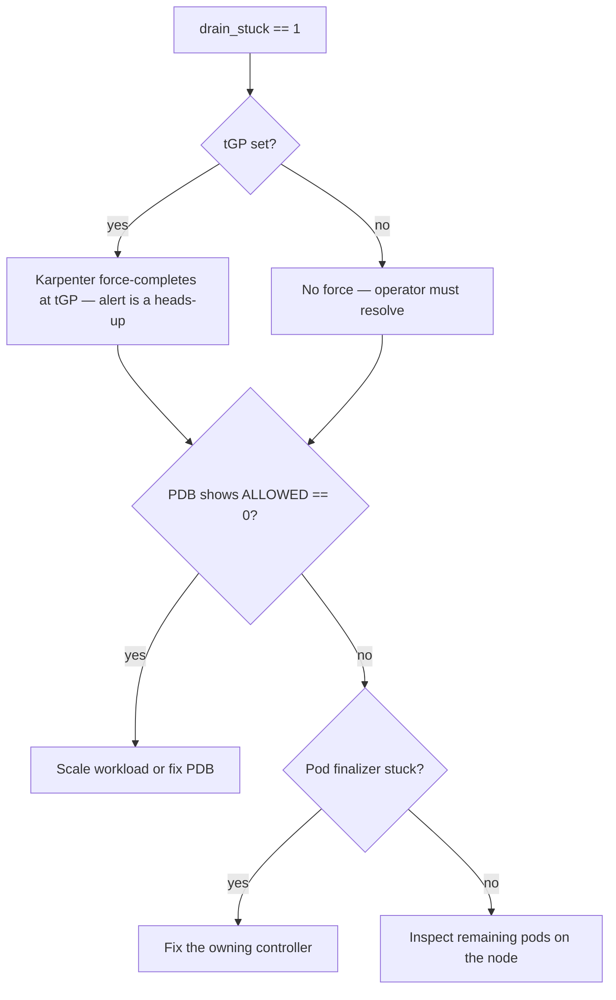

# Production runbook

Operational guidance for `node-rotation-controller`. Each section answers **when does this apply**, **what to look at**, and **what to do**.

For the design rationale, see the [specification](specification/). Japanese translation: [docs/ja/runbook.md](ja/runbook.md).

::: tip Incident right now?
Jump to [§7 Troubleshooting](#7-troubleshooting) — a symptom-based index that maps what you see to what you do.
:::

---

## Contents

1. [Per-AZ surge headroom (zonal PV)](#1-per-az-surge-headroom-zonal-pv)
2. [Tuning throughput and tGP](#2-tuning-throughput-and-tgp)
3. [Metrics reference](#3-metrics-reference)
4. [The freeze workflow](#4-the-freeze-workflow)
5. [Handling a stuck drain](#5-handling-a-stuck-drain)
6. [Alerting (PrometheusRule)](#6-alerting-prometheusrule)
7. [Troubleshooting](#7-troubleshooting)
8. [Upgrading and rolling back](#8-upgrading-and-rolling-back)
9. [Sizing at scale](#9-sizing-at-scale)

---

## 1. Per-AZ surge headroom (zonal PV)

**When:** your NodePool fronts workloads bound to zonal PersistentVolumes (EBS `gp3`/`io2`, or any PV with a `topology.kubernetes.io/zone` node affinity).

**The constraint:** the surge node is pinned to the candidate's AZ so the volume can re-attach. A same-AZ capacity shortage **cannot fall back to another zone** — the rotation rolls back after `readyTimeout`.

**What to do:**

- Keep enough **pool-wide** `spec.limits` headroom for one additional node, and ensure the NodePool's `requirements` permit every in-use AZ. `spec.limits` cannot reserve capacity per AZ.
- Separately confirm provider capacity in each AZ and enough regional EC2 vCPU quota for the surge.
- Consider capacity reservations for the surge instance shape in each AZ.

**How to detect a shortfall:**

- `noderotation_completed_total{outcome="failure"}` climbing
- `noderotation_retry_count >= 3` for the pool (alert: `NodeRotationRetryCountHigh`)

When that alert fires on a zonal-PV pool, suspect per-AZ capacity first.

---

## 2. Tuning throughput and tGP

### Raising throughput (window capacity `C`)

**When:** `ThroughputBelowArrival` or `ThroughputBurstShortfall` warnings appear, or candidates don't clear within a window.

**What controls throughput:**

```
C = ceil(D / (provisioningEstimate + drainEstimate + cooldownAfter))
```

| Knob | What it is | How to set it |
|------|-----------|---------------|
| `surge.provisioningEstimate` | Expected time for the surge node to reach Ready | Read from `noderotation_duration_seconds{phase="surge_wait"}` |
| `surge.drainEstimate` | Expected time for a healthy drain | Read from `noderotation_duration_seconds{phase="drain"}` |
| `surge.cooldownAfter` | Pause between consecutive rotations | May be `0` if PDBs already serialize drains |

**What does NOT raise throughput:** `terminationGracePeriod`. It no longer appears in `C`. Do not lower it for throughput warnings.

### Choosing `terminationGracePeriod`

**When:** deciding how long Karpenter waits before force-killing pods on a draining node.

**Pick it from:** the downtime you can tolerate in an incident (a genuinely slow drain that hits the deadline), not from the drain times you observe in normal operation.

**Reasons to lower tGP (none of them are throughput):**

- Lengthens `ageThreshold` → nodes rotate later, less churn
- Relaxes the Auto Mode 21-day cap (`expireAfter + tGP ≤ 21d`)
- Surfaces a stuck drain sooner (`noderotation_drain_stuck` fires at `tGP + buffer`)

For the full derivation, see [spec §3.2](specification/03-design.md#32-candidate-selection).

---

## 3. Metrics reference

Exposed on `/metrics`. Full semantics in [spec §4.2](specification/04-operations.md#42-observability).

Per-NodePool series are cleared when the NodePool is deleted or loses its governing `RotationPolicy`.

### Key operational metrics

| Metric | Type | What to watch for |
|--------|------|-------------------|
| `noderotation_candidates` | Gauge | Should trend to 0 after each window. Stuck > 0 for two windows → falling behind |
| `noderotation_in_progress` | Gauge | 0 or 1 (serial per pool in v1) |
| `noderotation_completed_total{outcome}` | Counter | `outcome ∈ {success, failure, expired}`. Any `failure`/`expired` → investigate |
| `noderotation_forceful_fallback_total` | Counter | Rising → graceful surges losing the race to deadlines |
| `noderotation_duration_seconds{phase}` | Histogram | `phase ∈ {surge_wait, drain}`. Use these to set your estimates |
| `noderotation_drain_stuck` | Gauge | `1` → operator action needed ([§5](#5-handling-a-stuck-drain)) |
| `noderotation_retry_count` | Gauge | `≥ 3` → systematic failure (preemption or AZ shortage) |
| `noderotation_short_lead_nodes` | Gauge | Nodes that can't get K chances before their own expiry |

### Schedule and policy metrics

| Metric | Type | Purpose |
|--------|------|---------|
| `noderotation_window_active` | Gauge | 0/1 per pool — is the window open now? |
| `noderotation_window_period_seconds` | Gauge | Worst-case gap `P` between windows (per pool) |
| `noderotation_age_threshold_seconds` | Gauge | Derived ageThreshold `A` (per pool) |
| `noderotation_rotation_chances` | Gauge | Guaranteed chances `G` |
| `noderotation_throughput_capacity` | Gauge | Forecast `C` — starts per window occurrence |
| `noderotation_t_rot_estimate_seconds` | Gauge | `t_rot_est` — expected healthy rotation time |
| `noderotation_t_rot_bound_seconds` | Gauge | `t_rot` — deadline-side bound (feeds lead time) |
| `noderotation_freeze_until_timestamp` | Gauge | Active freeze timestamp (0 = none) |
| `noderotation_policy_conflict` | Gauge | `1` = pool blocked by a policy conflict |

### Judging liveness

The controller's warning logs are deduped — a healthy idle loop emits **zero** log lines. Do not treat log silence as a stall. Use:

- `controller_runtime_reconcile_total{controller="rotation"}` — rising `rate()` = alive
- `workqueue_depth{name="rotation"}` — should stay near 0

---

## 4. The freeze workflow

**Purpose:** suppress rotation for a NodePool during a business-critical period.

**Set:**

```sh
kubectl annotate nodepool <name> \
  noderotation.io/freeze='2026-12-31T23:59:59Z' --overwrite
```

**Lift:**

```sh
kubectl annotate nodepool <name> noderotation.io/freeze-
```

**Behavior while frozen:**

- New rotations do not start
- A `pending` rotation is held (drain hasn't begun, so it's safe to pause)
- A `draining` rotation runs to completion (cannot abort a drain safely)
- The `expireAfter` backstop still applies — freezing cannot make nodes live forever

**Monitor:** `noderotation_freeze_until_timestamp{nodepool}` (0 = no freeze).

**Best practice:** manage freezes via GitOps, not ad-hoc `kubectl`. A forgotten freeze silently disables graceful rotation until its timestamp passes.

---

## 5. Handling a stuck drain

**Symptom:** `noderotation_drain_stuck == 1` (alert: `NodeRotationDrainStuck`).

**What happened:** the controller deleted the old NodeClaim, Karpenter is draining the node via the voluntary path, but the drain exceeds `tGP + buffer`.

**Important:** the stuck drain blocks all rotation for that pool on purpose (to respect `maxUnavailable = 1`). Other pools are unaffected.

**Decision flow:**



**Commands:**

```sh
# Find the draining node
kubectl get nodeclaim -l karpenter.sh/nodepool=<pool> -o wide | grep -i terminating

# Pods still on it
kubectl get pods -A --field-selector spec.nodeName=<node> -o wide

# PDBs blocking eviction
kubectl get pdb -A -o custom-columns=NS:.metadata.namespace,NAME:.metadata.name,ALLOWED:.status.disruptionsAllowed
```

**Do not** delete the controller's annotations or placeholder to "unstick" it — the state machine is idempotent and will re-assert. Fix the underlying PDB or finalizer.

---

## 6. Alerting (PrometheusRule)

The Helm chart ships an optional `PrometheusRule` (off by default). Enable:

```sh
helm upgrade --install node-rotation-controller charts/node-rotation-controller \
  --set prometheusRule.enabled=true
```

| Alert | Fires when | Action |
|-------|------------|--------|
| `NodeRotationCompletedFailureOrExpired` | A rotation failed or expired in the last hour | Check §1 (AZ capacity) and §5 (stuck drain) |
| `NodeRotationCandidatesNotDraining` | Candidates haven't cleared across two windows | Check §2 (throughput) |
| `NodeRotationStalledInWindow` | Window open, candidates exist, zero completions | Check §1 or §5 |
| `NodeRotationDrainStuck` | Drain exceeds `tGP + buffer` | Follow §5 |
| `NodeRotationShortLeadNodes` | Nodes can't get K chances before expiry | Raise `expireAfter` or add windows |
| `NodeRotationRetryCountHigh` | Same rotation failing ≥ 3 times | Systematic cause — check §1 |
| `NodeRotationForcefulFallback` | A rotation went surge-less (by design) | Check §2 if rising; single occurrence is expected |

**Tune schedule-dependent ranges** in your values:

- `prometheusRule.candidatesNotDraining.windowRange` → `2·P` (default `8d` for `{Wed, Sat}`)
- `prometheusRule.stalledInWindow.completionRange` → window duration `D` (default `4h`)

See [`values.yaml`](https://github.com/AkashiSN/node-rotation-controller/blob/main/charts/node-rotation-controller/values.yaml) for all tunable fields.

---

## 7. Troubleshooting

Start from what you **see**, confirm with the **signal**, then jump to the **fix**.

| Symptom | Signal | Fix |
|---------|--------|-----|
| Placeholder Pod stuck `Pending`, rotations fail | `noderotation_completed_total{outcome="failure"}`; `retry_count` climbing | [§1](#1-per-az-surge-headroom-zonal-pv) — same-AZ capacity |
| Candidates never clear across windows | `NodeRotationCandidatesNotDraining` alert | [§2](#2-tuning-throughput-and-tgp) — throughput too low |
| `ThroughputBurstShortfall` warning every window | Warning Event on NodePool | [§2](#2-tuning-throughput-and-tgp) — window too short for the batch |
| Drain hangs, no new completions | `noderotation_drain_stuck == 1` | [§5](#5-handling-a-stuck-drain) — PDB or finalizer |
| `noderotation_in_progress` stuck at 1 | `NodeRotationStalledInWindow` | Surge not landing (→ §1) or drain stuck (→ §5) |
| NodePool never rotates, candidates accumulate | `noderotation_policy_conflict == 1` | Fix the RotationPolicy selector overlap |
| NodePool stopped rotating quietly | `noderotation_freeze_until_timestamp > 0` | Forgotten freeze — [§4](#4-the-freeze-workflow) |
| Nodes reach `expireAfter` despite the controller | `noderotation_completed_total{outcome="expired"}` | Lead time too tight — widen windows or lower tGP |
| `noderotation_short_lead_nodes > 0` | `ShortLead` Warning Event | Raise `expireAfter` on the NodePool or add window days |
| Rising `forceful_fallback_total` | `ForcefulFallback` Warning Event | Expected if throughput is tight; remediate via §2 if excessive |
| "Reconcile looks stalled" (no log output) | Check `controller_runtime_reconcile_total` is rising | Not a real problem — logs are deduped in steady state |

---

## 8. Upgrading and rolling back

### Upgrading the image

**Safe mid-rotation.** All state lives on Kubernetes objects — a rolling upgrade hands leadership to the new pod, which resumes any in-flight rotation from the `active-rotation` annotation. No external state, nothing lost in memory.

To quiesce first (optional): set a short [freeze](#4-the-freeze-workflow) and wait for `noderotation_in_progress` to reach 0.

### CRD schema changes

Helm does **not** upgrade CRDs. When upgrading into a release that adds a field, apply the CRD first:

```sh
kubectl apply -f charts/node-rotation-controller/crds/
helm upgrade --install node-rotation-controller charts/node-rotation-controller ...
```

| Release | Schema change | Action |
|---------|---------------|--------|
| v0.6.1 | None | None |
| v0.6.0 | `surge.failurePause`, `surge.drainEstimate`, `surge.provisioningEstimate` added | Apply `crds/` first |
| v0.5.0 | `surge.forcefulFallback` added | Apply `crds/` first |
| v0.4.0 | None | None |
| v0.3.0 | `RotationPolicy` CRD introduced | First install |

### Behavioral change in v0.6.0

`cooldownAfter` no longer doubles as the post-failure pause. That is now `surge.failurePause` (defaults to `max(10m, cooldownAfter)`). If you had lowered `cooldownAfter` below 10m, the failure pause goes back up on upgrade. Set `failurePause` explicitly to keep your old value.

### Values schema change in v0.6.0

The chart seals the `rotationPolicies[].spec` subtree — a typo that was silently dropped before now fails the upgrade. **Dry-run first:**

```sh
helm template node-rotation-controller charts/node-rotation-controller -f your-values.yaml >/dev/null
```

### Rolling back

Rolling the image back is safe (same on-object state, older controller resumes). Rolling back **across a CRD change** may cause the controller to treat the policy as invalid (`noderotation_policy_conflict == 1`). Rotation pauses for that pool; `expireAfter` backstop still applies. Fix by also reverting the `RotationPolicy` objects.

---

## 9. Sizing at scale

**When:** clusters with **10k+ Pods**.

The controller caches every Pod in the cluster (it needs cross-namespace visibility to size the placeholder). Memory scales with Pod count:

| Pods | Cache footprint (lower bound) |
|------|-------------------------------|
| ~1k | ~4 MB |
| ~10k | ~37 MB |
| ~50k | ~185 MB — budget 500 MB to 1 GB |

CPU is not a concern — a 50k-Pod scan takes ~105 µs per call.

Size the Deployment's memory `requests`/`limits` accordingly. See the [perf note](reference/perf/pod-cache-scalability.md) for benchmark details.
