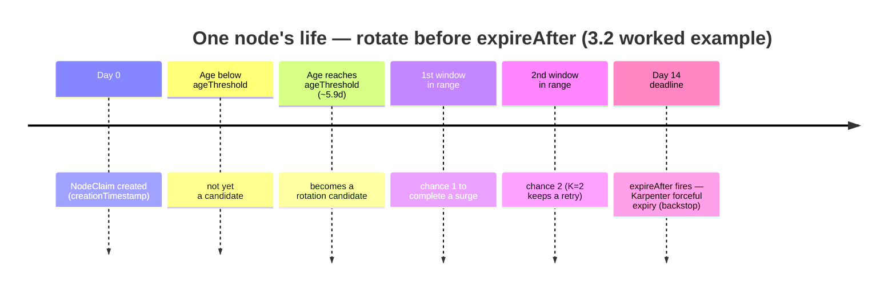
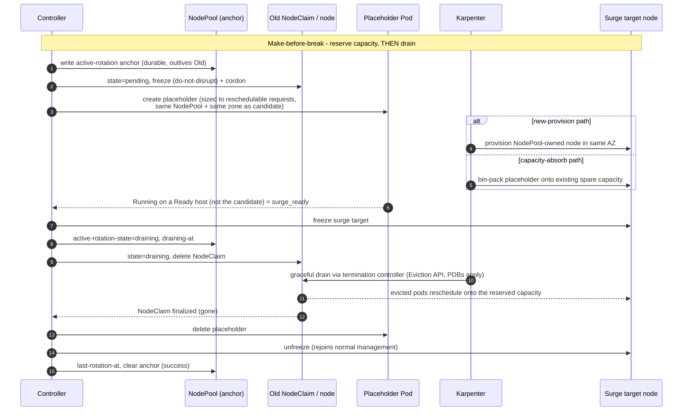
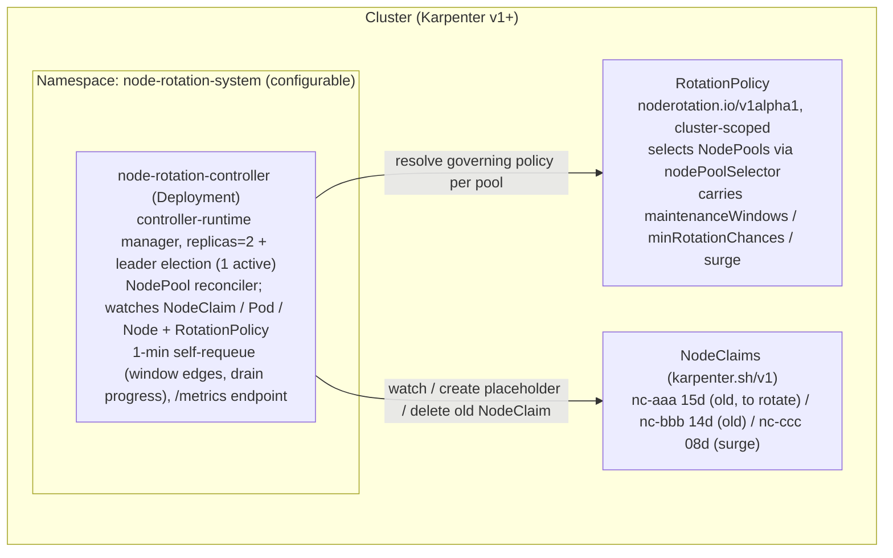
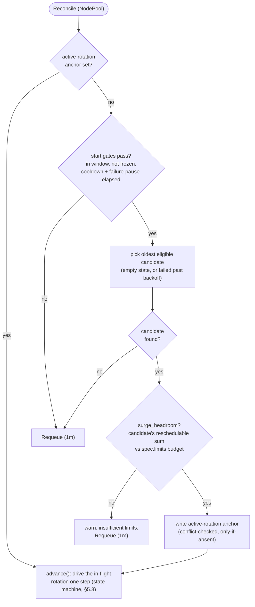
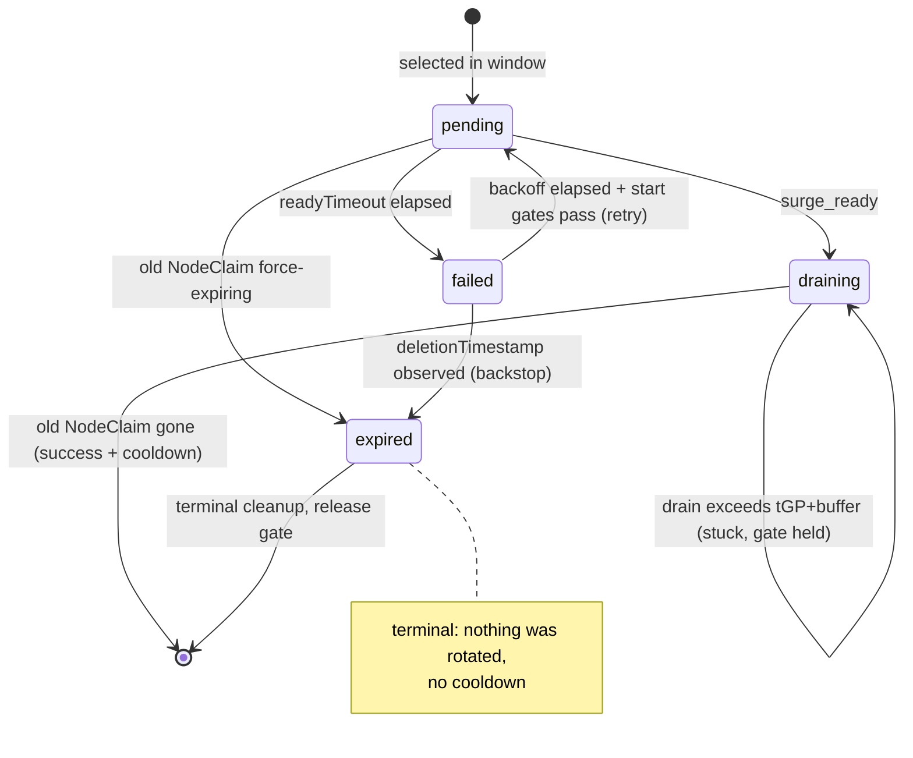

# node-rotation-controller — Specification

Functional specification for a Kubernetes controller that proactively rotates Karpenter-managed nodes in a make-before-break (surge) fashion within a configurable maintenance window, before Karpenter's forceful `expireAfter` is triggered.

Japanese translation: [docs/ja/specification.md](ja/specification.md)

---

## Contents

1. **Overview** — [1.1 Background](#11-background) · [1.2 Goals](#12-goals) · [1.3 Non-Goals](#13-non-goals) · [1.4 Terminology](#14-terminology) · [1.5 Position in the Karpenter Ecosystem](#15-position-in-the-karpenter-ecosystem)
2. **Scope** — [2.1 Scope and Compatibility](#21-scope-and-compatibility) · [2.2 Composition with Existing Mechanisms](#22-composition-with-existing-mechanisms)
3. **Design** — [3.1 Maintenance Window](#31-maintenance-window) · [3.2 Candidate Selection](#32-candidate-selection) · [3.3 Surge Sequence (v1)](#33-surge-sequence-v1) · [3.4 Future versions (v2)](#34-future-versions-v2) · [3.5 Backstop Behavior](#35-backstop-behavior)
4. **Operations** — [4.1 Capacity / Availability](#41-capacity--availability) · [4.2 Observability](#42-observability) · [4.3 RBAC and Cloud Permissions](#43-rbac-and-cloud-permissions) · [4.4 Cost](#44-cost)
5. **Implementation** — [5.1 Architecture](#51-architecture) · [5.2 Reconcile Loop](#52-reconcile-loop) · [5.3 State Model](#53-state-model) · [5.4 Configuration Schema](#54-configuration-schema)
6. **Release** — [6.1 Versioning and Release](#61-versioning-and-release) · [6.2 Roadmap](#62-roadmap)
7. **Risks & Status** — [7.1 Risks](#71-risks) · [7.2 Validated Assumptions](#72-validated-assumptions) · [7.3 Open Questions](#73-open-questions)

[References](#references)

---

## 1.1 Background

Karpenter (and EKS Auto Mode, which is built on Karpenter) classifies node disruption into two categories:

| Category | Examples | NodePool Disruption Budgets | Pre-provisioned replacement | PDB |
|----------|----------|------------------------------|------------------------------|-----|
| Graceful | Drift, Consolidation | Applied | Yes (make-before-break) | Strictly respected |
| **Forceful** | **Expiration**, Spot Interruption | **Not applied** | **No** | Respected, but capped by `terminationGracePeriod` |

Expiration is intentionally classified as forceful so that AMI patches and security-critical updates cannot be indefinitely delayed by misconfigured budgets or PDBs. This rationale is documented in the upstream Karpenter design [`forceful-expiration.md`](https://github.com/kubernetes-sigs/karpenter/blob/main/designs/forceful-expiration.md), which explicitly identifies "operators implement their own graceful rotation" as an acceptable solution path. EKS Auto Mode further enforces a **21-day maximum node lifetime** that users can *reduce* but not remove — nodes have "a maximum lifetime of 21 days … after which they are automatically replaced" ([EKS Auto Mode user guide](https://docs.aws.amazon.com/eks/latest/userguide/automode.html)). Because a node's true end-of-life is its `expireAfter` expiry **plus** up to `terminationGracePeriod` of drain, this ceiling is enforced as a constraint on their **sum**: `expireAfter + terminationGracePeriod ≤ 21d` (AWS states the sum "cannot exceed 21 days" — [AWS builders.flash, 2025-04](https://aws.amazon.com/jp/builders-flash/202504/dive-deep-eks-node-automated-update/)). For reference, the Auto Mode defaults are `expireAfter` 336h (≈14d) and `terminationGracePeriod` 24h ([Create a Node Pool](https://docs.aws.amazon.com/eks/latest/userguide/create-node-pool.html)).

The practical consequence: in any non-trivial cluster, nodes **will be force-drained at unpredictable times**, regardless of PDB settings, and Karpenter will only begin provisioning a replacement *after* the drain starts. For latency-sensitive workloads with strict capacity requirements (e.g., `request == limit`), this creates a window of forced pod-pending that can collide with peak business hours.

## 1.2 Goals

| # | Goal |
|---|------|
| G1 | **Prevent forceful Expiration from firing in practice** by replacing `NodeClaim` resources that approach an age threshold (derived per NodePool from the maintenance schedule and a target number of rotation chances — see §3.2) during a defined maintenance window, using the voluntary disruption path |
| G2 | **Eliminate the pending-pod window** by adding a NodePool-owned replacement node first and waiting for it to be `Ready` before deleting the old one (node-level surge / make-before-break; Pod-level ordering is delegated to PDB — see §3.3) |
| G3 | **Confine rotation to business-safe time slots** via a configurable maintenance window (weekday / time-of-day / timezone) |
| G4 | **Compose with existing protections** — PDB, `topologySpreadConstraints`, preStop hooks, Pod Readiness Gates, ALB slow start — without replacing them |

## 1.3 Non-Goals

| # | Non-Goal | Rationale |
|---|----------|-----------|
| N1 | Replace Karpenter Consolidation / Drift | Karpenter's autonomous optimization remains active and beneficial. Only the Expiration path is taken over |
| N2 | Handle Spot interruption | Spot interruption is an AWS-side event with a 2-minute hard limit; use [AWS Node Termination Handler](https://github.com/aws/aws-node-termination-handler) |
| N3 | Application-side warm-up | JVM warm-up, connection pool priming, and similar concerns belong to `readinessProbe` / `readinessGate` / ALB slow start. The controller orchestrates *node* placement; the application orchestrates its own readiness |
| N4 | Allow `expireAfter == 0` or removal of the 21-day hard cap | The Auto Mode cap cannot be bypassed. `expireAfter` is intentionally kept as a backstop in case the controller is unavailable |
| N5 | OS-patch reboot orchestration | Out of scope; see [kured](https://github.com/kubereboot/kured) |

## 1.4 Terminology

| Term | Definition |
|------|------------|
| **NodeClaim** | Karpenter v1 CRD; a 1:1 representation of an underlying instance (e.g., EC2) |
| **surge** | Creating a replacement node and waiting until it is `Ready` before draining the old one (make-before-break) |
| **maintenance window** | The **union** of one or more configured weekday/time-of-day ranges during which the controller may *start* a rotation. In-flight rotations are allowed to complete past the window boundary |
| **age threshold** | The `creationTimestamp` age beyond which a `NodeClaim` becomes a rotation candidate. **Derived** per NodePool from the schedule and the target rotation chances (`minRotationChances`), not set directly (§3.2). The actual per-node trigger anchors on each NodeClaim's own `spec.expireAfter` deadline; `ageThreshold` is its age-equivalent representative (§3.2) |
| **backstop** | Karpenter's native `expireAfter` (Forceful Expiration), which still fires if the controller is unavailable. Intentionally retained as a safety net |

**Symbols** — used throughout §3–§5. See §3.2 for the full derivation and the authoritative per-node vs NodePool-template distinction (the **Source** column there).

| Symbol | Meaning |
|--------|---------|
| `E` | `expireAfter` — a NodeClaim's lifetime before Forceful Expiration (per-node, authoritative: `NodeClaim.spec.expireAfter`) |
| `tGP` | `terminationGracePeriod` — the bound Karpenter can hold a drain to |
| `P` | worst-case window period — the largest gap between consecutive maintenance-window occurrences (§3.1) |
| `t_rot` | upper bound on one node's rotation time = `readyTimeout + tGP + buffer` |
| `K` | `minRotationChances` — desired guaranteed rotation chances before expiry (floor 1) |
| `leadTime` | how early a node is selected before its deadline = `K·P + t_rot` |
| `A` | `ageThreshold` — the age at which a node becomes a candidate; derived `A = E − (K·P + t_rot)` |
| `G` | rotation chances the schedule actually guarantees; `G = K` under auto-derivation, recomputed for an explicit `ageThreshold` override |

## 1.5 Position in the Karpenter Ecosystem

This controller is intentionally aligned with upstream Karpenter's design direction. It does not attempt to alter Karpenter's behavior; instead it operates in a layer above.

### Why upstream will not absorb this functionality

The Karpenter design [`forceful-expiration.md`](https://github.com/kubernetes-sigs/karpenter/blob/main/designs/forceful-expiration.md) records the deliberate decision to keep Expiration forceful. It lists three options for users who want graceful expiration semantics:

1. (Recommended by upstream) Keep Expiration forceful as-is
2. Add a per-NodePool `expirationPolicy: Forceful | Graceful` field
3. **"Operators implement their own graceful rotation"**

This controller is option 3. Because upstream has explicitly identified user-side implementation as a legitimate solution, the risk of this project being made redundant by upstream absorption is low.

### Why Disruption Budgets are not sufficient

Karpenter's `NodePool.spec.disruption.budgets` supports `schedule + duration`, which superficially looks like a maintenance window. In practice it has two structural limitations:

| Requirement | Achievable with vanilla Karpenter? |
|-------------|------------------------------------|
| Allow disruption only inside a window, deny outside | △ Only via blacklisting (set `nodes: "0"` outside the window via multiple budgets), because the budget algorithm takes the *minimum* across overlapping budgets — see [Discussion #1079](https://github.com/kubernetes-sigs/karpenter/discussions/1079) |
| Apply the window to Expiration | ✗ Budgets apply to Consolidation/Drift only, **not to Expiration** |
| Surge replacement during Expiration | ✗ Expiration is forceful; no pre-provisioning |

This controller fills the second and third rows above and substantially simplifies the first.

### Adjacent projects

| Project | Scope | Overlap |
|---------|-------|---------|
| Karpenter NodePool Disruption Budgets | Rate-limit Drift/Consolidation | Complementary; not applicable to Expiration |
| [kured](https://github.com/kubereboot/kured) | Reboot nodes for OS patching | None; doesn't manipulate NodeClaims |
| [AWS Node Termination Handler](https://github.com/aws/aws-node-termination-handler) | Spot interruption / scheduled events | None; different trigger |
| [descheduler](https://github.com/kubernetes-sigs/descheduler) | Pod rebalancing | None; doesn't touch nodes |
| EKS Node Auto Repair (AWS managed) | Replace unhealthy nodes | None; not expiration-driven |

---

## 2.1 Scope and Compatibility

### Supported environments

| Environment | Status |
|-------------|--------|
| EKS Auto Mode | Primary target (the 21-day hard cap is the strongest motivating constraint) |
| Self-managed Karpenter v1+ on EKS | Supported |
| Karpenter on other CNCF distributions (AKS NAP, etc.) | Best-effort; CRD API is the same but operator semantics may differ |

### Karpenter compatibility policy

`karpenter.sh/v1` is required; earlier versions (`v1beta1`, `v1alpha5`) are not supported.

The compatibility contract is the **stable `karpenter.sh/v1` CRD surface — not a specific Karpenter controller minor.** This matters for the primary target, **EKS Auto Mode**, which does not expose the exact managed Karpenter minor to users: the controller works against any cluster that serves a compatible `karpenter.sh/v1` `NodePool`/`NodeClaim` API, regardless of the Karpenter version Auto Mode runs underneath.

- **Runtime target.** EKS Auto Mode and any Karpenter v1+ cluster exposing a `karpenter.sh/v1`-compatible `NodePool`/`NodeClaim` API.
- **Build/test baseline.** The repository compiles and tests against the bundled `sigs.k8s.io/karpenter` Go module version pinned in [`go.mod`](../go.mod) (currently `v1.13.0`). That pins the *typed Go API* the controller is built against; it is **not** a runtime requirement that the cluster run that exact Karpenter minor.
- **Interaction boundary.** The controller never calls Karpenter controller internals or any cloud-provider API — it interacts solely through Kubernetes API objects (the `NodeClaim`/`NodePool` CRDs, plus core `Node`/`Pod`). Unknown Auto Mode internals are therefore acceptable as long as the public `karpenter.sh/v1` surface is compatible (and §4.3 requires no cloud IAM).
- **Runtime enforcement.** A startup preflight (§5.1) fails fast when the cluster does not serve `karpenter.sh/v1` with the `nodeclaims`/`nodepools` resources, or RBAC cannot read them — turning a compatibility gap into an immediate, actionable error rather than a deferred reconcile failure.

**Required compatibility surface.** The controller depends only on the following public `karpenter.sh/v1` fields, labels, and annotations; anything outside this set (including all Karpenter controller internals) is irrelevant to compatibility:

| Kind / field / key | Used for |
|--------------------|----------|
| `NodeClaim`, `NodePool` (`karpenter.sh/v1`) | the rotation unit and its owning pool (§3.2, §3.3) |
| `NodeClaim.spec.expireAfter` | per-node deadline anchoring the trigger (§3.2) |
| `NodeClaim.spec.terminationGracePeriod` | per-node drain bound feeding `t_rot` / lead time (§3.2) |
| `NodeClaim.spec.requirements` | fallback source for placeholder requirement replication when a parity key is not surfaced as a node label (§3.3) |
| `NodeClaim.status.nodeName` | mapping a claim to its Node (§3.3, §5.2) |
| `NodeClaim.status.conditions[Ready]` | selection eligibility (§3.2) |
| `NodePool.spec.template.spec.expireAfter` | representative `E` for per-pool validation (§3.2) |
| `NodePool.spec.template.spec.terminationGracePeriod` | representative `tGP` (§3.2) |
| `NodePool.spec.template.spec.requirements` | placeholder requirement replication (§3.3) |
| `NodePool.spec.template.spec.taints` | placeholder tolerations (§3.3) |
| `NodePool.spec.limits` | surge headroom check (§3.2, §5.2) |
| `NodePool.status.resources` | provisioned footprint for the headroom check (§5.2) |
| label `karpenter.sh/nodepool` | pairing nodes / placeholder to the pool (§3.3) |
| annotation `karpenter.sh/do-not-disrupt` | freezing the surge pair against voluntary disruption (§3.3) |

## 2.2 Composition with Existing Mechanisms

| Mechanism | Relationship |
|-----------|--------------|
| Karpenter Consolidation / Drift | **Coexists.** This controller takes over only the Expiration path. Voluntary disruption from Consolidation/Drift still flows through Karpenter |
| NodePool `expireAfter` | **Coexists** as backstop. The derived `ageThreshold` sits below `expireAfter` by construction (`A = E − (K·P + t_rot)`, §3.2), and validation fails (**fatal**) when the schedule cannot guarantee the configured rotation chances — the gap is not hand-tuned |
| NodePool `terminationGracePeriod` | **Depended on.** After the controller deletes an old `NodeClaim`, Karpenter's termination controller honors PDBs during drain, bounded by `terminationGracePeriod` |
| PodDisruptionBudget | **Depended on.** Drain after the controller's `NodeClaim` deletion follows the voluntary path, so PDBs are strictly respected |
| `topologySpreadConstraints` | **Depended on.** Even with surge, all pods on a node disappear together when that node is finally drained. Spreading remains essential |

---

## 3.1 Maintenance Window

```yaml
maintenanceWindows:        # a list; the effective window is the UNION of all entries
  - timezone: Asia/Tokyo   # IANA tz database name
    days: [Wed, Sat]       # ISO weekday names: Mon/Tue/Wed/Thu/Fri/Sat/Sun
    start: "02:00"
    end:   "06:00"
```

**Semantics**:

- The reconciler is **always running**; window membership is evaluated on each reconcile tick (1-minute Ticker).
- `maintenanceWindows` is a **list**; the effective maintenance window is the **union** of all entries. This lets operators combine schedules (e.g., a weekday slot plus a weekend slot) to increase rotation frequency.
- Outside the (union) window the reconcile loop is a no-op.
- The window controls only **rotation starts**. An in-flight rotation continues past the window boundary (aborting mid-drain is more dangerous than letting it complete).
- A single `NodePool` may be **frozen** by an annotation (e.g., `noderotation.io/freeze=<RFC3339 timestamp>`) to suppress rotation until that time (use case: business-critical periods). Unlike the window — which gates only *starts* (above) — a freeze also **holds an in-flight rotation that is still in `pending`**: the drain has not begun, so pausing is safe, and the pending handler stops escalating while the freeze is in effect (§5.2). The hold suspends only **escalation** — placeholder (re)creation and the transition to `draining`; passive bookkeeping (re-asserting the protective `do-not-disrupt`/cordon markers, persisting the `surge-claim` identification) keeps running, so a freeze never weakens the §3.3 crash-recovery guarantees. If the freeze outlasts `readyTimeout` the attempt simply rolls back through the normal failure path. A rotation already in `draining` continues to completion, for the same reason aborting mid-drain is not attempted.

The **worst-case window period `P`** — the largest gap between the start of one window occurrence and the start of the next over the recurring cycle — is derived from this union and feeds the `ageThreshold` derivation in §3.2. For example, the union `{Wed 02:00, Sat 02:00}` has gaps `Wed→Sat = 3d` and `Sat→Wed = 4d`, so `P = 4d`. A **continuously-open (24/7) union** — one whose occurrences merge to cover the entire week, e.g. across timezones — has no gap between rotation opportunities, so `P` collapses to the reconcile-tick granularity rather than the full `7d` week wrap (a zero `P` is undefined and reported as a NoWindows fatal, §3.2); an always-open schedule therefore permits rotation at any time and is never rejected as infeasible for that reason.

> **Note (DST).** `P` is computed over the recurring **wall-clock** cycle. A daylight-saving transition can shift an individual gap by ±1h; v1 treats this as a known approximation and does not special-case it.

## 3.2 Candidate Selection

A `NodeClaim` becomes a rotation candidate when **all** of the following hold:

| Condition | Default | Notes |
|-----------|---------|-------|
| `now() > deadline − leadTime`, where `deadline = NodeClaim.metadata.creationTimestamp + NodeClaim.spec.expireAfter` and `leadTime = K·P + t_rot` | `leadTime` is **derived** (see below), not set directly | Anchored on each NodeClaim's **own** `spec.expireAfter` (its authoritative expiry), **not** the NodePool template. The derived `ageThreshold` is the age-equivalent of this trigger; defaults to `auto`, an explicit override is allowed but still validated |
| Belongs to a `NodePool` governed by a `RotationPolicy` | Required | A `NodePool` matched by some `RotationPolicy.spec.nodePoolSelector` is in scope; an unmatched pool is not rotated (§5.4) |
| `status.conditions[Ready] == True` | Required | NotReady NodeClaims are skipped — an already-unhealthy node is left to EKS Node Auto Repair and the `expireAfter` backstop, not rotated here (the controller only owns the health of nodes it created during a surge) |
| `metadata.deletionTimestamp` is unset | Required | A claim already being deleted — typically Forceful Expiration in progress (under Auto Mode's `tGP = 24h` a force-draining claim stays alive, and even `Ready`, for hours) — can no longer be rotated gracefully. Selecting it would seize the per-NodePool serial gate only to abort immediately, over and over, livelocking selection and starving every other candidate (§5.2); the §5.2 abort path handles the one rotation such a claim may already be in |
| `metadata.annotations["noderotation.io/state"]` is empty, or `failed` past its escalated backoff | Required | `pending`/`draining` are in-flight and driven by §5.2 step 1, not re-selected here; `failed` is retried after an **escalating** backoff (doubling per consecutive failure, §5.3); `expired` is **terminal** — a claim caught force-expiring mid-rotation (§5.2) is never re-selected |

When multiple claims are eligible they are sorted by age (oldest first), ties broken by NodeClaim name. The tiebreak matters because `creationTimestamp` is second-granular, so claims batch-provisioned by Karpenter routinely share one — without a stable order the pick would follow nondeterministic list order and could drift across reconciles.

### Deriving `ageThreshold` from the desired rotation chances

Rather than hand-tuning `ageThreshold` (which is error-prone — a too-loose value lets Forceful Expiration fire before a window arrives), the controller **derives it per NodePool** from the schedule and a target number of rotation chances.

> **This is the central race.** Forceful Expiration fires at each node's `deadline` regardless of maintenance windows or PDBs, so the controller must *finish* a graceful surge rotation **before** that moment — every cycle. Candidate selection **is** that lookahead: a node is selected once its `deadline` falls within `leadTime = K·P + t_rot` of now (equivalently, `age > ageThreshold`). Read `leadTime` left to right — `K` worst-case window cycles (`K·P`) to *catch* a window, plus one node's completion time (`t_rot`) to *finish* inside it — and it guarantees the node sees at least `K` maintenance windows with enough headroom to complete before `expireAfter` can fire. `K ≥ 2` keeps a retry in hand if a window is missed or slow. The derivation below picks the largest such threshold so rotation still happens as late as safely possible.



**Symbols** (a quick glossary of these is in §1.4; the **Source** column below is the authoritative per-node vs NodePool-template distinction)

| Symbol | Meaning | Source |
|--------|---------|--------|
| `E` | `expireAfter` | Per-node: **`NodeClaim.spec.expireAfter`** (authoritative; anchored at the NodeClaim's `creationTimestamp`). NodePool `spec.template.spec.expireAfter` is used only as the **representative** for per-NodePool validation/logging — it does **not** propagate to existing NodeClaims (see note below) |
| `tGP` | `terminationGracePeriod` | Per-node: `NodeClaim.spec.terminationGracePeriod`; NodePool `spec.template.spec.terminationGracePeriod` as the representative |
| `P` | worst-case window period (largest gap between consecutive window occurrences) | derived from the `maintenanceWindows` union (§3.1) |
| `t_rot` | upper bound on a single node's rotation time = `readyTimeout + tGP + buffer` (**`cooldownAfter` is not included** — the node is already drained before the cooldown; see the margin note below). When `tGP` is unset (self-managed Karpenter allows nil), the **same fixed fallback bound** that `drain_bound` uses (§5.2, e.g. `1h`) is substituted for `tGP` here too — the derivation and layer-2 check below would otherwise be undefined exactly when the drain is unbounded | derived from config + NodePool |
| `K` | desired guaranteed rotation chances (`minRotationChances`) | user-set; floor **1** |

**Derivation** — pick the *largest* threshold that still guarantees `K` completable chances inside `[ageThreshold, E)`, so rotation happens as late as safely possible (minimizing churn and surge cost):

```
ageThreshold (A) = E − (K·P + t_rot)
```

This holds because the usable interval `[A, E − t_rot]` then spans at least `K` window occurrences in the worst phase (`floor(((E − t_rot) − A) / P) ≥ K`), each with `t_rot` of headroom to complete before `E`.

> **Margin.** The bound is **tight**: the worst-phase guarantee is *exactly* `K` (`floor(K·P / P) = K`), with no built-in slack. The tightness also inherits the §3.1 DST approximation: `P` is a wall-clock worst case, so a fall-back transition can stretch a single gap to `P + 1h`, which in the tightest phase can cost one of the `K` chances. Any safety margin must therefore come from `K` itself — `K ≥ 2` is recommended so a single missed or slow window (or a DST-stretched gap) still leaves a retry. `cooldownAfter` is the settle pause *between* consecutive rotations within a window; it does **not** count toward a single node's completion time (`t_rot`, which is why it was removed above) but it **does** factor into throughput (layer 2 below).

> **Authoritative expiry source.** The deadline that drives the *per-node* trigger is read from each **`NodeClaim.spec.expireAfter`**, anchored at that NodeClaim's `creationTimestamp` — **not** from the NodePool's `spec.template.spec.expireAfter`. Karpenter stamps `expireAfter` onto the NodeClaim at creation, and Forceful Expiration fires at `creationTimestamp + NodeClaim.spec.expireAfter`. Later edits to the NodePool template do **not** propagate to existing NodeClaims; they only trigger drift-based replacement. The controller therefore anchors `leadTime` on each node's own `deadline`, and uses the template `E` solely as the **representative** value for the per-NodePool startup validation and the logged/derived `ageThreshold` (§4.2). When a node's own `spec.expireAfter` differs from the template (e.g. mid-drift, or after a template change), its trigger follows its own value — so the identity `now() > deadline − leadTime ⟺ age > ageThreshold` holds exactly only when the two coincide.

**Validation** (layer 1 — scheduling feasibility)

| Condition | Outcome |
|-----------|---------|
| `K < 1` | **fatal** — invalid config |
| `K < 2` (i.e. `K = 1`) | **warn** — a single missed/failed window leaves no retry before Forceful Expiration; in a DST-observing timezone a fall-back transition can stretch one gap past `P` (§3.1 note), so the *exactly-K* bound can then mean **zero** completable chances |
| `A ≤ 0` (i.e. `E ≤ K·P + t_rot`; the schedule cannot guarantee even `K` chances) | **fatal** — raise `E` (Auto Mode allows up to `21d − tGP`), add window occurrences to shrink `P`, or lower `K`. Note that raising the template `E` heals **new** NodeClaims only — existing ones keep their stamped value and are surfaced by the per-node check (layer 3 below) until they rotate out |
| `0 < A < P` (a node becomes a candidate before it has lived even one window period) | **warn** — extremely aggressive: nodes rotate very young, maximizing churn/surge cost. Raise `E` or lower `K` |
| explicit `ageThreshold` override with recomputed `G < 1` (i.e. `floor(((E − t_rot) − A) / P) < 1` for the overridden `A`; see the `G` note below) | **fatal** — the override leaves no completable window occurrence before `E`, so the §2.2 invariant ("validation fails when the schedule cannot guarantee the configured chances") would be silently broken. The override is rejected, not merely observed |
| explicit `ageThreshold` override with recomputed `1 ≤ G < K` | **warn** — the override weakens the requested `minRotationChances`; `G` (not `K`) is what the schedule actually guarantees |
| Auto Mode and `E + tGP > 21d` | **warn** (`HardCapExceeded`) — violates the hard cap. Because Auto Mode is not reliably detectable from the NodePool API, the representative `E + tGP` is checked **unconditionally** against `21d` (a strict `>`); on self-managed Karpenter, where the cap does not apply, the warning is merely advisory and never changes `A` |
| `tGP` unset (self-managed Karpenter allows nil) | **warn** — the drain phase is then unbounded by Karpenter (a blocking PDB or stuck finalizer can hold it forever); the §5.2 stuck-drain alert **and the `t_rot` used by this derivation and layer 2** fall back to the same fixed bound (symbol table above) |
| `retryBackoff < readyTimeout` | **warn** — a failed attempt runs for up to `readyTimeout` before rolling back, so a shorter base backoff lets retries repeat the failed-surge cost (§4.4) faster than a single attempt even lasts. The per-attempt `started-at` re-stamp (§5.3) keeps retries *correct* regardless; the configuration just defeats the cost-bounding intent of the escalating backoff. The defaults (30m vs 15m) satisfy this |
| NodePool `spec.limits` resource budget (`{cpu, memory, …}`) leaves no room for the surge node's requests (the headroom for one more node is exhausted) | **warn** — surge cannot land without free budget; raise `limits` to leave headroom for one node's worth of resources. Startup uses a representative footprint; the authoritative, candidate-dependent check (`surge_headroom`, the selected candidate's reschedulable-Pod request sum) runs at rotation start, **after** candidate selection (§5.2 step 3) |

**Validation** (layer 2 — throughput) — independent of the derivation; it only **warns** and never changes `A`. Because rotations are serial within a window and separated by `cooldownAfter` (enforced as a per-NodePool start gate in §5.2 step 2), each window occurrence of duration `D` can rotate `C = m · floor(D / (t_rot + cooldownAfter))` nodes (`m = surge.maxUnavailable`, fixed at `1` in v1). This bound is deliberately **conservative**: the window gates only rotation *starts* (§3.1), so one further rotation can typically start near the window's edge and complete past it — the formula ignores that final start, erring toward a warning. If the candidate arrival rate exceeds capacity (`C < N · P / A`, where `N` is the NodePool node count), candidates accumulate and some may reach Forceful Expiration:

- **warn**: widen windows (larger `D`), add occurrences (smaller `P`), or raise `maxUnavailable` (reserved for a later version).

The steady-state condition above assumes node ages are uniformly distributed. A **synchronized batch** — `N` nodes created together (initial bring-up, scale-up, NodePool migration, post-consolidation re-packing) — shares one `creationTimestamp` and therefore one deadline, and contends for the same windows. The `leadTime` before that common deadline guarantees `K` window occurrences, each rotating at most `C`, so a synchronized batch completes gracefully only when `K · C ≥ N`. When `N > K · C` the surplus nodes miss every window and reach Forceful Expiration at the (uncontrolled) deadline — a case the steady-state average does **not** detect. This is surfaced as a separate **warn** (`ThroughputBurstShortfall`).

**Validation** (layer 3 — per-node, runtime) — the two layers above use the NodePool **template** `E`/`tGP` as representatives, but the actual trigger is per-NodeClaim (*Authoritative expiry source* above), so a passing template does not prove every *existing* claim is satisfiable — e.g. after the template `E` was raised to clear a fatal, the already-stamped claims still carry the short value. On each reconcile the controller therefore also checks every in-scope NodeClaim against its **own** `spec.expireAfter`: a claim with `E_node ≤ K·P + t_rot` (per-node `A ≤ 0`) can no longer be guaranteed `K` chances — it is counted in `noderotation_short_lead_nodes` (§4.2), warned via a `ShortLead` Warning Event on the NodeClaim (§4.2), and rotated **best-effort at the earliest opportunity** (by the trigger above it is already a candidate) — until Karpenter's forceful path actually begins: once its `deletionTimestamp` is set, it is excluded from selection (the table above) and only the §5.2 abort path applies.

> **Worked example.** Auto Mode with the NodePool's `terminationGracePeriod` **lowered from its `24h` default to `1h`** (see the calibration note below), `E = 14d`, union `{Wed, Sat} 02:00–06:00` → `P = 4d`, `t_rot ≈ 1.5h` (`readyTimeout 15m + tGP 1h + buffer`), `K = 2`. Then `A = 14d − (2·4d + 1.5h) ≈ 5.9d`: nodes become candidates at ~5.9d and are guaranteed 2 windows before 14d. Throughput `C = floor(4h / (1.5h + 10m)) = 2` per occurrence (conservative — a third rotation can still *start* before the window closes and complete past it, §3.1).
>
> A **weekly-only** window `{Sat}` has `P = 7d`, so `A = 14d − (2·7d + 1.5h) ≈ −1.5h ≤ 0` → **fatal**: weekly windows cannot guarantee 2 chances at `E = 14d`. This is exactly why a fixed `expireAfter − 4d` default was unsafe; the derivation surfaces it and tells the operator to raise `E` (to ~`20d`, giving `A ≈ 6d`) or add a window day. (Raising `E` takes effect for **new** NodeClaims only; the already-stamped ones are caught by the layer-3 per-node check until they rotate out.)
>
> **Calibration note (Auto Mode defaults).** With the stock `tGP = 24h` (§1.1), `t_rot ≈ 24.5h`. Layer 1 still passes (`A = 14d − (2·4d + 24.5h) ≈ 5d`), but layer 2 computes `C = floor(4h / (24.5h + 10m)) = 0` and warns on **every** occurrence — the model must budget the full `tGP` as potential drain time for each rotation even though typical PDB-respecting drains finish in minutes. Auto Mode operators should therefore lower the NodePool `terminationGracePeriod` to a realistic per-node drain bound (the `1h` used above). Doing so also relaxes the 21-day cap (`E + tGP ≤ 21d`, §1.1): `tGP = 1h` admits `E` up to ~`20d` — exactly the remedy suggested for the weekly-window fatal above. The trade-off is that a genuinely slow drain is force-completed after `1h` instead of `24h`; pick the bound from the workload's real PDB-respecting drain time, not from this example.

The derived `A`, the guaranteed chances `G`, and `P` are surfaced per NodePool via startup logs and metrics (§4.2). With the auto-derivation, `G = K` by construction; the separate `G` exists so that when an explicit `ageThreshold` override is used, `G` is **recomputed from that override** (`G = floor(((E − t_rot) − A) / P)`) — and not merely observed but **validated**: `G < 1` is **fatal** (the override cannot guarantee even one completable chance before `E`) and `G < K` **warns** (the override weakens the requested chances) — see the layer-1 table above. This is what "an explicit override is allowed but still validated" (§3.2 trigger row, §5.4) means concretely.

## 3.3 Surge Sequence (v1)

A single reconcile cycle handles **one** node. v1 enforces serial processing **per NodePool** (`surge.maxUnavailable = 1`) to minimize blast radius; distinct NodePools may rotate concurrently.

### Surge into the *same* NodePool — not a standalone node

The replacement node must belong to the **same NodePool** as the node being replaced. The controller therefore does **not** rotate by creating a standalone `NodeClaim`. (A standalone NodeClaim *is* provisionable — see §7.2 — but the resulting node has no NodePool owner, so its pods would persist on an unmanaged node that sits outside NodePool accounting, expiry, drift, and disruption budgets. In a cluster that deliberately separates NodePools, e.g. `api` vs `batch`, that is unacceptable.)

Instead, the controller induces Karpenter to add a NodePool-owned node by creating a temporary **placeholder Pod** — a single low-priority "pause" Pod that the controller **creates and manages directly** (deliberately *not* via a Deployment/ReplicaSet/Job). Its scheduling requirements are copied from the **candidate node** — most importantly the AZ (`topology.kubernetes.io/zone`), plus the arch / instance-type / capacity-type constraints the rescheduled Pods depend on (see *Stateful and zonal workloads* below) — and its resource requests are set to the **sum of the resource requests of the *reschedulable* Pods currently scheduled on the candidate node** — the workload that must re-land after the drain. This sum **excludes** Pods that Karpenter does not need to re-fit onto fresh capacity: **DaemonSet** Pods (kube-proxy, CNI, CSI, log shippers, …) — Karpenter already adds the DaemonSet overhead to *every* new node it provisions, so counting them here would **double-count** and over-provision — plus mirror/static Pods, completed (`Succeeded`/`Failed`) Pods, and Pods pinned to this specific node (e.g. by hostname affinity) that cannot re-land elsewhere.

A **soft** `nodeAffinity` (`preferredDuringScheduling…`, `kubernetes.io/hostname NotIn {…}`, high weight) additionally steers the placeholder away from the **candidate node itself** — Pod anti-affinity matches *Pods*, not nodes, so a hostname term is the mechanism that can rule out a specific node — along with **every node already past its own rotation trigger** (its NodeClaim's `deadline` within `leadTime`, §3.2): the placeholder should not reserve space on the very node about to be drained, nor absorb onto a host that is itself about to expire or be rotated next — that reservation would evaporate at the host's force-expiry, and the displaced Pods would be re-drained on the very next rotation. This exclusion is a **preference, not a hard required term** (issue #96): Karpenter's provisioner rejects any provisionable Pod whose **required** `nodeAffinity` references `kubernetes.io/hostname` (the key is in `sigs.k8s.io/karpenter`'s `RestrictedLabels` — Karpenter assigns hostnames itself), so a required hostname term would block the new-provision path outright, leaving only capacity-absorb. Karpenter's scheduler only *relaxes* preferred node-affinity terms and never folds them into the NodeClaim requirements it builds, so a **preferred** hostname term is never rejected and the new-provision path proceeds; `kube-scheduler` still honors the preference (high weight) when bin-packing on the capacity-absorb path. The **candidate's** exclusion is not weakened by this: the controller **cordons** the candidate (`spec.unschedulable`) when it enters `pending` — before the placeholder exists — and re-asserts the cordon every pass, so `kube-scheduler` will not bind the placeholder there, and `surge_ready` additionally re-checks that the bound host is not the candidate (§5.2) before the old node is drained. The **near-deadline** exclusion is therefore **best-effort** — consistent with the bounded residual already accepted just below. (Both exclusion lists are **computed when the placeholder is created**; a recreation after preemption (§5.2) recomputes them, so a stale snapshot lives at most one placeholder lifetime — bounded by `readyTimeout` — and the worst case is binding to a node that crossed its trigger in that gap, whose pods are then simply re-drained by that node's own rotation.)

Finally, a required **`karpenter.sh/nodepool = <candidate's NodePool>`** node selector is applied **unconditionally** — independent of the configurable `matchNodeRequirements` list (§5.4), because same-NodePool is a structural invariant (above), not a tunable. This selector, not the sizing, is what confines the reservation to the right pool: in a multi-NodePool cluster the kube-scheduler could bind the placeholder onto *another* pool's spare node, and Karpenter provisions pending pods from any compatible NodePool by weight — only the label selector rules both out, on the new-provision and the capacity-absorb path alike.

The placeholder also carries **tolerations copied from the candidate NodePool's `spec.template.spec.taints`**, so a NodePool that partitions capacity with permanent taints does not leave the placeholder unschedulable while the real Pods — which carry matching tolerations — can land; without them every rotation of such a NodePool would wait out `readyTimeout` and roll back. Only `taints` are copied, not `startupTaints` (removed once the node is `Ready`, and ignored for provisioning), and each taint becomes an exact-match toleration so the placeholder tolerates exactly the NodePool's own taints and never gains access to capacity the workload could not use. `surge_ready` additionally re-checks the host's `karpenter.sh/nodepool` label as a belt-and-suspenders guard (§5.2).

Sized and constrained this way, the placeholder forces Karpenter to provision a new node *within that NodePool* — in the same zone and large enough to host that workload — **whenever existing spare capacity cannot absorb it**. If the scheduler instead bin-packs the placeholder onto *pre-existing* spare capacity, that is equally acceptable (the **capacity-absorb path**): the placeholder is then *reserving* exactly the displaced workload's worth of existing headroom, so the drain is just as safe without a new node. This is the normal outcome for DaemonSet-heavy or low-utilization candidates whose reschedulable sum is small — nodes that would otherwise be structurally unable to rotate, since no sizing could force a new node for them. Either way, the node the placeholder lands on (the **surge target**) is frozen for the duration of the rotation (see *Guarding against mid-surge disruption* below); once the old node is drained, the placeholder is removed and the surge target remains a normal member of the NodePool.

Because the placeholder is a **bare Pod** (not backed by any controller) and is low-priority, when the rescheduled workload Pods need its space the scheduler **preempts** it and the placeholder is simply **deleted with no replacement**. (A Deployment/Job-backed pod would instead be recreated and re-pend, inducing extra node churn — which is exactly why a bare, controller-managed Pod is used.) Its only role is to reserve one node's worth of capacity until the drain lands the real Pods on it.

**Placeholder priority.** The placeholder runs under a **dedicated `PriorityClass`** with a **negative value** (`globalDefault: false`, below the `0` of normal workloads and far below the system-critical classes), and with `preemptionPolicy: Never`. This makes it the deliberate preemption *victim*: the rescheduled workload (priority `≥ 0`) preempts it as described above, while the placeholder itself **never** preempts real workloads or system-critical Pods: while pending it never evicts any existing Pod to make room — it either fits into genuinely *free* pre-existing capacity (the capacity-absorb path above) or waits for Karpenter to add a node. **Caveat — preemption is not exclusive to the rescheduled workload.** A negative priority makes the placeholder *maximally* preemptible, so the priority value alone cannot stop an **unrelated higher-priority pending Pod** from preempting it mid-surge (before the drain has even produced the workload it is holding space for). If that happens, the state machine observes the placeholder missing and recreates it (the pending handler's idempotent re-assertion, §5.2). This loop is **bounded, not perpetual**: the entire `pending` phase is capped by `readyTimeout`, after which the rotation **rolls back** and degrades to the `expireAfter` baseline (§3.3 *Rollback*) — so even a sustained hostile-preemption scenario self-terminates into a clean failure rather than churning forever.

### Guarding against mid-surge disruption

While the old and new nodes coexist, Karpenter's Consolidation/Drift could race the controller:

- the **new** node, briefly underutilized, could be judged "empty/underutilized" and consolidated away immediately;
- the **old** node could be consolidated/drifted before the controller has finished orchestrating, or be chosen for removal ahead of the intended order.

To prevent both, the controller applies `karpenter.sh/do-not-disrupt` to **both** the old node and the surge target (the node the placeholder landed on — newly provisioned or, on the capacity-absorb path, pre-existing) for the duration of the surge, and marks each frozen node with `noderotation.io/surge-for=<old NodeClaim name>` so its freeze is attributable to this rotation (§5.3) — the marker is what lets the controller find the surge target again after the old NodeClaim is gone. So that cleanup never strips an operator's own protection, the `do-not-disrupt` write is **conditional and ownership-marked**, mirroring the cordon guard below: the controller records `noderotation.io/do-not-disrupt-owned=true` only when it actually applies `do-not-disrupt`, and on a node already carrying an operator's active `do-not-disrupt: true` *without* that marker it leaves both the annotation and ownership untouched (it still writes `surge-for`, since the node belongs to the rotation). Only the literal value `true` is treated as that operator protection — Karpenter's node disruption check honors exactly `do-not-disrupt: true`, so a `false` or otherwise non-`true` value is **not** protection and the controller overwrites it to `true` and takes ownership, ensuring the surge pair is actually protected. Rollback and the startup sweep then remove `do-not-disrupt` only where the owned marker attributes it to the controller — an operator's pre-existing `do-not-disrupt` survives. (`surge-for` cannot itself carry this ownership distinction: the controller still freezes — and so labels with `surge-for` — a node an operator had already protected.) Per Karpenter's documented semantics, this annotation blocks only **voluntary disruption** (Consolidation, Drift, Emptiness) — it does **not** exclude a node from the *forceful* methods: **Forceful Expiration (`expireAfter`)**, Interruption, or Node Repair. (Confirmed in the Karpenter `nodeclaim/expiration` controller, which deletes an expired NodeClaim the moment `creationTimestamp + expireAfter` is reached without ever consulting the annotation; the node-level `do-not-disrupt` check lives solely on the voluntary candidate-selection path.) Winning the race against Forceful Expiration is therefore **not** this annotation's job — that is handled structurally by the `leadTime` sizing in §3.2, which selects each node early enough to finish a graceful surge **before** its `deadline`. The annotation's role here is narrower but still essential: it stops Karpenter's own optimizer from consolidating or drifting the half-built surge pair out from under the controller. The controller's own explicit `delete` of the old NodeClaim drains it through the voluntary (termination-controller) path regardless of the annotation. The annotations are removed at the end so the new node rejoins normal management. (**Residual risk:** because the annotation does **not** extend the old node's life, if its `deadline` arrives while the surge is still waiting for the replacement to become `Ready`, Karpenter force-expires the old node on schedule — landing the rescheduled Pods on capacity that may not yet exist. This is a tight-`leadTime` / last-window edge case; it degrades to the native baseline rather than being prevented — see §3.5. The **surge target's** own `deadline` is handled structurally instead: the placeholder's soft hostname exclusion above keeps it off any node already within `leadTime` of its own deadline on a **best-effort** basis, so a surge target normally has far more remaining life than one rotation needs. Because that exclusion is now a *preference* (issue #96), the absorb path can in a corner case still bin-pack onto a near-deadline host the scheduler had no better option than — exactly the bounded residual already documented in §3.3 (its absorbed Pods are simply re-drained by that host's own rotation).)

One further guard closes a *sizing* race rather than a disruption race: on entering `pending` the controller **cordons the candidate node** (`spec.unschedulable = true`), recording its own action with `noderotation.io/cordoned=true` so that rollback and the startup sweep undo only a cordon the controller itself applied — an operator's pre-existing cordon is never touched (§5.3). To make that guarantee implementable, `cordon()` is **conditional**: on a node that is already `unschedulable` *without* the marker it does nothing — neither flips the flag nor adds the marker — so an operator's cordon is never adopted as the controller's own. Such a node is still selected and rotated: the operator's cordon already achieves the nothing-new-lands goal, and a cordon is not a rotation veto — `freeze` (§3.1) is the mechanism for that intent.

One residual race is accepted: an operator cordon applied **mid-rotation**, after the controller's marker is already in place, is a state-level no-op that rollback's uncordon will undo; an operator who needs a node to stay cordoned across a rotation attempt should freeze the NodePool instead.

The placeholder's requests are a **snapshot** of the candidate's reschedulable Pods taken at creation time; without the cordon, a Pod newly scheduled onto the candidate during the surge wait would fall outside that reservation and could be left pending after the drain — break-before-make for exactly that delta. Cordoning closes the gap at the source: nothing new lands on the candidate once its rotation is underway. The cordon is released (together with the freeze) on rollback; on success the node is removed by the drain, so there is nothing to release.

The diagram below is the **logical** sequence of one rotation. It is **not** executed as a single blocking call: the controller implements it as a **non-blocking, requeue-driven state machine** (§5.2), persisting progress in the `noderotation.io/state` annotation on the old NodeClaim and anchoring the rotation itself in the `noderotation.io/active-rotation` annotation on the NodePool, with `noderotation.io/active-rotation-state` mirroring whether the rotation has reached `draining` — the anchor **outlives the old NodeClaim**, which is deleted when the rotation succeeds, and is what drives the completion step and its outcome (§5.3). Each wait (for `surge_ready`, then for the drain to finish) is therefore *a state that is re-evaluated on subsequent reconciles*, not a goroutine that blocks a worker.



The diagram shows the **happy path**. Each step maps to the `noderotation.io/state` annotation as labelled in §5.3, and the two failure outcomes — a `readyTimeout` rollback and a mid-surge force-expiry — are the `pending → failed` and `pending → expired` transitions of the full state machine in §5.3 (driven by the reconcile loop in §5.2).

> The placeholder's only job is to reserve exactly one node's worth of capacity ahead of the drain (make-before-break). Its requests are sized to the **sum of the candidate node's *reschedulable* Pod requests** (excluding DaemonSet, mirror, completed, and node-pinned Pods — see §3.3 above), so Karpenter launches a *new* node whenever existing spare capacity cannot fit it. The guard that protects the drain is **physical reservation**: `surge_ready` requires the placeholder to be *Running* on a *Ready* node **other than the candidate** (the candidate is ruled out at scheduling time by its **cordon**, applied in `pending` before the placeholder exists, and `surge_ready` re-checks `host != candidate` — the hostname `nodeAffinity` exclusion is now a soft *preference* and no longer hard-rules out the candidate, issue #96). Whether that host is newly provisioned or pre-existing (the capacity-absorb path above), its admission means the reschedulable workload's worth of capacity is now physically held — so the old node is never deleted without real headroom in place. One honesty note on the **absorb** path: there the reservation is an **aggregate** — one node's worth of summed requests held on a host that already runs other Pods — so an individual displaced Pod can still fail to use it even when nominal headroom exists (pod anti-affinity against the resident Pods, `hostPort` collisions, …). This is the same pod-level disclaimer as *Pod-level behavior* below: the controller guarantees node-level capacity; per-Pod placement remains the scheduler's and the PDB's domain. Whether the host's `creationTimestamp` postdates `started-at` is still recorded (event/metrics) to distinguish a true surge from capacity absorption, but it is observability, not a gate. Because these requests define the surge node's resource footprint, they are also what the `surge_headroom` pre-check tests against the NodePool's remaining `spec.limits` resource budget — the gate is therefore **candidate-dependent** and runs *after* candidate selection (§5.2 step 3), not among the candidate-independent start gates (conservative: the capacity-absorb path consumes no new budget, but v1 still requires the headroom before starting). v1 applies the exclusion filter above and no extra request padding beyond Kubernetes effective Pod requests.

### Pod-level behavior — node-level make-before-break only

The make-before-break in this design is at the **node** level, not the Pod level. The controller does **not** perform a rolling update of Pods: it does not pre-create new Pods on the surge node before terminating the old ones. The surge node is added as **empty capacity**.

When the old `NodeClaim` is deleted, Karpenter's termination controller drains the old node through the **Eviction API** (PDBs respected). Each evicted Pod is deleted, and its owning workload controller (Deployment/ReplicaSet/StatefulSet) creates a **replacement Pod** that the scheduler then places onto available capacity — typically the surge node. This is fundamentally **evict-then-reschedule**, so a replacement Pod is *not* guaranteed to be `Ready` before the old Pod terminates (see §4.1).

The surge node's role is therefore to **pre-stage a landing zone** so that PDB-gated eviction proceeds without a long pending window — not to order Pods. Pod-level safety is delegated to the workload's **PodDisruptionBudget** and replica headroom:

- With a strict PDB (e.g., `minAvailable` equal to the desired replica count), the Eviction API blocks further evictions until replacement Pods are `Ready`. Because the surge node provides the capacity for those replacements to schedule and become `Ready`, the drain effectively becomes Pod-level make-before-break.
- With a loose or absent PDB, evictions proceed in bulk and `readyReplicas` dips (§4.1).

In short: the controller guarantees a node-level surge; **Pod-level make-before-break is achieved by PDB + replica headroom, which the surge node's capacity enables — not by the controller itself** (consistent with G4).

### Window-bounded forceful fallback (opt-in) — planned (v1.0, #156)

**Status: planned for v1.0 (#156); described here as the agreed design (ADR-0001), not yet implemented in the shipped controller.**

When `surge.forcefulFallback.enabled: true` and a candidate cannot complete a graceful surge before its own deadline (it is in the last window before the deadline, or the backlog will not clear it in time), the controller deletes the old `NodeClaim` **inside the maintenance window without the make-before-break surge** (break-before-make). The drain still follows the voluntary path through Karpenter's termination controller, so **PDBs are respected up to `terminationGracePeriod`** — this relaxes only the node-level make-before-break ("surge-only") property, not "never bypasses Karpenter" or G4. It pulls the otherwise-uncontrolled `expireAfter` expiration into the window and, by dropping `readyTimeout` and the provisioning wait, raises throughput. Bypassing a blocking PDB is explicitly out of scope. The fallback is disabled by default; when off, behavior is unchanged (surplus nodes degrade to the native `expireAfter` baseline, §3.5).

### Stateful and zonal workloads — matching the replacement node's requirements

Because surge only **adds capacity** and never pins Pods to the new node (above), the rescheduled Pods land wherever the scheduler can place them. A Pod bound to a **zonal** PersistentVolume — EBS `gp3`/`io2`, or any volume whose PV carries a `topology.kubernetes.io/zone` `nodeAffinity` — can only reschedule onto a node in the **same AZ** as its volume. If the surge node is provisioned in a *different* AZ, that Pod has nowhere to land and stays `Pending` after the old node drains — defeating make-before-break for exactly the stateful workloads that need it most.

The placeholder therefore replicates the **candidate node's scheduling requirements**, not merely the NodePool's labels. **Which** requirements are replicated is **configurable** via `surge.matchNodeRequirements` (§5.4): each listed key is copied from the candidate node onto the placeholder — either as a **`required`** (hard `nodeAffinity` / `nodeSelector`, value = the candidate's) or a **`preferred`** (soft `nodeAffinity`, relaxed under capacity pressure) constraint.

- The default `required` set is **`topology.kubernetes.io/zone`** — pinning the surge node to the candidate's AZ so the existing EBS volume can re-attach — plus **`kubernetes.io/arch`** and **`karpenter.sh/capacity-type`** for arch/capacity parity. This is enough for zonal-PV rebind without pinning the exact instance type, which would needlessly shrink the schedulable pool and make same-AZ capacity harder to find.
- Operators add keys for stricter parity — e.g. `node.kubernetes.io/instance-type` (or family) for exact-type parity, or any custom node label the workload's `nodeAffinity` / `nodeSelector` / `topologySpreadConstraints` depend on — or move keys to `preferred` to trade strictness for schedulability.

The configured keys are read from the candidate `NodeClaim`'s `spec.requirements` and the candidate node's labels, **intersected with the NodePool's allowed requirements** — the intersection keeps the placeholder schedulable within the NodePool even if the NodePool template has since narrowed its allowed set (otherwise a now-disallowed candidate label would leave the placeholder unschedulable forever, tripping `readyTimeout` and rolling back). The candidate node's label is the **authoritative** source (the node's actual placement) and **wins on conflict**; for a key not surfaced as a node label — e.g. a custom parity key Karpenter constrains on the `NodeClaim` but does not project to a label — the candidate `NodeClaim`'s own `In` requirement values are used (only `In` carries concrete values to pin; other operators yield none). A key listed in config but absent from **both** sources is skipped. The intersection evaluates each NodePool requirement with its own operator — including the **numeric `Gt`/`Lt`/`Gte`/`Lte`** operators Karpenter uses for keys such as `karpenter.k8s.aws/instance-generation` (`Gte`/`Lte` are Karpenter additions to the Kubernetes `Gt`/`Lt` set): the candidate value is replicated when it satisfies the numeric bound, and dropped only when it genuinely falls outside the NodePool's allowed set (a malformed bound or non-integer node value drops the key, the schedulability-safe default). An operator-requested parity key is never silently weakened merely because its NodePool constraint is numeric. **Validation:** removing `topology.kubernetes.io/zone` from `required` **warns** — zonal-PV Pods may then strand if the surge node lands in another AZ.

This only re-creates a **same-AZ landing zone**; it does **not** move storage. The CSI driver re-attaches the existing zonal volume to the new node in that AZ once the replacement Pod is scheduled there. Cross-AZ migration of zonal storage is out of scope — surge neither can nor should do it. (Implication: if the candidate node's AZ has no schedulable capacity for a same-zone replacement, the surge cannot complete and rolls back via `readyTimeout` (§3.3 *Rollback*); the old node is left in place and the `expireAfter` backstop still applies. NodePools fronting zonal-PV workloads should ensure each in-use AZ retains surge headroom — see R3.)

### Rollback behavior

| Failure | Action |
|---------|--------|
| New node not `Ready` within timeout | **Explicitly delete the surge NodeClaim the placeholder induced, identified from `noderotation.io/surge-claim`.** That annotation is persisted by the pending handler **as soon as the placeholder's bind target (`spec.nodeName`) is observable** — the only scheduler-visible signal: `status.nominatedNodeName` appears only on a Pod that *preempts* others, which the placeholder (`preemptionPolicy: Never`) never does — not deferred to this failure path, where the placeholder (the only other source of the identity) may already be gone (preempted or externally deleted just before the timeout). A bind, however, requires a `Ready` host (the not-ready taint blocks scheduling), so the **dominant** `readyTimeout` cause — an induced instance that never registers or never reaches `Ready` — produces no bind at all and leaves the annotation unset. The failure path therefore falls back in order: re-resolve from a still-present placeholder; otherwise identify the induced claim as the NodePool's NodeClaim **created after `started-at` with no registered Node** (an unrelated scale-up claim still mid-launch can match this; reaping it is self-healing — its still-pending Pods simply make Karpenter re-provision — and accepted in v1). Only when no source resolves is the reap skipped (no-op) — the orphaned claim then stays billed until its own `expireAfter`, a bounded, alert-covered residual. Two guards keep the reap from touching the wrong claim: it must have been **created after this rotation's `started-at`** (a pre-existing capacity-absorb host is healthy production capacity, never surge debris), and its node must be **hosting nothing but the placeholder** (plus DaemonSet Pods) — a claim with **no Node object at all** (never registered) passes this guard trivially, while a NodeClaim born of an unrelated concurrent scale-up onto which the placeholder merely bin-packed, already carrying real Pods, must not be reaped. Reap first, then delete the placeholder; a crash between the two is healed by the annotation on the next pass (idempotent delete). Consolidation is *not* relied on to reap the induced claim: on a NodePool where consolidation is effectively disabled (e.g. `WhenEmpty` with a long `consolidateAfter`, or `nodes: "0"` budgets outside the window) an abandoned surge node would otherwise stay billed until its own `expireAfter`. Remove the controller's own `do-not-disrupt` (by its `noderotation.io/do-not-disrupt-owned` marker, leaving an operator's pre-existing one) and the controller's cordon (by its `noderotation.io/cordoned` marker) from **every node carrying this rotation's markers** — the old node, plus the surge target if a crash had already frozen it (symmetric with the completion handler); write `last-failure-at` on the NodePool (the pool-level inter-attempt pause, §4.4) in the same update that clears the anchor; leave the old node in place; emit failure metric + alert |
| New node becomes `NotReady` after old one was deleted | The old node's drain is already in flight and cannot be reversed; rely on Karpenter to reconcile capacity for the rescheduled pods |
| Karpenter API unavailable | Skip; the next reconcile retries |
| Controller dies mid-surge | The rotation resumes exactly from the `noderotation.io/active-rotation` anchor on the NodePool (§5.2 step 1); every state handler re-asserts its phase's side effects idempotently, so a freeze, placeholder, or delete lost to the crash is restored on the next reconcile (while the NodePool is frozen, the placeholder is the one exception — its (re)creation is escalation and waits for the freeze to lift, §3.1). A startup sweep additionally clears markers that no anchor references (the precise staleness rule is in §5.3) |

> v1 processes one node per cycle. If the maintenance window is too short to accommodate all candidates, the unprocessed ones roll over to the next window. The `expireAfter` backstop ensures eventual rotation (in the forceful path) even in pathological cases.

## 3.4 Future versions (v2)

The v1 design intentionally stops short of application-level concerns. The following is a reserved expansion point.

| Version | Addition | Trigger for adoption |
|---------|----------|----------------------|
| v1 | Surge + sequential delete | Initial release |
| v2 | Image pre-pull job pinned to the replacement node before deleting the old one | Observed image-pull latency on cold replacement nodes |

The configuration schema in §5.4 already includes a placeholder field for v2.

> Application-side warm-up (synthetic-traffic / JVM JIT priming before deleting the old node) is **not** a planned feature — it is an application-layer readiness concern owned by `readinessProbe` / `readinessGate` / ALB slow start (Non-Goal N3), and the controller has no means to observe its adoption trigger (post-replacement 5xx). A formerly reserved v3 hook was dropped from the roadmap.

## 3.5 Backstop Behavior

If the controller is unavailable, the following safety net engages in order:

1. Karpenter Consolidation / Drift may still rotate some nodes (e.g., on AMI drift)
2. NodePool `expireAfter` triggers Forceful drain on overdue nodes
3. NodePool `terminationGracePeriod` bounds the drain
4. The Auto Mode 21-day hard cap is the final ceiling

> **Important**: backstop paths 2–4 are forceful — PDBs are respected only until `terminationGracePeriod` expires. Extended controller downtime restores the original risk profile. A **stale `karpenter.sh/do-not-disrupt`** left on a node by a controller that crashed mid-surge does **not** change this: node-level `do-not-disrupt` suppresses only voluntary disruption (path 1), **not** `expireAfter` (path 2), so path 2 still fires on schedule and the node cannot outlive its `deadline`. The startup sweep clears the stale marker, but the marker was never extending the node's life in the first place.

> **Graceful degradation — never worse than the status quo.** Every failure mode degrades onto Karpenter's native Forceful Expiration (path 2). If a rotation fails, a maintenance window is missed, or the controller is absent entirely, the node is still expired and drained by `expireAfter` **exactly as it would be without this controller** — including the residual risk in §3.3 where a deadline reached mid-surge force-expires the old node before the replacement is `Ready` (forceful, but identical to the no-controller baseline). The controller only ever moves rotation *earlier* and makes it *graceful*; by design it never removes the safety net and — because node-level `do-not-disrupt` has no effect on `expireAfter` — it can never extend a node's life beyond `expireAfter` either. So the **worst case equals today's baseline** — forceful, but bounded — which is precisely why the design is safe to adopt incrementally and why the §3.2 lead time is sized to win the race in the *normal* case rather than depended on for safety in the *failure* case.

Once capacity is below demand (`C · A < N · P`, or a synchronized batch with `N > K·C`), a purely-graceful guarantee is impossible and a forceful disruption is unavoidable. The default behavior lets that happen at the native, **uncontrolled** `expireAfter` deadline. With `surge.forcefulFallback.enabled` (planned, §3.3, #156), the controller instead performs a **controlled** surge-less rotation inside the maintenance window (§3.3) for at-risk candidates. `NodeClaim.spec` is immutable, so the controller cannot retime the `expireAfter` backstop; the only lever is replacement.

---

## 4.1 Capacity / Availability

| Concern | Treatment |
|---------|-----------|
| Pod pending time during rotation | Approaches zero thanks to surge (matches Karpenter Graceful semantics) |
| `readyReplicas` dipping below the desired count | A structural Kubernetes limitation when pods leave via the Eviction API — even with surge, the new pod isn't `Ready` instantly. Mitigation belongs at the application layer (over-provision replicas + PDB) and is not in scope here |
| Concurrent surge nodes | v1 is fixed at `surge.maxUnavailable = 1` **per NodePool** (serial within a NodePool; distinct NodePools may surge concurrently). The replacement node is **NodePool-owned** (induced via the placeholder Pod, see §3.3). Note that `spec.limits` is a **resource budget** (`{cpu, memory, …}`), **not** a node count — so the actual precondition is that the placeholder's requests (the surge node's resource footprint, §3.3) fit within the NodePool's *remaining* budget (`limits − currently-provisioned`), alongside any external EC2 vCPU quota. Intuitively this is "+1 node over baseline," but it is enforced as a **resource** check, not a count. The controller **pre-checks this headroom before starting a rotation** (§5.2 step 3 — after candidate selection, because the placeholder's requests are defined by the selected candidate) and skips with a warning if the remaining budget cannot fit one more node's worth of resources. `maxUnavailable > 1` is reserved for a later version and would require headroom for `m` nodes |

## 4.2 Observability

Prometheus metrics exposed on `/metrics`:

| Metric | Type | Labels | Purpose |
|--------|------|--------|---------|
| `noderotation_candidates` | Gauge | `nodepool` | Eligible NodeClaim count |
| `noderotation_in_progress` | Gauge | `nodepool` | Active rotation count |
| `noderotation_completed_total` | Counter | `nodepool`, `outcome` | Cumulative completions; outcome ∈ {success, failure, expired} — `expired` = the old NodeClaim was force-expired before a graceful rotation completed (caught by its `deletionTimestamp` appearing while still `pending` or `failed`, or by its disappearance with no `draining` mirror — §5.2; emitted once per rotation, never counted as success) |
| `noderotation_duration_seconds` | Histogram | `nodepool`, `phase` | Per-phase duration; phase ∈ {surge_wait, drain}. `surge_wait` = `started-at → surge_ready`; `drain` = `draining-at → old-NodeClaim finalization`, anchored by the NodePool `draining-at` annotation stamped at the `pending → draining` transition because the old NodeClaim's `deletionTimestamp` has finalized away by the single completion point where the histogram is observed once (§5.3) |
| `noderotation_window_active` | Gauge | `nodepool` | 0/1 indicator of the NodePool's governing-policy window membership |
| `noderotation_policy_conflict` | Gauge | `nodepool` | 0/1: the NodePool is blocked from rotating by a `RotationPolicy` conflict — an equal-specificity selector tie or a runtime-invalid governing policy (§5.4). 1 while blocked, 0 once a single valid policy governs it |
| `noderotation_freeze_until_timestamp` | Gauge | `nodepool` | Unix timestamp of active freeze (0 = no freeze) |
| `noderotation_age_threshold_seconds` | Gauge | `nodepool` | Derived `ageThreshold` (§3.2) |
| `noderotation_rotation_chances` | Gauge | `nodepool` | Guaranteed rotation chances `G` for the derived threshold |
| `noderotation_window_period_seconds` | Gauge | `nodepool` | Worst-case window period `P` of the schedule union |
| `noderotation_short_lead_nodes` | Gauge | `nodepool` | NodeClaims whose **own** `spec.expireAfter` can no longer guarantee `K` chances (per-node `A ≤ 0`; §3.2 layer 3) |
| `noderotation_drain_stuck` | Gauge | `nodepool` | 0/1: the in-flight rotation's drain has exceeded `tGP + buffer` (§5.2) |
| `noderotation_retry_count` | Gauge | `nodepool` | Highest `noderotation.io/retry-count` (§5.3) across the NodePool's NodeClaims (0 when none) — the systematic-failure signal; annotations alone cannot feed Prometheus alerts |

> **Label note.** With per-NodePool maintenance windows (each NodePool resolves its own governing `RotationPolicy`, §5.4), `noderotation_window_period_seconds` and `noderotation_window_active` both carry a **load-bearing** `nodepool` label — `P` and window *membership* can differ across pools when their policies carry different `maintenanceWindows`. `noderotation_age_threshold_seconds` and `noderotation_rotation_chances` likewise vary per NodePool (they fold in each pool's representative `expireAfter`/`terminationGracePeriod` *and* its policy's `K`). This resolves the v1 simplification noted in earlier drafts, where a single cluster-wide window made these series identical across pools.

> **Lifecycle note.** The per-`nodepool` series are **cleared when the NodePool is deleted** — the controller drops them on the delete reconcile. The gauges are recomputed each reconcile, so a deleted pool whose reconciles stop would otherwise latch its last value forever (a since-removed `noderotation_drain_stuck = 1` would alert indefinitely). A NodePool that loses its governing policy (no `RotationPolicy` matches it any longer) has its series dropped the same way, since it is no longer rotated (§5.4); an in-flight rotation anchored on such a pool is rolled back first so its placeholder and `do-not-disrupt` marker are not orphaned (§5.4).

**Kubernetes Events.** Warning-level conditions that are computed every
reconcile are also surfaced as Kubernetes `Warning` Events, so operators see
them with `kubectl describe` without reading metrics:

| Surface | Object | Reason | When |
|---------|--------|--------|------|
| Non-fatal schedule finding (§3.2 layers 1–2) | NodePool | the finding code (e.g. `KBelowTwo`, `AVeryAggressive`, `TGPUnset`, `HardCapExceeded`, `RetryBackoffShort`, `ThroughputZero`, `ThroughputBelowArrival`, `ThroughputBurstShortfall`, `OverrideGBelowK`) | the finding becomes active for the NodePool |
| Short-lead NodeClaim (§3.2 layer 3) | NodeClaim | `ShortLead` | the claim's own `expireAfter` can no longer guarantee `K` chances |

Events are **deduplicated by emitting on the transition into the condition**:
a finding/claim that clears and later returns re-fires. The dedup state is
in-memory, so a controller restart re-emits each active warning once. Fatal
findings are not events — they block the start of a rotation and are logged by
the §5.2 feasibility gate.

> **Liveness is judged from metrics, not from the warning log.** The same
> transition dedup applies to the `INFO`-level warning **log** lines, so in
> steady state — stable findings, no transitions — a healthy reconcile loop can
> run for many passes emitting **zero** log lines. The deduped warning log is
> therefore **not** a liveness signal: reconcile liveness must be read from the
> `controller_runtime_reconcile_total` / `controller_runtime_reconcile_time_seconds_*`
> counters and the `workqueue_*` metrics (depth, adds, work duration), which tick
> on every pass regardless of whether findings change. To *see* per-pass activity
> in the log when debugging, raise the controller's log verbosity
> (`--zap-devel` / a higher `-v`): at debug verbosity (`V(1)`) the controller
> additionally emits, **un-deduplicated, every pass**, the current findings and a
> lightweight per-reconcile `reconcile` heartbeat (phase, candidate count, claim
> count, in-window, findings count). This debug output is purely additive — it
> does not change the dedup of the `INFO` log or the Warning Events, nor any
> metric — and is a human-readable aid only; the metrics above remain the
> authoritative liveness signal.

Suggested alerts:

- `increase(noderotation_completed_total{outcome=~"failure|expired"}[1h]) > 0`
- `noderotation_candidates > 0` for two consecutive windows (controller falling behind)
- `noderotation_window_active == 1` for the full window with zero completions and non-zero candidates
- `noderotation_drain_stuck == 1` (drain blocked past `tGP + buffer` — blocking PDB or stuck finalizer; §5.2)
- `noderotation_short_lead_nodes > 0` (NodeClaims whose stamped `expireAfter` can no longer guarantee `K` chances; §3.2 layer 3)
- `noderotation_retry_count >= 3` (the same rotation keeps failing — systematic cause such as sustained placeholder preemption or same-AZ capacity shortage; §5.3)

> The Helm chart ships these six alerts as an **optional** `PrometheusRule`, gated behind `prometheusRule.enabled` (default `false`). The schedule-dependent ranges (two-window and full-window) are chart values, since `P`/`D` come from the operator's `maintenanceWindows`. See the [production runbook](runbook.md) for how to read each metric and tune the alerts.

## 4.3 RBAC and Cloud Permissions

### Kubernetes RBAC

```yaml
- apiGroups: ["karpenter.sh"]
  resources: ["nodeclaims"]
  # no create: v1 never creates a NodeClaim (§3.3). update/patch carry the
  # noderotation.io/* state annotations; delete drives rotation and the failure reap
  verbs: ["get", "list", "watch", "update", "patch", "delete"]
- apiGroups: ["karpenter.sh"]
  resources: ["nodepools"]
  # update/patch: the active-rotation anchor, active-rotation-state mirror,
  # last-rotation-at and last-failure-at annotations (§5.2/§5.3) live on the NodePool
  verbs: ["get", "list", "watch", "update", "patch"]
- apiGroups: [""]
  resources: ["nodes"]
  # update/patch: do-not-disrupt / do-not-disrupt-owned / surge-for / cordoned annotations + spec.unschedulable
  # (cordon, §3.3). Node writes use the same full-object update-under-retry path as
  # nodeclaims/nodepools (§5.3), so update is required alongside patch
  verbs: ["get", "list", "watch", "update", "patch"]
- apiGroups: [""]
  resources: ["pods"]
  # the placeholder Pod is created and managed directly by the controller (§3.3)
  verbs: ["get", "list", "watch", "create", "delete"]
- apiGroups: [""]
  # core/v1 Events: leader election records its Lease events via the legacy recorder
  resources: ["events"]
  verbs: ["create", "patch"]
- apiGroups: ["events.k8s.io"]
  # events.k8s.io/v1 Events: the §4.2 / §3.2-layer-3 warning Events on the
  # cluster-scoped NodePool/NodeClaim objects use the new recorder API, which
  # writes those Events into the "default" namespace (granted cluster-wide)
  resources: ["events"]
  verbs: ["create", "patch"]
- apiGroups: ["coordination.k8s.io"]
  resources: ["leases"]
  verbs: ["get", "list", "watch", "create", "update", "patch", "delete"]
```

The placeholder's dedicated `PriorityClass` (§3.3) is installed **statically by the Helm chart**, not created at runtime — the controller therefore needs no `priorityclasses` permission.

### Cloud (e.g., AWS) IAM

v1 performs no direct cloud API calls. All operations route through Karpenter via the `NodeClaim` CRD.

v2 (image pre-pull) Jobs run as pods on the new node and inherit that node's role; no extra controller-level cloud permissions are introduced.

## 4.4 Cost

Each rotation creates a brief overlap during which both the old and new nodes are billed. Order of magnitude per rotation: 10–20 minutes of one extra on-demand instance. For weekly rotation of N nodes, additional cost is `≈ N × 4 × hourly_rate × 0.25` per month, which is small relative to baseline node cost. Because rotation is serial *per NodePool* but concurrent *across* NodePools (§3.3), peak overlap — and thus peak instantaneous extra cost — scales with the number of NodePools rotating at the same time. A **failed** surge attempt can also briefly bill a surge node (up to `readyTimeout`, after which it is explicitly reaped **when still unoccupied** — §3.3 *Rollback*; a surge node onto which an unrelated preemptor has meanwhile landed is deliberately *not* reaped and simply remains in the NodePool as normal capacity — a repurpose, not a leak). Two mechanisms bound how fast failures can repeat that cost: the escalating `retryBackoff` (§5.3) bounds retries of the *same* claim, and the **pool-level inter-attempt pause** (`last-failure-at` + `cooldownAfter`, §5.2 step 2) bounds candidate *cycling* — without it, a systematic cause (sustained placeholder preemption, persistent same-AZ capacity shortage) that fails every claim it touches would simply move on to the next candidate within ~a minute, burning a `readyTimeout`-worth of failed-surge billing per candidate. With the pause, a NodePool under a systematic failure runs at most **one attempt per `readyTimeout + cooldownAfter`** (~25m at defaults), and `noderotation_retry_count` alerts on the pattern (§4.2).

---

## 5.1 Architecture



The reconciler resolves each NodePool's **governing `RotationPolicy`** on every
pass (§5.4): it lists the cluster's policies, picks the one whose
`nodePoolSelector` matches the pool most specifically, and reads `maintenanceWindows`,
`minRotationChances`, and `surge` from it. A `RotationPolicy` create/update/delete
re-enqueues every NodePool, since one policy change can alter which policy wins for
any pool. Policy (the `RotationPolicy` spec, the desired configuration) is kept
distinct from rotation **state** (annotations on `NodeClaim`/`NodePool` and the
transient Node/placeholder markers, §5.3): the CRD never carries authoritative
runtime state.

**Startup preflight (Karpenter v1 API surface).** Before the manager begins
reconciling, the controller fails fast if the public Karpenter API it depends on
is absent or unreadable: it verifies that the cluster serves **`karpenter.sh/v1`**
with both the `nodeclaims` and `nodepools` resources, and that its RBAC permits
listing each kind. The compatibility contract is the `karpenter.sh/v1` **group/
version**, deliberately independent of the managed Karpenter minor (EKS Auto Mode
does not expose it) — see §1.1. A missing/incompatible CRD surface or an RBAC gap
becomes an immediate, actionable startup error instead of a deferred reconcile
failure. The typed list also serves as a schema-compatibility probe (a successful
decode of the v1 types the controller is built against confirms the served schema
is wire-compatible); per-field CRD OpenAPI introspection is intentionally not
attempted, as the typed `karpenter.sh/v1` contract already covers the required
fields.

## 5.2 Reconcile Loop

Implemented with [controller-runtime](https://github.com/kubernetes-sigs/controller-runtime). The reconciler is keyed on the `NodePool` and watches `NodeClaim` (mapped to its owning NodePool), plus the placeholder `Pod` reaching `Running` and the surge host `Node` reaching `Ready` — the two readiness signals that advance an in-flight `pending` rotation, watched so they are observed promptly rather than only on the next periodic pass. A periodic self-requeue remains the backstop that detects window edges, freeze releases, drain progress, and force-expiry.

Each `Reconcile` call performs **exactly one non-blocking step** and returns a `Requeue`. There are **no blocking waits** (the 15-minute surge wait and the drain wait are *elapsed-time checks* against the `started-at`/deletion timestamps, re-evaluated on later reconciles), so a worker is never held and progress survives controller restarts — all state is read back from annotations (§5.3). Serial processing is enforced by handling any in-flight rotation *before* starting a new one.

The decision flow for one NodePool is below; the per-state work of `advance()` is the state machine in §5.3, and the authoritative algorithm (with every crash-recovery invariant) is the pseudocode that follows.



```text
Reconcile(req):                              # req is a NodeClaim event or a periodic Tick
  if req is Tick:                            # a Tick is not tied to one object
      for np in in_scope_nodepools():        #   → fan out over every selected NodePool
          reconcile_nodepool(np)
      return Requeue(1m)
  return reconcile_nodepool(nodepool(req.obj))

reconcile_nodepool(np):
  # ── 1. Drive the in-flight rotation first (serial: at most one per NodePool).
  #       Keyed on the NodePool's active-rotation ANCHOR, not on finding an annotated
  #       NodeClaim — the old NodeClaim disappears when the rotation succeeds, and the
  #       completion side effects below must still run after that.
  if name := np[active-rotation]:
      return advance(np, name)

  # ── 2. No rotation in flight → candidate-independent start gates.
  #       start_gates(np) is shared verbatim with the failed → pending re-entry (case failed
  #       below): a re-entry is a NEW attempt, so the two gate sets must never diverge.
  start_gates(np) :=
      in_window(now) and not frozen(np)
      and since_last_rotation(np) >= cooldownAfter   # settle pause after a success; since_* = now − the
      and since_last_failure(np)  >= cooldownAfter   #   NodePool annotation, +∞ when unset. The failure-side
                                                     #   pause bounds candidate cycling under a systematic
                                                     #   failure cause (§4.4)
  if not start_gates(np): return Requeue(1m)

  # ── 3. Start a new rotation: pick the candidate, gate on ITS headroom, then anchor ──
  cand := pick_oldest_eligible(np)           # empty state, or failed past its escalated backoff
  if cand == nil: return Requeue(1m)
  if not surge_headroom(np, cand):           # cand's reschedulable-Pod request sum (= the placeholder's
                                             #   requests, §3.3) vs (spec.limits − provisioned): the gate is
                                             #   candidate-dependent by definition, so it runs AFTER selection
      warn("insufficient limits headroom; cannot surge"); return Requeue(1m)
  annotate(np, active-rotation=cand.name)    # anchor BEFORE any other side effect. Conflict-checked,
                                             #   only-if-absent write (optimistic lock on resourceVersion /
                                             #   SSA): Ticks and NodeClaim events queue under different keys,
                                             #   so two reconciles can race on one NodePool — the loser's
                                             #   write fails, and it does nothing but requeue
  return advance(np, cand.name)              # falls into the idempotent pending handler below

# advance() runs one step for the in-flight rotation, keyed by the anchor:
advance(np, name):
  cand := nodeclaim(name)
  if cand == nil:                            # old NodeClaim finalized away → terminal, but in WHICH way?
      delete(placeholder(name))              # if still present
      for node in nodes_with(surge-for=name):    # resolves the surge target WITHOUT the old claim
          unfreeze(node)                     # remove surge-for + the controller's own do-not-disrupt (by its
                                             #   do-not-disrupt-owned marker; an operator's is kept) + uncordon
                                             #   when the noderotation.io/cordoned marker is present
      if np[active-rotation-state] == draining:  # controller-driven drain → genuine rotation
          annotate(np, last-rotation-at=now) # cooldown anchor
          emit_metrics(success, duration[drain]=now − np[draining-at])  # §4.2 drain phase; skipped when
                                             #   draining-at is absent (a rotation that reached draining before
                                             #   this anchor existed) — uncounted beats mis-anchored
      else:                                  # vanished out of pending (e.g. force-expired mid-surge,
          emit_metrics(expired); alert       #   §3.3 residual risk): nothing was rotated — no cooldown
      clear(np, active-rotation, active-rotation-state, draining-at)  # same object → one update; release the gate LAST
      return Requeue(1m)                     # cooldown is enforced at the step-2 start gate

  switch cand.state:
  case (none) | pending:                     # idempotent: (re-)assert everything this phase needs
      if cand.deletionTimestamp != nil:      # force-expiry caught in the act (§3.3 residual risk): Karpenter's
                                             #   forceful path got there first. Checked before EVERYTHING else —
                                             #   a dying claim must never be escalated to draining (the mirror
                                             #   would mislabel this as success, §4.2) nor failed by the timeout
          delete(placeholder(name))
          for node in nodes_with(surge-for=name):
              unfreeze(node)                 # surge-for + the controller's own do-not-disrupt (owned marker) (+ uncordon by the cordoned marker)
          annotate(cand, state=expired,      # terminal marker BEFORE the pool clear: under tGP=24h a force-
                   clear=[started-at, surge-claim])  # draining claim stays alive (and oldest) for hours — without
                                             #   this write plus the §3.2 deletionTimestamp exclusion, selection
                                             #   would re-pick it every minute and livelock the serial gate
          emit_metrics(expired); alert       # nothing was rotated — never success, no cooldown; emitted once:
                                             #   the expired case below never re-emits (at-most-once)
          clear(np, active-rotation, active-rotation-state)
          return Requeue(1m)                 # the claim finishes finalizing on its own
      annotate(cand, state=pending)          # no-op if already set
      annotate_once(cand, started-at=now)    # write-once per attempt: cleared by the failed write below,
                                             #   so a retry re-stamps its own timeout
      if elapsed(cand.started-at) > readyTimeout:        # default 15m. Checked FIRST: a crash on this failure
                                             #   path must not resurrect the placeholder via the recreate branch.
          if cand[surge-claim] unset and c := induced_claim(name):
              annotate(cand, surge-claim=c.name)   # last resort only — normally persisted by the pending
                                             #   re-assertion below, the moment the bind became observable;
                                             #   induced_claim falls back to the pool's claim created after
                                             #   started-at with NO registered Node (never-Ready: the dominant
                                             #   timeout cause, where no bind ever happens — §3.3 Rollback)
          reap_surge_claim(cand[surge-claim]) # idempotent delete; no-op when unset / already gone. Guarded:
                                             #   only a claim created after started-at AND whose node hosts
                                             #   nothing but the placeholder (+ DaemonSets); no registered Node
                                             #   passes trivially — never an absorb host, never a claim already
                                             #   carrying real Pods (§3.3 Rollback)
          delete(placeholder(name))
          for node in nodes_with(surge-for=name):  # the old node — plus the surge target, if a crash had
              unfreeze(node)                 #   already frozen it; symmetric with the completion handler
          annotate(cand, state=failed, failed-at=now, retry-count+=1,
                   clear=[started-at, surge-claim])  # single update (same object) — no torn intermediate state
          emit_metrics(failure); alert       # before the anchor clear: a crash here loses at most this one
                                             #   increment (the failed case below never re-emits)
          annotate(np, last-failure-at=now,  # pool-level inter-attempt pause anchor (§4.4) — written in the
                   clear=[active-rotation, active-rotation-state])  # SAME single update that releases the
          return Requeue(1m)                 #   gate LAST — the failed claim re-enters via backoff
      freeze(cand.node, surge-for=name)      # re-assert do-not-disrupt lost to a crash (§3.3) — BEFORE the
                                             #   freeze hold below: protective markers are passive and always
                                             #   re-asserted; a freeze holds only escalation (§3.1)
      cordon(cand.node)                      # re-assert too; sets noderotation.io/cordoned so rollback and
                                             #   the sweep undo only the controller's own cordon — a no-op
                                             #   (no flag write, no marker) on a node already unschedulable
                                             #   without the marker: an operator's cordon is never adopted (§3.3)
      if c := induced_claim(name):           # bind target (spec.nodeName) observable → persist the identifica-
          annotate(cand, surge-claim=c.name) #   tion NOW, not on the failure path: the placeholder (its only
                                             #   other source) may be gone by then (§3.3 Rollback); no-op once
                                             #   set. A passive record — never deferred by the freeze hold below
      if frozen(np): return Requeue(1m)      # freeze landed mid-pending: HOLD all escalation (§3.1) — no
                                             #   placeholder (re)creation, no transition to draining; the attempt
                                             #   times out above and rolls back cleanly if the freeze outlasts
                                             #   readyTimeout
      if placeholder(name) is missing:       # lost / preempted / crash before creation
          create_placeholder(np, cand)       # requests = Σ reschedulable Pod requests (§3.3 exclusions:
          return Requeue(30s)                #   DaemonSet/mirror/completed/node-pinned); do-not-disrupt
                                             #   annotation; required karpenter.sh/nodepool selector (§3.3);
                                             #   SOFT preferred nodeAffinity hostname NotIn {cand.node, near-deadline}
                                             #   (candidate hard-excluded by the cordon + surge_ready, not this term; #96)
                                             #   — both exclusion lists recomputed on every (re)creation
      if surge_ready(cand):                  # placeholder Running AND not terminating (deletionTimestamp unset)
                                             #   on a Ready host ≠ cand.node, AND the host's
                                             #   karpenter.sh/nodepool label == np.name (belt-and-suspenders
                                             #   for the placeholder's required selector, §3.3). A placeholder
                                             #   preempted mid-grace stays Running with deletionTimestamp set;
                                             #   its reservation is already being removed, so it is not ready
                                             #   (§5.2 recreates it once gone, bounded by readyTimeout).
          host := placeholder_node(name)     # newly provisioned or pre-existing (capacity-absorb, §3.3)
          freeze(host, surge-for=name)
          annotate(np, active-rotation-state=draining, draining-at=now)   # durable phase record BEFORE the
          annotate(cand, state=draining)                 #   delete (decides the completion outcome, §5.3);
                                             #   draining-at (write-once) anchors the §4.2 drain duration
          delete(cand)                       # explicit; not blocked by do-not-disrupt
          return Requeue(30s)
      return Requeue(30s)
  case draining:                             # waiting for the old NodeClaim to finalize away
      annotate(np, active-rotation-state=draining)   # idempotent re-assert (normally a no-op; written before
                                             #   cand.state). draining-at is NOT backfilled here: a rotation that
                                             #   reached draining before the anchor existed stays uncounted — an
                                             #   uncounted drain beats a mis-anchored one (§4.2)
      if cand.deletionTimestamp == nil:      # crash between the state write and delete(cand)
          delete(cand)                       # idempotent re-issue — without this the rotation hangs forever
          return Requeue(30s)
      if elapsed(cand.deletionTimestamp) > drain_bound(np):   # tGP + buffer; fixed fallback if tGP unset
          alert(stuck_drain)                 # once; state stays draining — the gate is held on purpose (below)
      return Requeue(30s)
  case failed:
      if cand.deletionTimestamp != nil:      # the backstop reached a rolled-back claim (anchored here by re-
          annotate(cand, state=expired)      #   selection or crash recovery): nothing is in flight — the failure
          emit_metrics(expired); alert       #   path already cleaned the runtime objects. Mark terminal so it
          clear(np, active-rotation, active-rotation-state)  # is never re-selected, and release the gate
          return Requeue(1m)
      if start_gates(np)                     # ALL the step-2 start gates (window / freeze / cooldown /
         and elapsed(cand.failed-at) >= escalated_backoff(cand)
         and surge_headroom(np, cand):       #   failure pause) PLUS the step-3 candidate gate: a re-entry is
                                             #   a NEW attempt, never an in-flight continuation, so it must
                                             #   pass everything a fresh start would — this path is reachable
                                             #   with stale conditions (frozen pool, vanished headroom) via
                                             #   crash + outage > backoff between the failed write and the clear
          annotate(cand, state=pending)      # the §5.3 failed → pending re-entry: step 3 re-selected this claim
          return advance(np, name)           #   past its backoff; falls into the pending handler, which
                                             #   re-stamps started-at (cleared at failure) — without this reset
                                             #   the claim would ping-pong against the branch below forever
      annotate(np, last-failure-at=max(np[last-failure-at], cand.failed-at),
               clear=[active-rotation, active-rotation-state])
                                             # otherwise: crash between the failed write and the pool update —
      return Requeue(1m)                     #   repair BOTH halves of the torn write, not just the anchor:
                                             #   clearing alone would leave last-failure-at unset (since_last_
                                             #   failure = +∞ passes the gate) and void the §4.4 inter-attempt
                                             #   pause on exactly the crash path it exists for; max() keeps a
                                             #   newer pause anchor intact
  case expired:                              # terminal (§5.3): the abort path wrote this, then crashed before
      delete(placeholder(name))              #   clearing the anchor — re-run the cleanup idempotently and
      for node in nodes_with(surge-for=name):    # release the gate; the metric/alert are NOT re-emitted
          unfreeze(node)                     #   (the abort already emitted, at-most-once — see below)
      clear(np, active-rotation, active-rotation-state)
      return Requeue(1m)
```

`pick_oldest_eligible` selects claims with **no `deletionTimestamp`** whose `state` is empty (fresh) or `failed` with `now − failed-at` past the escalated backoff (`retryBackoff · 2^(retry-count − 1)`, capped at 8×); `pending`/`draining` claims are never re-selected (they are driven by step 1), `expired` is terminal, and a claim already being deleted is excluded outright (§3.2) — it cannot be rotated, and selecting it would seize the serial gate just to abort, over and over, for as long as the force-drain keeps it alive. Re-selecting a `failed` claim writes the anchor and lands in the `failed` case of `advance()`, which performs the actual `failed → pending` re-entry by resetting `state` — `started-at` was cleared by the failed write, so the new attempt re-stamps its own `readyTimeout` deadline (with `retryBackoff` ≥ `readyTimeout` — true of the defaults, 30m vs 15m; §3.2 warns otherwise — a retry that inherited the old timestamp would fail instantly without ever creating a placeholder). Without that reset there would be no executable path for the §5.3 `failed → pending` transition at all: every reconcile would re-select the claim, write the anchor, fall into the anchor-clearing crash-recovery branch, and loop — starving every other candidate in the NodePool. Leader election uses the standard `coordination.k8s.io/Lease`; on leader change the new leader resumes purely from annotations.

Step 1 keys on the **NodePool's `active-rotation` anchor**, not on finding an annotated NodeClaim: the old NodeClaim — the carrier of the per-rotation `state` — is deleted when the rotation succeeds, so any discovery that depends on it would go blind at exactly the moment the completion side effects (placeholder removal, surge-target unfreeze, `last-rotation-at`) must run. The anchor is written **before** any other side effect at start and cleared **last** at completion/failure, so every crash point leaves a resumable record. The anchor write itself is a **conflict-checked, only-if-absent update** (optimistic concurrency on `resourceVersion`, or SSA with an absence precondition): Ticks and NodeClaim events enter the workqueue under different keys, so two reconciles *can* race on the same NodePool under informer-cache skew — the precondition makes the race harmless, because exactly one write lands and the loser does nothing but requeue. Serialization therefore rests on the anchor itself, not on workqueue keying.

The completion **outcome** is decided by the NodePool-side phase mirror `active-rotation-state`: written (immediately before the controller's `delete`) when the rotation enters `draining`, it is the only durable record of how far the rotation had progressed once the old NodeClaim is gone — a controller-driven drain completes as `success` (cooldown consumed), while a force-expiry out of `pending` (§3.3 residual risk) is recorded as `expired` with an alert and **no** cooldown: counting an un-rotated node as success would silence the failure alerts and delay the next genuine rotation.

The force-expiry is caught on **two** paths: early, by the claim's `deletionTimestamp` appearing while it is still in `pending` — checked before everything else in the pending handler, so a dying claim is neither escalated to `draining` (which would flip the mirror and mislabel the outcome as `success`; relevant on Auto Mode, where `tGP = 24h` keeps a force-draining claim alive for hours) nor pushed to `failed` by the `readyTimeout` (which would clear the anchor and lose the `expired` record entirely) — or late, by its disappearance with no `draining` mirror. The early path also writes a terminal `state=expired` onto the claim **before** releasing the anchor: under Auto Mode's `tGP = 24h` a force-draining claim can survive — `Ready`, oldest, and otherwise eligible — for hours, so without that marker (and the matching `deletionTimestamp` exclusion in §3.2 selection) every reconcile would re-select it, write the anchor, abort, and clear — a livelock that spams the `expired` counter and starves every other candidate in the NodePool.

Complementarily, each state handler is an **idempotent re-assertion** of its phase's desired state rather than a one-shot action: the pending handler re-asserts the old node's freeze and the placeholder's existence on every pass (a crash between any two start-time side effects heals on the next reconcile), and the draining handler re-issues the idempotent `delete` when the old NodeClaim has no `deletionTimestamp` (a crash between the state write and the delete would otherwise hang the rotation forever — the handler would be waiting for a deletion nobody requested).

Two narrow observability skews are accepted in v1 rather than engineered away. **Mislabeled force-expiry in the mirror-to-delete gap:** the phase mirror is written immediately *before* the controller's `delete`, so a crash in that gap, followed by the old node force-expiring during the outage, is still recorded as `success` — by that point `surge_ready` had already held (the replacement capacity was reserved), so the practical outcome matches a controller-driven drain; only the label is off, and the exposure is a single reconcile step landing right before an outage. **At-least-once / at-most-once metric emission:** metric writes are not transactional with the annotation updates. The completion handler emits before clearing the anchor, so a crash between the two replays the completion and can double-count `success`/`expired` (at-least-once); the failure path emits after the failed-state write, so a crash between the two loses at most that one `failure` increment (at-most-once) — the `failed` state and the `noderotation_retry_count` gauge survive on the claim, so a systematic failure still alerts. The expired-abort emits between its claim-side `state=expired` write and the anchor clear, and the `case expired` recovery never re-emits — at-most-once as well. Alert rules built on `increase(...)` over a window tolerate both skews.

A drain that exceeds `drain_bound` (= `tGP + buffer`; a fixed default, e.g. `1h`, when `tGP` is unset — see the §3.2 layer-1 warning) raises the stuck-drain alert (`noderotation_drain_stuck`, §4.2 — a 0/1 gauge recomputed from live state on every reconcile, so it clears once the drain completes rather than latching) but deliberately **keeps the serial gate held**: a rotation in `draining` cannot be rolled back (the old NodeClaim already carries a `deletionTimestamp`), and releasing the gate would start disrupting a second node while the first is still half-drained, violating `maxUnavailable = 1`. Remediation is operator-side — resolve the blocking PDB or stuck finalizer; when `tGP` is set, Karpenter ultimately forces the drain on its own.

The `cooldownAfter` gate in step 2 anchors on `noderotation.io/last-rotation-at`, written on the **NodePool** at each successful completion. It is **not** carried on the old NodeClaim: that object — the carrier of per-rotation state — is deleted when the rotation completes, so a requeue keyed on it would be a no-op (the reason the previous `Requeue(cooldown=…)` on the deleted claim did not actually enforce a pause; instead the next Tick could start a rotation immediately). Anchoring on the surviving NodePool makes the pause durable across the completion boundary and across leader changes. The gate is evaluated *per NodePool*, matching the per-NodePool serial model (distinct NodePools still rotate concurrently).

## 5.3 State Model

Progress state lives entirely on Kubernetes objects (the NodePool, the old `NodeClaim`, the two nodes, and the transient placeholder Pod) — **no external datastore** is required. Rotation **state** (this section) is kept strictly separate from rotation **policy** (the `RotationPolicy` CRD, §5.4): policy is the desired configuration an operator authors, while the annotations and markers below are authoritative runtime truth the controller writes and reads back. The CRD is resolved per pass and never stores in-flight state — its `status` subresource is observational only — so the "no external datastore" invariant holds regardless of the policy carrier. Durable truth is split across two carriers: the NodePool's `active-rotation` anchor records **which** rotation is in flight (and survives the old NodeClaim's deletion on success), with `active-rotation-state` mirroring whether it reached `draining` — the record that lets the completion handler pick the right outcome after the old NodeClaim is gone — while the old NodeClaim's `state` annotation records **where** that rotation is. The placeholder Pod and the node markers are runtime objects that the idempotent handlers (§5.2) re-create or re-assert from those two if lost.

| Key | Target | Value | Purpose |
|-----|--------|-------|---------|
| `noderotation.io/active-rotation` | NodePool | Old NodeClaim's `metadata.name` | **Durable anchor** for the in-flight rotation; drives §5.2 step 1 and — because it outlives the old NodeClaim — the completion handler. Written before any other side effect at start, cleared last at completion/failure. Also the per-NodePool serial gate |
| `noderotation.io/active-rotation-state` | NodePool | `draining` | Phase mirror for the anchored rotation, written immediately **before** the controller's `delete` of the old NodeClaim; absence means the rotation never left `pending`. Read by the completion handler — after the old NodeClaim (the `state` carrier) is gone — to pick the outcome: `draining` → `success` + cooldown; absent → `expired` + alert, no cooldown (§5.2). Cleared in the same update as the anchor on **both** the completion and the failure path (same object → atomic) |
| `noderotation.io/draining-at` | NodePool | RFC3339 timestamp | **Drain-start anchor** for the `drain`-phase `noderotation_duration_seconds` histogram (§4.2). Stamped **write-once** in the same update as `active-rotation-state=draining` at the `pending → draining` transition; the natural drain start — the old NodeClaim's `deletionTimestamp` — has finalized away by the single completion point where the histogram is observed once, so the duration needs this pool-side anchor. Read at completion (`now − draining-at`) and cleared in the same update as the anchor |
| `noderotation.io/state` | Old NodeClaim | `pending` / `draining` / `failed` / `expired` | Progress state of the anchored rotation. `expired` is **terminal**: written by the abort path when the claim is caught force-expiring (§5.2), it blocks re-selection while the claim — alive for up to `tGP` under the forceful drain — finishes finalizing |
| `noderotation.io/started-at` | Old NodeClaim | RFC3339 timestamp | `readyTimeout` deadline + observability. Write-once **per attempt**: cleared by the failed write — a **single update** together with `state=failed`/`failed-at`/`retry-count` (§5.2), so no crash can leave a torn intermediate — and re-stamped by the retry (otherwise, `retryBackoff` ≥ `readyTimeout` — true of the defaults; §3.2 warns when violated — would make every retry time out instantly) |
| `noderotation.io/failed-at` | Old NodeClaim | RFC3339 timestamp | Backoff anchor for re-selection after a failure |
| `noderotation.io/retry-count` | Old NodeClaim | integer | Consecutive failures of this claim; escalates the backoff (`retryBackoff · 2^(retry-count − 1)`, capped at 8×) and is surfaced as the `noderotation_retry_count` gauge (§4.2), which feeds the systematic-failure alert |
| `noderotation.io/surge-claim` | Old NodeClaim | Induced surge NodeClaim's `metadata.name` | Written by the **pending handler as soon as** the placeholder's bind target (`spec.nodeName`) is observable — the only scheduler-visible signal (`status.nominatedNodeName` appears only on a *preempting* Pod, which the placeholder, `preemptionPolicy: Never`, never is); the placeholder is the only other source of this identity and can vanish (preemption, external delete) at any moment, so identification never waits for the failure path. That path re-resolves from a still-present placeholder, or — when no bind ever happened (never-registered / never-`Ready` instance, the dominant timeout cause) — as the pool's claim created after `started-at` with no registered Node (§3.3 *Rollback*). Cleared in the same update as the failed write |
| `noderotation.io/surge-for` | Placeholder Pod **and** each controller-frozen node | Old NodeClaim's `metadata.name` | Pairing: finds/cleans up the placeholder; resolves the **surge target** at completion after the old NodeClaim is gone. Always written on a frozen node (the node belongs to the rotation), so it does **not** itself attribute `do-not-disrupt` ownership — `do-not-disrupt-owned` does (below) |
| `karpenter.sh/do-not-disrupt` | Old node + surge target node | `true` | Blocks Karpenter **voluntary disruption only** (Consolidation/Drift/Emptiness) during the surge — **not** `expireAfter`, Interruption, or Node Repair (§3.3). On nodes, written only when the controller does not find an operator's pre-existing `do-not-disrupt`, and then paired with the `noderotation.io/do-not-disrupt-owned` marker; removed at the end; a stale value does not extend node life (see §3.5) |
| `noderotation.io/do-not-disrupt-owned` | Old node + surge target node | `true` | Marks the node `karpenter.sh/do-not-disrupt` as **controller-applied**, so rollback and the startup sweep remove only what the controller set — an operator's pre-existing `do-not-disrupt` (no marker) is never touched. The do-not-disrupt analogue of `noderotation.io/cordoned`: `freeze()` sets it only when the controller actually applies `do-not-disrupt`, never on a node already carrying an operator's active `do-not-disrupt: true` without the marker; a non-`true` value is not operator protection (Karpenter honors only `true`) and is overwritten and owned (§3.3) |
| `karpenter.sh/do-not-disrupt` | Placeholder Pod | `true` | **Pod-level** annotation, distinct from the node-level row above: blocks voluntary disruption of whatever node the placeholder is *running on*, covering the surge target in the bind → `surge_ready` gap before the controller's node-level freeze lands (§3.3 diagram; set in `create_placeholder`, §5.2). Paired with the `surge-for` **label** on the Pod |
| `noderotation.io/cordoned` | Old (candidate) node | `true` | Marks the cordon (`spec.unschedulable`, §3.3) as **controller-applied**, so rollback and the startup sweep uncordon only what the controller cordoned — an operator's pre-existing cordon (no marker) is never touched. Set only when the controller itself flipped the flag: `cordon()` is a no-op — no flag write, no marker — on a node already unschedulable without the marker (§3.3) |
| `noderotation.io/last-failure-at` | NodePool | RFC3339 timestamp | Failure-side counterpart of `last-rotation-at`: anchors the pool-level **inter-attempt pause** (gated with `cooldownAfter` in §5.2 step 2), bounding candidate cycling under a systematic failure cause (§4.4). Written in the same update that clears the anchor on the failure path; re-stamped (`max` with the claim's `failed-at`) by the `case failed` crash-recovery branch when it clears a stale anchor, so a torn failure write cannot void the pause (§5.2) |
| `noderotation.io/freeze` | NodePool | RFC3339 timestamp (freeze-until) | Suppresses rotation until the given time |
| `noderotation.io/last-rotation-at` | NodePool | RFC3339 timestamp | Completion time of the NodePool's last rotation; the `cooldownAfter` start-gate anchor (§5.2 step 2). Lives on the **NodePool** because the old NodeClaim that carries per-rotation state is deleted on success, so the pause must survive that deletion |

### State transitions

The old NodeClaim's `noderotation.io/state` drives the machine in §5.2, anchored by the NodePool's `active-rotation`. Crash recovery rests on two rules rather than on annotation order alone: the **anchor brackets the rotation** (written first, cleared last), and **every handler idempotently re-asserts its phase's side effects** — so a crash between any two writes is healed on the next reconcile instead of leaving a half-applied step behind.



The diagram is the structure; the table below is the authoritative **side effects** for each transition (including the idempotent recovery self-loops the diagram omits). Both `pending`/`draining` are driven by §5.2 step 1, never re-picked as fresh candidates.

| From | Event | To | Side effects |
|------|-------|----|--------------|
| *(none)* | selected in window | `pending` | write NodePool `active-rotation` anchor (first; conflict-checked, only-if-absent — §5.2); freeze old node (`do-not-disrupt` + `do-not-disrupt-owned` marker + `surge-for`, unless the node already carries an operator's active `do-not-disrupt: true`); cordon old node (+ `cordoned` marker); create placeholder (required `karpenter.sh/nodepool` selector; pod-level `do-not-disrupt`; **soft** preferred hostname `NotIn` exclusion of the old node and near-deadline hosts — candidate hard-excluded by the cordon above, §3.3 / #96) |
| `pending` | each reconcile (recovery) | `pending` | re-assert old-node freeze + cordon and persist `surge-claim` as soon as the placeholder's bind target is observable — passive steps that run **even while the NodePool is frozen**; recreate missing placeholder (only while `readyTimeout` has not elapsed — the timeout is checked first, §5.2; exclusion lists recomputed) — placeholder (re)creation and escalation are **held** during a freeze (§3.1) |
| `pending` | placeholder Running **and not terminating** (`deletionTimestamp` unset) on Ready host ≠ old node, host in the same NodePool | `draining` | freeze surge target (`do-not-disrupt` + `do-not-disrupt-owned` marker + `surge-for`, unless the node already carries an operator's active `do-not-disrupt: true`); write NodePool `active-rotation-state=draining` + `draining-at=now` (write-once, before the delete — the §4.2 drain-duration anchor); `delete` old NodeClaim |
| `pending` | `readyTimeout` elapsed | `failed` | reap the induced claim from `surge-claim` (persisted during `pending`; when unset, re-resolved from a still-present placeholder or as the pool's claim created after `started-at` with no registered Node; guards: created after `started-at` **and** hosting only the placeholder — no registered Node passes trivially — §3.3 *Rollback*); delete placeholder; unfreeze + uncordon node(s) carrying this rotation's markers; one update: `state=failed`, `failed-at`, `retry-count += 1`, clear `started-at` + `surge-claim`; emit failure + alert; one NodePool update (last): write `last-failure-at`, clear anchor + `active-rotation-state` |
| `pending` | old NodeClaim force-expiring (`deletionTimestamp` observed — checked first in the handler, §5.2) | `expired` (terminal) | delete placeholder; unfreeze + uncordon node(s) carrying the markers; write `state=expired` (clear `started-at` + `surge-claim`) **before** the pool clear — blocks re-selection (with the §3.2 `deletionTimestamp` exclusion) and keeps the sweep invariant; emit `expired` + alert (once); **no** `last-rotation-at` (nothing was rotated → no cooldown); clear anchor + `active-rotation-state` (last) |
| `pending` | old NodeClaim already **gone** with no `draining` mirror (§3.3) | *(aborted)* | delete placeholder; unfreeze + uncordon node(s) carrying the markers; emit `expired` + alert; **no** `last-rotation-at` (no cooldown); clear anchor + `active-rotation-state` (last) |
| `draining` | old NodeClaim has no `deletionTimestamp` (recovery) | `draining` | re-issue the idempotent `delete` (a missing `draining-at` is left unset — the drain stays uncounted rather than mis-anchored, §4.2) |
| `draining` | drain exceeds `tGP + buffer` | `draining` (stuck) | stuck-drain signal via the `noderotation_drain_stuck` 0/1 gauge — recomputed each reconcile (so it clears when the drain completes), not a one-shot emission; the serial gate stays held on purpose — see §5.2 |
| `draining` | old NodeClaim gone | *(completed)* | delete placeholder; unfreeze (+ uncordon by marker) node(s) carrying `surge-for`; write `last-rotation-at`; emit success + the `drain`-phase duration (`now − draining-at`, when anchored); clear anchor + `active-rotation-state` + `draining-at` (last) |
| `failed` | escalated backoff elapsed **and every start gate passes** — the step-2 set (window / freeze / cooldown / failure pause) plus `surge_headroom` for this claim (§5.2) | `pending` | the `failed` case of `advance()` resets `state` to `pending` (§5.2) — `retry-count` retained, `started-at` re-stamped by the new attempt. A re-entry is a **new** attempt, not an in-flight continuation, so it honors everything a fresh start would; the `expireAfter` backstop covers repeated failure |
| `failed` | `deletionTimestamp` observed while anchored (re-selection or crash recovery, §5.2) | `expired` (terminal) | the backstop reached a rolled-back claim — the failure path already cleaned the runtime objects; write `state=expired`; emit `expired` + alert; clear anchor + `active-rotation-state` |
| `expired` | each reconcile while still anchored (crash between the terminal write and the pool clear, §5.2) | `expired` | re-run the cleanup idempotently (placeholder delete; unfreeze + uncordon by markers); clear anchor + `active-rotation-state`; the metric/alert are **not** re-emitted |

`pending` and `draining` are **driven by step 1** of §5.2 and are never re-picked as fresh candidates; this is also what enforces serial (`surge.maxUnavailable = 1`) processing. A completed rotation leaves no per-claim state because the old NodeClaim — the carrier of those annotations — is deleted; the NodePool keeps only `last-rotation-at`.

**Startup sweep — staleness rule.** A NodePool whose `active-rotation` anchor is set is **not** stale: step 1 resumes it on the first reconcile (that is the normal recovery path, not the sweep's job). The sweep cleans only markers that **no anchor references**: placeholder Pods whose `surge-for` claim no longer exists or is not anchored are deleted; node markers likewise have `noderotation.io/surge-for` removed, *and* the accompanying `karpenter.sh/do-not-disrupt` (with its `noderotation.io/do-not-disrupt-owned` marker) when the controller owns it; a node carrying `noderotation.io/cordoned` with no anchored rotation is uncordoned and the marker removed. The sweep strips `do-not-disrupt` **only** from nodes carrying the controller's own `noderotation.io/do-not-disrupt-owned` marker, and uncordons **only** nodes carrying the controller's `cordoned` marker — an operator-applied `do-not-disrupt` or cordon (no marker) is never touched, even on a node the controller froze (its `surge-for` marker is removed while the operator's `do-not-disrupt` stays). `failed` and `expired` claims keep their annotations (`failed` drives backoff re-entry; `expired` marks a claim already finalizing away under the forceful drain — neither is stale). A `pending`/`draining` claim in a NodePool with no anchor cannot result from any crash point (the anchor is written first and cleared last; the expired-abort likewise rewrites the claim to `expired` *before* releasing the anchor); if observed anyway (manual edit), it is set to `failed` and alerted. Likewise an `active-rotation-state` with no accompanying anchor (also impossible from any crash point — the two are cleared in a single update on the same object) is simply removed.

The sweep runs **exactly once, gated before the first reconcile does any work** — not as a separate manager runnable, which controller-runtime starts concurrently with the reconcile loop and so would not order against it. That ordering is the sweep's load-bearing precondition: it reads the anchor snapshot while no reconcile is yet allowed to create a new anchor or its artifacts, so a rotation starting immediately after controller startup can never have its just-created placeholder, node markers, or in-flight claim mistaken for an orphan and reaped. The sweep is best-effort: per-item errors are logged, never fatal, and the next controller restart re-attempts.

## 5.4 Configuration Schema

The configuration carrier is the cluster-scoped `RotationPolicy` CRD, so distinct NodePools can carry divergent policy (issue #119). The controller resolves each NodePool's governing policy from the cluster's `RotationPolicy` objects at reconcile time — it no longer reads the former single `policy.yaml` ConfigMap. The ConfigMap is documented at the end of this section for historical reference only; it is no longer consumed and has been removed from the Helm chart, which now ships the CRD and a sample `RotationPolicy`.

### RotationPolicy CRD (`noderotation.io/v1alpha1`)

`RotationPolicy` is cluster-scoped (NodePools are cluster-scoped; a namespaced policy would be an impedance mismatch) and carries its own `nodePoolSelector` plus the full policy block. The field shapes are lifted one-to-one from the legacy ConfigMap — this is a carrier change (one ConfigMap → N CRD objects), not a redefinition of the policy fields. The version is `v1alpha1` (pre-1.0, not frozen) and stabilizes to `v1` at the 1.0 milestone. The CRD's OpenAPI schema enforces the structural rules at admission time, closing the ConfigMap weakness where a typo failed only at runtime — which matters for a controller that deletes nodes. Cross-field rules the OpenAPI schema cannot express (a window's `end` after its `start`; the surge durations strictly positive) are still validated at reconcile time when the policy is resolved; a policy that fails them is treated as a conflict (below) rather than acted on.

```yaml
apiVersion: noderotation.io/v1alpha1
kind: RotationPolicy
metadata:
  name: api                       # cluster-scoped; one object per NodePool policy
spec:
  nodePoolSelector:               # selects the NodePools this policy governs
    matchLabels:
      workload: api
  ageThreshold: auto              # "auto" (derived per NodePool, §3.2) or a Go duration override
  minRotationChances: 2           # K; floor 1, values < 2 only warn
  maintenanceWindows:             # per-policy now; the effective window is the UNION of entries (§3.1)
    - timezone: Asia/Tokyo
      days: [Wed, Sat]
      start: "02:00"
      end:   "06:00"
  surge:
    maxUnavailable: 1             # v1 fixed at 1 (serial); the OpenAPI schema rejects any other value
    readyTimeout: 15m             # must be > 0 (validated at runtime)
    cooldownAfter: 10m            # must be > 0
    retryBackoff: 30m             # must be > 0
    matchNodeRequirements:        # which candidate-node requirements the placeholder replicates (§3.3)
      required:                   # defaulted to the set below when empty (applied at runtime)
        - topology.kubernetes.io/zone
        - kubernetes.io/arch
        - karpenter.sh/capacity-type
      preferred: []
    forcefulFallback:             # reserved until #156 behavior lands; enabled:true is rejected
      enabled: false
  prePull:                        # v2 (disabled in v1); only `enabled` is accepted
    enabled: false
status:                           # observational/derived only — never authoritative runtime state (§5.3)
  observedGeneration: 3           # the spec generation this status was computed from
  matchedNodePools: 2             # NodePools this policy wins by selector specificity
  rotatingNodePools: 1            # of those, the count with an in-flight rotation
  conditions:
    - type: Ready
      status: "True"
      reason: Accepted            # or False/Invalid (unparseable spec), False/Conflict (equal-specificity tie)
      message: "policy is valid and governs 2 NodePool(s)"
```

**Reserved (v1.0, [#156]).** `surge.forcefulFallback.enabled` (boolean, default `false`) — opt-in window-bounded surge-less forceful fallback (§3.3). The field is present in the CRD but **reserved-disabled**: `enabled: true` is rejected at admission (and by the controller's policy validation) until the rotation behavior lands. It is documented in §3.2/§3.3/§3.5 as the agreed design (ADR-0001).

A dedicated status-only reconciler (`RotationPolicyStatusReconciler`) populates this view after every `RotationPolicy` or `NodePool` change — it never touches the rotation state machine, annotations, or markers. `matchedNodePools` counts the pools this policy wins by selector specificity, independent of whether the spec is valid. `rotatingNodePools` counts those won pools that currently carry the `noderotation.io/active-rotation` anchor (an in-flight rotation). The single `Ready` condition summarises the policy's effectiveness: reason `Accepted` means the policy is valid and uncontested; `Invalid` means the spec failed reconcile-time validation (e.g. an overnight window the OpenAPI schema cannot reject); `Conflict` means the policy ties with one or more equally-specific policies for at least one NodePool. `Invalid` takes precedence over `Conflict` — the intrinsic fault is reported first. Status is observational only and is never the source of truth for rotation decisions; durable state lives on `NodeClaim`/`NodePool` annotations (§5.3).

#### Targeting, conflict resolution, and fallback

A `RotationPolicy` governs the NodePools its `nodePoolSelector` matches (a standard label selector — `matchLabels` and/or `matchExpressions`). More than one policy can match a given NodePool; the controller resolves a **single** governing policy per pool with these decided rules (issue #119 §3–§4):

- **Most-specific match wins.** Specificity is the number of label-key constraints the selector carries (`matchLabels` entries plus `matchExpressions` entries). Among the policies that match a NodePool, the one with the highest specificity governs it. An empty (catch-all) selector scores 0, so it loses to any keyed selector — the intended way to write a broad default that any narrower policy overrides.
- **An equal-specificity tie is a hard error.** If two or more matching policies tie at the top specificity, the controller **refuses to rotate that NodePool** — it never guesses which policy applies, because guessing wrong deletes the wrong nodes. It emits a `PolicyConflict` Warning event on the NodePool and sets `noderotation_policy_conflict{nodepool} = 1` (§4.2); the pool is re-evaluated on the next reconcile and on any `RotationPolicy` change. A governing policy that fails the reconcile-time validation above (e.g. an overnight window) is surfaced the same way.
- **A NodePool matched by no policy is not rotated.** There is no implicit cluster-default policy; an unmatched pool is a safe no-op (its `expireAfter` backstop still applies exactly as before). An operator who wants blanket coverage writes a catch-all `RotationPolicy` with a broad/empty selector. The pool's metric series are dropped while it is ungoverned, the same as for a deleted pool (§4.2).

**Leaving governance mid-rotation is not a leak.** Both branches above — a tie (or runtime-invalid policy) and an unmatched pool — stop the controller from advancing the pool, so an in-flight rotation anchored on it (the `noderotation.io/active-rotation` anchor set, §5.3) would otherwise be **orphaned**: its placeholder Pod would keep holding capacity and its candidate node would keep the controller-owned `karpenter.sh/do-not-disrupt` marker, silently blocking Karpenter's voluntary Consolidation/Drift on that node indefinitely, with no future reconcile to clear either — and the startup sweep does not help, since it treats an anchored claim as live (§5.3). So when a pool ceases to be governed while a rotation is anchored, the controller first **rolls that rotation back**: it deletes the placeholder, unfreezes every node carrying this rotation's `surge-for` marker (lifting the controller's `do-not-disrupt` and cordon while preserving an operator's own protections, §3.3/§5.3), and clears the anchor — the same clean terminal state a completed or expired rotation leaves (§5.3) — emitting a `GovernanceLost` Warning event on the NodePool. The tie branch still raises `noderotation_policy_conflict` and its `PolicyConflict` event: reaping the orphan does not paper over the misconfiguration that caused the loss. The roll-back is a no-op when no rotation is anchored, so an ungoverned idle pool stays a pure no-op. (This is a governance-loss robustness path, not the happy path: taking a pool out of scope — pausing rotations, re-scoping a policy — during the few-minute surge window is plausible, issue #141.)

Because a single `RotationPolicy` change can alter which policy wins — or whether a tie exists — for any pool its selector touches, a create/update/delete of any `RotationPolicy` re-enqueues **every** NodePool for re-resolution.

`maintenanceWindows` now lives on each policy, so the maintenance window is **per-NodePool** (resolved from its governing policy); the union semantics (§3.1) apply within one policy's list. This is why `noderotation_window_active` and `noderotation_window_period_seconds` carry a load-bearing `nodepool` label (§4.2).

### ConfigMap (legacy — no longer read by the controller)

The single `policy.yaml` ConfigMap below was the v0.x carrier. The controller no longer reads it; it is retained here only to document the one-to-one field mapping into a `RotationPolicy` (`nodepoolSelectors[].matchLabels` → `spec.nodePoolSelector.matchLabels`, every other field unchanged). The Helm chart no longer ships it — it installs the CRD and a sample `RotationPolicy` instead.

```yaml
apiVersion: v1
kind: ConfigMap
metadata:
  name: node-rotation-config
  namespace: node-rotation-system
data:
  policy.yaml: |
    nodepoolSelectors:
      - matchLabels:
          # example; adjust to your NodePool labels
          workload: api

    ageThreshold: auto         # derived per NodePool (§3.2); an explicit duration override is allowed but still
                               #   validated — recomputed G < 1 is fatal, G < K warns (§3.2 layer 1)
    minRotationChances: 2      # K; floor 1, values < 2 only warn

    maintenanceWindows:        # list; the effective window is the UNION of all entries (§3.1)
      - timezone: Asia/Tokyo
        days: [Wed, Sat]
        start: "02:00"
        end:   "06:00"

    surge:
      maxUnavailable: 1        # v1 fixed at 1 (serial); > 1 reserved for a later version. The only valid explicit
                               #   value is 1: unset defaults to 1, but an explicit 0 is REJECTED (not coerced) so a
                               #   misconfiguration is loud and the controller matches the Helm schema's const 1
      readyTimeout: 15m        # surge node must reach Ready within this, else state=failed; must be > 0 (validation rejects ≤ 0)
      cooldownAfter: 10m       # settle pause between consecutive rotations in a window (not part of t_rot; affects
                               #   throughput, §3.2); also reused as the pool-level inter-attempt pause after a
                               #   FAILED attempt (anchored on last-failure-at, §5.2 step 2 / §4.4) — no separate knob in v1; must be > 0
      retryBackoff: 30m        # base wait before re-selecting a failed NodeClaim; doubles per consecutive failure, capped at 8x (§5.3); must be > 0
      matchNodeRequirements:   # which candidate-node requirements the placeholder replicates (§3.3 "Stateful and zonal
                               #   workloads"). The required karpenter.sh/nodepool selector is NOT listed here — it is
                               #   always applied, unconditionally: same-NodePool is a structural invariant (§3.3), not a tunable
        required:              # hard nodeAffinity, value copied from candidate node; intersected with NodePool's allowed requirements
          - topology.kubernetes.io/zone   # default: same-AZ for zonal-PV (EBS) rebind; removing it only warns
          - kubernetes.io/arch
          - karpenter.sh/capacity-type
        preferred: []          # soft nodeAffinity; relaxed under capacity pressure. e.g. node.kubernetes.io/instance-type

    prePull:                   # v2 (disabled in v1); only `enabled` is accepted in v1
      enabled: false
```

---

## 6.1 Versioning and Release

- Semantic versioning (`vMAJOR.MINOR.PATCH`)
- Pre-1.0 releases (`v0.x.y`) until v1 scope and CRD shape are stable
- API compatibility surface: the `RotationPolicy` CRD schema (stabilizing `v1alpha1` → `v1`), Prometheus metric names, annotation keys
- **Distribution.** A `vX.Y.Z` git tag publishes, to GitHub Container Registry
  (ghcr.io) as OCI artifacts at the same version: the multi-arch controller image
  (`ghcr.io/akashisn/node-rotation-controller`, `linux/amd64,linux/arm64`) and the
  Helm chart (`oci://ghcr.io/akashisn/charts/node-rotation-controller`). The
  release pipeline guards that the tag matches `Chart.yaml` `version`==`appVersion`
  before publishing; the tag is the source of truth.
- Install: `helm install ... oci://ghcr.io/akashisn/charts/node-rotation-controller --version X.Y.Z`.

## 6.2 Roadmap

| Milestone | Content |
|-----------|---------|
| v0.1 (spec) | This document |
| v0.2 (skeleton) | Project layout, controller-runtime bootstrap, leader election, CI |
| v0.3 (MVP, v1 surge) | Reconcile + surge + drain + metrics + Helm chart |
| v0.4 | Pre-pull (v2 feature) |
| v1.0 | Stable `RotationPolicy` CRD (`v1`), documented production runbook, soak-tested on a real EKS Auto Mode cluster |

---

## 7.1 Risks

| # | Risk | Mitigation |
|---|------|------------|
| R1 | Controller pod crashes / leader loss | `replicas=2` with leader election; the `expireAfter` backstop is retained; failure metrics alert |
| R2 | Maintenance window too short to drain all candidates | The §3.2 throughput check warns up front; alert on `noderotation_candidates` failing to decrease for two consecutive windows; consider `maxUnavailable > 1` in a later version |
| R3 | Surge NodeClaim cannot be launched (capacity / AZ shortage / NodePool `limits` resource budget exhausted) | The controller pre-checks NodePool `limits` resource-budget headroom before starting (§5.2) and warns if the placeholder's requests won't fit; ready-timeout triggers rollback otherwise; NodePool should already permit multi-AZ / multi-instance-type. **Zonal caveat:** the surge node is pinned to the candidate's AZ for zonal-PV rebind (§3.3 *Stateful and zonal workloads*), so a same-AZ capacity shortage cannot fall back to another zone — keep per-AZ surge headroom for NodePools fronting zonal-PV workloads |
| R4 | Drain blocks on a misconfigured PDB | Karpenter's `terminationGracePeriod` ultimately forces drain; PDB review is the application owner's responsibility |
| R5 | Forgotten freeze during business-critical period | The freeze annotation is meant to be managed declaratively (e.g., via GitOps) rather than ad-hoc |
| R6 | Verification gap when test clusters routinely turn over (e.g., nightly shutdown) | Disable shutdown for a soak period that exceeds the age threshold to validate end-to-end rotation |

## 7.2 Validated Assumptions

| Assumption | Status | Evidence |
|------------|--------|----------|
| A standalone (non-NodePool-owned) `NodeClaim` is *provisionable* on EKS Auto Mode | **Validated** — K8s 1.35, `karpenter.sh/v1` (2026-05-29) | A NodeClaim with only `nodeClassRef` (managed `eks.amazonaws.com/NodeClass`) + `requirements` reached `Ready` (real EC2, node registered) in ~30s; admission accepted it (`--dry-run=server`); graceful finalizer-driven deletion confirmed |
| The §3.3 **placeholder-Pod surge** induces a NodePool-owned replacement and completes make-before-break | **Validated** — EKS Auto Mode, K8s 1.33, `karpenter.sh/v1` (2026-06-22) | A low-priority placeholder Pod induced a new NodePool-owned surge `NodeClaim` that reached `Ready` (~30s) **before** the old `NodeClaim` was deleted; deleting it drained the old node via the voluntary path and the workload rescheduled onto the surge node; `noderotation_completed_total{outcome="success"}` incremented |
| Same-AZ surge lets the EBS CSI driver re-attach a **zonal EBS volume** (zonal-PV rebind, §3.3) | **Validated** — EKS Auto Mode (2026-06-22) | A StatefulSet's gp3 PVC bound in `us-west-2a`; across rotations the `matchNodeRequirements` zone parity kept every surge node in `us-west-2a`, so the **same** PV re-attached (not reprovisioned) and the sentinel data survived |
| A surge that misses `readyTimeout` **rolls back cleanly** (§3.2 / §5.2, R3) | **Validated** — EKS Auto Mode (2026-06-22) | With `readyTimeout` set below node-ready time the attempt timed out → the induced surge claim was reaped, the placeholder deleted, the candidate node uncordoned/unfrozen and the candidate **retained** (not rotated), `retry-count` incremented, `noderotation_completed_total{outcome="failure"}` incremented |
| NodePool `limits` exhaustion **gates** the surge before it starts (§5.2 step 3) | **Validated** — EKS Auto Mode (2026-06-22) | With `spec.limits.cpu` leaving no headroom, an eligible candidate (`noderotation_candidates=1`) did not surge — the controller logged `insufficient limits headroom; cannot surge`, `noderotation_in_progress` stayed 0 and no replacement node was created |
| The required `karpenter.sh/nodepool` selector **confines** surge binding AND provisioning to the candidate's pool (§3.3) | **Validated** — EKS Auto Mode (2026-06-22) | A second, out-of-scope NodePool held a same-AZ node with ~1.7 cpu free (ample for the ~1 cpu placeholder); the nrc-poc surge still stayed in nrc-poc — surge `NodeClaim` `karpenter.sh/nodepool=nrc-poc`, placeholder bound a `pool=poc` node, and the other pool's `NodeClaim` list was unchanged (no absorb, no provision there) |
| Explicit `NodeClaim` deletion drains the old node via Karpenter's **voluntary, PDB-respecting** path (§3.3) | **Validated** — EKS Auto Mode (2026-06-22) | A blocking PDB (`minAvailable=2`, 2 replicas) **stalled** the drain — both replicas pinned to the old node, old `NodeClaim` lingering — where a forceful path would evict immediately; relaxing to `minAvailable=1` let the replicas migrate one at a time and the rotation completed |
| The controller applies `karpenter.sh/do-not-disrupt` to **both** surge nodes and removes it on completion (§3.3) | **Validated** — EKS Auto Mode (2026-06-22) | During the surge both the old candidate node and the new surge host carried `karpenter.sh/do-not-disrupt=true` plus the controller's `do-not-disrupt-owned` marker; the unfreeze removed both on completion (that it does not block `expireAfter` is documented Karpenter behavior, not retested) |
| A force-expiry **caught mid-pending** records `outcome="expired"`, not success/failure (§5.2) | **Validated** — EKS Auto Mode (2026-06-22) | Freezing the pool and deleting a pending candidate's `NodeClaim` drove `abortPendingExpiry`: `state=expired`, the pool anchor cleared, no surge left behind, `noderotation_completed_total{outcome="expired"}` incremented |
| `expireAfter` stays a **backstop** the controller's lead time wins against (R6) | **Validated** (by construction + observed) — EKS Auto Mode (2026-06-22) | The candidate retained `expireAfter=336h` while the controller rotated at `ageThreshold=5m` with `noderotation_rotation_chances=13` and `noderotation_short_lead_nodes=0`; a scaled soak of 3 consecutive rotations turned every node over at ~5m (`completed_total{outcome="success"}` +3, no `expired`/`failure`, `short_lead_nodes` 0 throughout), far inside the backstop. A full multi-hour *tight-race* soak is deferred (a daily window forces a large `expireAfter`, so the race is never close) |
| The placeholder **bin-packs onto pre-existing same-pool spare** instead of inducing a new node (capacity-absorb path, §3.3) | **Validated** — EKS Auto Mode (2026-06-23) | With a *young* (sub-`ageThreshold`, so non-candidate) same-AZ spare node holding ~1970m free, the candidate's 250m placeholder was scheduled **straight onto it** (`Successfully assigned`, no `FailedScheduling`) and **no new `NodeClaim` was induced** — the pool's claim count held at 2 for the whole rotation (never 3); the `surge-for` marker landed on the **pre-existing** spare (the surge target), the drained candidate Pod re-landed on the reserved headroom, the pool collapsed to one node, and `noderotation_completed_total{outcome="success"}` incremented. (Forcing this path is non-obvious: the spare must be young — a near-deadline spare is soft-excluded (§3.3, issue #96) so Karpenter wins the provision race — and the workloads must carry no mutual Pod anti-affinity, which is symmetric and would block the drained Pod from re-landing on the spare; separate the two nodes by sizing instead.) |
| A new leader **resumes an in-flight rotation purely from annotations** (§5.1) | **Validated** — EKS Auto Mode (2026-06-23) | Mid-rotation (`state=pending`, `surge-claim`/`started-at` stamped) the leader Pod was killed; a new replica took the Lease and continued the **same** rotation — identical `surge-claim` and `started-at`, advancing pending→draining→complete — with no in-memory state and without restarting the rotation |
| An in-flight rotation **completes past the window boundary**, and no new rotation starts post-boundary (§3.1) | **Validated** — EKS Auto Mode (2026-06-23) | A rotation started in-window (`state=pending`); closing the window (`maintenanceWindows` edit + controller restart) did **not** abort it — the in-flight rotation still completed — while a second eligible candidate (`noderotation_candidates=1`, `noderotation_window_active=0`) did not start, `noderotation_in_progress=0` |
| The placeholder is the **preemption victim** (negative-priority, `preemptionPolicy: Never`, bare Pod) and sustained higher-priority pressure ends in a **`readyTimeout`-bounded rollback** (§3.3) | **Validated** — EKS Auto Mode (2026-06-23) | A higher-priority Pod preempted the placeholder (`Preempted` event); the placeholder never preempts others to make room (`preemption: not eligible due to preemptionPolicy=Never`) and, being a bare Pod, never re-pends (only the controller recreates it). With a higher-priority blocker holding the only same-AZ spare and new nodes blocked by `limits`, the placeholder stayed `Pending` until `readyTimeout` → clean rollback: candidate retained + uncordoned, surge reaped, `noderotation_completed_total{outcome="failure"}` +1, `retry-count=1` |
| Karpenter **honors** `do-not-disrupt` against voluntary (Drift) disruption (§3.3, #95) | **Validated** — EKS Auto Mode (2026-06-23) | A node carrying `karpenter.sh/do-not-disrupt=true` (the value the controller applies) and made `Drifted=True` via a NodePool `spec.template` change was **not** replaced for >3 min; removing the annotation let Karpenter immediately drift-replace it (make-before-break). Complements the "applies" row above — the controller's annotation is honored mid-surge (that it does not block `expireAfter` is documented Karpenter behavior, not retested) |

> **Why this is recorded as a capability, not the surge mechanism.** The standalone-NodeClaim result proves Karpenter will honor a controller-created NodeClaim, which de-risks the project. But the surge design (§3.3) deliberately does **not** use it: a standalone node is unowned by any NodePool, so pods would persist on a node outside NodePool accounting/expiry/drift/budgets, breaking intentional NodePool separation. It is kept as a documented **fallback** should the placeholder approach prove unworkable.
>
> **Current validation status (PoC scope):** the primary placeholder-Pod surge mechanism, new-provision path, same-AZ zonal-PV rebind, `readyTimeout` rollback + cleanup, NodePool `limits` gating, multi-NodePool confinement, voluntary PDB-respecting drain, `do-not-disrupt` markers on both surge nodes, `expired` force-expiry outcome, a scaled R6 soak, the capacity-absorb path, placeholder preemption (victim + `readyTimeout`-bounded rollback), window-boundary start/stop, leader-change resume, and `do-not-disrupt` honored against voluntary disruption are recorded in the Validated rows above. Still open on real cloud: a genuine same-AZ **capacity shortage (ICE)** driving rollback (stood in for by a short `readyTimeout`, since it is not deterministically inducible on demand); and a full multi-hour *tight-race* `expireAfter` soak (not achievable under a daily window). RBAC sufficiency and `karpenter.sh/v1` CRD decode are implicitly exercised — the controller creates/patches/deletes the surge objects and reconciles real `NodeClaim`s without error.

## 7.3 Open Questions

1. **Holiday-aware scheduling** (skip rotation if `Sat` falls on a holiday). The v1 design intentionally ignores holidays
2. **Pre-pull image source provisioning** for v2 — whether to use the standard Karpenter NodeClass image-pulling capability or a dedicated Job
3. **Multi-cloud verification** (AKS NAP, GKE) before claiming compatibility beyond EKS Auto Mode

> Resolved by the `RotationPolicy` CRD (issue #119): *CRD-based policy migration when NodePools need divergent rotation policy* and *per-NodePool maintenance window vs a single cluster-wide window* — both delivered by the per-NodePool `RotationPolicy` (§5.4).

---

## References

- [Karpenter Disruption (official docs)](https://karpenter.sh/docs/concepts/disruption/)
- [Karpenter forceful-expiration design](https://github.com/kubernetes-sigs/karpenter/blob/main/designs/forceful-expiration.md) — establishes "user-side implementation" as a valid path
- [Karpenter Discussion #1079 — Schedule for disruption](https://github.com/kubernetes-sigs/karpenter/discussions/1079) — whitelist limitation of Disruption Budgets
- [EKS Auto Mode docs](https://docs.aws.amazon.com/eks/latest/userguide/automode.html)
- [EKS Auto Mode and maintenance window for "Drifted" nodes (AWS re:Post)](https://repost.aws/articles/ARbff3_8A_R7uiPMpCfjHznw/eks-auto-mode-and-maintenance-window-for-drifted-nodes)
