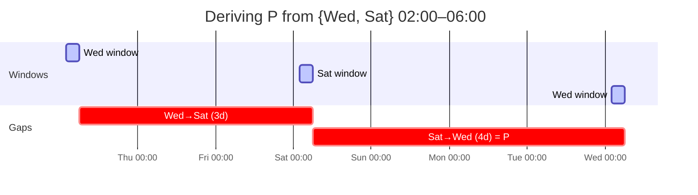
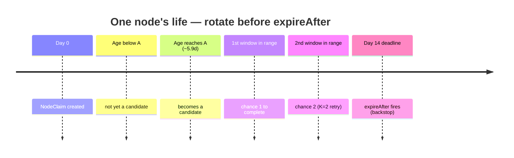
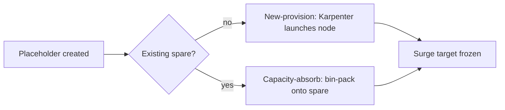
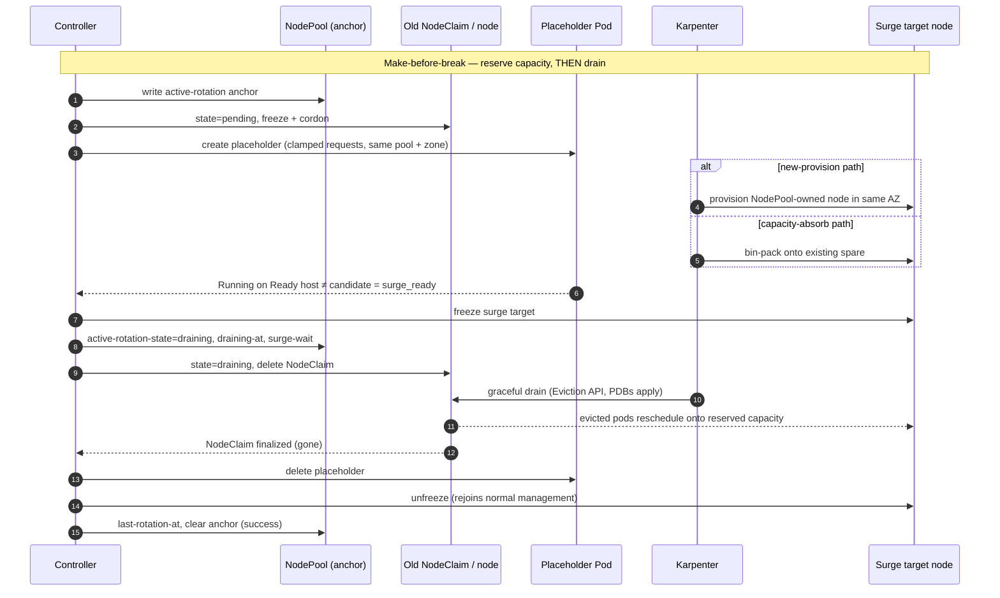

# 3. Design

## 3.1 Maintenance Window

::: tip What this section defines
The maintenance window controls when rotations may **start**. In-flight rotations complete past the boundary. The worst-case window period `P` feeds the `ageThreshold` derivation (§3.2).
:::

```yaml
maintenanceWindows:        # a list; effective window = UNION of all entries
  - timezone: Asia/Tokyo   # IANA tz database name
    days: [Wed, Sat]       # Mon/Tue/Wed/Thu/Fri/Sat/Sun
    start: "02:00"
    end:   "06:00"
```

### Semantics

- The reconciler is **always running**; window membership is evaluated each tick (1-minute).
- `maintenanceWindows` is a **list**; the effective window is the **union** of all entries.
- Outside the union the reconcile loop is a no-op.
- The window controls only **rotation starts**. In-flight rotations continue past the boundary.
- A **freeze** annotation (`noderotation.io/freeze=<RFC3339 timestamp>`) suppresses rotation until that time.

### Freeze behavior

Unlike the window (which gates only starts), a freeze also **holds an in-flight `pending` rotation**:

- Suspends **escalation only** — placeholder (re)creation and the `draining` transition
- **Passive bookkeeping keeps running** — re-asserting `do-not-disrupt`/cordon markers, persisting `surge-claim` identification
- If the freeze outlasts `readyTimeout` → normal failure-path rollback
- A rotation already in `draining` continues to completion (aborting mid-drain is unsafe)

### Worst-case window period `P`

`P` is the largest gap between the start of one occurrence and the start of the next over the recurring cycle.



- **Example:** union `{Wed, Sat}` 02:00–06:00 → gaps `3d` and `4d` → `P = 4d`
- **Continuously-open (24/7) union:** `P` collapses to the reconcile-tick granularity (not `7d`)
- **DST note:** `P` is computed over the recurring wall-clock cycle. A DST transition can shift an individual gap by ±1h; v1 treats this as a known approximation

## 3.2 Candidate Selection

::: tip What this section defines
Three questions: **(1)** when does a node become a candidate? **(2)** how is `ageThreshold` derived so the controller finishes before `expireAfter`? **(3)** what validations ensure feasibility? Core formula: `A = E − (K·P + t_rot)`.
:::

### Selection conditions

A `NodeClaim` becomes a candidate when **all** of the following hold:

| Condition | Notes |
|-----------|-------|
| `now() > deadline − leadTime` | Anchored on each NodeClaim's **own** `spec.expireAfter` |
| Belongs to a governed NodePool | Matched by a `RotationPolicy` (§5.4) |
| `Ready == True` | NotReady → left to Auto Repair / backstop |
| `deletionTimestamp` unset | Already-deleting → excluded |
| `state` empty or `failed` past backoff | `pending`/`draining` in-flight; `expired` terminal |
| No operator `do-not-disrupt` | Operator's own opt-out honored |

- **Deadline computation:** `deadline = creationTimestamp + NodeClaim.spec.expireAfter`
- **Ordering:** earliest deadline first, ties broken by oldest `creationTimestamp`, then name
- **Heterogeneous `expireAfter`:** a younger claim with a shorter `expireAfter` can have an earlier deadline and is rotated first
- **Operator opt-out:** `karpenter.sh/do-not-disrupt: "true"` on the Node (without `do-not-disrupt-owned` marker) excludes the claim from proactive rotation while keeping its `expireAfter` backstop

### Deriving `ageThreshold`

Rather than hand-tuning (error-prone — too loose lets Forceful Expiration fire), the controller **derives `ageThreshold` per NodePool** from the schedule and target rotation chances.

**The central race:** Forceful Expiration fires at each node's `deadline` regardless of windows or PDBs. The controller must finish a graceful surge rotation **before** that moment.



**Formula:**

```
ageThreshold (A) = E − (K·P + t_rot)
```

Read `leadTime = K·P + t_rot` left to right:
- `K` worst-case window cycles (`K·P`) to *catch* a window
- Plus one completion time (`t_rot`) to *finish* inside it
- Guarantees `K` maintenance windows with enough headroom before `expireAfter`

#### Symbols (authoritative source)

| Symbol | Source |
|--------|--------|
| `E` | Per-node: **`NodeClaim.spec.expireAfter`** (authoritative). Template used only as representative for validation |
| `tGP` | Per-node: `NodeClaim.spec.terminationGracePeriod`; template as representative |
| `P` | Derived from `maintenanceWindows` union (§3.1) |
| `t_rot` | `readyTimeout + tGP + buffer`. When `tGP` unset → fixed fallback (e.g. `1h`) |
| `t_rot_est` | `provisioningEstimate + drainEstimate`. Layer-2 only, no deadline terms |
| `buffer` | Fixed `4·shortRequeue = 2m`. Deadline-side only, not in `t_rot_est` |

#### Authoritative expiry source

The per-node trigger reads from **`NodeClaim.spec.expireAfter`**, anchored at that NodeClaim's `creationTimestamp`. Later edits to the NodePool template do **not** propagate to existing NodeClaims (only trigger drift). The template `E` is used solely as the representative for per-NodePool validation and metrics.

#### Margin and `cooldownAfter`

- The bound is **tight** — exactly `K` chances, no built-in slack
- Safety margin comes from `K` itself — `K ≥ 2` recommended
- `cooldownAfter` is the post-success settle between consecutive rotations — **not** part of `t_rot`
- `failurePause` (gate B, §4.4, ADR-0004) is a separate field feeding no throughput term

::: details Validation details (layers 1–3) — click to expand

#### Layer 1 — scheduling feasibility

| Condition | Outcome |
|-----------|---------|
| `P = 0` (no window occurrences) | **fatal** (`NoWindows`) |
| `K < 1` | **fatal** — invalid config |
| `K < 2` (i.e. `K = 1`) | **warn** — no retry if window missed |
| `A ≤ 0` (`E ≤ K·P + t_rot`) | **fatal** — raise `E`, add windows, or lower `K` |
| `0 < A < P` | **warn** — extremely aggressive rotation |
| Explicit override with `G < 1` | **fatal** — override rejected |
| Explicit override with `1 ≤ G < K` | **warn** — weakened chances |
| `E + tGP > 21d` | **warn** (`HardCapExceeded`) — Auto Mode violation |
| `tGP` unset | **warn** — drain phase unbounded |
| `retryBackoff < readyTimeout` | **warn** — retries faster than attempts |
| `spec.limits` no headroom | **warn** — surge cannot land |

#### Layer 2 — throughput

Per-occurrence capacity: `C = m · ceil(D / (t_rot_est + cooldownAfter))`.

- **`C` uses `t_rot_est`** (expected service time), not `t_rot` (deadline bound)
- Every positive-length occurrence admits at least one start (`C ≥ 1`)
- If arrival exceeds capacity (`C < N · P / A`): **warn** — widen windows or add occurrences

**Synchronized batch:** `N` nodes with one shared deadline. Completes gracefully only when `K · C ≥ N`. Otherwise **warn** (`ThroughputBurstShortfall`).

**Spillover:** when `t_rot_est + cooldownAfter > gap`, a rotation started late carries into the next occurrence. **warn** (`RotationSpansNextWindow`) — adjacent occurrences do not each deliver full `C`.

#### Layer 3 — per-node runtime

The template-level checks above don't prove every existing claim is satisfiable. On each reconcile the controller also checks every in-scope NodeClaim against its **own** `spec.expireAfter`:

- `E_node ≤ K·P + t_rot` (per-node `A ≤ 0`) → counted in `noderotation_short_lead_nodes`, warned via `ShortLead` Event
- Rotated **best-effort at the earliest opportunity**
- Once `deletionTimestamp` is set → excluded from selection, abort path applies (§5.2)

:::

::: details Worked example — click to expand

**Setup:** Auto Mode, `tGP` lowered to `1h`, `E = 14d`, union `{Wed, Sat}` 02:00–06:00.

- `P = 4d`
- `t_rot = 15m + 1h + 2m ≈ 1h17m`
- `K = 2`
- `A = 14d − (2·4d + 1h17m) ≈ 5.9d`

Nodes become candidates at ~5.9d and are guaranteed 2 windows before 14d.

**Throughput:**
- `provisioningEstimate = min(15m, 5m) = 5m`
- `drainEstimate = min(1h, 10m) = 10m`
- `t_rot_est = 15m`
- `C = ceil(4h / (15m + 10m)) = 10` per occurrence

**Fatal example:** weekly-only window `{Sat}` → `P = 7d` → `A = 14d − (14d + 1h17m) ≈ −1h17m ≤ 0` → **fatal**. Fix: raise `E` to ~20d or add a window day.

**Calibration note:** with stock `tGP = 24h`, `t_rot ≈ 24h17m` but `t_rot_est` remains `15m` (same `C = 10`). Lowering `tGP` helps by: (1) lengthening `A`, (2) relaxing the 21-day cap. Pick `tGP` from risk tolerance; pick `drainEstimate`/`provisioningEstimate` from observed durations.

:::

## 3.3 Surge Sequence

::: tip What this section defines
A single reconcile cycle handles **one** node: serial per NodePool (`maxUnavailable = 1`), concurrent across NodePools. The placeholder Pod induces NodePool-owned replacement capacity.
:::

### Why same-NodePool (not a standalone NodeClaim)

A standalone `NodeClaim` produces an **unowned** node outside NodePool accounting, expiry, drift, and disruption budgets — breaking intentional NodePool separation.

### The placeholder Pod

| Property | Value |
|----------|-------|
| Kind | Bare Pod (no controller) |
| Priority | Dedicated negative `PriorityClass` |
| Preemption | `preemptionPolicy: Never` |
| Requests | Reschedulable Pod sum (clamped) |
| Node selector | `karpenter.sh/nodepool = <pool>` |
| Node affinity | Soft: avoid candidate + near-deadline |
| Tolerations | From NodePool `spec.template.spec.taints` |

#### Request sum exclusions

Pods that Karpenter does not need to re-fit:

- **DaemonSet Pods** — Karpenter adds overhead to every new node (double-count)
- **Mirror / static Pods**
- **Completed Pods** (`Succeeded` / `Failed`)
- **Node-pinned Pods** (hostname affinity)

#### Hostname exclusion (soft, not hard)

- Candidate exclusion enforced by the **cordon**, not this preference
- Near-deadline exclusion is best-effort
- **Why not required (issue #96):** Karpenter rejects required `kubernetes.io/hostname` affinity (restricted label)
- Exclusion lists recomputed on each (re)creation; stale lifetime ≤ `readyTimeout`

#### Two provisioning paths



- **New-provision:** Karpenter provisions a NodePool-owned node in the same AZ
- **Capacity-absorb:** scheduler places placeholder onto pre-existing spare capacity

Either way, the host becomes the **surge target**, frozen for the rotation's duration.

### Placeholder sizing clamp (issue #224)

**Problem:** Karpenter caches one `allocatable` per instance type, but actual allocatable can be higher per-AZ. A node filled past the cached estimate produces an unprovisionable placeholder.

**Solution:**

```
limit    = NodeClaim.status.allocatable − DaemonSet overhead   (per resource, floored at 0)
requests = min(reschedulable sum, limit)                        (per resource)
```

- Uses `status.allocatable` — no instance-type or cache knowledge needed
- If `status.allocatable` absent → clamp is a no-op
- `surge_headroom` (§5.2) tests the **clamped** footprint

**Edge cases:**

- **Refused** (`limit ≤ 0`): DaemonSet overhead exhausts allocatable → placeholder keeps full drain, stays unschedulable, rotation rolls back
- **Band-exceeded** (shortfall > measured band): `SurgeClampBandExceeded` Warning Event; rotation proceeds
- **Common case** (fits under limit): silent

### Placeholder priority and preemption

- **Victim by design:** negative priority + `preemptionPolicy: Never` → workload preempts it; it never preempts anything
- **Bare Pod:** when preempted, simply gone — state machine detects and recreates (bounded by `readyTimeout`)
- **Hostile preemption:** repeated preemption self-terminates at `readyTimeout` → clean rollback

### Sequence diagram (happy path)



#### `surge_ready` conditions

The placeholder must be:
- **Running** and **not terminating** (`deletionTimestamp` unset)
- On a **Ready** host ≠ candidate node
- Host's `karpenter.sh/nodepool` label == pool name

A preempted placeholder stays Running with `deletionTimestamp` set → not ready (reservation being removed). Recreated once gone, bounded by `readyTimeout`.

#### Capacity reservation semantics

The placeholder reserves one node's worth of capacity. The guard is **physical reservation**: `surge_ready` requires the placeholder to be Running on a Ready node other than the candidate. Whether new or pre-existing, the host's admission means reschedulable capacity is physically held.

::: warning Absorb-path limitation
On the absorb path, the reservation is aggregate — one node's requests held on a host already running other Pods. An individual displaced Pod can still fail to use it (pod anti-affinity, `hostPort` collisions). The controller guarantees node-level capacity; per-Pod placement is the scheduler's and PDB's domain (§3.5).
:::

## 3.4 Mid-surge Protection

::: tip What this section defines
While old and new nodes coexist, the controller prevents Karpenter's optimizer from consolidating/drifting the half-built surge pair.
:::

### Mechanism: `do-not-disrupt` annotation

Applied to **both** the old node and the surge target for the rotation's duration.

#### What it blocks

| Disruption type | Blocked? |
|-----------------|----------|
| Consolidation | Yes |
| Drift | Yes |
| Emptiness | Yes |
| Forceful Expiration | **No** |
| Interruption | **No** |
| Node Repair | **No** |

- Winning the race against `expireAfter` is `leadTime`'s job (§3.2), not this annotation's
- The annotation prevents the optimizer from disrupting the half-built pair

#### Ownership tracking

- `noderotation.io/do-not-disrupt-owned=true` written only when the controller applies `do-not-disrupt`
- Operator's pre-existing `do-not-disrupt: true` (no marker) is **never touched**
- Non-`true` values are not operator protection — overwritten and owned
- Cleanup removes `do-not-disrupt` only where the owned marker is present

#### `surge-for` marker

Each frozen node carries `noderotation.io/surge-for=<old NodeClaim name>`:
- Attributes the freeze to this rotation
- Finds the surge target after old NodeClaim deletion
- Does **not** carry `do-not-disrupt` ownership semantics

### Mechanism: cordon

On entering `pending`, the controller **cordons the candidate node**:

- **Purpose:** prevent new Pods landing during surge wait (placeholder requests are a snapshot)
- **Marker:** `noderotation.io/cordoned=true` — rollback/sweep undo only the controller's cordon
- **Conditional:** already `unschedulable` without marker → no-op (operator's cordon not adopted)
- **Not a rotation veto:** a cordoned node is still selected. Use `freeze` to suppress rotation

### Residual risk

If the old node's `deadline` arrives while the surge is still waiting → Karpenter force-expires on schedule. This is a tight-`leadTime` / last-window edge case that **degrades to the native baseline** (§3.9), not a prevented scenario.

## 3.5 Pod-level Behavior

::: tip Key point
Make-before-break is at the **node** level, not Pod level. Pod-level safety is delegated to PDB + replica headroom.
:::

The controller does **not** perform a rolling update of Pods. The surge node is added as **empty capacity**.

When the old `NodeClaim` is deleted:
1. Karpenter's termination controller drains via the **Eviction API** (PDBs respected)
2. Each evicted Pod is deleted
3. The owning workload controller creates a replacement Pod
4. The scheduler places it onto available capacity (typically the surge node)

This is **evict-then-reschedule** — a replacement Pod is not guaranteed `Ready` before the old terminates (§4.1).

**The surge node's role:** pre-stage a landing zone so PDB-gated eviction proceeds without a long pending window.

- **Strict PDB** (`minAvailable` = desired count): eviction blocks until replacements are `Ready` → effectively Pod-level make-before-break (enabled by the surge node's capacity)
- **Loose/absent PDB:** evictions proceed in bulk, `readyReplicas` dips (§4.1)

**Summary:** the controller guarantees a node-level surge; Pod-level make-before-break is achieved by PDB + replica headroom, which the surge node's capacity *enables* — consistent with G4.

## 3.6 Forceful Fallback (opt-in)

::: tip What this section defines
When `surge.forcefulFallback.enabled: true` and a graceful surge cannot finish before the candidate's deadline, the controller deletes the `NodeClaim` **surge-less, inside the window**, via the voluntary path (PDBs apply).
:::

### Trigger

```
deadline − now < t_rot
```

Where `deadline = creationTimestamp + spec.expireAfter` and `t_rot = readyTimeout + tGP + buffer`.

### Behavior

- Deletes old `NodeClaim` in-window **without** make-before-break (break-before-make)
- Still via the voluntary path — **PDBs respected** up to `terminationGracePeriod`
- Relaxes only the node-level surge property, not "never bypasses Karpenter" or G4
- Pulls the otherwise-uncontrolled expiration into the window
- Drops `readyTimeout` and provisioning wait → raises throughput

### Constraints

- Serial per NodePool (`maxUnavailable = 1`)
- A candidate with `expireAfter: Never` (nil) has no deadline → never qualifies
- Default **off** — when off, surplus nodes degrade to native `expireAfter` baseline (§3.9)
- Recorded via `noderotation.io/rotation-mode = forceful-fallback` on the anchor (§5.3)
- Emits `ForcefulFallback` Warning Event + `noderotation_forceful_fallback_total` counter (§4.2)

## 3.7 Zonal Workloads

::: tip What this section defines
Zonal-PV Pods can only reschedule in the same AZ. The placeholder replicates the candidate's zone (and other configurable requirements) so the surge node lands in the correct AZ.
:::

### Problem

A Pod bound to a zonal PersistentVolume (EBS `gp3`/`io2`) can only reschedule in the **same AZ**. If the surge node lands in a different AZ, that Pod stays `Pending`.

### Solution: `matchNodeRequirements`

The placeholder replicates configurable scheduling requirements from the candidate node:

| Category | Default keys | Purpose |
|----------|-------------|---------|
| `required` | `topology.kubernetes.io/zone`, `kubernetes.io/arch`, `karpenter.sh/capacity-type` | Pin surge to same AZ, arch, capacity type |
| `preferred` | *(empty)* | Relaxed under capacity pressure |

- Operators add keys for stricter parity (instance type, custom labels)
- Move keys to `preferred` to trade strictness for schedulability

### Requirement resolution

Keys are read from the candidate `NodeClaim.spec.requirements` and node labels, **intersected with the NodePool's allowed requirements**:

- Intersection keeps the placeholder schedulable within the pool
- Node label is **authoritative** (actual placement) and wins on conflict
- For keys not surfaced as labels → `NodeClaim.spec.requirements` `In` values used
- Absent from both sources → skipped
- Numeric operators (`Gt`/`Lt`/`Gte`/`Lte`) handled correctly — never silently weakened
- Removing `topology.kubernetes.io/zone` from `required` → **warn** (zonal-PV Pods may strand)

### Limitations

- Only re-creates a same-AZ landing zone; does **not** move storage
- CSI driver re-attaches the existing volume once the replacement Pod is scheduled
- If the AZ has no schedulable capacity → rolls back via `readyTimeout`; backstop applies
- NodePools fronting zonal-PV workloads should ensure per-AZ surge headroom (R3)

## 3.8 Rollback Behavior

| Failure | Action |
|---------|--------|
| New node not Ready within timeout | Reap surge claim, delete placeholder, unfreeze, record failure |
| New node NotReady after old deleted | Drain in flight, cannot reverse; Karpenter reconciles capacity |
| Karpenter API unavailable | Skip; next reconcile retries |
| Controller dies mid-surge | Resumes from `active-rotation` anchor (§5.2); idempotent re-assertion |

### Timeout rollback detail

When `readyTimeout` expires:

1. **Reap the induced surge NodeClaim** — identified from `noderotation.io/surge-claim` (persisted as soon as placeholder's bind target is observable)
2. **Unfreeze nodes** — remove controller's `do-not-disrupt` (by owned marker) and cordon (by `cordoned` marker)
3. **Record failure** — write `last-failure-at` on NodePool, clear anchor, emit failure metric + alert

#### Surge-claim identification

The `surge-claim` annotation is persisted by the pending handler **as soon as the placeholder's bind target is observable** — `spec.nodeName` (the only scheduler-visible signal for a non-preempting Pod). Fallback resolution order on failure:

1. Re-resolve from a still-present placeholder
2. The pool's `NodeClaim` created after `started-at` with no registered Node

#### Reap guards

Two guards prevent reaping the wrong claim:
- Must be **created after `started-at`** (pre-existing capacity-absorb hosts are never surge debris)
- Node must host **only the placeholder** + DaemonSets (no real Pods)

::: warning
v1 processes one node per cycle. Unprocessed candidates roll to the next window. The `expireAfter` backstop ensures eventual rotation.
:::

## 3.9 Backstop Behavior

::: tip Key point
Every failure mode degrades onto Karpenter's native Forceful Expiration — **never worse than the status quo** without this controller.
:::

If the controller is unavailable, the safety net engages in order:

1. **Consolidation / Drift** — may still rotate some nodes via the voluntary path
2. **`expireAfter`** — triggers Forceful drain on overdue nodes
3. **`terminationGracePeriod`** — bounds the drain
4. **Auto Mode 21-day hard cap** — final ceiling

### Stale `do-not-disrupt` is not a risk

A stale `karpenter.sh/do-not-disrupt` left by a crashed controller:
- Suppresses only **voluntary** disruption (path 1)
- Does **not** block `expireAfter` (path 2) — the node cannot outlive its deadline
- The startup sweep clears it, but the marker was never extending node life

### Graceful degradation guarantee

The controller only ever moves rotation **earlier** and makes it **graceful**. It never:
- Removes the safety net
- Extends a node's life beyond `expireAfter` (node-level `do-not-disrupt` has no effect on it)

The **worst case equals today's baseline** — forceful, but bounded. Safe to adopt incrementally.

### When graceful guarantee is impossible

Once capacity is below demand (`C · A < N · P` or a batch with `N > K·C`), some forceful disruption is unavoidable:

- **Default:** happens at the native, uncontrolled `expireAfter` deadline
- **With `forcefulFallback`:** the controller performs a controlled surge-less rotation inside the window (§3.6)
- `NodeClaim.spec` is immutable — the controller cannot retime `expireAfter`; the only lever is replacement
