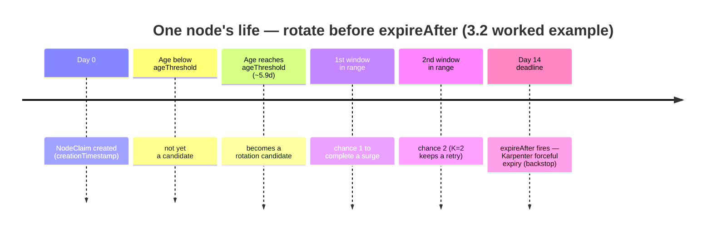
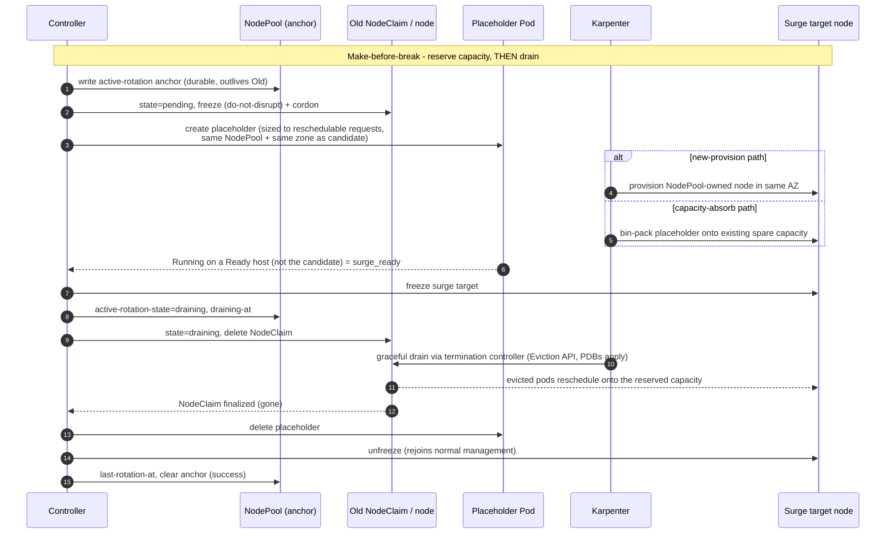

# 3. Design

## 3.1 Maintenance Window

```yaml
maintenanceWindows:        # a list; the effective window is the UNION of all entries
  - timezone: Asia/Tokyo   # IANA tz database name
    days: [Wed, Sat]       # ISO weekday names: Mon/Tue/Wed/Thu/Fri/Sat/Sun
    start: "02:00"
    end:   "06:00"
```

**Semantics**:

- The reconciler is **always running**; window membership is evaluated on each reconcile tick (1-minute Ticker).
- `maintenanceWindows` is a **list**; the effective maintenance window is the **union** of all entries. This lets operators combine schedules (e.g., a weekday slot plus a weekend slot) to increase rotation frequency.
- Outside the (union) window the reconcile loop is a no-op.
- The window controls only **rotation starts**. An in-flight rotation continues past the window boundary (aborting mid-drain is more dangerous than letting it complete).
- A single `NodePool` may be **frozen** by an annotation (e.g., `noderotation.io/freeze=<RFC3339 timestamp>`) to suppress rotation until that time (use case: business-critical periods). Unlike the window — which gates only *starts* (above) — a freeze also **holds an in-flight rotation that is still in `pending`**: the drain has not begun, so pausing is safe, and the pending handler stops escalating while the freeze is in effect (§5.2). The hold suspends only **escalation** — placeholder (re)creation and the transition to `draining`; passive bookkeeping (re-asserting the protective `do-not-disrupt`/cordon markers, persisting the `surge-claim` identification) keeps running, so a freeze never weakens the §3.3 crash-recovery guarantees. If the freeze outlasts `readyTimeout` the attempt simply rolls back through the normal failure path. A rotation already in `draining` continues to completion, for the same reason aborting mid-drain is not attempted.

The **worst-case window period `P`** — the largest gap between the start of one window occurrence and the start of the next over the recurring cycle — is derived from this union and feeds the `ageThreshold` derivation in §3.2. For example, the union `{Wed 02:00, Sat 02:00}` has gaps `Wed→Sat = 3d` and `Sat→Wed = 4d`, so `P = 4d`. A **continuously-open (24/7) union** — one whose occurrences merge to cover the entire week, e.g. across timezones — has no gap between rotation opportunities, so `P` collapses to the reconcile-tick granularity rather than the full `7d` week wrap (a zero `P` is undefined and reported as a NoWindows fatal, §3.2); an always-open schedule therefore permits rotation at any time and is never rejected as infeasible for that reason.

> **Note (DST).** `P` is computed over the recurring **wall-clock** cycle. A daylight-saving transition can shift an individual gap by ±1h; v1 treats this as a known approximation and does not special-case it.

## 3.2 Candidate Selection

A `NodeClaim` becomes a rotation candidate when **all** of the following hold:

| Condition | Default | Notes |
|-----------|---------|-------|
| `now() > deadline − leadTime`, where `deadline = NodeClaim.metadata.creationTimestamp + NodeClaim.spec.expireAfter` and `leadTime = K·P + t_rot` | `leadTime` is **derived** (see below), not set directly | Anchored on each NodeClaim's **own** `spec.expireAfter` (its authoritative expiry), **not** the NodePool template. The derived `ageThreshold` is the age-equivalent of this trigger; defaults to `auto`, an explicit override is allowed but still validated |
| Belongs to a `NodePool` governed by a `RotationPolicy` | Required | A `NodePool` matched by some `RotationPolicy.spec.nodePoolSelector` is in scope; an unmatched pool is not rotated (§5.4) |
| `status.conditions[Ready] == True` | Required | NotReady NodeClaims are skipped — an already-unhealthy node is left to EKS Node Auto Repair and the `expireAfter` backstop, not rotated here (the controller only owns the health of nodes it created during a surge) |
| `metadata.deletionTimestamp` is unset | Required | A claim already being deleted — typically Forceful Expiration in progress (under Auto Mode's `tGP = 24h` a force-draining claim stays alive, and even `Ready`, for hours) — can no longer be rotated gracefully. Selecting it would seize the per-NodePool serial gate only to abort immediately, over and over, livelocking selection and starving every other candidate (§5.2); the §5.2 abort path handles the one rotation such a claim may already be in |
| `metadata.annotations["noderotation.io/state"]` is empty, or `failed` past its escalated backoff | Required | `pending`/`draining` are in-flight and driven by §5.2 step 1, not re-selected here; `failed` is retried after an **escalating** backoff (doubling per consecutive failure, §5.3); `expired` is **terminal** — a claim caught force-expiring mid-rotation (§5.2) is never re-selected |
| Node does not carry an operator-set `karpenter.sh/do-not-disrupt: "true"` | Required | An operator's own Karpenter disruption opt-out is honored here too: read from the candidate's **Node** (Karpenter enforces `do-not-disrupt` on the Node, not the NodeClaim, for registered nodes), and only when the controller's own surge marker `noderotation.io/do-not-disrupt-owned` is **absent** — so the controller's own `do-not-disrupt` on a mid-surge candidate is not itself an opt-out (§3.3, §5.3). The claim keeps its `expireAfter` backstop; the controller only declines to *proactively* rotate it. Eligibility-only: does not affect the NodePool node count `N` used in feasibility validation or the short-lead accounting (below) |

When multiple claims are eligible they are sorted by **earliest deadline first** — deadline `= creationTimestamp + spec.expireAfter`, the Forceful Expiration instant this rotation races — ties broken by oldest `creationTimestamp` then NodeClaim name. Ordering by deadline rather than raw `creationTimestamp` rotates the most at-risk node first: when `expireAfter` is **heterogeneous** across claims (e.g. after the NodePool template `E` was raised, already-stamped claims keep the shorter value), a **younger** claim with a **shorter** `expireAfter` can reach its deadline before an older claim with a longer one, and must be rotated first or it races its own Forceful Expiration. For the common **homogeneous-`expireAfter`** case deadline order is identical to oldest-first, so the pick is unchanged. The `creationTimestamp`/name tiebreak matters because `creationTimestamp` is second-granular, so claims batch-provisioned by Karpenter routinely share a deadline — without a stable order the pick would follow nondeterministic list order and could drift across reconciles. Under an explicit `ageThreshold` override the trigger is purely age-based and every eligible claim shares one threshold, so ordering degrades to oldest-`creationTimestamp`-first (identical to homogeneous-`expireAfter` behavior).

### Deriving `ageThreshold` from the desired rotation chances

Rather than hand-tuning `ageThreshold` (which is error-prone — a too-loose value lets Forceful Expiration fire before a window arrives), the controller **derives it per NodePool** from the schedule and a target number of rotation chances.

> **This is the central race.** Forceful Expiration fires at each node's `deadline` regardless of maintenance windows or PDBs, so the controller must *finish* a graceful surge rotation **before** that moment — every cycle. Candidate selection **is** that lookahead: a node is selected once its `deadline` falls within `leadTime = K·P + t_rot` of now (equivalently, `age > ageThreshold`). Read `leadTime` left to right — `K` worst-case window cycles (`K·P`) to *catch* a window, plus one node's completion time (`t_rot`) to *finish* inside it — and it guarantees the node sees at least `K` maintenance windows with enough headroom to complete before `expireAfter` can fire. `K ≥ 2` keeps a retry in hand if a window is missed or slow. The derivation below picks the largest such threshold so rotation still happens as late as safely possible.



**Symbols** (a quick glossary of these is in §1.4; the **Source** column below is the authoritative per-node vs NodePool-template distinction)

| Symbol | Meaning | Source |
|--------|---------|--------|
| `E` | `expireAfter` | Per-node: **`NodeClaim.spec.expireAfter`** (authoritative; anchored at the NodeClaim's `creationTimestamp`). NodePool `spec.template.spec.expireAfter` is used only as the **representative** for per-NodePool validation/logging — it does **not** propagate to existing NodeClaims (see note below) |
| `tGP` | `terminationGracePeriod` | Per-node: `NodeClaim.spec.terminationGracePeriod`; NodePool `spec.template.spec.terminationGracePeriod` as the representative |
| `P` | worst-case window period (largest gap between consecutive window occurrences) | derived from the `maintenanceWindows` union (§3.1) |
| `t_rot` | upper bound on a single node's rotation time = `readyTimeout + tGP + buffer` (**`cooldownAfter` is not included** — the node is already drained before the cooldown; see the margin note below). When `tGP` is unset (self-managed Karpenter allows nil), the **same fixed fallback bound** that `drain_bound` uses (§5.2, e.g. `1h`) is substituted for `tGP` here too — the derivation and layer-2 check below would otherwise be undefined exactly when the drain is unbounded | derived from config + NodePool |
| `K` | desired guaranteed rotation chances (`minRotationChances`) | user-set; floor **1** |

**Derivation** — pick the *largest* threshold that still guarantees `K` completable chances inside `[ageThreshold, E)`, so rotation happens as late as safely possible (minimizing churn and surge cost):

```
ageThreshold (A) = E − (K·P + t_rot)
```

This holds because the usable interval `[A, E − t_rot]` then spans at least `K` window occurrences in the worst phase (`floor(((E − t_rot) − A) / P) ≥ K`), each with `t_rot` of headroom to complete before `E`.

> **Margin.** The bound is **tight**: the worst-phase guarantee is *exactly* `K` (`floor(K·P / P) = K`), with no built-in slack. The tightness also inherits the §3.1 DST approximation: `P` is a wall-clock worst case, so a fall-back transition can stretch a single gap to `P + 1h`, which in the tightest phase can cost one of the `K` chances. Any safety margin must therefore come from `K` itself — `K ≥ 2` is recommended so a single missed or slow window (or a DST-stretched gap) still leaves a retry. `cooldownAfter` is the settle pause *between* consecutive rotations within a window; it does **not** count toward a single node's completion time (`t_rot`, which is why it was removed above) but it **does** factor into throughput (layer 2 below).

> **Authoritative expiry source.** The deadline that drives the *per-node* trigger is read from each **`NodeClaim.spec.expireAfter`**, anchored at that NodeClaim's `creationTimestamp` — **not** from the NodePool's `spec.template.spec.expireAfter`. Karpenter stamps `expireAfter` onto the NodeClaim at creation, and Forceful Expiration fires at `creationTimestamp + NodeClaim.spec.expireAfter`. Later edits to the NodePool template do **not** propagate to existing NodeClaims; they only trigger drift-based replacement. The controller therefore anchors `leadTime` on each node's own `deadline`, and uses the template `E` solely as the **representative** value for the per-NodePool startup validation and the logged/derived `ageThreshold` (§4.2). When a node's own `spec.expireAfter` differs from the template (e.g. mid-drift, or after a template change), its trigger follows its own value — so the identity `now() > deadline − leadTime ⟺ age > ageThreshold` holds exactly only when the two coincide.

**Validation** (layer 1 — scheduling feasibility)

| Condition | Outcome |
|-----------|---------|
| `K < 1` | **fatal** — invalid config |
| `K < 2` (i.e. `K = 1`) | **warn** — a single missed/failed window leaves no retry before Forceful Expiration; in a DST-observing timezone a fall-back transition can stretch one gap past `P` (§3.1 note), so the *exactly-K* bound can then mean **zero** completable chances |
| `A ≤ 0` (i.e. `E ≤ K·P + t_rot`; the schedule cannot guarantee even `K` chances) | **fatal** — raise `E` (Auto Mode allows up to `21d − tGP`), add window occurrences to shrink `P`, or lower `K`. Note that raising the template `E` heals **new** NodeClaims only — existing ones keep their stamped value and are surfaced by the per-node check (layer 3 below) until they rotate out |
| `0 < A < P` (a node becomes a candidate before it has lived even one window period) | **warn** — extremely aggressive: nodes rotate very young, maximizing churn/surge cost. Raise `E` or lower `K` |
| explicit `ageThreshold` override with recomputed `G < 1` (i.e. `floor(((E − t_rot) − A) / P) < 1` for the overridden `A`; see the `G` note below) | **fatal** — the override leaves no completable window occurrence before `E`, so the §2.2 invariant ("validation fails when the schedule cannot guarantee the configured chances") would be silently broken. The override is rejected, not merely observed |
| explicit `ageThreshold` override with recomputed `1 ≤ G < K` | **warn** — the override weakens the requested `minRotationChances`; `G` (not `K`) is what the schedule actually guarantees |
| Auto Mode and `E + tGP > 21d` | **warn** (`HardCapExceeded`) — violates the hard cap. Because Auto Mode is not reliably detectable from the NodePool API, the representative `E + tGP` is checked **unconditionally** against `21d` (a strict `>`); on self-managed Karpenter, where the cap does not apply, the warning is merely advisory and never changes `A` |
| `tGP` unset (self-managed Karpenter allows nil) | **warn** — the drain phase is then unbounded by Karpenter (a blocking PDB or stuck finalizer can hold it forever); the §5.2 stuck-drain alert **and the `t_rot` used by this derivation and layer 2** fall back to the same fixed bound (symbol table above) |
| `retryBackoff < readyTimeout` | **warn** — a failed attempt runs for up to `readyTimeout` before rolling back, so a shorter base backoff lets retries repeat the failed-surge cost (§4.4) faster than a single attempt even lasts. The per-attempt `started-at` re-stamp (§5.3) keeps retries *correct* regardless; the configuration just defeats the cost-bounding intent of the escalating backoff. The defaults (30m vs 15m) satisfy this |
| NodePool `spec.limits` resource budget (`{cpu, memory, …}`) leaves no room for the surge node's requests (the headroom for one more node is exhausted) | **warn** — surge cannot land without free budget; raise `limits` to leave headroom for one node's worth of resources. Startup uses a representative footprint; the authoritative, candidate-dependent check (`surge_headroom`, the selected candidate's reschedulable-Pod request sum) runs at rotation start, **after** candidate selection (§5.2 step 3) |

**Validation** (layer 2 — throughput) — independent of the derivation; it only **warns** and never changes `A`. Because rotations are serial within a window and separated by `cooldownAfter` (enforced as a per-NodePool start gate in §5.2 step 2), each window occurrence of duration `D` can rotate `C = m · floor(D / (t_rot + cooldownAfter))` nodes (`m = surge.maxUnavailable`, fixed at `1` in v1). This bound is deliberately **conservative**: the window gates only rotation *starts* (§3.1), so one further rotation can typically start near the window's edge and complete past it — the formula ignores that final start, erring toward a warning. If the candidate arrival rate exceeds capacity (`C < N · P / A`, where `N` is the NodePool node count), candidates accumulate and some may reach Forceful Expiration:

- **warn**: widen windows (larger `D`), add occurrences (smaller `P`), or raise `maxUnavailable` (reserved for a later version).

The steady-state condition above assumes node ages are uniformly distributed. A **synchronized batch** — `N` nodes created together (initial bring-up, scale-up, NodePool migration, post-consolidation re-packing) — shares one `creationTimestamp` and therefore one deadline, and contends for the same windows. The `leadTime` before that common deadline guarantees `K` window occurrences, each rotating at most `C`, so a synchronized batch completes gracefully only when `K · C ≥ N`. When `N > K · C` the surplus nodes miss every window and reach Forceful Expiration at the (uncontrolled) deadline — a case the steady-state average does **not** detect. This is surfaced as a separate **warn** (`ThroughputBurstShortfall`).

**Validation** (layer 3 — per-node, runtime) — the two layers above use the NodePool **template** `E`/`tGP` as representatives, but the actual trigger is per-NodeClaim (*Authoritative expiry source* above), so a passing template does not prove every *existing* claim is satisfiable — e.g. after the template `E` was raised to clear a fatal, the already-stamped claims still carry the short value. On each reconcile the controller therefore also checks every in-scope NodeClaim against its **own** `spec.expireAfter`: a claim with `E_node ≤ K·P + t_rot` (per-node `A ≤ 0`) can no longer be guaranteed `K` chances — it is counted in `noderotation_short_lead_nodes` (§4.2), warned via a `ShortLead` Warning Event on the NodeClaim (§4.2), and rotated **best-effort at the earliest opportunity** (by the trigger above it is already a candidate) — until Karpenter's forceful path actually begins: once its `deletionTimestamp` is set, it is excluded from selection (the table above) and only the §5.2 abort path applies.

> **Worked example.** Auto Mode with the NodePool's `terminationGracePeriod` **lowered from its `24h` default to `1h`** (see the calibration note below), `E = 14d`, union `{Wed, Sat} 02:00–06:00` → `P = 4d`, `t_rot ≈ 1.5h` (`readyTimeout 15m + tGP 1h + buffer`), `K = 2`. Then `A = 14d − (2·4d + 1.5h) ≈ 5.9d`: nodes become candidates at ~5.9d and are guaranteed 2 windows before 14d. Throughput `C = floor(4h / (1.5h + 10m)) = 2` per occurrence (conservative — a third rotation can still *start* before the window closes and complete past it, §3.1).
>
> A **weekly-only** window `{Sat}` has `P = 7d`, so `A = 14d − (2·7d + 1.5h) ≈ −1.5h ≤ 0` → **fatal**: weekly windows cannot guarantee 2 chances at `E = 14d`. This is exactly why a fixed `expireAfter − 4d` default was unsafe; the derivation surfaces it and tells the operator to raise `E` (to ~`20d`, giving `A ≈ 6d`) or add a window day. (Raising `E` takes effect for **new** NodeClaims only; the already-stamped ones are caught by the layer-3 per-node check until they rotate out.)
>
> **Calibration note (Auto Mode defaults).** With the stock `tGP = 24h` (§1.1), `t_rot ≈ 24.5h`. Layer 1 still passes (`A = 14d − (2·4d + 24.5h) ≈ 5d`), but layer 2 computes `C = floor(4h / (24.5h + 10m)) = 0` and warns on **every** occurrence — the model must budget the full `tGP` as potential drain time for each rotation even though typical PDB-respecting drains finish in minutes. Auto Mode operators should therefore lower the NodePool `terminationGracePeriod` to a realistic per-node drain bound (the `1h` used above). Doing so also relaxes the 21-day cap (`E + tGP ≤ 21d`, §1.1): `tGP = 1h` admits `E` up to ~`20d` — exactly the remedy suggested for the weekly-window fatal above. The trade-off is that a genuinely slow drain is force-completed after `1h` instead of `24h`; pick the bound from the workload's real PDB-respecting drain time, not from this example.

The derived `A`, the guaranteed chances `G`, and `P` are surfaced per NodePool via startup logs and metrics (§4.2). With the auto-derivation, `G = K` by construction; the separate `G` exists so that when an explicit `ageThreshold` override is used, `G` is **recomputed from that override** (`G = floor(((E − t_rot) − A) / P)`) — and not merely observed but **validated**: `G < 1` is **fatal** (the override cannot guarantee even one completable chance before `E`) and `G < K` **warns** (the override weakens the requested chances) — see the layer-1 table above. This is what "an explicit override is allowed but still validated" (§3.2 trigger row, §5.4) means concretely.

## 3.3 Surge Sequence (v1)

A single reconcile cycle handles **one** node. v1 enforces serial processing **per NodePool** (`surge.maxUnavailable = 1`) to minimize blast radius; distinct NodePools may rotate concurrently.

### Surge into the *same* NodePool — not a standalone node

The replacement node must belong to the **same NodePool** as the node being replaced. The controller therefore does **not** rotate by creating a standalone `NodeClaim`. (A standalone NodeClaim *is* provisionable — see §7.2 — but the resulting node has no NodePool owner, so its pods would persist on an unmanaged node that sits outside NodePool accounting, expiry, drift, and disruption budgets. In a cluster that deliberately separates NodePools, e.g. `api` vs `batch`, that is unacceptable.)

Instead, the controller induces Karpenter to add a NodePool-owned node by creating a temporary **placeholder Pod** — a single low-priority "pause" Pod that the controller **creates and manages directly** (deliberately *not* via a Deployment/ReplicaSet/Job). Its scheduling requirements are copied from the **candidate node** — most importantly the AZ (`topology.kubernetes.io/zone`), plus the arch / instance-type / capacity-type constraints the rescheduled Pods depend on (see *Stateful and zonal workloads* below) — and its resource requests are set to the **sum of the resource requests of the *reschedulable* Pods currently scheduled on the candidate node** — the workload that must re-land after the drain. This sum **excludes** Pods that Karpenter does not need to re-fit onto fresh capacity: **DaemonSet** Pods (kube-proxy, CNI, CSI, log shippers, …) — Karpenter already adds the DaemonSet overhead to *every* new node it provisions, so counting them here would **double-count** and over-provision — plus mirror/static Pods, completed (`Succeeded`/`Failed`) Pods, and Pods pinned to this specific node (e.g. by hostname affinity) that cannot re-land elsewhere.

A **soft** `nodeAffinity` (`preferredDuringScheduling…`, `kubernetes.io/hostname NotIn {…}`, high weight) additionally steers the placeholder away from the **candidate node itself** — Pod anti-affinity matches *Pods*, not nodes, so a hostname term is the mechanism that can rule out a specific node — along with **every node already past its own rotation trigger** (its NodeClaim's `deadline` within `leadTime`, §3.2): the placeholder should not reserve space on the very node about to be drained, nor absorb onto a host that is itself about to expire or be rotated next — that reservation would evaporate at the host's force-expiry, and the displaced Pods would be re-drained on the very next rotation. This exclusion is a **preference, not a hard required term** (issue #96): Karpenter's provisioner rejects any provisionable Pod whose **required** `nodeAffinity` references `kubernetes.io/hostname` (the key is in `sigs.k8s.io/karpenter`'s `RestrictedLabels` — Karpenter assigns hostnames itself), so a required hostname term would block the new-provision path outright, leaving only capacity-absorb. Karpenter's scheduler only *relaxes* preferred node-affinity terms and never folds them into the NodeClaim requirements it builds, so a **preferred** hostname term is never rejected and the new-provision path proceeds; `kube-scheduler` still honors the preference (high weight) when bin-packing on the capacity-absorb path. The **candidate's** exclusion is not weakened by this: the controller **cordons** the candidate (`spec.unschedulable`) when it enters `pending` — before the placeholder exists — and re-asserts the cordon every pass, so `kube-scheduler` will not bind the placeholder there, and `surge_ready` additionally re-checks that the bound host is not the candidate (§5.2) before the old node is drained. The **near-deadline** exclusion is therefore **best-effort** — consistent with the bounded residual already accepted just below. (Both exclusion lists are **computed when the placeholder is created**; a recreation after preemption (§5.2) recomputes them, so a stale snapshot lives at most one placeholder lifetime — bounded by `readyTimeout` — and the worst case is binding to a node that crossed its trigger in that gap, whose pods are then simply re-drained by that node's own rotation.)

Finally, a required **`karpenter.sh/nodepool = <candidate's NodePool>`** node selector is applied **unconditionally** — independent of the configurable `matchNodeRequirements` list (§5.4), because same-NodePool is a structural invariant (above), not a tunable. This selector, not the sizing, is what confines the reservation to the right pool: in a multi-NodePool cluster the kube-scheduler could bind the placeholder onto *another* pool's spare node, and Karpenter provisions pending pods from any compatible NodePool by weight — only the label selector rules both out, on the new-provision and the capacity-absorb path alike.

The placeholder also carries **tolerations copied from the candidate NodePool's `spec.template.spec.taints`**, so a NodePool that partitions capacity with permanent taints does not leave the placeholder unschedulable while the real Pods — which carry matching tolerations — can land; without them every rotation of such a NodePool would wait out `readyTimeout` and roll back. Only `taints` are copied, not `startupTaints` (removed once the node is `Ready`, and ignored for provisioning), and each taint becomes an exact-match toleration so the placeholder tolerates exactly the NodePool's own taints and never gains access to capacity the workload could not use. `surge_ready` additionally re-checks the host's `karpenter.sh/nodepool` label as a belt-and-suspenders guard (§5.2).

Sized and constrained this way, the placeholder forces Karpenter to provision a new node *within that NodePool* — in the same zone and large enough to host that workload — **whenever existing spare capacity cannot absorb it**. If the scheduler instead bin-packs the placeholder onto *pre-existing* spare capacity, that is equally acceptable (the **capacity-absorb path**): the placeholder is then *reserving* exactly the displaced workload's worth of existing headroom, so the drain is just as safe without a new node. This is the normal outcome for DaemonSet-heavy or low-utilization candidates whose reschedulable sum is small — nodes that would otherwise be structurally unable to rotate, since no sizing could force a new node for them. Either way, the node the placeholder lands on (the **surge target**) is frozen for the duration of the rotation (see *Guarding against mid-surge disruption* below); once the old node is drained, the placeholder is removed and the surge target remains a normal member of the NodePool.

Because the placeholder is a **bare Pod** (not backed by any controller) and is low-priority, when the rescheduled workload Pods need its space the scheduler **preempts** it and the placeholder is simply **deleted with no replacement**. (A Deployment/Job-backed pod would instead be recreated and re-pend, inducing extra node churn — which is exactly why a bare, controller-managed Pod is used.) Its only role is to reserve one node's worth of capacity until the drain lands the real Pods on it.

**Placeholder priority.** The placeholder runs under a **dedicated `PriorityClass`** with a **negative value** (`globalDefault: false`, below the `0` of normal workloads and far below the system-critical classes), and with `preemptionPolicy: Never`. This makes it the deliberate preemption *victim*: the rescheduled workload (priority `≥ 0`) preempts it as described above, while the placeholder itself **never** preempts real workloads or system-critical Pods: while pending it never evicts any existing Pod to make room — it either fits into genuinely *free* pre-existing capacity (the capacity-absorb path above) or waits for Karpenter to add a node. **Caveat — preemption is not exclusive to the rescheduled workload.** A negative priority makes the placeholder *maximally* preemptible, so the priority value alone cannot stop an **unrelated higher-priority pending Pod** from preempting it mid-surge (before the drain has even produced the workload it is holding space for). If that happens, the state machine observes the placeholder missing and recreates it (the pending handler's idempotent re-assertion, §5.2). This loop is **bounded, not perpetual**: the entire `pending` phase is capped by `readyTimeout`, after which the rotation **rolls back** and degrades to the `expireAfter` baseline (§3.3 *Rollback*) — so even a sustained hostile-preemption scenario self-terminates into a clean failure rather than churning forever.

### Guarding against mid-surge disruption

While the old and new nodes coexist, Karpenter's Consolidation/Drift could race the controller:

- the **new** node, briefly underutilized, could be judged "empty/underutilized" and consolidated away immediately;
- the **old** node could be consolidated/drifted before the controller has finished orchestrating, or be chosen for removal ahead of the intended order.

To prevent both, the controller applies `karpenter.sh/do-not-disrupt` to **both** the old node and the surge target (the node the placeholder landed on — newly provisioned or, on the capacity-absorb path, pre-existing) for the duration of the surge, and marks each frozen node with `noderotation.io/surge-for=<old NodeClaim name>` so its freeze is attributable to this rotation (§5.3) — the marker is what lets the controller find the surge target again after the old NodeClaim is gone. So that cleanup never strips an operator's own protection, the `do-not-disrupt` write is **conditional and ownership-marked**, mirroring the cordon guard below: the controller records `noderotation.io/do-not-disrupt-owned=true` only when it actually applies `do-not-disrupt`, and on a node already carrying an operator's active `do-not-disrupt: true` *without* that marker it leaves both the annotation and ownership untouched (it still writes `surge-for`, since the node belongs to the rotation). Only the literal value `true` is treated as that operator protection — Karpenter's node disruption check honors exactly `do-not-disrupt: true`, so a `false` or otherwise non-`true` value is **not** protection and the controller overwrites it to `true` and takes ownership, ensuring the surge pair is actually protected. Rollback and the startup sweep then remove `do-not-disrupt` only where the owned marker attributes it to the controller — an operator's pre-existing `do-not-disrupt` survives. (`surge-for` cannot itself carry this ownership distinction: the controller still freezes — and so labels with `surge-for` — a node an operator had already protected.) Per Karpenter's documented semantics, this annotation blocks only **voluntary disruption** (Consolidation, Drift, Emptiness) — it does **not** exclude a node from the *forceful* methods: **Forceful Expiration (`expireAfter`)**, Interruption, or Node Repair. (Confirmed in the Karpenter `nodeclaim/expiration` controller, which deletes an expired NodeClaim the moment `creationTimestamp + expireAfter` is reached without ever consulting the annotation; the node-level `do-not-disrupt` check lives solely on the voluntary candidate-selection path.) Winning the race against Forceful Expiration is therefore **not** this annotation's job — that is handled structurally by the `leadTime` sizing in §3.2, which selects each node early enough to finish a graceful surge **before** its `deadline`. The annotation's role here is narrower but still essential: it stops Karpenter's own optimizer from consolidating or drifting the half-built surge pair out from under the controller. The controller's own explicit `delete` of the old NodeClaim drains it through the voluntary (termination-controller) path regardless of the annotation. The annotations are removed at the end so the new node rejoins normal management. (**Residual risk:** because the annotation does **not** extend the old node's life, if its `deadline` arrives while the surge is still waiting for the replacement to become `Ready`, Karpenter force-expires the old node on schedule — landing the rescheduled Pods on capacity that may not yet exist. This is a tight-`leadTime` / last-window edge case; it degrades to the native baseline rather than being prevented — see §3.5. The **surge target's** own `deadline` is handled structurally instead: the placeholder's soft hostname exclusion above keeps it off any node already within `leadTime` of its own deadline on a **best-effort** basis, so a surge target normally has far more remaining life than one rotation needs. Because that exclusion is now a *preference* (issue #96), the absorb path can in a corner case still bin-pack onto a near-deadline host the scheduler had no better option than — exactly the bounded residual already documented in §3.3 (its absorbed Pods are simply re-drained by that host's own rotation).)

One further guard closes a *sizing* race rather than a disruption race: on entering `pending` the controller **cordons the candidate node** (`spec.unschedulable = true`), recording its own action with `noderotation.io/cordoned=true` so that rollback and the startup sweep undo only a cordon the controller itself applied — an operator's pre-existing cordon is never touched (§5.3). To make that guarantee implementable, `cordon()` is **conditional**: on a node that is already `unschedulable` *without* the marker it does nothing — neither flips the flag nor adds the marker — so an operator's cordon is never adopted as the controller's own. Such a node is still selected and rotated: the operator's cordon already achieves the nothing-new-lands goal, and a cordon is not a rotation veto — `freeze` (§3.1) is the mechanism for that intent.

One residual race is accepted: an operator cordon applied **mid-rotation**, after the controller's marker is already in place, is a state-level no-op that rollback's uncordon will undo; an operator who needs a node to stay cordoned across a rotation attempt should freeze the NodePool instead.

The placeholder's requests are a **snapshot** of the candidate's reschedulable Pods taken at creation time; without the cordon, a Pod newly scheduled onto the candidate during the surge wait would fall outside that reservation and could be left pending after the drain — break-before-make for exactly that delta. Cordoning closes the gap at the source: nothing new lands on the candidate once its rotation is underway. The cordon is released (together with the freeze) on rollback; on success the node is removed by the drain, so there is nothing to release.

The diagram below is the **logical** sequence of one rotation. It is **not** executed as a single blocking call: the controller implements it as a **non-blocking, requeue-driven state machine** (§5.2), persisting progress in the `noderotation.io/state` annotation on the old NodeClaim and anchoring the rotation itself in the `noderotation.io/active-rotation` annotation on the NodePool, with `noderotation.io/active-rotation-state` mirroring whether the rotation has reached `draining` — the anchor **outlives the old NodeClaim**, which is deleted when the rotation succeeds, and is what drives the completion step and its outcome (§5.3). Each wait (for `surge_ready`, then for the drain to finish) is therefore *a state that is re-evaluated on subsequent reconciles*, not a goroutine that blocks a worker.



The diagram shows the **happy path**. Each step maps to the `noderotation.io/state` annotation as labelled in §5.3, and the two failure outcomes — a `readyTimeout` rollback and a mid-surge force-expiry — are the `pending → failed` and `pending → expired` transitions of the full state machine in §5.3 (driven by the reconcile loop in §5.2).

> The placeholder's only job is to reserve exactly one node's worth of capacity ahead of the drain (make-before-break). Its requests are sized to the **sum of the candidate node's *reschedulable* Pod requests** (excluding DaemonSet, mirror, completed, and node-pinned Pods — see §3.3 above), so Karpenter launches a *new* node whenever existing spare capacity cannot fit it. The guard that protects the drain is **physical reservation**: `surge_ready` requires the placeholder to be *Running* on a *Ready* node **other than the candidate** (the candidate is ruled out at scheduling time by its **cordon**, applied in `pending` before the placeholder exists, and `surge_ready` re-checks `host != candidate` — the hostname `nodeAffinity` exclusion is now a soft *preference* and no longer hard-rules out the candidate, issue #96). Whether that host is newly provisioned or pre-existing (the capacity-absorb path above), its admission means the reschedulable workload's worth of capacity is now physically held — so the old node is never deleted without real headroom in place. One honesty note on the **absorb** path: there the reservation is an **aggregate** — one node's worth of summed requests held on a host that already runs other Pods — so an individual displaced Pod can still fail to use it even when nominal headroom exists (pod anti-affinity against the resident Pods, `hostPort` collisions, …). This is the same pod-level disclaimer as *Pod-level behavior* below: the controller guarantees node-level capacity; per-Pod placement remains the scheduler's and the PDB's domain. Whether the host's `creationTimestamp` postdates `started-at` is still recorded (event/metrics) to distinguish a true surge from capacity absorption, but it is observability, not a gate. Because these requests define the surge node's resource footprint, they are also what the `surge_headroom` pre-check tests against the NodePool's remaining `spec.limits` resource budget — the gate is therefore **candidate-dependent** and runs *after* candidate selection (§5.2 step 3), not among the candidate-independent start gates (conservative: the capacity-absorb path consumes no new budget, but v1 still requires the headroom before starting). v1 applies the exclusion filter above and no extra request padding beyond Kubernetes effective Pod requests.

### Pod-level behavior — node-level make-before-break only

The make-before-break in this design is at the **node** level, not the Pod level. The controller does **not** perform a rolling update of Pods: it does not pre-create new Pods on the surge node before terminating the old ones. The surge node is added as **empty capacity**.

When the old `NodeClaim` is deleted, Karpenter's termination controller drains the old node through the **Eviction API** (PDBs respected). Each evicted Pod is deleted, and its owning workload controller (Deployment/ReplicaSet/StatefulSet) creates a **replacement Pod** that the scheduler then places onto available capacity — typically the surge node. This is fundamentally **evict-then-reschedule**, so a replacement Pod is *not* guaranteed to be `Ready` before the old Pod terminates (see §4.1).

The surge node's role is therefore to **pre-stage a landing zone** so that PDB-gated eviction proceeds without a long pending window — not to order Pods. Pod-level safety is delegated to the workload's **PodDisruptionBudget** and replica headroom:

- With a strict PDB (e.g., `minAvailable` equal to the desired replica count), the Eviction API blocks further evictions until replacement Pods are `Ready`. Because the surge node provides the capacity for those replacements to schedule and become `Ready`, the drain effectively becomes Pod-level make-before-break.
- With a loose or absent PDB, evictions proceed in bulk and `readyReplicas` dips (§4.1).

In short: the controller guarantees a node-level surge; **Pod-level make-before-break is achieved by PDB + replica headroom, which the surge node's capacity enables — not by the controller itself** (consistent with G4).

### Window-bounded forceful fallback (opt-in)

When `surge.forcefulFallback.enabled: true` and a candidate cannot complete a graceful surge before its own deadline — evaluated in-window as `deadline − now < t_rot`, where `deadline = NodeClaim.creationTimestamp + spec.expireAfter` and `t_rot = readyTimeout + tGP + buffer` (§3.2) — the controller deletes the old `NodeClaim` **inside the maintenance window without the make-before-break surge** (break-before-make). The trigger is the same per-candidate horizon the auto-mode selector already uses; the rotation stays serial per NodePool (`surge.maxUnavailable = 1`). The drain still follows the voluntary path through Karpenter's termination controller, so **PDBs are respected up to `terminationGracePeriod`** — this relaxes only the node-level make-before-break ("surge-only") property, not "never bypasses Karpenter" or G4. It pulls the otherwise-uncontrolled `expireAfter` expiration into the window and, by dropping `readyTimeout` and the provisioning wait, raises throughput. Bypassing a blocking PDB is explicitly out of scope. A candidate with `expireAfter: Never` (nil) has no deadline and never qualifies. The fallback is disabled by default; when off, behavior is unchanged (surplus nodes degrade to the native `expireAfter` baseline, §3.5). The controller records the in-flight surge-less rotation on the NodePool anchor via the `noderotation.io/rotation-mode = forceful-fallback` annotation (§5.3) and emits a `ForcefulFallback` Warning Event and the `noderotation_forceful_fallback_total` counter (§4.2) when it begins.

### Stateful and zonal workloads — matching the replacement node's requirements

Because surge only **adds capacity** and never pins Pods to the new node (above), the rescheduled Pods land wherever the scheduler can place them. A Pod bound to a **zonal** PersistentVolume — EBS `gp3`/`io2`, or any volume whose PV carries a `topology.kubernetes.io/zone` `nodeAffinity` — can only reschedule onto a node in the **same AZ** as its volume. If the surge node is provisioned in a *different* AZ, that Pod has nowhere to land and stays `Pending` after the old node drains — defeating make-before-break for exactly the stateful workloads that need it most.

The placeholder therefore replicates the **candidate node's scheduling requirements**, not merely the NodePool's labels. **Which** requirements are replicated is **configurable** via `surge.matchNodeRequirements` (§5.4): each listed key is copied from the candidate node onto the placeholder — either as a **`required`** (hard `nodeAffinity` / `nodeSelector`, value = the candidate's) or a **`preferred`** (soft `nodeAffinity`, relaxed under capacity pressure) constraint.

- The default `required` set is **`topology.kubernetes.io/zone`** — pinning the surge node to the candidate's AZ so the existing EBS volume can re-attach — plus **`kubernetes.io/arch`** and **`karpenter.sh/capacity-type`** for arch/capacity parity. This is enough for zonal-PV rebind without pinning the exact instance type, which would needlessly shrink the schedulable pool and make same-AZ capacity harder to find.
- Operators add keys for stricter parity — e.g. `node.kubernetes.io/instance-type` (or family) for exact-type parity, or any custom node label the workload's `nodeAffinity` / `nodeSelector` / `topologySpreadConstraints` depend on — or move keys to `preferred` to trade strictness for schedulability.

The configured keys are read from the candidate `NodeClaim`'s `spec.requirements` and the candidate node's labels, **intersected with the NodePool's allowed requirements** — the intersection keeps the placeholder schedulable within the NodePool even if the NodePool template has since narrowed its allowed set (otherwise a now-disallowed candidate label would leave the placeholder unschedulable forever, tripping `readyTimeout` and rolling back). The candidate node's label is the **authoritative** source (the node's actual placement) and **wins on conflict**; for a key not surfaced as a node label — e.g. a custom parity key Karpenter constrains on the `NodeClaim` but does not project to a label — the candidate `NodeClaim`'s own `In` requirement values are used (only `In` carries concrete values to pin; other operators yield none). A key listed in config but absent from **both** sources is skipped. The intersection evaluates each NodePool requirement with its own operator — including the **numeric `Gt`/`Lt`/`Gte`/`Lte`** operators Karpenter uses for keys such as `karpenter.k8s.aws/instance-generation` (`Gte`/`Lte` are Karpenter additions to the Kubernetes `Gt`/`Lt` set): the candidate value is replicated when it satisfies the numeric bound, and dropped only when it genuinely falls outside the NodePool's allowed set (a malformed bound or non-integer node value drops the key, the schedulability-safe default). An operator-requested parity key is never silently weakened merely because its NodePool constraint is numeric. **Validation:** removing `topology.kubernetes.io/zone` from `required` **warns** — zonal-PV Pods may then strand if the surge node lands in another AZ.

This only re-creates a **same-AZ landing zone**; it does **not** move storage. The CSI driver re-attaches the existing zonal volume to the new node in that AZ once the replacement Pod is scheduled there. Cross-AZ migration of zonal storage is out of scope — surge neither can nor should do it. (Implication: if the candidate node's AZ has no schedulable capacity for a same-zone replacement, the surge cannot complete and rolls back via `readyTimeout` (§3.3 *Rollback*); the old node is left in place and the `expireAfter` backstop still applies. NodePools fronting zonal-PV workloads should ensure each in-use AZ retains surge headroom — see R3.)

### Rollback behavior

| Failure | Action |
|---------|--------|
| New node not `Ready` within timeout | **Explicitly delete the surge NodeClaim the placeholder induced, identified from `noderotation.io/surge-claim`.** That annotation is persisted by the pending handler **as soon as the placeholder's bind target (`spec.nodeName`) is observable** — the only scheduler-visible signal: `status.nominatedNodeName` appears only on a Pod that *preempts* others, which the placeholder (`preemptionPolicy: Never`) never does — not deferred to this failure path, where the placeholder (the only other source of the identity) may already be gone (preempted or externally deleted just before the timeout). A bind, however, requires a `Ready` host (the not-ready taint blocks scheduling), so the **dominant** `readyTimeout` cause — an induced instance that never registers or never reaches `Ready` — produces no bind at all and leaves the annotation unset. The failure path therefore falls back in order: re-resolve from a still-present placeholder; otherwise identify the induced claim as the NodePool's NodeClaim **created after `started-at` with no registered Node** (an unrelated scale-up claim still mid-launch can match this; reaping it is self-healing — its still-pending Pods simply make Karpenter re-provision — and accepted in v1). Only when no source resolves is the reap skipped (no-op) — the orphaned claim then stays billed until its own `expireAfter`, a bounded, alert-covered residual. Two guards keep the reap from touching the wrong claim: it must have been **created after this rotation's `started-at`** (a pre-existing capacity-absorb host is healthy production capacity, never surge debris), and its node must be **hosting nothing but the placeholder** (plus DaemonSet Pods) — a claim with **no Node object at all** (never registered) passes this guard trivially, while a NodeClaim born of an unrelated concurrent scale-up onto which the placeholder merely bin-packed, already carrying real Pods, must not be reaped. Reap first, then delete the placeholder; a crash between the two is healed by the annotation on the next pass (idempotent delete). Consolidation is *not* relied on to reap the induced claim: on a NodePool where consolidation is effectively disabled (e.g. `WhenEmpty` with a long `consolidateAfter`, or `nodes: "0"` budgets outside the window) an abandoned surge node would otherwise stay billed until its own `expireAfter`. Remove the controller's own `do-not-disrupt` (by its `noderotation.io/do-not-disrupt-owned` marker, leaving an operator's pre-existing one) and the controller's cordon (by its `noderotation.io/cordoned` marker) from **every node carrying this rotation's markers** — the old node, plus the surge target if a crash had already frozen it (symmetric with the completion handler); write `last-failure-at` on the NodePool (the pool-level inter-attempt pause, §4.4) in the same update that clears the anchor; leave the old node in place; emit failure metric + alert |
| New node becomes `NotReady` after old one was deleted | The old node's drain is already in flight and cannot be reversed; rely on Karpenter to reconcile capacity for the rescheduled pods |
| Karpenter API unavailable | Skip; the next reconcile retries |
| Controller dies mid-surge | The rotation resumes exactly from the `noderotation.io/active-rotation` anchor on the NodePool (§5.2 step 1); every state handler re-asserts its phase's side effects idempotently, so a freeze, placeholder, or delete lost to the crash is restored on the next reconcile (while the NodePool is frozen, the placeholder is the one exception — its (re)creation is escalation and waits for the freeze to lift, §3.1). A startup sweep additionally clears markers that no anchor references (the precise staleness rule is in §5.3) |

> v1 processes one node per cycle. If the maintenance window is too short to accommodate all candidates, the unprocessed ones roll over to the next window. The `expireAfter` backstop ensures eventual rotation (in the forceful path) even in pathological cases.

## 3.4 Future versions (v2)

The v1 design intentionally stops short of application-level concerns. The following is a reserved expansion point.

| Version | Addition | Trigger for adoption |
|---------|----------|----------------------|
| v1 | Surge + sequential delete | Initial release |
| v2 | Image pre-pull job pinned to the replacement node before deleting the old one | Observed image-pull latency on cold replacement nodes |

The configuration schema in §5.4 already includes a placeholder field for v2.

> Application-side warm-up (synthetic-traffic / JVM JIT priming before deleting the old node) is **not** a planned feature — it is an application-layer readiness concern owned by `readinessProbe` / `readinessGate` / ALB slow start (Non-Goal N3), and the controller has no means to observe its adoption trigger (post-replacement 5xx). A formerly reserved v3 hook was dropped from the roadmap.

## 3.5 Backstop Behavior

If the controller is unavailable, the following safety net engages in order:

1. Karpenter Consolidation / Drift may still rotate some nodes (e.g., on AMI drift)
2. NodePool `expireAfter` triggers Forceful drain on overdue nodes
3. NodePool `terminationGracePeriod` bounds the drain
4. The Auto Mode 21-day hard cap is the final ceiling

> **Important**: backstop paths 2–4 are forceful — PDBs are respected only until `terminationGracePeriod` expires. Extended controller downtime restores the original risk profile. A **stale `karpenter.sh/do-not-disrupt`** left on a node by a controller that crashed mid-surge does **not** change this: node-level `do-not-disrupt` suppresses only voluntary disruption (path 1), **not** `expireAfter` (path 2), so path 2 still fires on schedule and the node cannot outlive its `deadline`. The startup sweep clears the stale marker, but the marker was never extending the node's life in the first place.

> **Graceful degradation — never worse than the status quo.** Every failure mode degrades onto Karpenter's native Forceful Expiration (path 2). If a rotation fails, a maintenance window is missed, or the controller is absent entirely, the node is still expired and drained by `expireAfter` **exactly as it would be without this controller** — including the residual risk in §3.3 where a deadline reached mid-surge force-expires the old node before the replacement is `Ready` (forceful, but identical to the no-controller baseline). The controller only ever moves rotation *earlier* and makes it *graceful*; by design it never removes the safety net and — because node-level `do-not-disrupt` has no effect on `expireAfter` — it can never extend a node's life beyond `expireAfter` either. So the **worst case equals today's baseline** — forceful, but bounded — which is precisely why the design is safe to adopt incrementally and why the §3.2 lead time is sized to win the race in the *normal* case rather than depended on for safety in the *failure* case.

Once capacity is below demand (`C · A < N · P`, or a synchronized batch with `N > K·C`), a purely-graceful guarantee is impossible and a forceful disruption is unavoidable. The default behavior lets that happen at the native, **uncontrolled** `expireAfter` deadline. With `surge.forcefulFallback.enabled` (§3.3), the controller instead performs a **controlled** surge-less rotation inside the maintenance window (§3.3) for at-risk candidates. `NodeClaim.spec` is immutable, so the controller cannot retime the `expireAfter` backstop; the only lever is replacement.
