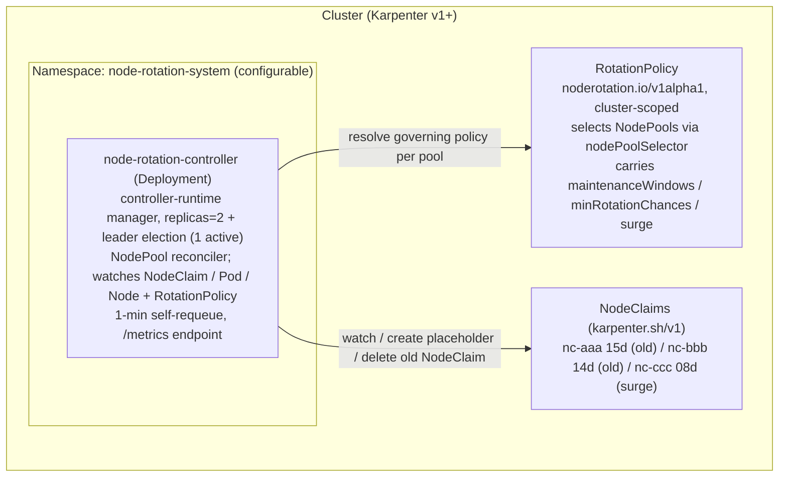
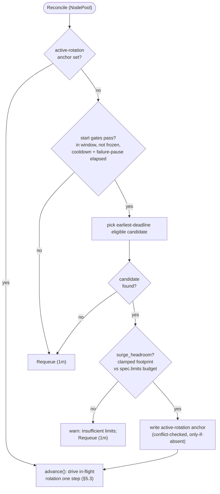
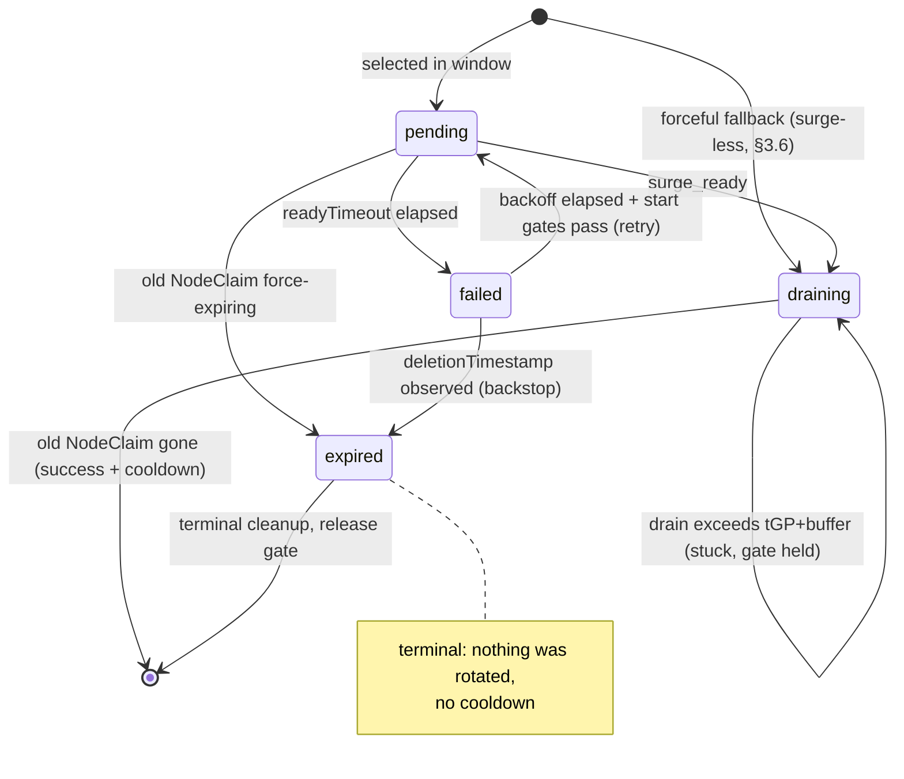

# 5. Implementation

## 5.1 Architecture

::: tip What this section defines
The controller is a controller-runtime manager (Deployment, replicas=2, leader election) that reconciles per NodePool, resolving each pool's governing `RotationPolicy` on every pass.
:::



### Policy vs state separation

- **Policy** = the `RotationPolicy` spec (desired configuration an operator authors)
- **State** = annotations on `NodeClaim`/`NodePool` + transient Node/placeholder markers (§5.3)
- The CRD never carries authoritative runtime state — its `status` is observational only

### Startup preflight

Before reconciling, the controller fails fast if:
- The cluster does not serve `karpenter.sh/v1` with `nodeclaims`/`nodepools` resources
- RBAC cannot read them

The compatibility contract is the `karpenter.sh/v1` **group/version**, independent of the managed Karpenter minor (EKS Auto Mode does not expose it). A successful decode of the v1 types confirms wire-compatible schema. Per-field CRD introspection is not attempted.

## 5.2 Reconcile Loop

::: tip What this section defines
Each `Reconcile` call performs **exactly one non-blocking step** and returns a `Requeue`. No blocking waits — all state is read from annotations and survives restarts.
:::

The reconciler is keyed on `NodePool` and watches:
- `NodeClaim` (mapped to owning NodePool)
- Placeholder `Pod` reaching `Running`
- Surge host `Node` reaching `Ready`

A periodic self-requeue remains the backstop for window edges, freeze releases, drain progress, and force-expiry.

### Decision flow



### Start gates (step 2)

All of the following must pass before a new rotation can begin:

- `in_window(now)` — maintenance window open
- `not frozen(np)` — no freeze annotation
- `since_last_rotation(np) >= cooldownAfter` — gate A: post-success settle
- `since_last_failure(np) >= failurePause` — gate B: post-failure pause (§4.4, ADR-0004)

### Candidate selection (step 3)

`pick_earliest_deadline_eligible` selects claims with:
- No `deletionTimestamp`
- `state` empty (fresh) or `failed` past escalated backoff (`retryBackoff · 2^(retry-count − 1)`, capped 8×)
- `pending`/`draining` never re-selected; `expired` is terminal

### Anchor semantics

The `active-rotation` anchor is:
- Written **before** any other side effect at start
- Cleared **last** at completion/failure
- **Conflict-checked, only-if-absent** write (optimistic concurrency)
- Ticks and NodeClaim events can race on the same NodePool — the precondition makes the race harmless

### Completion outcome

Decided by the NodePool-side `active-rotation-state` mirror:
- `draining` present → **success** (cooldown consumed)
- `draining` absent → **expired** (alert, no cooldown)

### Force-expiry detection

Caught on two paths:
- **Early:** `deletionTimestamp` appearing while still `pending` — checked first, before everything else
- **Late:** old NodeClaim disappearing with no `draining` mirror

The early path also writes `state=expired` before releasing the anchor (prevents livelock under Auto Mode's `tGP = 24h`).

### Stuck drain

A drain exceeding `tGP + buffer` raises `noderotation_drain_stuck` but **keeps the serial gate held** — a rotation in `draining` cannot be rolled back (the delete already happened), and releasing the gate would violate `maxUnavailable = 1`.

### Cooldown anchor

`last-rotation-at` lives on the **NodePool** (not the deleted old NodeClaim). The pause is durable across the completion boundary and leader changes.

::: details Full pseudocode — click to expand

```text
Reconcile(req):
  if req is Tick:
      for np in in_scope_nodepools():
          reconcile_nodepool(np)
      return Requeue(1m)
  return reconcile_nodepool(nodepool(req.obj))

reconcile_nodepool(np):
  # ── 1. Drive in-flight rotation first (serial: at most one per NodePool)
  if name := np[active-rotation]:
      return advance(np, name)

  # ── 2. Start gates
  start_gates(np) :=
      in_window(now) and not frozen(np)
      and since_last_rotation(np) >= cooldownAfter   # gate A
      and since_last_failure(np)  >= failurePause    # gate B
  if not start_gates(np): return Requeue(1m)

  # ── 3. Pick candidate, check headroom, anchor
  cand := pick_earliest_deadline_eligible(np)
  if cand == nil: return Requeue(1m)
  surgeless := forceful_fallback(np, cand)
  if not surgeless and not surge_headroom(np, cand):
      warn("insufficient limits headroom"); return Requeue(1m)
  annotate(np, active-rotation=cand.name)    # conflict-checked, only-if-absent
  if surgeless:
      annotate(np, rotation-mode=forceful-fallback,
               active-rotation-state=draining, draining-at=now)
      annotate(cand, state=draining)
      emit_metrics(forceful_fallback); event
      delete(cand)
      return Requeue(30s)
  return advance(np, cand.name)

advance(np, name):
  cand := nodeclaim(name)
  if cand == nil:                            # old NodeClaim finalized
      delete(placeholder(name))
      for node in nodes_with(surge-for=name):
          unfreeze(node)
      if np[active-rotation-state] == draining:
          annotate(np, last-rotation-at=now)
          emit_metrics(success, duration)
      else:
          emit_metrics(expired); alert
      clear(np, anchor)
      return Requeue(1m)

  switch cand.state:
  case (none) | pending:
      if cand.deletionTimestamp != nil:      # force-expiry caught
          delete(placeholder(name))
          for node in nodes_with(surge-for=name): unfreeze(node)
          annotate(cand, state=expired, clear=[started-at, surge-claim])
          emit_metrics(expired); alert
          clear(np, anchor)
          return Requeue(1m)
      annotate(cand, state=pending)
      annotate_once(cand, started-at=now)
      if elapsed(cand.started-at) > readyTimeout:
          reap_surge_claim(cand[surge-claim])
          delete(placeholder(name))
          for node in nodes_with(surge-for=name): unfreeze(node)
          annotate(cand, state=failed, failed-at=now, retry-count+=1,
                   clear=[started-at, surge-claim])
          emit_metrics(failure); alert
          annotate(np, last-failure-at=now, clear=anchor)
          return Requeue(1m)
      freeze(cand.node, surge-for=name)
      cordon(cand.node)
      if c := induced_claim(name):
          annotate(cand, surge-claim=c.name)
      if frozen(np): return Requeue(1m)      # hold escalation
      if placeholder(name) is missing:
          create_placeholder(np, cand)
          return Requeue(30s)
      if surge_ready(cand):
          host := placeholder_node(name)
          freeze(host, surge-for=name)
          annotate(np, active-rotation-state=draining, draining-at=now,
                   surge-wait=now − cand.started-at)
          annotate(cand, state=draining)
          delete(cand)
          return Requeue(30s)
      return Requeue(30s)

  case draining:
      annotate(np, active-rotation-state=draining)
      if cand.deletionTimestamp == nil:      # crash recovery
          delete(cand)
          return Requeue(30s)
      if elapsed(cand.deletionTimestamp) > drain_bound(np):
          alert(stuck_drain)
      return Requeue(30s)

  case failed:
      if cand.deletionTimestamp != nil:
          annotate(cand, state=expired)
          emit_metrics(expired); alert
          clear(np, anchor)
          return Requeue(1m)
      if start_gates(np) and elapsed(cand.failed-at) >= escalated_backoff(cand)
         and surge_headroom(np, cand):
          annotate(cand, state=pending)
          return advance(np, name)
      annotate(np, last-failure-at=max(np[last-failure-at], cand.failed-at),
               clear=anchor)
      return Requeue(1m)

  case expired:                              # terminal cleanup
      delete(placeholder(name))
      for node in nodes_with(surge-for=name): unfreeze(node)
      clear(np, anchor)
      return Requeue(1m)
```

:::

### Idempotent recovery

Each state handler **re-asserts** its phase's desired state rather than performing one-shot actions:
- `pending` re-asserts freeze, cordon, placeholder existence on every pass
- `draining` re-issues idempotent `delete` if `deletionTimestamp` is missing (crash between state write and delete)

### Observability skews (accepted in v1)

- **Mirror-to-delete gap:** a crash there followed by force-expiry records `success` (surge was reserved — practical outcome matches)
- **Metric emission:** completion emits before clearing anchor (at-least-once on crash); failure emits after state write (at-most-once on crash). Alert rules using `increase(...)` tolerate both

## 5.3 State Model

::: tip What this section defines
All state lives on Kubernetes objects — no external datastore. The NodePool's `active-rotation` anchor records **which** rotation is in flight; the old NodeClaim's `state` records **where** it is.
:::

### Annotation reference

| Key | Target | Value | Purpose |
|-----|--------|-------|---------|
| `active-rotation` | NodePool | NodeClaim name | Durable anchor + serial gate |
| `active-rotation-state` | NodePool | `draining` | Phase mirror for completion outcome |
| `draining-at` | NodePool | RFC3339 | Drain-duration anchor (§4.2) |
| `surge-wait` | NodePool | Go duration | Surge-phase duration for completion log |
| `rotation-mode` | NodePool | `forceful-fallback` | Surge-less path marker |
| `state` | Old NodeClaim | `pending`/`draining`/`failed`/`expired` | Progress state |
| `started-at` | Old NodeClaim | RFC3339 | `readyTimeout` deadline |
| `failed-at` | Old NodeClaim | RFC3339 | Backoff anchor |
| `retry-count` | Old NodeClaim | integer | Escalates backoff |
| `surge-claim` | Old NodeClaim | NodeClaim name | Induced surge identification |
| `surge-for` | Pod + frozen nodes | NodeClaim name | Rotation pairing |
| `do-not-disrupt` | Old + surge nodes | `true` | Block voluntary disruption |
| `do-not-disrupt-owned` | Old + surge nodes | `true` | Controller ownership marker |
| `cordoned` | Old node | `true` | Controller's cordon marker |
| `last-failure-at` | NodePool | RFC3339 | Inter-attempt pause anchor |
| `freeze` | NodePool | RFC3339 | Suppresses rotation until time |
| `last-rotation-at` | NodePool | RFC3339 | `cooldownAfter` gate anchor |

All keys use the `noderotation.io/` prefix except `karpenter.sh/do-not-disrupt`.

::: details Annotation details — click to expand

- **`active-rotation`:** written before any side effect, cleared last. Outlives the old NodeClaim (which is deleted on success). Also the serial gate for `maxUnavailable = 1`
- **`active-rotation-state`:** written immediately before `delete(cand)`. Absence = rotation never left `pending`. Read by completion handler after old NodeClaim is gone
- **`draining-at`:** write-once at `pending → draining`. The old NodeClaim's `deletionTimestamp` is gone by completion — needs this anchor
- **`surge-wait`:** write-once at `pending → draining`. The old NodeClaim (`started-at` carrier) is deleted at that transition
- **`rotation-mode`:** stamped on anchor at forceful-fallback start. Absent = default surge. Cleared with anchor on every end path
- **`state`:** `expired` is terminal — blocks re-selection while the claim finalizes under the forceful drain
- **`started-at`:** write-once per attempt. Cleared by the failed write (single update with `state=failed`). Re-stamped on retry
- **`surge-claim`:** persisted as soon as placeholder's bind target (`spec.nodeName`) is observable. Cleared with the failed write
- **`surge-for`:** on frozen nodes, attributes freeze to this rotation. On the Pod, pairs it for discovery
- **`do-not-disrupt-owned`:** set only when the controller actually applies `do-not-disrupt`. An operator's pre-existing annotation (no marker) is never touched
- **`cordoned`:** set only when the controller flips `spec.unschedulable`. An operator's cordon (no marker) is never adopted
- **`last-failure-at`:** `max` semantics on crash-recovery branch prevents voiding the pause

:::

### State transitions



::: details Transition side effects — click to expand

| From | Event | To | Side effects |
|------|-------|----|--------------|
| *(none)* | selected in window | `pending` | write anchor (first); freeze old node; cordon old node; create placeholder |
| *(none)* | forceful fallback | `draining` | write anchor + `rotation-mode` + `draining-at`; write `state=draining`; delete old NodeClaim (surge-less) |
| `pending` | each reconcile | `pending` | re-assert freeze + cordon; persist `surge-claim`; recreate placeholder if missing (held during freeze) |
| `pending` | `surge_ready` | `draining` | freeze surge target; write `draining-at` + `surge-wait`; delete old NodeClaim |
| `pending` | `readyTimeout` | `failed` | reap surge claim; delete placeholder; unfreeze; write `state=failed` + `last-failure-at`; clear anchor |
| `pending` | force-expiring | `expired` | delete placeholder; unfreeze; write `state=expired`; emit expired; clear anchor |
| `draining` | no `deletionTimestamp` | `draining` | re-issue delete (crash recovery) |
| `draining` | drain > `tGP + buffer` | `draining` | stuck-drain gauge; gate held |
| `draining` | NodeClaim gone | *(success)* | unfreeze; write `last-rotation-at`; emit success; clear anchor |
| `failed` | backoff + gates pass | `pending` | reset `state`; `started-at` re-stamped by new attempt |
| `failed` | `deletionTimestamp` | `expired` | write `state=expired`; emit expired; clear anchor |
| `expired` | still anchored | `expired` | idempotent cleanup; clear anchor (metric not re-emitted) |

:::

### Clearing the anchor

`clear(np, anchor)` is a **single update** removing the whole rotation-scoped set:
- `active-rotation`, `active-rotation-state`, `draining-at`, `surge-wait`, `rotation-mode`

No companion field can outlive the rotation. The failure path additionally writes `last-failure-at` in the same update.

### Startup sweep

Runs **once, gated before the first reconcile**. Cleans only markers that no anchor references:

- **Placeholder Pods** whose `surge-for` claim is absent/not-anchored → deleted
- **Node markers** (`surge-for`, controller's `do-not-disrupt` by owned marker) → removed
- **`cordoned` marker** with no anchored rotation → uncordon and remove

Rules:
- An anchored NodePool is **not stale** — step 1 resumes it normally
- `failed`/`expired` claims keep their annotations (backoff re-entry / terminal marker)
- A `pending`/`draining` claim with no anchor (impossible from any crash point) → set to `failed` + alert
- An orphaned `active-rotation-state` without anchor → simply removed
- Best-effort: per-item errors logged, never fatal

## 5.4 Configuration Schema

::: tip What this section defines
The `RotationPolicy` CRD (cluster-scoped, `v1alpha1`) carries per-NodePool rotation configuration. The controller resolves each NodePool's governing policy by selector specificity.
:::

### RotationPolicy CRD (`noderotation.io/v1alpha1`)

```yaml
apiVersion: noderotation.io/v1alpha1
kind: RotationPolicy
metadata:
  name: api                       # cluster-scoped; one per NodePool policy
spec:
  nodePoolSelector:               # selects governed NodePools
    matchLabels:
      workload: api
  ageThreshold: auto              # "auto" (derived, §3.2) or Go duration override
  minRotationChances: 2           # K; floor 1
  maintenanceWindows:             # per-policy; union semantics (§3.1)
    - timezone: Asia/Tokyo
      days: [Wed, Sat]
      start: "02:00"
      end:   "06:00"
  surge:
    maxUnavailable: 1             # v1 fixed at 1 (OpenAPI rejects other)
    readyTimeout: 15m             # must be > 0
    cooldownAfter: 10m            # gate A; may be 0
    # failurePause: 10m           # gate B; unset → max(10m, cooldownAfter)
    # drainEstimate: 10m          # layer-2 only; unset → min(tGP, 10m)
    # provisioningEstimate: 5m    # layer-2 only; unset → min(readyTimeout, 5m)
    retryBackoff: 30m             # must be > 0
    matchNodeRequirements:        # placeholder requirement replication (§3.7)
      required:
        - topology.kubernetes.io/zone
        - kubernetes.io/arch
        - karpenter.sh/capacity-type
      preferred: []
    forcefulFallback:             # opt-in surge-less fallback (§3.6)
      enabled: false
  prePull:                        # v2 (disabled in v1)
    enabled: false
status:
  observedGeneration: 3
  matchedNodePools: 2
  rotatingNodePools: 1
  conditions:
    - type: Ready
      status: "True"
      reason: Accepted
```

### Status subresource

- **`matchedNodePools`:** pools this policy wins by selector specificity
- **`rotatingNodePools`:** of those, count with an in-flight rotation
- **`Ready` condition:**
  - `Accepted` — valid and uncontested
  - `Invalid` — failed reconcile-time validation
  - `Conflict` — equal-specificity tie (§below)
- `Invalid` takes precedence over `Conflict`
- Status is observational only — never authoritative for rotation decisions

A dedicated `RotationPolicyStatusReconciler` populates this view. Optimistic-concurrency conflicts are treated as silent requeues.

### Targeting and conflict resolution

| Rule | Behavior |
|------|----------|
| Most-specific wins | Specificity = label-key constraint count |
| Equal-specificity tie | **Hard error** — refuses to rotate that NodePool |
| No policy matches | Not rotated (safe no-op) |

- **Specificity:** `matchLabels` entries + `matchExpressions` entries. Empty (catch-all) selector scores 0 — loses to any keyed selector
- **Tie:** emits `PolicyConflict` Warning Event + sets `noderotation_policy_conflict{nodepool} = 1`
- **Unmatched:** no implicit default; operator writes a catch-all if blanket coverage is desired

### Leaving governance mid-rotation

When a pool ceases to be governed while a rotation is anchored, the controller **rolls it back**:
- Deletes placeholder
- Unfreezes nodes (preserving operator's own protections)
- Clears anchor
- Emits `GovernanceLost` Warning Event

This prevents orphaned placeholders and stale `do-not-disrupt` markers from silently blocking Karpenter's voluntary operations indefinitely.

### Policy change propagation

A create/update/delete of any `RotationPolicy` re-enqueues **every** NodePool for re-resolution (one change can alter which policy wins for any pool).

### Per-NodePool maintenance windows

`maintenanceWindows` lives on each policy, so the window is per-NodePool. The union semantics (§3.1) apply within one policy's list. This is why `noderotation_window_active` and `noderotation_window_period_seconds` carry a load-bearing `nodepool` label (§4.2).
