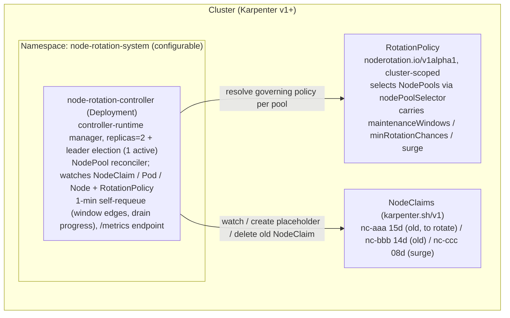
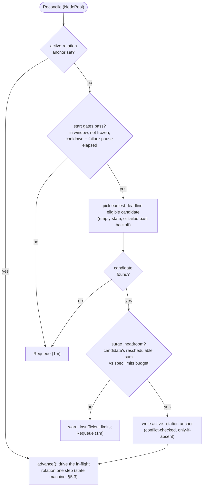

# 5. Implementation

## 5.1 Architecture



The reconciler resolves each NodePool's **governing `RotationPolicy`** on every
pass (§5.4): it lists the cluster's policies, picks the one whose
`nodePoolSelector` matches the pool most specifically, and reads `maintenanceWindows`,
`minRotationChances`, and `surge` from it. A `RotationPolicy` create/update/delete
re-enqueues every NodePool, since one policy change can alter which policy wins for
any pool. Policy (the `RotationPolicy` spec, the desired configuration) is kept
distinct from rotation **state** (annotations on `NodeClaim`/`NodePool` and the
transient Node/placeholder markers, §5.3): the CRD never carries authoritative
runtime state.

**Startup preflight (Karpenter v1 API surface).** Before the manager begins
reconciling, the controller fails fast if the public Karpenter API it depends on
is absent or unreadable: it verifies that the cluster serves **`karpenter.sh/v1`**
with both the `nodeclaims` and `nodepools` resources, and that its RBAC permits
listing each kind. The compatibility contract is the `karpenter.sh/v1` **group/
version**, deliberately independent of the managed Karpenter minor (EKS Auto Mode
does not expose it) — see §1.1. A missing/incompatible CRD surface or an RBAC gap
becomes an immediate, actionable startup error instead of a deferred reconcile
failure. The typed list also serves as a schema-compatibility probe (a successful
decode of the v1 types the controller is built against confirms the served schema
is wire-compatible); per-field CRD OpenAPI introspection is intentionally not
attempted, as the typed `karpenter.sh/v1` contract already covers the required
fields.

## 5.2 Reconcile Loop

Implemented with [controller-runtime](https://github.com/kubernetes-sigs/controller-runtime). The reconciler is keyed on the `NodePool` and watches `NodeClaim` (mapped to its owning NodePool), plus the placeholder `Pod` reaching `Running` and the surge host `Node` reaching `Ready` — the two readiness signals that advance an in-flight `pending` rotation, watched so they are observed promptly rather than only on the next periodic pass. A periodic self-requeue remains the backstop that detects window edges, freeze releases, drain progress, and force-expiry.

Each `Reconcile` call performs **exactly one non-blocking step** and returns a `Requeue`. There are **no blocking waits** (the 15-minute surge wait and the drain wait are *elapsed-time checks* against the `started-at`/deletion timestamps, re-evaluated on later reconciles), so a worker is never held and progress survives controller restarts — all state is read back from annotations (§5.3). Serial processing is enforced by handling any in-flight rotation *before* starting a new one.

The decision flow for one NodePool is below; the per-state work of `advance()` is the state machine in §5.3, and the authoritative algorithm (with every crash-recovery invariant) is the pseudocode that follows.



```text
Reconcile(req):                              # req is a NodeClaim event or a periodic Tick
  if req is Tick:                            # a Tick is not tied to one object
      for np in in_scope_nodepools():        #   → fan out over every selected NodePool
          reconcile_nodepool(np)
      return Requeue(1m)
  return reconcile_nodepool(nodepool(req.obj))

reconcile_nodepool(np):
  # ── 1. Drive the in-flight rotation first (serial: at most one per NodePool).
  #       Keyed on the NodePool's active-rotation ANCHOR, not on finding an annotated
  #       NodeClaim — the old NodeClaim disappears when the rotation succeeds, and the
  #       completion side effects below must still run after that.
  if name := np[active-rotation]:
      return advance(np, name)

  # ── 2. No rotation in flight → candidate-independent start gates.
  #       start_gates(np) is shared verbatim with the failed → pending re-entry (case failed
  #       below): a re-entry is a NEW attempt, so the two gate sets must never diverge.
  start_gates(np) :=
      in_window(now) and not frozen(np)
      and since_last_rotation(np) >= cooldownAfter   # settle pause after a success; since_* = now − the
      and since_last_failure(np)  >= cooldownAfter   #   NodePool annotation, +∞ when unset. The failure-side
                                                     #   pause bounds candidate cycling under a systematic
                                                     #   failure cause (§4.4)
  if not start_gates(np): return Requeue(1m)

  # ── 3. Start a new rotation: pick the candidate, gate on ITS headroom, then anchor ──
  cand := pick_earliest_deadline_eligible(np) # empty state, or failed past its escalated backoff
  if cand == nil: return Requeue(1m)
  surgeless := forceful_fallback(np, cand)   # opt-in (§3.3, ADR-0001): surge.forcefulFallback.enabled AND a
                                             #   graceful surge started now cannot finish before cand's own
                                             #   deadline (deadline − now < t_rot) — a surge would only lose the
                                             #   race, so rotate surge-less. A claim with no deadline never qualifies
  if not surgeless and not surge_headroom(np, cand):   # cand's reschedulable-Pod request sum (= the placeholder's
                                             #   requests, §3.3) vs (spec.limits − provisioned): candidate-dependent,
                                             #   so it runs AFTER selection — and only for a surge (a surge-less
                                             #   fallback provisions no placeholder to size)
      warn("insufficient limits headroom; cannot surge"); return Requeue(1m)
  annotate(np, active-rotation=cand.name)    # anchor BEFORE any other side effect. Conflict-checked,
                                             #   only-if-absent write (optimistic lock on resourceVersion /
                                             #   SSA): Ticks and NodeClaim events queue under different keys,
                                             #   so two reconciles can race on one NodePool — the loser's
                                             #   write fails, and it does nothing but requeue
  if surgeless:                              # surge-less window-bounded forceful fallback (§3.3): no placeholder,
      annotate(np, rotation-mode=forceful-fallback,     #   no readyTimeout, no node freeze — no surge pair to
               active-rotation-state=draining, draining-at=now)   #   protect. rotation-mode lives on the ANCHOR so
      annotate(cand, state=draining)         #   it survives cand's deletion; draining-at (write-once) anchors §4.2
      emit_metrics(forceful_fallback); event # §4.2 counter + a ForcefulFallback Warning event on the NodePool
      delete(cand)                           # voluntary path (PDBs apply); completion reuses advance()'s draining
      return Requeue(30s)                    #   handler above, which clears rotation-mode with the anchor
  return advance(np, cand.name)              # falls into the idempotent pending handler below

# advance() runs one step for the in-flight rotation, keyed by the anchor:
advance(np, name):
  cand := nodeclaim(name)
  if cand == nil:                            # old NodeClaim finalized away → terminal, but in WHICH way?
      delete(placeholder(name))              # if still present
      for node in nodes_with(surge-for=name):    # resolves the surge target WITHOUT the old claim
          unfreeze(node)                     # remove surge-for + the controller's own do-not-disrupt (by its
                                             #   do-not-disrupt-owned marker; an operator's is kept) + uncordon
                                             #   when the noderotation.io/cordoned marker is present
      if np[active-rotation-state] == draining:  # controller-driven drain → genuine rotation
          annotate(np, last-rotation-at=now) # cooldown anchor
          emit_metrics(success, duration[drain]=now − np[draining-at])  # §4.2 drain phase; skipped when
                                             #   draining-at is absent (a rotation that reached draining before
                                             #   this anchor existed) — uncounted beats mis-anchored
      else:                                  # vanished out of pending (e.g. force-expired mid-surge,
          emit_metrics(expired); alert       #   §3.3 residual risk): nothing was rotated — no cooldown
      clear(np, active-rotation, active-rotation-state, draining-at, rotation-mode)  # same object → one update; release the gate LAST (rotation-mode present only for a forceful fallback, §5.3)
      return Requeue(1m)                     # cooldown is enforced at the step-2 start gate

  switch cand.state:
  case (none) | pending:                     # idempotent: (re-)assert everything this phase needs
      if cand.deletionTimestamp != nil:      # force-expiry caught in the act (§3.3 residual risk): Karpenter's
                                             #   forceful path got there first. Checked before EVERYTHING else —
                                             #   a dying claim must never be escalated to draining (the mirror
                                             #   would mislabel this as success, §4.2) nor failed by the timeout
          delete(placeholder(name))
          for node in nodes_with(surge-for=name):
              unfreeze(node)                 # surge-for + the controller's own do-not-disrupt (owned marker) (+ uncordon by the cordoned marker)
          annotate(cand, state=expired,      # terminal marker BEFORE the pool clear: under tGP=24h a force-
                   clear=[started-at, surge-claim])  # draining claim stays alive (past deadline ⇒ first in line) for hours — without
                                             #   this write plus the §3.2 deletionTimestamp exclusion, selection
                                             #   would re-pick it every minute and livelock the serial gate
          emit_metrics(expired); alert       # nothing was rotated — never success, no cooldown; emitted once:
                                             #   the expired case below never re-emits (at-most-once)
          clear(np, active-rotation, active-rotation-state)
          return Requeue(1m)                 # the claim finishes finalizing on its own
      annotate(cand, state=pending)          # no-op if already set
      annotate_once(cand, started-at=now)    # write-once per attempt: cleared by the failed write below,
                                             #   so a retry re-stamps its own timeout
      if elapsed(cand.started-at) > readyTimeout:        # default 15m. Checked FIRST: a crash on this failure
                                             #   path must not resurrect the placeholder via the recreate branch.
          if cand[surge-claim] unset and c := induced_claim(name):
              annotate(cand, surge-claim=c.name)   # last resort only — normally persisted by the pending
                                             #   re-assertion below, the moment the bind became observable;
                                             #   induced_claim falls back to the pool's claim created after
                                             #   started-at with NO registered Node (never-Ready: the dominant
                                             #   timeout cause, where no bind ever happens — §3.3 Rollback)
          reap_surge_claim(cand[surge-claim]) # idempotent delete; no-op when unset / already gone. Guarded:
                                             #   only a claim created after started-at AND whose node hosts
                                             #   nothing but the placeholder (+ DaemonSets); no registered Node
                                             #   passes trivially — never an absorb host, never a claim already
                                             #   carrying real Pods (§3.3 Rollback)
          delete(placeholder(name))
          for node in nodes_with(surge-for=name):  # the old node — plus the surge target, if a crash had
              unfreeze(node)                 #   already frozen it; symmetric with the completion handler
          annotate(cand, state=failed, failed-at=now, retry-count+=1,
                   clear=[started-at, surge-claim])  # single update (same object) — no torn intermediate state
          emit_metrics(failure); alert       # before the anchor clear: a crash here loses at most this one
                                             #   increment (the failed case below never re-emits)
          annotate(np, last-failure-at=now,  # pool-level inter-attempt pause anchor (§4.4) — written in the
                   clear=[active-rotation, active-rotation-state])  # SAME single update that releases the
          return Requeue(1m)                 #   gate LAST — the failed claim re-enters via backoff
      freeze(cand.node, surge-for=name)      # re-assert do-not-disrupt lost to a crash (§3.3) — BEFORE the
                                             #   freeze hold below: protective markers are passive and always
                                             #   re-asserted; a freeze holds only escalation (§3.1)
      cordon(cand.node)                      # re-assert too; sets noderotation.io/cordoned so rollback and
                                             #   the sweep undo only the controller's own cordon — a no-op
                                             #   (no flag write, no marker) on a node already unschedulable
                                             #   without the marker: an operator's cordon is never adopted (§3.3)
      if c := induced_claim(name):           # bind target (spec.nodeName) observable → persist the identifica-
          annotate(cand, surge-claim=c.name) #   tion NOW, not on the failure path: the placeholder (its only
                                             #   other source) may be gone by then (§3.3 Rollback); no-op once
                                             #   set. A passive record — never deferred by the freeze hold below
      if frozen(np): return Requeue(1m)      # freeze landed mid-pending: HOLD all escalation (§3.1) — no
                                             #   placeholder (re)creation, no transition to draining; the attempt
                                             #   times out above and rolls back cleanly if the freeze outlasts
                                             #   readyTimeout
      if placeholder(name) is missing:       # lost / preempted / crash before creation
          create_placeholder(np, cand)       # requests = Σ reschedulable Pod requests (§3.3 exclusions:
          return Requeue(30s)                #   DaemonSet/mirror/completed/node-pinned); do-not-disrupt
                                             #   annotation; required karpenter.sh/nodepool selector (§3.3);
                                             #   SOFT preferred nodeAffinity hostname NotIn {cand.node, near-deadline}
                                             #   (candidate hard-excluded by the cordon + surge_ready, not this term; #96)
                                             #   — both exclusion lists recomputed on every (re)creation
      if surge_ready(cand):                  # placeholder Running AND not terminating (deletionTimestamp unset)
                                             #   on a Ready host ≠ cand.node, AND the host's
                                             #   karpenter.sh/nodepool label == np.name (belt-and-suspenders
                                             #   for the placeholder's required selector, §3.3). A placeholder
                                             #   preempted mid-grace stays Running with deletionTimestamp set;
                                             #   its reservation is already being removed, so it is not ready
                                             #   (§5.2 recreates it once gone, bounded by readyTimeout).
          host := placeholder_node(name)     # newly provisioned or pre-existing (capacity-absorb, §3.3)
          freeze(host, surge-for=name)
          annotate(np, active-rotation-state=draining, draining-at=now)   # durable phase record BEFORE the
          annotate(cand, state=draining)                 #   delete (decides the completion outcome, §5.3);
                                             #   draining-at (write-once) anchors the §4.2 drain duration
          delete(cand)                       # explicit; not blocked by do-not-disrupt
          return Requeue(30s)
      return Requeue(30s)
  case draining:                             # waiting for the old NodeClaim to finalize away
      annotate(np, active-rotation-state=draining)   # idempotent re-assert (normally a no-op; written before
                                             #   cand.state). draining-at is NOT backfilled here: a rotation that
                                             #   reached draining before the anchor existed stays uncounted — an
                                             #   uncounted drain beats a mis-anchored one (§4.2)
      if cand.deletionTimestamp == nil:      # crash between the state write and delete(cand)
          delete(cand)                       # idempotent re-issue — without this the rotation hangs forever
          return Requeue(30s)
      if elapsed(cand.deletionTimestamp) > drain_bound(np):   # tGP + buffer; fixed fallback if tGP unset
          alert(stuck_drain)                 # once; state stays draining — the gate is held on purpose (below)
      return Requeue(30s)
  case failed:
      if cand.deletionTimestamp != nil:      # the backstop reached a rolled-back claim (anchored here by re-
          annotate(cand, state=expired)      #   selection or crash recovery): nothing is in flight — the failure
          emit_metrics(expired); alert       #   path already cleaned the runtime objects. Mark terminal so it
          clear(np, active-rotation, active-rotation-state)  # is never re-selected, and release the gate
          return Requeue(1m)
      if start_gates(np)                     # ALL the step-2 start gates (window / freeze / cooldown /
         and elapsed(cand.failed-at) >= escalated_backoff(cand)
         and surge_headroom(np, cand):       #   failure pause) PLUS the step-3 candidate gate: a re-entry is
                                             #   a NEW attempt, never an in-flight continuation, so it must
                                             #   pass everything a fresh start would — this path is reachable
                                             #   with stale conditions (frozen pool, vanished headroom) via
                                             #   crash + outage > backoff between the failed write and the clear
          annotate(cand, state=pending)      # the §5.3 failed → pending re-entry: step 3 re-selected this claim
          return advance(np, name)           #   past its backoff; falls into the pending handler, which
                                             #   re-stamps started-at (cleared at failure) — without this reset
                                             #   the claim would ping-pong against the branch below forever
      annotate(np, last-failure-at=max(np[last-failure-at], cand.failed-at),
               clear=[active-rotation, active-rotation-state])
                                             # otherwise: crash between the failed write and the pool update —
      return Requeue(1m)                     #   repair BOTH halves of the torn write, not just the anchor:
                                             #   clearing alone would leave last-failure-at unset (since_last_
                                             #   failure = +∞ passes the gate) and void the §4.4 inter-attempt
                                             #   pause on exactly the crash path it exists for; max() keeps a
                                             #   newer pause anchor intact
  case expired:                              # terminal (§5.3): the abort path wrote this, then crashed before
      delete(placeholder(name))              #   clearing the anchor — re-run the cleanup idempotently and
      for node in nodes_with(surge-for=name):    # release the gate; the metric/alert are NOT re-emitted
          unfreeze(node)                     #   (the abort already emitted, at-most-once — see below)
      clear(np, active-rotation, active-rotation-state)
      return Requeue(1m)
```

`pick_earliest_deadline_eligible` selects claims with **no `deletionTimestamp`** whose `state` is empty (fresh) or `failed` with `now − failed-at` past the escalated backoff (`retryBackoff · 2^(retry-count − 1)`, capped at 8×); `pending`/`draining` claims are never re-selected (they are driven by step 1), `expired` is terminal, and a claim already being deleted is excluded outright (§3.2) — it cannot be rotated, and selecting it would seize the serial gate just to abort, over and over, for as long as the force-drain keeps it alive. Re-selecting a `failed` claim writes the anchor and lands in the `failed` case of `advance()`, which performs the actual `failed → pending` re-entry by resetting `state` — `started-at` was cleared by the failed write, so the new attempt re-stamps its own `readyTimeout` deadline (with `retryBackoff` ≥ `readyTimeout` — true of the defaults, 30m vs 15m; §3.2 warns otherwise — a retry that inherited the old timestamp would fail instantly without ever creating a placeholder). Without that reset there would be no executable path for the §5.3 `failed → pending` transition at all: every reconcile would re-select the claim, write the anchor, fall into the anchor-clearing crash-recovery branch, and loop — starving every other candidate in the NodePool. Leader election uses the standard `coordination.k8s.io/Lease`; on leader change the new leader resumes purely from annotations.

Step 1 keys on the **NodePool's `active-rotation` anchor**, not on finding an annotated NodeClaim: the old NodeClaim — the carrier of the per-rotation `state` — is deleted when the rotation succeeds, so any discovery that depends on it would go blind at exactly the moment the completion side effects (placeholder removal, surge-target unfreeze, `last-rotation-at`) must run. The anchor is written **before** any other side effect at start and cleared **last** at completion/failure, so every crash point leaves a resumable record. The anchor write itself is a **conflict-checked, only-if-absent update** (optimistic concurrency on `resourceVersion`, or SSA with an absence precondition): Ticks and NodeClaim events enter the workqueue under different keys, so two reconciles *can* race on the same NodePool under informer-cache skew — the precondition makes the race harmless, because exactly one write lands and the loser does nothing but requeue. Serialization therefore rests on the anchor itself, not on workqueue keying.

The completion **outcome** is decided by the NodePool-side phase mirror `active-rotation-state`: written (immediately before the controller's `delete`) when the rotation enters `draining`, it is the only durable record of how far the rotation had progressed once the old NodeClaim is gone — a controller-driven drain completes as `success` (cooldown consumed), while a force-expiry out of `pending` (§3.3 residual risk) is recorded as `expired` with an alert and **no** cooldown: counting an un-rotated node as success would silence the failure alerts and delay the next genuine rotation.

The force-expiry is caught on **two** paths:

- **Early:** by the claim's `deletionTimestamp` appearing while it is still in `pending` — checked before everything else in the pending handler, so a dying claim is neither escalated to `draining` (which would flip the mirror and mislabel the outcome as `success`; relevant on Auto Mode, where `tGP = 24h` keeps a force-draining claim alive for hours) nor pushed to `failed` by the `readyTimeout` (which would clear the anchor and lose the `expired` record entirely).
- **Late:** by its disappearance with no `draining` mirror.

The early path also writes a terminal `state=expired` onto the claim **before** releasing the anchor: under Auto Mode's `tGP = 24h` a force-draining claim can survive — `Ready`, first in line (past its deadline ⇒ earliest), and otherwise eligible — for hours, so without that marker (and the matching `deletionTimestamp` exclusion in §3.2 selection) every reconcile would re-select it, write the anchor, abort, and clear — a livelock that spams the `expired` counter and starves every other candidate in the NodePool.

Complementarily, each state handler is an **idempotent re-assertion** of its phase's desired state rather than a one-shot action: the pending handler re-asserts the old node's freeze and the placeholder's existence on every pass (a crash between any two start-time side effects heals on the next reconcile), and the draining handler re-issues the idempotent `delete` when the old NodeClaim has no `deletionTimestamp` (a crash between the state write and the delete would otherwise hang the rotation forever — the handler would be waiting for a deletion nobody requested).

Two narrow observability skews are accepted in v1 rather than engineered away.

- **Mislabeled force-expiry in the mirror-to-delete gap:** the phase mirror is written immediately *before* the controller's `delete`, so a crash in that gap, followed by the old node force-expiring during the outage, is still recorded as `success` — by that point `surge_ready` had already held (the replacement capacity was reserved), so the practical outcome matches a controller-driven drain; only the label is off, and the exposure is a single reconcile step landing right before an outage.
- **At-least-once / at-most-once metric emission:** metric writes are not transactional with the annotation updates. The completion handler emits before clearing the anchor, so a crash between the two replays the completion and can double-count `success`/`expired` (at-least-once); the failure path emits after the failed-state write, so a crash between the two loses at most that one `failure` increment (at-most-once) — the `failed` state and the `noderotation_retry_count` gauge survive on the claim, so a systematic failure still alerts. The expired-abort emits between its claim-side `state=expired` write and the anchor clear, and the `case expired` recovery never re-emits — at-most-once as well.

Alert rules built on `increase(...)` over a window tolerate both skews.

A drain that exceeds `drain_bound` (= `tGP + buffer`; a fixed default, e.g. `1h`, when `tGP` is unset — see the §3.2 layer-1 warning) raises the stuck-drain alert (`noderotation_drain_stuck`, §4.2 — a 0/1 gauge recomputed from live state on every reconcile, so it clears once the drain completes rather than latching) but deliberately **keeps the serial gate held**: a rotation in `draining` cannot be rolled back (the old NodeClaim already carries a `deletionTimestamp`), and releasing the gate would start disrupting a second node while the first is still half-drained, violating `maxUnavailable = 1`. Remediation is operator-side — resolve the blocking PDB or stuck finalizer; when `tGP` is set, Karpenter ultimately forces the drain on its own.

The `cooldownAfter` gate in step 2 anchors on `noderotation.io/last-rotation-at`, written on the **NodePool** at each successful completion. It is **not** carried on the old NodeClaim: that object — the carrier of per-rotation state — is deleted when the rotation completes, so a requeue keyed on it would be a no-op (the reason the previous `Requeue(cooldown=…)` on the deleted claim did not actually enforce a pause; instead the next Tick could start a rotation immediately). Anchoring on the surviving NodePool makes the pause durable across the completion boundary and across leader changes. The gate is evaluated *per NodePool*, matching the per-NodePool serial model (distinct NodePools still rotate concurrently).

## 5.3 State Model

Progress state lives entirely on Kubernetes objects (the NodePool, the old `NodeClaim`, the two nodes, and the transient placeholder Pod) — **no external datastore** is required. Rotation **state** (this section) is kept strictly separate from rotation **policy** (the `RotationPolicy` CRD, §5.4): policy is the desired configuration an operator authors, while the annotations and markers below are authoritative runtime truth the controller writes and reads back. The CRD is resolved per pass and never stores in-flight state — its `status` subresource is observational only — so the "no external datastore" invariant holds regardless of the policy carrier. Durable truth is split across two carriers: the NodePool's `active-rotation` anchor records **which** rotation is in flight (and survives the old NodeClaim's deletion on success), with `active-rotation-state` mirroring whether it reached `draining` — the record that lets the completion handler pick the right outcome after the old NodeClaim is gone — while the old NodeClaim's `state` annotation records **where** that rotation is. The placeholder Pod and the node markers are runtime objects that the idempotent handlers (§5.2) re-create or re-assert from those two if lost.

| Key | Target | Value | Purpose |
|-----|--------|-------|---------|
| `noderotation.io/active-rotation` | NodePool | Old NodeClaim's `metadata.name` | **Durable anchor** for the in-flight rotation; drives §5.2 step 1 and — because it outlives the old NodeClaim — the completion handler. Written before any other side effect at start, cleared last at completion/failure. Also the per-NodePool serial gate |
| `noderotation.io/active-rotation-state` | NodePool | `draining` | Phase mirror for the anchored rotation, written immediately **before** the controller's `delete` of the old NodeClaim; absence means the rotation never left `pending`. Read by the completion handler — after the old NodeClaim (the `state` carrier) is gone — to pick the outcome: `draining` → `success` + cooldown; absent → `expired` + alert, no cooldown (§5.2). Cleared in the same update as the anchor on **both** the completion and the failure path (same object → atomic) |
| `noderotation.io/draining-at` | NodePool | RFC3339 timestamp | **Drain-start anchor** for the `drain`-phase `noderotation_duration_seconds` histogram (§4.2). Stamped **write-once** in the same update as `active-rotation-state=draining` at the `pending → draining` transition; the natural drain start — the old NodeClaim's `deletionTimestamp` — has finalized away by the single completion point where the histogram is observed once, so the duration needs this pool-side anchor. Read at completion (`now − draining-at`) and cleared in the same update as the anchor |
| `noderotation.io/rotation-mode` | NodePool | `forceful-fallback` | Records how the in-flight rotation is performed; stamped on the anchor (so it survives the candidate NodeClaim's deletion on success) at the start of a surge-less window-bounded forceful fallback (§3.3). **Absent = the default surge** (make-before-break) rotation. Cleared with the anchor on every gate release (completion, failure, abort) |
| `noderotation.io/state` | Old NodeClaim | `pending` / `draining` / `failed` / `expired` | Progress state of the anchored rotation. `expired` is **terminal**: written by the abort path when the claim is caught force-expiring (§5.2), it blocks re-selection while the claim — alive for up to `tGP` under the forceful drain — finishes finalizing |
| `noderotation.io/started-at` | Old NodeClaim | RFC3339 timestamp | `readyTimeout` deadline + observability. Write-once **per attempt**: cleared by the failed write — a **single update** together with `state=failed`/`failed-at`/`retry-count` (§5.2), so no crash can leave a torn intermediate — and re-stamped by the retry (otherwise, `retryBackoff` ≥ `readyTimeout` — true of the defaults; §3.2 warns when violated — would make every retry time out instantly) |
| `noderotation.io/failed-at` | Old NodeClaim | RFC3339 timestamp | Backoff anchor for re-selection after a failure |
| `noderotation.io/retry-count` | Old NodeClaim | integer | Consecutive failures of this claim; escalates the backoff (`retryBackoff · 2^(retry-count − 1)`, capped at 8×) and is surfaced as the `noderotation_retry_count` gauge (§4.2), which feeds the systematic-failure alert |
| `noderotation.io/surge-claim` | Old NodeClaim | Induced surge NodeClaim's `metadata.name` | Written by the **pending handler as soon as** the placeholder's bind target (`spec.nodeName`) is observable — the only scheduler-visible signal (`status.nominatedNodeName` appears only on a *preempting* Pod, which the placeholder, `preemptionPolicy: Never`, never is); the placeholder is the only other source of this identity and can vanish (preemption, external delete) at any moment, so identification never waits for the failure path. That path re-resolves from a still-present placeholder, or — when no bind ever happened (never-registered / never-`Ready` instance, the dominant timeout cause) — as the pool's claim created after `started-at` with no registered Node (§3.3 *Rollback*). Cleared in the same update as the failed write |
| `noderotation.io/surge-for` | Placeholder Pod **and** each controller-frozen node | Old NodeClaim's `metadata.name` | Pairing: finds/cleans up the placeholder; resolves the **surge target** at completion after the old NodeClaim is gone. Always written on a frozen node (the node belongs to the rotation), so it does **not** itself attribute `do-not-disrupt` ownership — `do-not-disrupt-owned` does (below) |
| `karpenter.sh/do-not-disrupt` | Old node + surge target node | `true` | Blocks Karpenter **voluntary disruption only** (Consolidation/Drift/Emptiness) during the surge — **not** `expireAfter`, Interruption, or Node Repair (§3.3). On nodes, written only when the controller does not find an operator's pre-existing `do-not-disrupt`, and then paired with the `noderotation.io/do-not-disrupt-owned` marker; removed at the end; a stale value does not extend node life (see §3.5). This annotation is not only **written** here by the controller — it is also **read**, on any candidate's Node, as an operator's rotation opt-out at candidate selection (§3.2): an operator-set `true` without the `do-not-disrupt-owned` marker below excludes the claim from proactive rotation. No new annotation key is introduced |
| `noderotation.io/do-not-disrupt-owned` | Old node + surge target node | `true` | Marks the node `karpenter.sh/do-not-disrupt` as **controller-applied**, so rollback and the startup sweep remove only what the controller set — an operator's pre-existing `do-not-disrupt` (no marker) is never touched. The do-not-disrupt analogue of `noderotation.io/cordoned`: `freeze()` sets it only when the controller actually applies `do-not-disrupt`, never on a node already carrying an operator's active `do-not-disrupt: true` without the marker; a non-`true` value is not operator protection (Karpenter honors only `true`) and is overwritten and owned (§3.3) |
| `karpenter.sh/do-not-disrupt` | Placeholder Pod | `true` | **Pod-level** annotation, distinct from the node-level row above: blocks voluntary disruption of whatever node the placeholder is *running on*, covering the surge target in the bind → `surge_ready` gap before the controller's node-level freeze lands (§3.3 diagram; set in `create_placeholder`, §5.2). Paired with the `surge-for` **label** on the Pod |
| `noderotation.io/cordoned` | Old (candidate) node | `true` | Marks the cordon (`spec.unschedulable`, §3.3) as **controller-applied**, so rollback and the startup sweep uncordon only what the controller cordoned — an operator's pre-existing cordon (no marker) is never touched. Set only when the controller itself flipped the flag: `cordon()` is a no-op — no flag write, no marker — on a node already unschedulable without the marker (§3.3) |
| `noderotation.io/last-failure-at` | NodePool | RFC3339 timestamp | Failure-side counterpart of `last-rotation-at`: anchors the pool-level **inter-attempt pause** (gated with `cooldownAfter` in §5.2 step 2), bounding candidate cycling under a systematic failure cause (§4.4). Written in the same update that clears the anchor on the failure path; re-stamped (`max` with the claim's `failed-at`) by the `case failed` crash-recovery branch when it clears a stale anchor, so a torn failure write cannot void the pause (§5.2) |
| `noderotation.io/freeze` | NodePool | RFC3339 timestamp (freeze-until) | Suppresses rotation until the given time |
| `noderotation.io/last-rotation-at` | NodePool | RFC3339 timestamp | Completion time of the NodePool's last rotation; the `cooldownAfter` start-gate anchor (§5.2 step 2). Lives on the **NodePool** because the old NodeClaim that carries per-rotation state is deleted on success, so the pause must survive that deletion |

### State transitions

The old NodeClaim's `noderotation.io/state` drives the machine in §5.2, anchored by the NodePool's `active-rotation`. Crash recovery rests on two rules rather than on annotation order alone: the **anchor brackets the rotation** (written first, cleared last), and **every handler idempotently re-asserts its phase's side effects** — so a crash between any two writes is healed on the next reconcile instead of leaving a half-applied step behind.


The diagram is the structure; the table below is the authoritative **side effects** for each transition (including the idempotent recovery self-loops the diagram omits). Both `pending`/`draining` are driven by §5.2 step 1, never re-picked as fresh candidates.

| From | Event | To | Side effects |
|------|-------|----|--------------|
| *(none)* | selected in window | `pending` | write NodePool `active-rotation` anchor (first; conflict-checked, only-if-absent — §5.2); freeze old node (`surge-for` always; plus `do-not-disrupt` + `do-not-disrupt-owned` marker, skipped only when the node already carries an operator's active `do-not-disrupt: true`); cordon old node (+ `cordoned` marker); create placeholder (required `karpenter.sh/nodepool` selector; pod-level `do-not-disrupt`; **soft** preferred hostname `NotIn` exclusion of the old node and near-deadline hosts — candidate hard-excluded by the cordon above, §3.3 / #96) |
| *(none)* | selected in window, a graceful surge cannot complete before the candidate's deadline (`deadline − now < t_rot`), and `surge.forcefulFallback` is enabled (§3.3, ADR-0001) | `draining` | write NodePool `active-rotation` anchor (first) **plus** `rotation-mode=forceful-fallback` + `active-rotation-state=draining` + `draining-at=now` (one anchor object); write old NodeClaim `state=draining`; `delete` old NodeClaim — **surge-less: no placeholder, no freeze, no `readyTimeout`** (drains via the voluntary path, PDBs apply); emit the forceful-fallback counter (§4.2) + a `ForcefulFallback` event. Completes through the `draining → *(completed)*` row below, where `rotation-mode` clears with the anchor |
| `pending` | each reconcile (recovery) | `pending` | re-assert old-node freeze + cordon and persist `surge-claim` as soon as the placeholder's bind target is observable — passive steps that run **even while the NodePool is frozen**; recreate missing placeholder (only while `readyTimeout` has not elapsed — the timeout is checked first, §5.2; exclusion lists recomputed) — placeholder (re)creation and escalation are **held** during a freeze (§3.1) |
| `pending` | placeholder Running **and not terminating** (`deletionTimestamp` unset) on Ready host ≠ old node, host in the same NodePool | `draining` | freeze surge target (`surge-for` always; plus `do-not-disrupt` + `do-not-disrupt-owned` marker, skipped only when the node already carries an operator's active `do-not-disrupt: true`); write NodePool `active-rotation-state=draining` + `draining-at=now` (write-once, before the delete — the §4.2 drain-duration anchor); `delete` old NodeClaim |
| `pending` | `readyTimeout` elapsed | `failed` | reap the induced claim from `surge-claim` (persisted during `pending`; when unset, re-resolved from a still-present placeholder or as the pool's claim created after `started-at` with no registered Node; guards: created after `started-at` **and** hosting only the placeholder — no registered Node passes trivially — §3.3 *Rollback*); delete placeholder; unfreeze + uncordon node(s) carrying this rotation's markers; one update: `state=failed`, `failed-at`, `retry-count += 1`, clear `started-at` + `surge-claim`; emit failure + alert; one NodePool update (last): write `last-failure-at`, clear anchor + `active-rotation-state` |
| `pending` | old NodeClaim force-expiring (`deletionTimestamp` observed — checked first in the handler, §5.2) | `expired` (terminal) | delete placeholder; unfreeze + uncordon node(s) carrying the markers; write `state=expired` (clear `started-at` + `surge-claim`) **before** the pool clear — blocks re-selection (with the §3.2 `deletionTimestamp` exclusion) and keeps the sweep invariant; emit `expired` + alert (once); **no** `last-rotation-at` (nothing was rotated → no cooldown); clear anchor + `active-rotation-state` (last) |
| `pending` | old NodeClaim already **gone** with no `draining` mirror (§3.3) | *(aborted)* | delete placeholder; unfreeze + uncordon node(s) carrying the markers; emit `expired` + alert; **no** `last-rotation-at` (no cooldown); clear anchor + `active-rotation-state` (last) |
| `draining` | old NodeClaim has no `deletionTimestamp` (recovery) | `draining` | re-issue the idempotent `delete` (a missing `draining-at` is left unset — the drain stays uncounted rather than mis-anchored, §4.2) |
| `draining` | drain exceeds `tGP + buffer` | `draining` (stuck) | stuck-drain signal via the `noderotation_drain_stuck` 0/1 gauge — recomputed each reconcile (so it clears when the drain completes), not a one-shot emission; the serial gate stays held on purpose — see §5.2 |
| `draining` | old NodeClaim gone | *(completed)* | delete placeholder; unfreeze (+ uncordon by marker) node(s) carrying `surge-for`; write `last-rotation-at`; emit success + the `drain`-phase duration (`now − draining-at`, when anchored); clear anchor + `active-rotation-state` + `draining-at` + `rotation-mode` (last; `rotation-mode` present only for a forceful fallback) |
| `failed` | escalated backoff elapsed **and every start gate passes** — the step-2 set (window / freeze / cooldown / failure pause) plus `surge_headroom` for this claim (§5.2) | `pending` | the `failed` case of `advance()` resets `state` to `pending` (§5.2) — `retry-count` retained, `started-at` re-stamped by the new attempt. A re-entry is a **new** attempt, not an in-flight continuation, so it honors everything a fresh start would; the `expireAfter` backstop covers repeated failure |
| `failed` | `deletionTimestamp` observed while anchored (re-selection or crash recovery, §5.2) | `expired` (terminal) | the backstop reached a rolled-back claim — the failure path already cleaned the runtime objects; write `state=expired`; emit `expired` + alert; clear anchor + `active-rotation-state` |
| `expired` | each reconcile while still anchored (crash between the terminal write and the pool clear, §5.2) | `expired` | re-run the cleanup idempotently (placeholder delete; unfreeze + uncordon by markers); clear anchor + `active-rotation-state`; the metric/alert are **not** re-emitted |

`pending` and `draining` are **driven by step 1** of §5.2 and are never re-picked as fresh candidates; this is also what enforces serial (`surge.maxUnavailable = 1`) processing. A completed rotation leaves no per-claim state because the old NodeClaim — the carrier of those annotations — is deleted; the NodePool keeps only `last-rotation-at`.

**Startup sweep — staleness rule.** A NodePool whose `active-rotation` anchor is set is **not** stale: step 1 resumes it on the first reconcile (that is the normal recovery path, not the sweep's job). The sweep cleans only markers that **no anchor references**:

- **placeholder Pods** whose `surge-for` claim no longer exists or is not anchored are deleted;
- **node markers** likewise have `noderotation.io/surge-for` removed, *and* the accompanying `karpenter.sh/do-not-disrupt` (with its `noderotation.io/do-not-disrupt-owned` marker) when the controller owns it;
- a node carrying **`noderotation.io/cordoned`** with no anchored rotation is uncordoned and the marker removed.

The sweep strips `do-not-disrupt` **only** from nodes carrying the controller's own `noderotation.io/do-not-disrupt-owned` marker, and uncordons **only** nodes carrying the controller's `cordoned` marker — an operator-applied `do-not-disrupt` or cordon (no marker) is never touched, even on a node the controller froze (its `surge-for` marker is removed while the operator's `do-not-disrupt` stays). `failed` and `expired` claims keep their annotations (`failed` drives backoff re-entry; `expired` marks a claim already finalizing away under the forceful drain — neither is stale). A `pending`/`draining` claim in a NodePool with no anchor cannot result from any crash point (the anchor is written first and cleared last; the expired-abort likewise rewrites the claim to `expired` *before* releasing the anchor); if observed anyway (manual edit), it is set to `failed` and alerted. Likewise an `active-rotation-state` with no accompanying anchor (also impossible from any crash point — the two are cleared in a single update on the same object) is simply removed.

The sweep runs **exactly once, gated before the first reconcile does any work** — not as a separate manager runnable, which controller-runtime starts concurrently with the reconcile loop and so would not order against it. That ordering is the sweep's load-bearing precondition: it reads the anchor snapshot while no reconcile is yet allowed to create a new anchor or its artifacts, so a rotation starting immediately after controller startup can never have its just-created placeholder, node markers, or in-flight claim mistaken for an orphan and reaped. The sweep is best-effort: per-item errors are logged, never fatal, and the next controller restart re-attempts.

## 5.4 Configuration Schema

The configuration carrier is the cluster-scoped `RotationPolicy` CRD, so distinct NodePools can carry divergent policy (issue #119). The controller resolves each NodePool's governing policy from the cluster's `RotationPolicy` objects at reconcile time. The Helm chart ships the CRD and a sample `RotationPolicy`.

### RotationPolicy CRD (`noderotation.io/v1alpha1`)

`RotationPolicy` is cluster-scoped (NodePools are cluster-scoped; a namespaced policy would be an impedance mismatch) and carries its own `nodePoolSelector` plus the full policy block. The version is `v1alpha1` (pre-1.0, not frozen) and stabilizes to `v1` at the 1.0 milestone. The CRD's OpenAPI schema enforces the structural rules at admission time, so a typo is rejected at admission rather than failing only at runtime — which matters for a controller that deletes nodes. Cross-field rules the OpenAPI schema cannot express (a window's `end` after its `start`; the surge durations strictly positive) are still validated at reconcile time when the policy is resolved; a policy that fails them is treated as a conflict (below) rather than acted on.

```yaml
apiVersion: noderotation.io/v1alpha1
kind: RotationPolicy
metadata:
  name: api                       # cluster-scoped; one object per NodePool policy
spec:
  nodePoolSelector:               # selects the NodePools this policy governs
    matchLabels:
      workload: api
  ageThreshold: auto              # "auto" (derived per NodePool, §3.2) or a Go duration override
  minRotationChances: 2           # K; floor 1, values < 2 only warn
  maintenanceWindows:             # per-policy now; the effective window is the UNION of entries (§3.1)
    - timezone: Asia/Tokyo
      days: [Wed, Sat]
      start: "02:00"
      end:   "06:00"
  surge:
    maxUnavailable: 1             # v1 fixed at 1 (serial); the OpenAPI schema rejects any other value
    readyTimeout: 15m             # must be > 0 (validated at runtime)
    cooldownAfter: 10m            # must be > 0
    retryBackoff: 30m             # must be > 0
    matchNodeRequirements:        # which candidate-node requirements the placeholder replicates (§3.3)
      required:                   # defaulted to the set below when empty (applied at runtime)
        - topology.kubernetes.io/zone
        - kubernetes.io/arch
        - karpenter.sh/capacity-type
      preferred: []
    forcefulFallback:             # opt-in surge-less window-bounded forceful fallback (§3.3); default off
      enabled: false
  prePull:                        # v2 (disabled in v1); only `enabled` is accepted
    enabled: false
status:                           # observational/derived only — never authoritative runtime state (§5.3)
  observedGeneration: 3           # the spec generation this status was computed from
  matchedNodePools: 2             # NodePools this policy wins by selector specificity
  rotatingNodePools: 1            # of those, the count with an in-flight rotation
  conditions:
    - type: Ready
      status: "True"
      reason: Accepted            # or False/Invalid (failed reconcile-time validation), False/Conflict (equal-specificity tie)
      message: "policy is valid and governs 2 NodePool(s)"
```

**Opt-in (ADR-0001).** `surge.forcefulFallback.enabled` (boolean, default `false`) — when `true`, enables the §3.3 surge-less window-bounded forceful fallback: a candidate that cannot complete a graceful surge before its own deadline is rotated surge-less inside the window, via the voluntary path (PDBs apply). Default off preserves the surge-only behavior. The CRD accepts `enabled: true` (the field is settable; it is no longer rejected at admission). See §3.2/§3.3/§3.5 for the behavior and ADR-0001 for the decision.

A dedicated status-only reconciler (`RotationPolicyStatusReconciler`) populates this view after every `RotationPolicy` or `NodePool` change — it never touches the rotation state machine, annotations, or markers. `matchedNodePools` counts the pools this policy wins by selector specificity, independent of whether the spec is valid. `rotatingNodePools` counts those won pools that currently carry the `noderotation.io/active-rotation` anchor (an in-flight rotation). The single `Ready` condition summarises the policy's effectiveness: reason `Accepted` means the policy is valid and uncontested; `Invalid` means the spec failed reconcile-time validation (e.g. an overnight window the OpenAPI schema cannot reject); `Conflict` means the policy ties with one or more equally-specific policies for at least one NodePool. `Invalid` takes precedence over `Conflict` — the intrinsic fault is reported first. Status is observational only and is never the source of truth for rotation decisions; durable state lives on `NodeClaim`/`NodePool` annotations (§5.3).

#### Targeting, conflict resolution, and fallback

A `RotationPolicy` governs the NodePools its `nodePoolSelector` matches (a standard label selector — `matchLabels` and/or `matchExpressions`). More than one policy can match a given NodePool; the controller resolves a **single** governing policy per pool with these decided rules (issue #119 §3–§4):

- **Most-specific match wins.** Specificity is the number of label-key constraints the selector carries (`matchLabels` entries plus `matchExpressions` entries). Among the policies that match a NodePool, the one with the highest specificity governs it. An empty (catch-all) selector scores 0, so it loses to any keyed selector — the intended way to write a broad default that any narrower policy overrides.
- **An equal-specificity tie is a hard error.** If two or more matching policies tie at the top specificity, the controller **refuses to rotate that NodePool** — it never guesses which policy applies, because guessing wrong deletes the wrong nodes. It emits a `PolicyConflict` Warning event on the NodePool and sets `noderotation_policy_conflict{nodepool} = 1` (§4.2); the pool is re-evaluated on the next reconcile and on any `RotationPolicy` change. A governing policy that fails the reconcile-time validation above (e.g. an overnight window) is surfaced the same way.
- **A NodePool matched by no policy is not rotated.** There is no implicit cluster-default policy; an unmatched pool is a safe no-op (its `expireAfter` backstop still applies exactly as before). An operator who wants blanket coverage writes a catch-all `RotationPolicy` with a broad/empty selector. The pool's metric series are dropped while it is ungoverned, the same as for a deleted pool (§4.2).

**Leaving governance mid-rotation is not a leak.** Both branches above — a tie (or runtime-invalid policy) and an unmatched pool — stop the controller from advancing the pool, so an in-flight rotation anchored on it (the `noderotation.io/active-rotation` anchor set, §5.3) would otherwise be **orphaned**: its placeholder Pod would keep holding capacity and its candidate node would keep the controller-owned `karpenter.sh/do-not-disrupt` marker, silently blocking Karpenter's voluntary Consolidation/Drift on that node indefinitely, with no future reconcile to clear either — and the startup sweep does not help, since it treats an anchored claim as live (§5.3). So when a pool ceases to be governed while a rotation is anchored, the controller first **rolls that rotation back**: it deletes the placeholder, unfreezes every node carrying this rotation's `surge-for` marker (lifting the controller's `do-not-disrupt` and cordon while preserving an operator's own protections, §3.3/§5.3), and clears the anchor — the same clean terminal state a completed or expired rotation leaves (§5.3) — emitting a `GovernanceLost` Warning event on the NodePool. The tie branch still raises `noderotation_policy_conflict` and its `PolicyConflict` event: reaping the orphan does not paper over the misconfiguration that caused the loss. The roll-back is a no-op when no rotation is anchored, so an ungoverned idle pool stays a pure no-op. (This is a governance-loss robustness path, not the happy path: taking a pool out of scope — pausing rotations, re-scoping a policy — during the few-minute surge window is plausible, issue #141.)

Because a single `RotationPolicy` change can alter which policy wins — or whether a tie exists — for any pool its selector touches, a create/update/delete of any `RotationPolicy` re-enqueues **every** NodePool for re-resolution.

`maintenanceWindows` now lives on each policy, so the maintenance window is **per-NodePool** (resolved from its governing policy); the union semantics (§3.1) apply within one policy's list. This is why `noderotation_window_active` and `noderotation_window_period_seconds` carry a load-bearing `nodepool` label (§4.2).
